# Petzy

**Petzy** это дневник здоровья питомца: Progressive Web App (ставится на телефон), за ним Flask + MongoDB. Кормление, вес, лоток, капли для глаз и любой тип события, который добавит семья, курсы лекарств с приёмами, остатком и напоминаниями, документы и сканы, всё это общее для того, кто ухаживает за питомцем.

- Работающий сервис: https://petzy.duckdns.org
- Справочник API: https://petzy.duckdns.org/api/docs

## Возможности

- **Записи.** Встроенные типы событий (кормление, вес, дефекация, смена лотка, закапывание глаз, чистка зубов, чистка ушей, приступ астмы) и свои с набором полей, видны семье, которая их создала. Лента, история с фильтрами и графиками трендов, уведомления о необычных значениях, экспорт в CSV, TSV, HTML, Markdown или ZIP со всем сразу. Запись, убранная свайпом, исчезает сразу и остаётся отменяемой шесть секунд.
- **Лекарства.** Курсы с расписанием, датами начала и окончания, назначением и врачом (закончившийся курс остаётся в медкарте с приёмами), ближайший приём сегодня на ленте («Принять», «Уже дали в 08:00», «Пропустить»), время приёма можно поправить, остаток считается вниз и говорит, когда докупить, отмена приёма, отмеченного по ошибке.
- **Документы.** Фото и PDF до 10 МБ, сканы и архивы до 500 МБ уходят сразу в объектное хранилище, с напоминанием об окончании срока. Квота 2 ГБ на владельца питомца.
- **Медкарта.** Страница питомца для ветеринара, собранная на лету из его записей: аллергии (включая «аллергий нет»), хронические состояния, чип и группа крови, клиники и врачи со специальностями (можно несколько), питание, условия жизни, «К приёму» (жалоба и что изменилось, врач видит первой строкой), прививки со сроками, курсы лекарств, обработки от паразитов, визиты, операции, вес, последние анализы. Прививки, обработки, визиты и операции вносятся записями с датой и сроком повтора («Записать снова», оформление сертификата из документов). Профиль правят все, у кого есть доступ к питомцу. PDF для врача: на первой странице то, что нужно на приёме (аллергии, что просрочено, лекарства сейчас), дальше история: хронология по годам от рождения, прошлые курсы, график веса с диапазоном по годам и последними замерами, сводка дневника по видам и годам, документы. Открывается кнопкой в карточке питомца, скачивается PDF (`fpdf2`, шрифт DejaVu Sans лежит в `web/fonts`). Отдельно её заполнять не нужно.
- **Питомцы и общий доступ.** 13 видов (включая «Другой питомец») со своими плитками и полями, фото, шаринг по приглашению (другой человек принимает и позже может выйти).
- **Аккаунты.** Открытая регистрация (можно закрыть), восстановление пароля разовой ссылкой на подтверждённую почту, почта и пароль в настройках, админ-панель для блокировки аккаунтов. Пользователь удаляет свой аккаунт в настройках: питомец, с кем-то расшаренный, переходит ему с историей и файлами, остальное удаляется.
- **Персональные данные (152-ФЗ и Закон РК № 94-V).** Политика конфиденциальности (`/privacy`) и отдельный текст согласия (`/consent`), согласие фиксируется при регистрации с версией политики и запрашивается у всех заново, когда версия меняется (`web/legal.py`).
- **Уведомления.** Web Push на приёмы, документы с истекающим сроком, повтор прививки или обработки от паразитов (по шагам: «скоро» за 14 и за 3 дня у прививки, за 7 и за 3 у обработки, «сегодня», «просрочено» и «всё ещё просрочено» через неделю) и необычные значения, всем, у кого есть доступ к питомцу. Нажатие открывает нужную страницу, для медкарты с id питомца в ссылке.
- **Приложение.** Устанавливаемое PWA, которое обновляет себя, тёмная тема, значения форм по аккаунту, переставляемые плитки «+», справка внутри (Настройки → «Справка»), боковая панель на широких экранах и защита от закрытия формы с несохранёнными данными.

## Стек

- **Бэкенд:** Python 3.12, Flask, flask-pydantic-spec (валидация и OpenAPI-спецификация), pymongo, gunicorn, Flask-Limiter, boto3 (Backblaze B2, S3 API), pywebpush, Pillow, Sentry.
- **Фронтенд:** React 18, TypeScript, Vite, antd-mobile, TanStack Query, React Router, React Hook Form + Zod, vite-plugin-pwa (Workbox, `injectManifest`).
- **Инфраструктура:** Docker Compose, nginx, MongoDB, GitHub Actions (CI, деплой по пушу в `master`).

## Скриншоты

| | | |
|---|---|---|
| 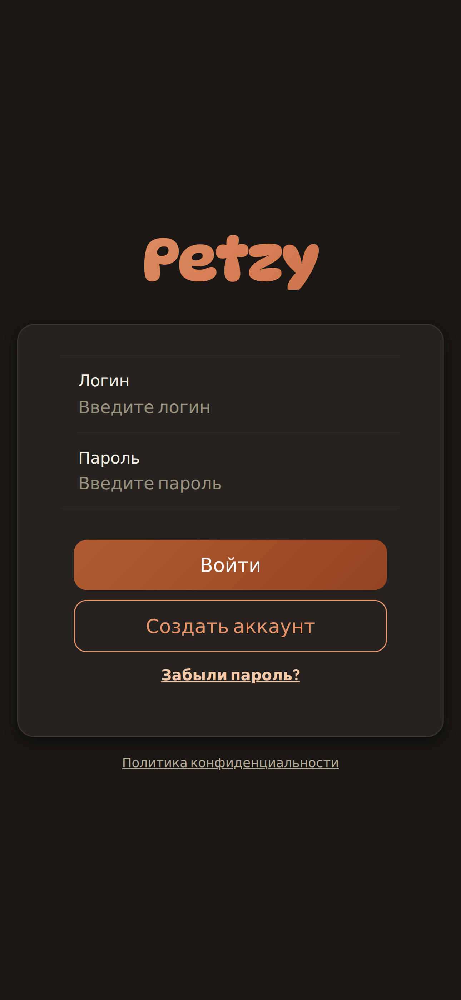 | 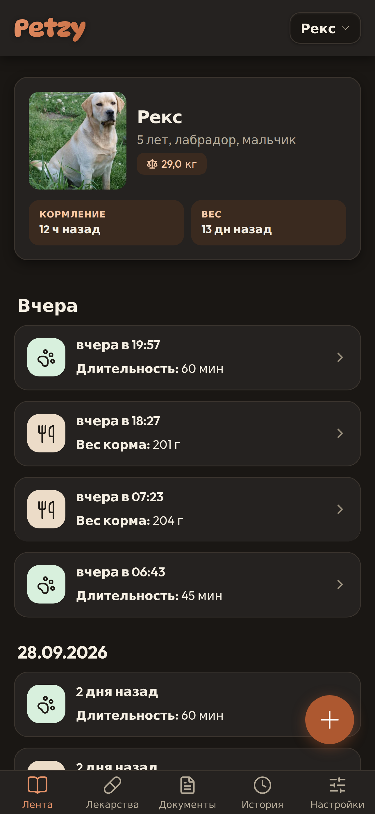 | 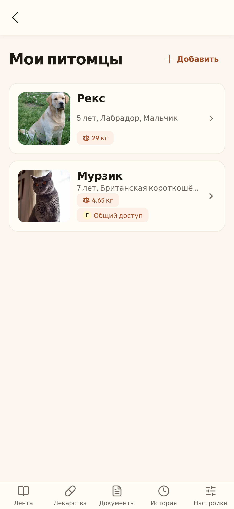 |
| **Вход** | **Лента** | **Мои питомцы** |
| 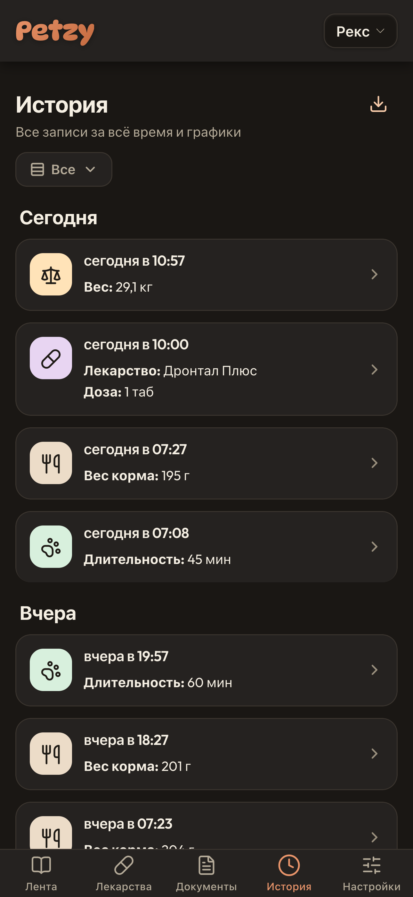 | 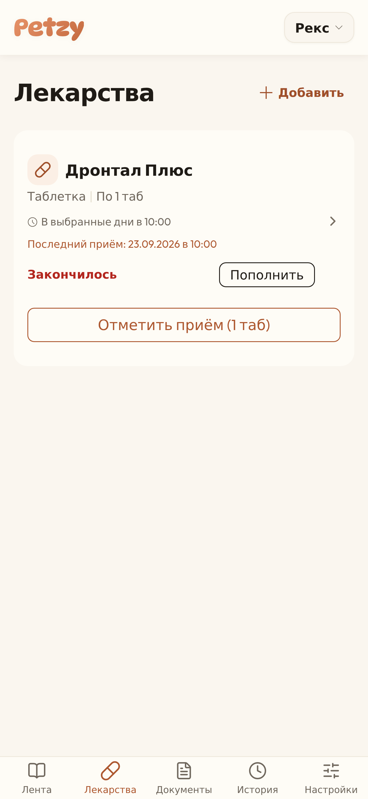 | 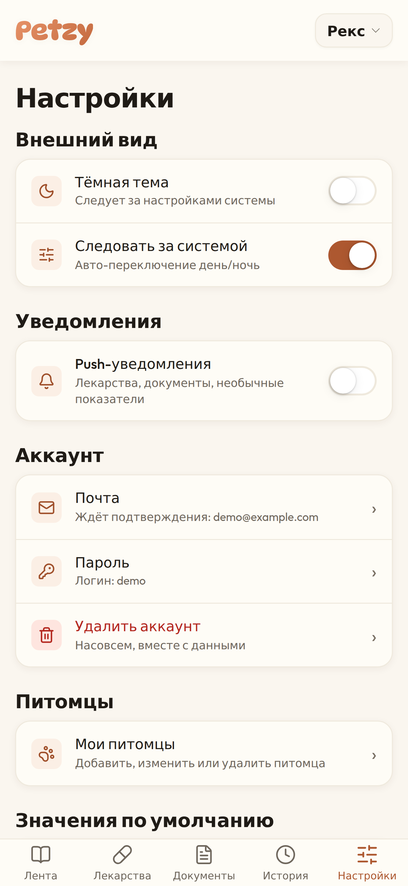 |
| **История** | **Лекарства** | **Настройки** |
| 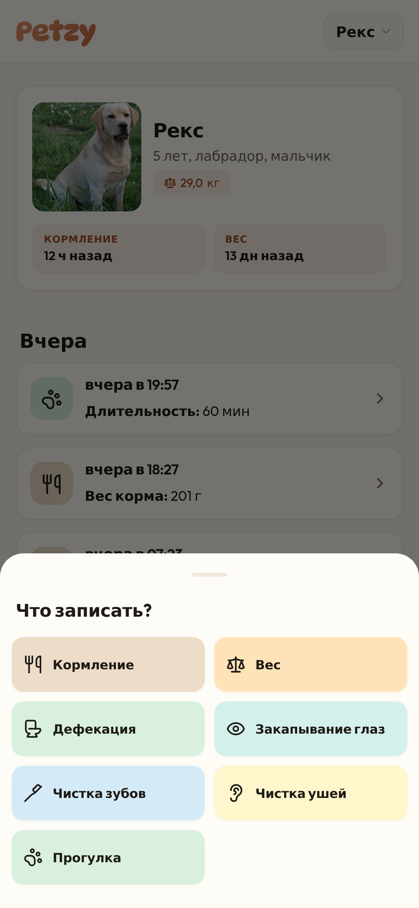 | 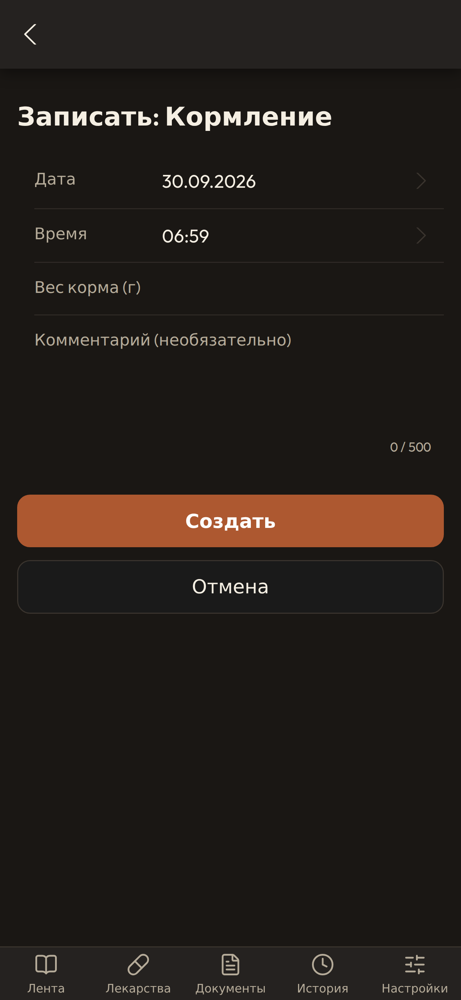 | 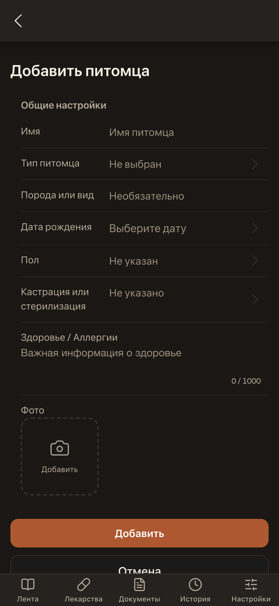 |
| **Что записать?** | **Записать: Кормление** | **Добавить питомца** |
| 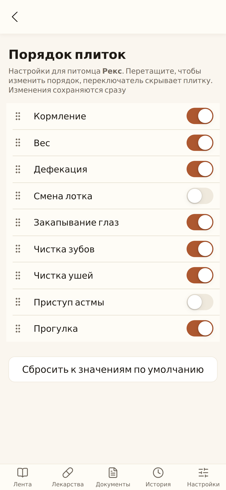 | 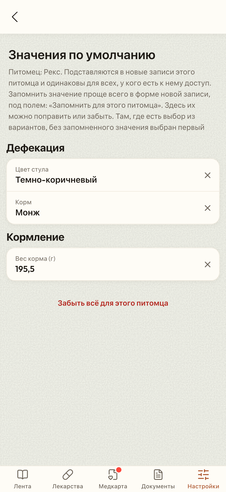 | 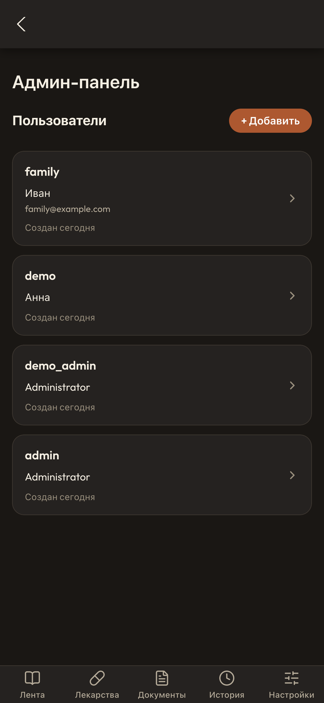 |
| **Порядок плиток** | **Значения по умолчанию** | **Админ-панель** |

## API

Справочник опубликован по **https://petzy.duckdns.org/api/docs** (ReDoc), спецификация по **/api/openapi.json** (OpenAPI 3.1). В ней описан вход из нативного приложения (токены в теле запроса без заголовка `Origin`, `Authorization: Bearer`), формат ошибок, соглашения про дату и время, загрузки и лимиты. Спецификация собирается из pydantic-схем роутов и дописывается в `web/openapi_doc.py`; ответы на runtime сверяются с этими схемами.

## Запуск локально

Самый быстрый способ обходится без MongoDB и Docker: `scripts/dev_local.py` поднимает API на базе в памяти (mongomock), засевает демо-питомцев и два месяца истории, а исходящую почту держит в памяти.

```sh
python3.12 -m venv .venv
.venv/bin/pip install -r requirements-dev.txt
.venv/bin/python scripts/dev_local.py        # API на http://localhost:5001

cd frontend && npm install && npm run dev    # приложение на http://localhost:5173
```

Заходите под `admin` / `test1234` (только для локального раннера). Vite dev server проксирует `/api` на порт 5001.

- Файлы уходят в тот же бакет, что и в проде, под `dev/`, если в `.env` прописаны ключи `S3_*`, или в S3 в памяти при `DEV_STORAGE=memory`.
- Письма (подтверждение, сброс пароля) лежат на http://localhost:5001/api/dev/outbox. На любом другом адресе эндпоинт отвечает 404.
- `/apidoc/redoc` и `/api/docs` показывают справочник API.

### Тесты и проверки

```sh
.venv/bin/python -m pytest tests          # бэкенд, mongomock и moto, без сети
.venv/bin/ruff check . && .venv/bin/ruff format --check .
cd frontend && npm run lint && npm run build
```

Git-хуки запускают всё это за вас: включите один раз `git config core.hooksPath .githooks` (см. `CLAUDE.md`).

## Запуск в Docker

```sh
cp .env.example .env    # и заполните его, см. ниже
docker compose up -d --build
```

| Сервис | Что делает |
|---|---|
| `db` | MongoDB, только на `127.0.0.1:27017` |
| `web` | API (gunicorn), на `127.0.0.1:5001` |
| `frontend` | собирает приложение и кладёт в общий volume |
| `nginx` | отдаёт приложение и проксирует `/api/` в `web`, на `127.0.0.1:3000` |
| `reminders` | шлёт push-напоминания про приёмы, документы с истекающим сроком и повтор прививок и обработок |
| `backup` | ежедневный бэкап базы в бакет |

### Весь стек локально, с демо-данными

Чтобы прокликать продовый сетап у себя на машине (тот же nginx, заголовки, сборка, gunicorn, напоминания):

```sh
docker compose -p petzy-local -f docker-compose.yml -f docker-compose.local.yml up -d --build
.venv/bin/python scripts/seed_demo.py    # аккаунты, питомцы, два месяца записей
.venv/bin/python scripts/seed_medical.py  # медкарта: полная у Рекса, неполная у Мурзика, пустая у Пустика (повторяемо)
```

Открывайте http://localhost:3000 и заходите как `demo` (владелец) или `family` (приглашён на одного питомца); пароль лежит в `DEMO_PASSWORD` в `scripts/seed_demo.py`. Сидер наполняет двух питомцев с фото, двумя месяцами записей, одним своим типом события, лекарствами с остатком и приёмами, документами (один скоро истекает), одним ожидающим и одним принятым приглашением и подтверждённой почтой.

`docker-compose.local.yml` отделяет это от продакшена: файлы идут в локальный S3-сервер (Versity Gateway) в собственном volume, сервиса бэкапа нет (он бы крутил бэкапы настоящего бакета), письма лежат в памяти на http://localhost:3000/api/dev/outbox. Большие сканы сюда не загрузить. Остановить: `docker compose -p petzy-local down`, с `-v` очистит данные перед повторным сидом.

В проде на хосте стоит nginx, который terminated TLS и проксирует всё на `127.0.0.1:3000`; security-заголовки, настоящий адрес клиента и Secure-флаг cookie ставит `nginx/nginx.conf`.

### Переменные окружения

`.env.example` перечисляет каждую с комментариями. Главные:

| Переменная | |
|---|---|
| `MONGO_USER`, `MONGO_PASS`, `MONGO_DB` | база; root-аккаунт, его используют бэкапы |
| `MONGO_APP_USER`, `MONGO_APP_PASS` | собственный аккаунт приложения (чтение и запись только в свою базу и `limits`); деплой создаёт его и пароль на сервере. Без него приложение логинится как root |
| `FLASK_SECRET_KEY`, `JWT_SECRET_KEY` | длинное случайное значение; приложение не стартует с примерным |
| `ADMIN_USERNAME`, `ADMIN_PASSWORD_HASH` | аккаунт админа (bcrypt-хэш) |
| `S3_ENDPOINT`, `S3_REGION`, `S3_BUCKET`, `S3_KEY_ID`, `S3_SECRET_KEY` | объектное хранилище для всех файлов и бэкапов |
| `SMTP_HOST`, `SMTP_PORT`, `SMTP_USER`, `SMTP_PASSWORD`, `SMTP_FROM` | почта для восстановления пароля; без неё приложение говорит, что восстановление через админа |
| `VAPID_PUBLIC_KEY`, `VAPID_PRIVATE_KEY`, `VAPID_CLAIMS_EMAIL` | Web Push (`python -m scripts.generate_vapid_keys`) |
| `REGISTRATION_ENABLED` | `false` закрывает регистрацию |
| `STORAGE_QUOTA_MB` | документы на владельца питомца, по умолчанию 2048 |
| `SENTRY_DSN` | ошибки, трейсы и профили в Sentry; без него выключено |
| `PRIVACY_OPERATOR`, `PRIVACY_CONTACT_EMAIL`, `PRIVACY_SERVER_LOCATION` | кто обрабатывает данные, куда писать, страна сервера базы: показывается в политике конфиденциальности |

bcrypt-хэш для пароля админа:

```sh
python -c "import bcrypt; print(bcrypt.hashpw(b'your_password', bcrypt.gensalt()).decode())"
```

## Деплой

Пуш в `master` запускает CI и деплой на сервер (`.github/workflows/deploy.yaml`). Документация, скриншоты и четыре сервисных workflow его не триггерят. Сам деплой: сначала освобождает диск (свежие сборки оставляли старые образы и кэш сборки, пока MongoDB не перестала писать), потом делает pull, прописывает секреты ниже в серверный `.env`, пересобирает и перезапускает стек. Деплой идёт по одному. Запустить можно и руками, например после смены секрета:

```sh
gh workflow run "Deploy to Server"
```

Секреты репозитория: `SERVER_PETZY_HOST`, `SERVER_PETZY_USER`, `SERVER_PETZY_SSH_KEY`, `S3_KEY_ID`, `S3_SECRET_KEY`, `VAPID_*`, `SMTP_*`, `SENTRY_DSN`. Поставить: `gh secret set NAME` (спросит значение). Переменные репозитория (публичные): `PRIVACY_OPERATOR`, `PRIVACY_CONTACT_EMAIL`, `PRIVACY_SERVER_LOCATION`, ставятся через `gh variable set NAME`.

Остальные workflow (все запускаются руками):

- **Diagnose server:** контейнеры, диск, nginx, какие настройки заданы (никаких их значений), почтовый логин, бэкапы, по желанию проверка восстановления.
- **Storage check:** бакет и его ключи.
- **Inspect DB:** количество документов, никаких данных.
- **Migrate events:** разовые миграции данных.
- **Cleanup refresh tokens:** удаляет истёкшие сессии.
- **Clean server disk:** показывает, что забивает диск сервера (размеры по категориям, никаких путей) и, с `apply`, освобождает то, что сборка может воспроизвести: неиспользуемые образы, кэш сборки, старый журнал, кэш пакетов. Volume не трогаются.

Репозиторий публичный, как и логи Actions: workflow печатают только количества и факт наличия, никогда пользовательские данные или секреты.

## Бэкапы

Сервис `backup` (`backup/Dockerfile`, `scripts/backup_to_s3.py`) раз в день бэкапит базу в бакет:

- дампит её `mongodump` в один gz-архив и проверяет, что он читается обратно (`mongorestore --dryRun`);
- загружает в `backups/mongo/<db>-YYYYMMDD-HHMMSS.archive.gz`, мимо пользовательских файлов (`users/`) и локальных запусков (`dev/`), и сверяет сохранённый размер;
- и только потом удаляет всё, кроме новейших `BACKUP_KEEP` (3) бэкапов, каждую их версию.

Неудачная попытка сохраняет старые бэкапы и повторяется через час. Когда сервис стартует и новейшему бэкапу больше суток, он бэкапит сразу. Файлы (фото, документы, сканы) уже в бакете и в дамп не входят.

Бэкап прямо сейчас:

```sh
docker compose run --rm backup python3 scripts/backup_to_s3.py --once
```

**Восстановление** (перезаписывает коллекции, которые восстанавливает; файл берите из списка, который печатает workflow Diagnose):

```sh
# 1. Скачать его в текущую директорию (или из веб-консоли Backblaze)
docker compose run --rm -v "$PWD:/out" backup python3 -c "from web import storage; \
  storage._client().download_file(storage._bucket(), 'backups/mongo/<file>.archive.gz', '/out/b.archive.gz')"
# 2. Восстановить в работающую базу
docker compose cp b.archive.gz db:/tmp/b.archive.gz
docker compose exec db mongorestore -u "$MONGO_USER" -p "$MONGO_PASS" --authenticationDatabase admin \
  --archive=/tmp/b.archive.gz --gzip --drop
```

Чтобы посмотреть бэкап, не трогая живые данные, восстановите его под другим именем через `--nsFrom '<db>.*' --nsTo 'restored.*'` вместо `--drop`.

## Структура проекта

```text
web/                     Flask API
  app.py                 приложение, блюпринты, security-заголовки, rate limits
  auth.py                вход, регистрация, refresh, logout
  account.py             почта, пароль, восстановление по почте
  account_deletion.py    передача питомцев удаляемого владельца тому, с кем они расшарены
  security.py            токены, сессии, декораторы доступа
  pets.py                питомцы, фото, шаринг и приглашения
  events.py              записи, типы событий, лента, статистика
  builtin_event_types.py встроенные типы и их порядок
  medications.py         курсы, приёмы, остаток, ближайшие дозы
  documents.py            документы, сканы, квота
  storage.py             объектное хранилище (ключи, подписанные URL)
  push.py, push_delivery.py  Web Push
  export.py              экспорт
  users.py               пользователи, поиск, значения форм
  mail.py                SMTP
  validation.py          русские ошибки валидации
  trend_alerts.py        уведомления о необычных значениях
  legal.py               политика конфиденциальности и согласие
  observability.py       настройка Sentry
  openapi_doc.py         опубликованный справочник API
  schemas.py             pydantic-схемы запросов и ответов
frontend/src/            React-приложение (страницы, компоненты, сервисы, хуки, утилиты)
  content/help.ts        справка внутри приложения
  sw.ts                  service worker
nginx/                   nginx приложения (nginx.conf, nginx.conf.server, nginx.conf.external, security-headers.conf)
scripts/                 dev_local.py, отправка напоминаний, бэкапы, миграции, проверки
tests/                   тесты бэкенда (stateless и stateful)
.github/workflows/       CI, деплой, обслуживание
```

## Лицензия

MIT. Текст: [LICENSE](https://opensource.org/license/mit).
