# Аудит пользовательских путей

По одному файлу на экран: что человек хочет, куда может уйти и где путь ломается. Файлы
лежат рядом, на каждый экран `_template.md`.

Правила аудита:

- Только то, что есть в коде. Каждое утверждение и каждая проблема со ссылкой на
  `файл:строка`. Чего в коде нет, в аудите не утверждается: это идёт в «Вопросы к владельцу».
- Тон и пунктуация как в интерфейсе: без «·», тире «—» только в диапазонах чисел, строки
  интерфейса без точки в конце.
- Служебные файлы `_template.md` и `_existing-audit.md` — не экраны, в списке их нет.

## Связь со старым аудитом

`docs/ux-audit.docx` от 2 октября 2026: 125 историй по четырём областям, у каждой вердикт
(сломано, неудобно, работает) и отметка, что уже исправлено. Этот каталог не заменяет его, а
разложен по экранам: в [_existing-audit.md](_existing-audit.md) каждая старая история
сопоставлена с тем документом, где её путь теперь описан. Новую находку, которая продолжает
старую, в документе экрана стоит называть её идентификатором, а не заводить вторую нумерацию.

## Как устроен экран

Пять вкладок снизу (`.tsx` `components/BottomTabBar.tsx`): лента, лекарства, медкарта,
документы, настройки. Медкарта принадлежит одному питомцу, её вкладка ведёт на карту
выбранного питомца, а на самой карте остаётся подсвеченной.

Нижние вкладки — соседи, а не шаги: переключение между ними не накапливает историю. Всё, что
открыто поверх вкладки (формы, карточки, разделы), накапливает, и уходит через `goBack`
(`utils/navigation.ts`): форма возвращается на экран, который её открыл, со всеми его
состояниями.

## Общий граф

```mermaid
graph TD
  anonymous["Аноним"]

  subgraph public["Без входа"]
    Login["/login"]
    Register["/register"]
    Forgot["/forgot-password"]
    Reset["/reset-password"]
    Verify["/verify-email"]
    Policy["/privacy"]
    Consent["/consent"]
    Shared["/share/medical/:token"]
  end

  subgraph entry["Вход и первые шаги"]
    Welcome["/welcome"]
  end

  subgraph tabs["Вкладки"]
    Feed["/ Лента"]
    Meds["/medications"]
    Card["/pets/:id/medical-card"]
    Docs["/documents"]
    Settings["/settings"]
  end

  subgraph surfaces["Экраны поверх вкладок"]
    Record["/form/:type, /form/:type/:id"]
    History["/history"]
    Pets["/pets"]
    PetForm["/pets/new, /pets/:id/edit"]
    MedForm["/medications/new, /medications/:id/edit"]
    DocForm["/documents/new, /documents/:id/edit"]
    CardSection["/pets/:id/medical-card/:section"]
    MedProfile["/pets/:id/medical-profile"]
    VisitPrep["/pets/:id/visit-prep"]
    MedRecord["/pets/:id/medical-records/new, /:recordId"]
  end

  subgraph settingsBranch["Ветки настроек"]
    Email["/settings/email"]
    Password["/settings/password"]
    DeleteAccount["/settings/delete-account"]
    MedLinks["/settings/medical-links"]
    Defaults["/form-defaults"]
    EventTypes["/event-types"]
    EventTypeForm["/event-types/new, /event-types/:key/edit"]
    PetEvents["/pet-events"]
    PetLook["/pet-look"]
    Help["/help"]
    Admin["/admin"]
    UserForm["/admin/users/new, /admin/users/:username/edit"]
    UserProfile["/users/:username"]
  end

  anonymous --> Login
  Login --> Register
  Login --> Forgot
  Forgot --> Reset
  Login -. письмо .-> Verify
  Verify --> Feed
  Register --> Feed
  Reset --> Login
  Login --> Policy
  Consent --> Feed

  Feed --> Welcome
  Welcome --> Feed
  Welcome --> MedForm
  Welcome --> PetLook

  Feed --> Record
  Feed --> Pets
  Feed --> Card
  Feed --> Meds
  Feed --> Docs
  Feed --> Settings

  Meds --> MedForm
  Docs --> DocForm
  Pets --> PetForm
  Pets --> Card
  Card --> CardSection
  Card --> MedProfile
  Card --> VisitPrep
  Card --> MedRecord
  CardSection --> MedRecord
  CardSection --> Record
  MedProfile --> VisitPrep
  MedRecord --> History
  Record --> History
  Record --> Feed

  Settings --> Pets
  Settings --> PetLook
  Settings --> PetEvents
  Settings --> MedProfile
  Settings --> MedLinks
  Settings --> History
  Settings --> Defaults
  Settings --> EventTypes
  EventTypes --> EventTypeForm
  Settings --> Help
  Settings --> Email
  Settings --> Password
  Settings --> DeleteAccount
  Settings --> Policy
  Settings --> Admin
  Settings --> Welcome
  Admin --> UserForm
  Card --> Docs
  Docs --> MedRecord
  Meds --> UserProfile
  Docs --> UserProfile
  PetForm --> UserProfile
  Settings -. выход .-> Login
```

Подробности по каждому экрану: [шаблон](_template.md).

## Что видно сверху

36 экранов, 298 находок: 3 блокера, 129 важных, 166 мелочей. Всё выведено из кода, ничего не
проверено в браузере и на устройстве.

Три блокера:

| Экран | Что происходит | Документ |
| --- | --- | --- |
| Запись | Обязательный выбор показывает первый вариант, а в форме пустое значение, и запись не сохраняется. Так у десяти встроенных типов, включая «Тип стула» | [health-record-form.md](health-record-form.md) |
| Политика | Если `GET /api/legal` недоступен, документ рисуется целиком с текстом «пока не указан», заглушка выглядит как факт | [privacy.md](privacy.md) |
| Подтверждение почты | Тексты отправляют в Настройки, а единственная кнопка ведёт в `/`, то есть у человека без сессии в `/login` | [verify-email.md](verify-email.md) |

Что повторяется из экрана в экран:

1. **Защита от двойного приёма держится на времени, а не на слоте.** Ответ 409 смотрит на
   `date_time` плюс минус 30 минут, поэтому два человека, отметившие один слот с разницей
   больше получаса, запишут его дважды и спишут остаток дважды
   ([medications-list.md](medications-list.md), `web/medications.py:449`, `web/dose_slots.py:24`).
2. **Повтор после «Сервер не ответил» создаёт вторую запись.** Ключа идемпотентности нет, сервер
   одинаковую запись не отклоняет; для отметок приёма это закрыто кодом 409, для записей о
   здоровье нет ([health-record-form.md](health-record-form.md)).
3. **Выход с экрана не везде по правилу `goBack`.** Оформление питомца после сохранения всегда
   уходит в `/settings`, хотя на него ведут три входа
   ([pet-look-settings.md](pet-look-settings.md)).
4. **«Питомца нет» выглядит по-разному в соседних местах.** Три строки настроек уводят на экран
   «Сначала добавьте питомца», две молчат до тоста, причём тост может прозвучать у человека, у
   которого питомцы есть ([settings.md](settings.md), [form-defaults.md](form-defaults.md),
   [medical-links.md](medical-links.md)).
5. **Отказ по правам и потерянный питомец не отличить от сбоя.** На трёх формах медкарты, в
   админке и в профиле человека это «Не удалось загрузить» с бесполезным «Повторить»
   ([medical-profile-form.md](medical-profile-form.md),
   [medical-record-form.md](medical-record-form.md), [admin-panel.md](admin-panel.md),
   [user-profile.md](user-profile.md)).
6. **У члена семьи нет отмены там, где у владельца она есть.** Выход из общего доступа у
   приглашённого необратим: у владельца удаление питомца отменяется ([pets.md](pets.md),
   `hooks/useDeletePet.ts:44`).
7. **Справка обещает то, чего нет.** Два расхождения: push на iPhone и вопрос при уходе из формы
   ([help.md](help.md)).
8. **Вкладка «Настройки» не подсвечена там, где человек её ждёт:** на `/history` и на `/admin`
   ([settings.md](settings.md), [admin-panel.md](admin-panel.md)).
9. **Обычный Safari на iPhone получает «браузер не поддерживает push»,** хотя на других экранах
   для того же случая есть верный текст про приложение на экране «Домой»
   ([settings.md](settings.md), `components/PushOffNotice.tsx:46`).
10. **На ленте нет пути в «Историю», а на «Истории» нет кнопки записи.** История открывается из
    Настроек и из раздела веса в медкарте ([dashboard.md](dashboard.md),
    [history.md](history.md)).

Что стоит решить первым, потому что это тихо портит данные: пункты 1 и 2.

## Экраны

### Вход и публичные

| Экран | Маршрут | Документ |
| --- | --- | --- |
| Вход | `/login` | [login.md](login.md) |
| Регистрация | `/register` | [register.md](register.md) |
| Забыл пароль | `/forgot-password` | [forgot-password.md](forgot-password.md) |
| Сброс пароля | `/reset-password` | [reset-password.md](reset-password.md) |
| Подтверждение почты | `/verify-email` | [verify-email.md](verify-email.md) |
| Политика и согласие | `/privacy`, `/consent` | [privacy.md](privacy.md) |
| Медкарта по ссылке | `/share/medical/:token` | [shared-medical-card.md](shared-medical-card.md) |

### Первые шаги и питомцы

| Экран | Маршрут | Документ |
| --- | --- | --- |
| Первый запуск | `/welcome` | [onboarding.md](onboarding.md) |
| Питомцы | `/pets` | [pets.md](pets.md) |
| Форма питомца | `/pets/new`, `/pets/:id/edit` | [pet-form.md](pet-form.md) |
| Оформление питомца | `/pet-look` | [pet-look-settings.md](pet-look-settings.md) |
| События питомца | `/pet-events` | [pet-events.md](pet-events.md) |
| Профиль человека | `/users/:username` | [user-profile.md](user-profile.md) |

### Лента и записи

| Экран | Маршрут | Документ |
| --- | --- | --- |
| Лента | `/` | [dashboard.md](dashboard.md) |
| История | `/history` | [history.md](history.md) |
| Запись | `/form/:type`, `/form/:type/:id` | [health-record-form.md](health-record-form.md) |

### Медкарта

| Экран | Маршрут | Документ |
| --- | --- | --- |
| Медкарта | `/pets/:id/medical-card` | [medical-card.md](medical-card.md) |
| Раздел медкарты | `/pets/:id/medical-card/:section` | [medical-card-section.md](medical-card-section.md) |
| Данные для врача | `/pets/:id/medical-profile` | [medical-profile-form.md](medical-profile-form.md) |
| К приёму | `/pets/:id/visit-prep` | [visit-prep-form.md](visit-prep-form.md) |
| Запись медкарты | `/pets/:id/medical-records/new`, `/…/:recordId` | [medical-record-form.md](medical-record-form.md) |
| Ссылки на медкарту | `/settings/medical-links` | [medical-links.md](medical-links.md) |

### Лекарства и документы

| Экран | Маршрут | Документ |
| --- | --- | --- |
| Лекарства | `/medications` | [medications-list.md](medications-list.md) |
| Форма лекарства | `/medications/new`, `/medications/:id/edit` | [medication-form.md](medication-form.md) |
| Документы | `/documents` | [documents-list.md](documents-list.md) |
| Форма документа | `/documents/new`, `/documents/:id/edit` | [document-form.md](document-form.md) |

### Настройки и аккаунт

| Экран | Маршрут | Документ |
| --- | --- | --- |
| Настройки | `/settings` | [settings.md](settings.md) |
| Почта | `/settings/email` | [account-email.md](account-email.md) |
| Пароль | `/settings/password` | [account-password.md](account-password.md) |
| Удаление аккаунта | `/settings/delete-account` | [account-delete.md](account-delete.md) |
| Значения по умолчанию | `/form-defaults` | [form-defaults.md](form-defaults.md) |
| Типы событий | `/event-types` | [event-types-settings.md](event-types-settings.md) |
| Форма типа события | `/event-types/new`, `/event-types/:key/edit` | [event-type-form.md](event-type-form.md) |
| Помощь | `/help` | [help.md](help.md) |

### Админка

| Экран | Маршрут | Документ |
| --- | --- | --- |
| Админка | `/admin` | [admin-panel.md](admin-panel.md) |
| Форма человека | `/admin/users/new`, `/admin/users/:username/edit` | [user-form.md](user-form.md) |
