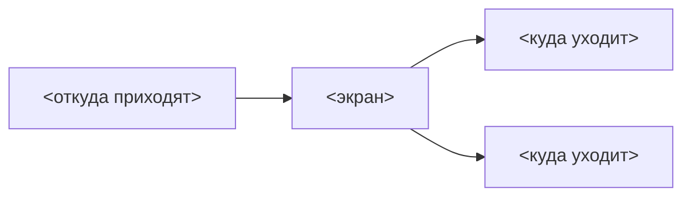

# Аудит пути: <Название экрана>

Маршрут: `<path>` · Файл: `frontend/src/pages/<File>.tsx`

## Кто это

Одно-два предложения: что человек видит на этом экране и зачем он сюда приходит.

- Роли: кто может попасть (владелец, приглашённый, админ, аноним по ссылке)
- Глубина: вкладка / экран поверх вкладки / публичный

## Пользовательские истории

Каждая история: кто, чего хочет, зачем, как поймёт, что получилось. 3–6 штук, в порядке
важности. Формат: «Я <роль>, чтобы <цель>, <действие>. Критерий: <что наблюдаемо>».

1. **.** Я <роль>, чтобы <цель>, <действие>. Критерий: <наблюдаемый результат>.
2. **.**

## Граф переходов

Каждое ребро: подписать условие, если оно неочевидно («после сохранения», «если питомца нет»).
Обратные рёбра (назад, отмена, свайп) помечать пунктиром.

## Путь по шагам

Основной сценарий, по шагам: что человек делает, что видит в ответ, где может застрять.
Отдельно: что происходит при отмене, при возврате, при ошибке сети.

| Шаг | Действие | Что видит | Чем может кончиться |
| --- | --- | --- | --- |
| 1 | | | |

## Состояния экрана

Загрузка, пусто, ошибка и повтор, нет питомца, нет доступа, офлайн, длинные тексты,
пустые имена. Что из этого покрыто, что нет.

## Точки входа и выхода

Вход: откуда можно попасть на экран (вкладка, ссылка, свайп, шапка, deep link, push).
Выход: куда уходит, поведение кнопки «назад» (см. `utils/navigation.ts`, `goBack`).

## Правила и валидация

Для форм: обязательные поля, границы, нормализация текста, что уходит на сервер, что
сохраняется при уходе со страницы. Со ссылками на код, а не описанием «по памяти».

## Доступность

Роли и имена элементов, фокус, размеры нажатия, текст на контрасте, работа со скринридером,
что уже сделано через `utils/antdA11y.ts`, чего не хватает.

## Найденное

| Что | Где | Почему это важно | Тяжесть | Предложение |
| --- | --- | --- | --- | --- |
| | | | | |

Тяжесть: блокер, важно, мелочь. Каждая строка со ссылкой на код.

## Вопросы к владельцу

Решения, которые нельзя принять по коду: тон, порядок, что показывать.

## Связанные экраны

Ссылки на соседние доки из `docs/ux/`.
