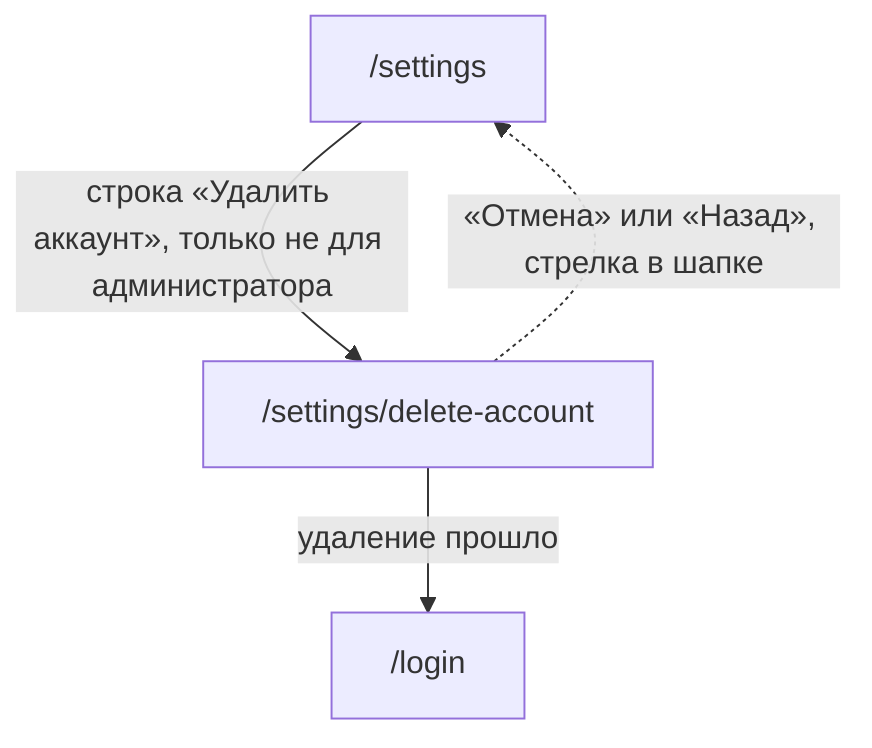

# Аудит пути: Удаление аккаунта

Маршрут: `/settings/delete-account`, файл: `frontend/src/pages/AccountDelete.tsx`

## Кто это

Необратимый путь. Экран показывает, что произойдёт с каждым питомцем человека, спрашивает
пароль, спрашивает ещё раз в диалоге и удаляет всё вместе с аккаунтом.

- Роли: вошедший человек, который не администратор. Администратору сервер отдаёт
  `can_delete: false` (`web/account.py:382`), а строка в настройках у него и не показывается
  (`Settings.tsx:320-329`). Состояние «удалить нельзя» поэтому видно только по прямому
  адресу.
- Глубина: экран поверх вкладки «Настройки», последняя строка в группе «Выход»
  (`Settings.tsx:321-328`).

## Пользовательские истории

1. **.** Я человек, который уходит из Petzy, и хочу понять, что именно пропадёт. Критерий:
   три группы питомцев: «Удалятся», «Перейдут другим», «Пропадёт доступ»
   (`AccountDelete.tsx:127-143`).
2. **.** Я человек, у которого есть общий питомец, и хочу, чтобы он не исчез вместе со мной.
   Критерий: «Перейдут другим», «Владельцем станет <логин>» (`AccountDelete.tsx:132-137`).
3. **.** Я человек, который веду чужого питомца, и хочу знать, что будет с доступом. Критерий:
   «Пропадёт доступ», «Питомец <логин владельца>» (`AccountDelete.tsx:138-143`).
4. **.** Я человек, который удаляет аккаунт, и хочу подтвердить, что это я. Критерий: поле
   «Пароль» с подписью «Чтобы подтвердить, что это вы», потом диалог «Удалить аккаунт?» с
   «Это нельзя отменить» (`AccountDelete.tsx:155,184-185`).
5. **.** Я человек, который нажал удалить, а сеть отвалилась. Критерий: честный ответ о том, что
   удаление не вышло, и возможность повторить. Сейчас это не так, см. «Найденное».

## Граф переходов

Выход в `/login` это не переход по кнопке, а следствие выхода из аккаунта
(`AccountDelete.tsx:89`, `hooks/useAuth.ts:95-127`).

## Путь по шагам

| Шаг | Действие | Что видит | Чем может кончиться |
| --- | --- | --- | --- |
| 1 | Нажал «Удалить аккаунт» | Крутилка, потом «Аккаунт <логин> удалится насовсем, восстановить его не получится» | Список питомцев |
| 2 | Посмотрел, что пропадёт | До трёх групп с именами питомцев, у каждой объяснение. Групп без питомцев не показываются | Ввести пароль |
| 3 | Питомцы достанутся другим | Дополнительно «Записи, которые вы добавили этим питомцам, останутся, но без вашего имени» | Ввести пароль |
| 4 | Нажал «Удалить аккаунт» без пароля | Под полем «Введите пароль» | Написать пароль |
| 5 | Написал пароль и нажал ещё раз | Диалог «Удалить аккаунт?», текст «Это нельзя отменить», кнопки «Удалить» и «Отмена» | Удалить или отменить |
| 6 | Нажал «Удалить» | Крутилка на кнопке, диалог жив | «Аккаунт удалён» и `/login` |
| 7 | Нажал «Отмена» в диалоге | Диалог закрылся, пароль остался в поле | Всё как было |
| 8 | Пароль неверный | Диалог закрылся, тост «Неверный текущий пароль» | Остаться на экране |
| 9 | Это администратор | «Аккаунт администратора удалить нельзя: без него никто не сможет управлять Petzy», форма и кнопки удаления нет, только «Назад» | Уйти назад |
| 10 | Не удалось узнать судьбу питомцев | «Не удалось узнать, что станет с питомцами. Попробуйте открыть страницу ещё раз», кнопки удаления нет | Только уйти и вернуться |
| 11 | Удаление прошло на сервере, ответ не дошёл | Тост «Нет связи с интернетом. Ничего не сохранилось, попробуйте ещё раз, когда связь появится», экран остаётся, аккаунта уже нет | Следующий запрос уведёт на `/login` без объяснения |
| 12 | Ошибка на сервере | «Не получилось удалить аккаунт. Попробуйте ещё раз позже» | Повторить можно, но файлы уже могут быть скопированы |

## Состояния экрана

| Состояние | Покрыто | Где в коде |
| --- | --- | --- |
| Загрузка | Да, крутилка, кнопок удаления нет | `AccountDelete.tsx:108` |
| Ошибка загрузки | Да, текст есть, кнопки повтора нет | `AccountDelete.tsx:109-113` |
| Это администратор | Да, объяснение и только «Назад» | `AccountDelete.tsx:115-119,171-178` |
| Ни одного питомца | Нет: все три группы пусты и не рисуются (`AccountDelete.tsx:33`), остаётся одна строка про необратимость | `AccountDelete.tsx:121-150` |
| Питомцы без других людей | Да, группа «Удалятся» | `AccountDelete.tsx:127-131` |
| Питомцы достанутся другим | Да, «Перейдут другим» и «Владельцем станет <логин>» | `AccountDelete.tsx:132-137` |
| Чужие питомцы | Да, «Пропадёт доступ» и «Питомец <логин>» | `AccountDelete.tsx:138-143` |
| Есть куда передать | Да, добавляется строка про записи без имени | `AccountDelete.tsx:144-148` |
| Пароль не введён | Да, ошибка под полем, не тостом | `AccountDelete.tsx:74-77,155` |
| Идёт удаление | Да, кнопка с крутилкой и выключена, кнопки диалога тоже | `AccountDelete.tsx:83,172,189` |
| Диалог открыт | Да | `AccountDelete.tsx:182-192` |
| Ошибка удаления | Да, тост, диалог закрывается | `AccountDelete.tsx:90-93` |
| Обрыв связи посередине | Нет: тот же тост, что и при отказе сервера, и с текстом о том, что ничего не сохранилось | `AccountDelete.tsx:90-93`, `utils/apiError.ts:10-11` |
| Успех | Да, «Аккаунт удалён» на 3 секунды и выход на `/login` | `AccountDelete.tsx:88-89` |
| Офлайн | Тост с «Не удалось удалить аккаунт» | `AccountDelete.tsx:92` |

## Точки входа и выхода

Вход:

- настройки, строка «Удалить аккаунт» в группе «Выход», администратору не показывается
  (`Settings.tsx:320-329`);
- прямой адрес `/settings/delete-account`.

Выход:

- кнопка «Отмена», а у администратора «Назад» (`AccountDelete.tsx:176-178`);
- стрелка в шапке (`Navbar.tsx:94-96`), ведёт туда, откуда пришли;
- после успеха выход из аккаунта уводит на `/login` без возврата
  (`AccountDelete.tsx:89`, `hooks/useAuth.ts:122`);
- сессия на этом устройстве чистится целиком: логин, выбранный питомец, кэш и копия в
  сервис-воркере (`hooks/useAuth.ts:110-126`).

## Правила и валидация

- План удаления приходит отдельным запросом `GET /api/me/account/deletion` и состоит из трёх
  списков питомцев и флага `can_delete` (`web/account.py:376-382`,
  `services/account.service.ts:26-35`).
- Удаление это `DELETE /api/me/account` с паролем, лимит 10 в час
  (`web/account.py:385-392`, `services/account.service.ts:61-63`).
- Порядок на сервере такой: сначала копируются файлы передаваемых питомцев в папку нового
  владельца (`web/account_deletion.py:152`, `77-97`), потом питомцы передаются
  (`154-155`), потом удаляются вместе с записями и файлами (`156-157`), потом с чужих
  питомцев снимается доступ (`160-163`), потом с чужих записей снимается имя автора
  (`166-169`), свои типы событий либо переходят к владельцу оставшегося питомца, либо
  удаляются (`170`, `122-137`), потом чистятся сессии, ссылки из писем и устройства
  (`172-173`), и только потом удаляется строка пользователя (`174`).
- Папка файлов человека удаляется последней, с предупреждением в лог, а не откатом
  (`web/account_deletion.py:176-181`).
- Письмо «Аккаунт удалён» уходит на подтверждённую почту, если она была, а наследникам
  питомцев отдельное письмо о передаче (`web/account.py:417-430`). Если почты нет, человек
  не узнает о своей стороне события оттуда.
- Пароль проверяется на сервере до всего остального (`web/account.py:404-405`), поэтому при
  неверном пароле ничего не удалено и файлы не тронуты.
- Администратору отвечают отказом до проверки пароля (`web/account.py:402-403`).

## Доступность

- Заголовок экрана это `h1` «Удаление аккаунта» (`AccountDelete.tsx:104-106`), группы
  питомцев это `h2` с классом `section-header` (`AccountDelete.tsx:36`).
- Список питомцев это `div` без роли списка, элементы без роли (`AccountDelete.tsx:38-53`).
- Поле пароля с подписью и подсказкой, ошибка через `FieldError` ставит `aria-invalid` и
  `aria-describedby` (`AccountDelete.tsx:155-163`, `components/FieldError.tsx:18-32`).
- Диалог: опасное действие первым, отмена второй, как в остальном приложении
  (`AccountDelete.tsx:188-191`).
- У диалога есть и предупреждающая надпись, и повтор пароля: это единственный диалог, где
  перед необратимой операцией стоят два рубежа.
- Чего не хватает: у полосы «Сколько удалится» нет `role="status"`, при этом текст меняется
  после загрузки; у сообщения об ошибке загрузки (`AccountDelete.tsx:110`) нет
  `role="alert"`, и у него нет кнопки, кроме как уйти со страницы.

## Найденное

| Что | Где | Почему это важно | Тяжесть | Предложение |
| --- | --- | --- | --- | --- |
| Нигде не сказано, сколько пропадёт | `AccountDelete.tsx:127-148`, `web/account_deletion.py:55-63` | Сервер отдаёт только имена питомцев: ни числа записей, ни числа файлов. На экране написано «вместе с записями, лекарствами и документами», а про фотографии и файлы не сказано ничего, хотя удаляются и они (`web/account_deletion.py:157`, `web/pets.py:790-812`). Продолжает A1-20 из старого аудита | важно | Считать в превью четыре числа: питомцы, записи, курсы лекарств, документы и файлы. Показывать словами: «пропадёт 320 записей и 12 файлов» |
| Диалог подтверждения не перечисляет, что исчезнет | `AccountDelete.tsx:184-185` | Весь разговор сводится к словам «Это нельзя отменить». Список питомцев прямо над диалогом не повторяется, про записи и файлы не сказано нигде. Продолжает A1-20 | важно | Собрать в диалог короткую сводку из того же превью: сколько питомцев уйдёт, сколько останется у других |
| Обрыв связи посередине говорит неправду | `AccountDelete.tsx:90-93`, `utils/apiError.ts:10-11`, `web/account.py:410,433-434`, `services/api.ts:128-147` | Если удаление прошло, а ответ не дошёл, человек видит «Нет связи с интернетом. Ничего не сохранилось, попробуйте ещё раз, когда связь появится». Это прямое утверждение, что ничего не сохранилось, хотя аккаунт уже удалён и куки очищены. Следующий запрос даст 401 и выкинет на `/login` без единого слова о том, что аккаунт удалён, а на экране остаётся введённый пароль от несуществующего аккаунта | важно | Различать сетевую ошибку и отказ сервера. При сетевой ошибке после `DELETE` предлагать проверить вход и прямо говорить, что удаление, возможно, уже произошло |
| Прерванное удаление можно начать заново | `web/account_deletion.py:150-174`, `AccountDelete.tsx:172` | Если оборвалось на середине (например, упал `purge_pet`), часть питомцев передана, а строка пользователя цела, и повторная попытка посчитает план заново по уже изменённым данным. Проверить это тестом нельзя, повторный `DELETE` на изменённом состоянии не описан | важно | Сделать удаление повторяемым идемпотентным и покрыть тестом повтор после частичного сбоя |
| Превью нельзя обновить, не уходя со страницы | `AccountDelete.tsx:66-70,109-113` | Запрос с `staleTime: 0` и без повторов. При ошибке человек видит текст с призывом «Попробуйте открыть страницу ещё раз», но кнопки повтора на экране нет | мелочь | Добавить кнопку «Повторить», как в `ProtectedRoute.tsx:48-50` |
| `document_uploads` нет ни в одном списке удаления | `web/account_deletion.py:21,23`, `web/documents.py:292` | Незакрытые загрузки сканов хранят логин человека (`web/documents.py:292`), но `AUTHORED_COLLECTIONS` и `PERSONAL_COLLECTIONS` их не знают. Для передаваемых питомцев слоты чистятся по `pet_id` (`web/account_deletion.py:118`), для чужих остаются до общей уборки через 6 часов (`web/storage.py:48,395-411`, `scripts/send_medication_reminders.py:533`). По остальному коду список полон: сессии, ссылки из писем, устройства (`PERSONAL_COLLECTIONS`), шесть коллекций с логином автора (`AUTHORED_COLLECTIONS`) | мелочь | Дописать `document_uploads` в список очистки по логину |
| Проверки полноты списка нет | `tests/stateless/test_medical_records.py:317` | Единственный тест на список удаления проверяет, что `medical_records` в нём есть. Теста, который бы нашёл новую коллекцию с логином автора и не нашёл её в списке, нет, хотя `AGENTS.md` называет этот список местом, которое надо дополнять | мелочь | Тест, который ищет в `web/` все вставки с ключом `username` и требует, чтобы коллекция была в списке |
| Состояние администратора видно только по прямому адресу | `Settings.tsx:320-329`, `AccountDelete.tsx:115-119` | Строка удаления администратору не показывается, поэтому текст «Аккаунт администратора удалить нельзя» он не увидит никогда. При этом он честный и полезный | мелочь | Либо оставить как есть и не считать проблемой, либо показать строку заблокированной с этим текстом |
| После удаления на экране ещё секунды видна удалённая форма | `AccountDelete.tsx:87-89` | Между сообщением «Аккаунт удалён» и переходом на `/login` проходит отписка от push и выход из аккаунта. Экран с уже несуществующим аккаунтом остаётся видимым | мелочь | Переходить сразу, отписку от push сделать неблокирующей |

## Вопросы к владельцу

- Нужно ли говорить в самом диалоге про количество записей и файлов, или достаточно того, что
  список питомцев уже на экране. Сейчас сделано второе.
- Что человек должен успеть сделать, если передумал после удаления. Сейчас письмо приходит
  только тем, у кого была подтверждённая почта (`web/account.py:417-422`).
- Стоит ли предлагать перед удалением выгрузить медкарту в PDF или хотя бы сказать, что
  фотографии и документы тоже исчезнут.
- Должен ли администратор видеть, что у него экран удаления недоступен, или лучше оставить
  как сейчас.
- Нужен ли срок, после которого удалённый логин можно занять заново. Сервер это допускает
  (строка пользователя удаляется, `web/account_deletion.py:174`), и на экране об этом не
  сказано.

## Связанные экраны

- [settings.md](settings.md), настройки, последняя строка группы «Выход»
- [login.md](login.md), `/login`, куда ведёт выход из аккаунта после удаления
- [account-email.md](account-email.md), почта, которая удаляется вместе с аккаунтом
- [account-password.md](account-password.md), пароль, который здесь спрашивают для подтверждения
- [pet-form.md](pet-form.md), передача питомца другому человеку, тот же механизм доступа
- [pets.md](pets.md), список питомцев, часть из которых уйдёт из приложения
- [event-types-settings.md](event-types-settings.md), свои типы событий, которые удаляются или переходят