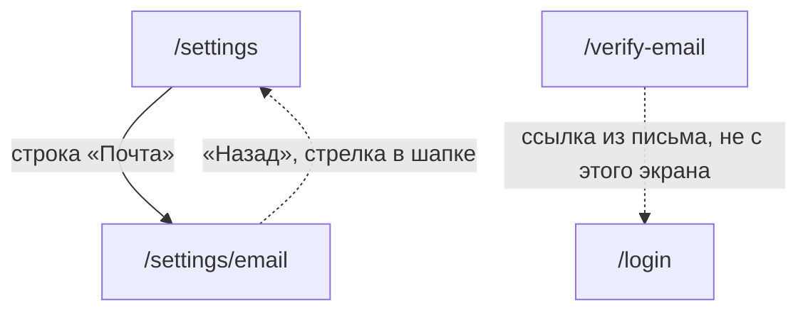

# Аудит пути: Почта аккаунта

Маршрут: `/settings/email`, файл: `frontend/src/pages/AccountEmail.tsx`

## Кто это

Почта, на которую приходят ссылки для восстановления пароля. Экран показывает, что с этой
почтой сейчас, меняет её, отправляет письмо подтверждения повторно и убирает её совсем.

- Роли: вошедший человек. Аноним не попадёт: маршрут под `ProtectedRoute`
  (`App.tsx:487-494`). Администратор попадёт, отдельного запрета нет.
- Глубина: экран поверх вкладки «Настройки». Открывается строкой «Почта»
  (`Settings.tsx:263`).
- Это не `verify-email`: здесь письмо не открывают, здесь его запрашивают. Адрес из письма
  ведёт на `/verify-email` (`web/account.py:112-113`), это другой экран.

## Пользовательские истории

1. **.** Я человек, который забыл пароль, и хочу убедиться, что почта на месте, открыть
   «Почта» в настройках. Критерий: строка «Подтверждена: <адрес>. Если забудете пароль,
   ссылка для нового придёт сюда» (`AccountEmail.tsx:83`).
2. **.** Я человек, который сменил почту, и хочу это подтвердить. Критерий: после сохранения
   «Письмо отправлено на <новый адрес>» и ниже «Ждёт подтверждения: <новый адрес>. Откройте
   ссылку из письма, оно действует сутки» (`AccountEmail.tsx:49,85`).
3. **.** Я человек, который не получил письмо, и хочу отправить его ещё раз. Критерий: кнопка
   «Отправить письмо ещё раз» и ответ «Письмо отправлено ещё раз» (`AccountEmail.tsx:90-92`,
   `62`).
4. **.** Я человек, который больше не хочет оставлять почту в чужом сервисе, и хочу её убрать.
   Критерий: вопрос «Удалить почту? Без неё забытый пароль придётся сбрасывать через
   администратора», потом «Почта удалена» (`AccountEmail.tsx:35`, `49`).
5. **.** Я человек, у которого нет почты, и хочу понять, чем я рискую. Критерий: «Почта не
   указана. Без неё забытый пароль придётся сбрасывать через администратора»
   (`AccountEmail.tsx:86`).

## Граф переходов

Пунктиром возврат: маршрут не вкладка, в шапке есть стрелка назад
(`utils/navigation.ts:15-17`, `Navbar.tsx:60,94`). Связи с `verify-email` на экране нет:
адрес из письма открывают отдельно, экран только просит письмо.

## Путь по шагам

| Шаг | Действие | Что видит | Чем может кончиться |
| --- | --- | --- | --- |
| 1 | Нажал «Почта» | Пока грузится, текст «Отправка писем пока не настроена. Пока её нет, забытый пароль сбрасывает администратор Petzy» | Данные пришли и текст сменился, либо остался навсегда |
| 2 | Данные пришли | Абзац с состоянием почты, ниже карточка формы | Дальше по форме |
| 3 | Почта подтверждена | Поле «Адрес почты» уже заполнено текущим адресом, «Сохранить и подтвердить» и «Удалить почту» | Сохранить без изменений даёт «Почта не изменилась» (`AccountEmail.tsx:49`) |
| 4 | Ввёл новый адрес и нажал «Сохранить и подтвердить» без пароля | Под полем пароля «Введите текущий пароль» | Написал пароль и повторил |
| 5 | Ввёл пароль и сохранил | «Письмо отправлено на <адрес>», поле пароля очищено | Ссылка из письма открывает `/verify-email` |
| 6 | Нажал «Отправить письмо ещё раз» | «Письмо отправлено ещё раз» | Письмо приходит повторно |
| 7 | Нажал «Удалить почту» | Вопрос «Удалить почту? Без неё забытый пароль придётся сбрасывать через администратора», кнопки «Удалить» и «Оставить» | «Почта удалена» |
| 8 | Адрес уже занят | Тост с текстом сервера «Эта почта уже подтверждена в другом аккаунте Petzy» | Правьте адрес, он остался в поле |
| 9 | Писем в проекте нет | Один абзац про администратора, формы на экране нет вообще | Уйти стрелкой назад |

## Состояния экрана

| Состояние | Покрыто | Где в коде |
| --- | --- | --- |
| Загрузка | Нет, вместо неё показан текст «Отправка писем пока не настроена» | `AccountEmail.tsx:77-78` |
| Ошибка загрузки | Нет, остаётся тот же текст про письма, повтора нет | `AccountEmail.tsx:18,77-78` |
| Почты нет | Да, «Почта не указана...», кнопки «Удалить почту» нет | `AccountEmail.tsx:86`, `107` |
| Почта подтверждена | Да | `AccountEmail.tsx:82-83` |
| Ждёт подтверждения | Да, абзац и кнопка «Отправить письмо ещё раз» | `AccountEmail.tsx:84-85,88-94` |
| Адрес есть, но не подтверждён | Нет: сервер отдаёт `email` пустым, экран говорит «Почта не указана» | `web/account.py:132`, `AccountEmail.tsx:86` |
| Писем в проекте нет | Да, форма и кнопка удаления скрыты, остаётся один абзац | `AccountEmail.tsx:77-78` |
| Ошибка сохранения | Текст сервера в тосте, у адресного поля ошибки нет | `AccountEmail.tsx:52` |
| Пароль не введён | Да, ошибка под полем, не тостом | `AccountEmail.tsx:29-32,99` |
| Поле очищено вручную | Кнопка «Сохранить и подтвердить» выключена, текущий адрес из поля исчез | `AccountEmail.tsx:25,97,104` |
| Длинный адрес | Обрезается на 254 символах молча, счётчика нет | `AccountEmail.tsx:97` |
| Офлайн | Да, но текст общий на всё приложение: «Нет связи с интернетом. Ничего не сохранилось, попробуйте ещё раз, когда связь появится» | `utils/apiError.ts:10`, `AccountEmail.tsx:52` |

## Точки входа и выхода

Вход:

- настройки, строка «Почта» в группе «Аккаунт» (`Settings.tsx:250-264`);
- прямой адрес `/settings/email`;
- вернуться можно только этими двумя способами, из письма экран не открывается.

Выход:

- кнопка «Назад» (`AccountEmail.tsx:112-114`);
- стрелка в шапке (`Navbar.tsx:94-96`), ведёт туда, откуда пришли;
- если форму не трогали и ушли, вопроса о несохранённом нет.

## Правила и валидация

- Запрос: `GET /api/me/account`, меняет `PUT /api/me/email` с текущим паролем, повторное
  письмо это `POST /api/me/email/resend` (`services/account.service.ts:40-53`).
- Пароль обязателен на сервере, а не только на экране: без правильного пароля
  `account_wrong_password` («Неверный текущий пароль») (`web/account.py:163-164`).
- Пустая почта это не ошибка, а удаление (`web/account.py:168-173`). Перед этим спрашивают
  (`AccountEmail.tsx:33-40`).
- Адрес проверяется регулярным выражением и длиной 254 (`web/account.py:175-176`),
  занятый адрес даёт `account_email_taken` (`web/account.py:179-180`).
- Тот же адрес, что уже подтверждён, тихо ничего не меняет и отвечает 200
  (`web/account.py:181-182`), экран показывает «Почта не изменилась» (`AccountEmail.tsx:49`).
- Письмо уходит на `pending_email`, а не сразу в `email`: пока ссылка не открыта, старый
  адрес остаётся рабочим (`web/account.py:184-190`).
- Если сервер не смог отправить письмо, адрес всё равно записан как ожидающий, и человек
  получит «Не удалось отправить письмо. Попробуйте позже» (`web/account.py:185-189`).
- Лимит: 10 смен почты в час и 5 повторных писем в час (`web/account.py:150,194`), при
  превышении `rate_limit_exceeded` («Превышен лимит запросов») (`web/errors.py:189`).

## Доступность

- Заголовок экрана это `h1` «Почта» (`AccountEmail.tsx:74`).
- Поля это `Input` с подписью через `Form.Item` («Адрес почты», «Текущий пароль»),
  у поля пароля есть `autoComplete="current-password"` (`AccountEmail.tsx:96-101`).
- Ошибка пароля это `FieldError`: она ставит на само поле `aria-invalid` и
  `aria-describedby` (`components/FieldError.tsx:18-32`), то есть скринридер её прочтёт.
- Подпись пароля объясняет, зачем он (`AccountEmail.tsx:99`), подписи у адресного поля нет.
- Чего не хватает: у поля адреса стоит `maxLength={254}`, но счётчика рядом нет, хотя для
  этого в проекте есть `fieldNote` (`components/FieldNote.tsx:29-49`,
  `DocumentForm.tsx:599`); у поля пароля нет кнопки показать, и она не нужна, такой кнопки
  нет и на входе.

## Найденное

| Что | Где | Почему это важно | Тяжесть | Предложение |
| --- | --- | --- | --- | --- |
| Пока не пришли данные, показывается ложное «Отправка писем пока не настроена» | `AccountEmail.tsx:18,77-78` | Человек успевает прочитать, что у проекта нет писем, хотя письма настроены. Если запрос упал, текст останется навсегда: ни ошибки, ни кнопки повтора, ни крутилки | важно | Различать три состояния: грузится, пришло, не пришло. При ошибке показать текст с кнопкой «Повторить» |
| Адрес, который есть, но не подтверждён, виден как «Почта не указана» | `web/account.py:132`, `AccountEmail.tsx:86,88,104` | Сервер отдаёт `email` пустым, пока нет `email_verified`. Кнопка «Отправить письмо ещё раз» зависит от `pending_email`, а не от неподтверждённого `email` (`AccountEmail.tsx:88`), поле пустое, «Сохранить и подтвердить» выключена. Человек видит «почты нет» и должен руками напечатать адрес, который уже в базе | важно | Отдавать состояние «есть неподтверждённый адрес» отдельным полем и разрешить дослать письмо |
| Введённый адрес и пароль теряются молча | `AccountEmail.tsx` (весь файл), нет `useUnsavedChangesGuard` | В форме типа события и форме человека вопрос «Выйти без сохранения?» стоит (`EventTypeForm.tsx:112`, `UserForm.tsx:66`, `hooks/useUnsavedChangesGuard.tsx:40-52`). Здесь стрелка в шапке, свайп и своя кнопка «Назад» (`AccountEmail.tsx:112`) уносят набранное без вопроса | важно | Подключить `useUnsavedChangesGuard` по образцу соседних форм |
| `maxLength={254}` без счётчика | `AccountEmail.tsx:97` | Единственное поле в приложении с ограничением и без счётчика (`DocumentForm.tsx:599`, `MedicalProfileForm.tsx:412` считают). Обрезка происходит молча, человек узнаёт об этом только потому, что адрес не сошёлся | мелочь | Передать `fieldNote({ value, max: 254 })` в `description` |
| Ошибка сохранения живёт только в тосте, поле не помечено | `AccountEmail.tsx:52` | Текст «Эта почта уже подтверждена в другом аккаунте Petzy» держится несколько секунд, потом исчезает, а адрес остаётся в поле без следа: непонятно, что именно не так, когда человек вернётся к экрану | мелочь | Показывать ошибку под полем через `FieldError`, тост оставить как дубль |
| Стирание поля убирает из него текущий адрес | `AccountEmail.tsx:25,97` | `value` это `email ?? current`, и пустая строка уже не `null`. Человек, который стёр адрес, чтобы вернуться к текущему, больше не видит его и не может вернуть, кроме как уйти со экрана и вернуться | мелочь | Считать пустое поле как «вернуть текущий», либо показывать текущий адрес отдельной строкой |
| Кнопка удаления скрыта, когда писем в проекте нет | `AccountEmail.tsx:77-78,107` | Если отправка не настроена, человек не может убрать адрес, который остался в базе с прошлых настроек. Экран объясняет, что пароль сбросит администратор, но очистить свою почту не даёт | мелочь | Показать удаление и в этом состоянии, сервер его и так разрешает (`web/account.py:168-173`) |

## Вопросы к владельцу

- Стоит ли держать человека на этом экране после того, как он подтвердил адрес. Сейчас
  единственная кнопка, которая меняет что-то, это «Сохранить и подтвердить», а она при
  неизменном адресе честно отвечает «Почта не изменилась».
- Нужен ли тут срок давности адреса («подтверждён 2 года назад»), как на `/users/:username`
  есть дата регистрации (`UserProfile.tsx:77-81`).
- Стоит ли объяснить на этом экране, что письмо с подтверждением пришло от Petzy и что
  ссылка в нём действует сутки (`web/account.py:104-115`). Сейчас это сказано только в
  письме.

## Связанные экраны

- [settings.md](settings.md), настройки, отсюда открывается этот экран
- [account-password.md](account-password.md), соседняя строка той же группы «Аккаунт»
- [account-delete.md](account-delete.md), удаление аккаунта, там же удаляется и почта
- [verify-email.md](verify-email.md), подтверждение адреса из письма
- [forgot-password.md](forgot-password.md), восстановление пароля, ради него почта и нужна
- [login.md](login.md), вход, откуда приходит человек, забывший пароль
- [medical-links.md](medical-links.md), другие ссылки, которые Petzy шлёт письмом