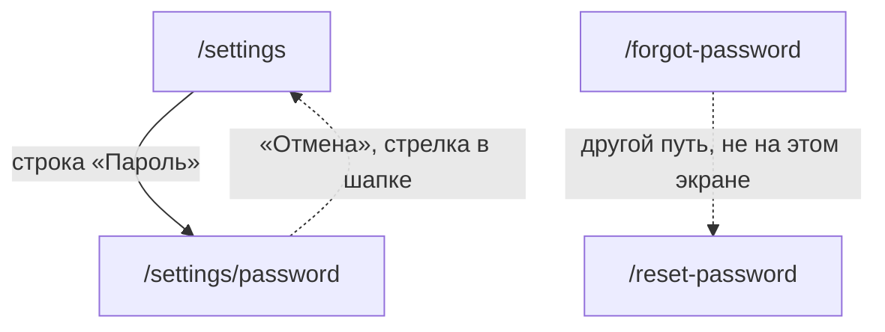

# Аудит пути: Пароль аккаунта

Маршрут: `/settings/password`, файл: `frontend/src/pages/AccountPassword.tsx`

## Кто это

Смена пароля человеком, который вошёл и знает текущий. После смены все другие устройства
выходят сами, это устройство остаётся в системе.

- Роли: вошедший человек. Аноним не попадёт: маршрут под `ProtectedRoute`
  (`App.tsx:495-502`).
- Глубина: экран поверх вкладки «Настройки». Открывается строкой «Пароль», подписью строки
  служит логин (`Settings.tsx:265-271`).
- В отличие от `/forgot-password` пароль здесь известен: человек его помнит. Экран поэтому
  требует и текущий, и два новых.

## Пользовательские истории

1. **.** Я человек, у которого ворут доступ, и хочу сменить пароль. Критерий: «Пароль
   изменён. На других устройствах нужно будет войти заново» (`AccountPassword.tsx:39`).
2. **.** Я человек, который забыл пароль. Критерий: на этом экране сказать нечем, его ведёт
   «Забыли пароль?» на `/forgot-password` (`App.tsx:262`).
3. **.** Я человек, который хочу понять, что будет с другими устройствами, до смены. Критерий:
   такого текста на экране нет, есть только тост после смены (`AccountPassword.tsx:39`).
4. **.** Я человек, который не помнит текущий пароль и хочет выйти, не потеряв доступ. Критерий:
   «Неверный текущий пароль» (`web/errors.py:77`), экран остаётся, поля сохраняются.

## Граф переходов

Пунктиром возврат: маршрут не вкладка, в шапке есть стрелка назад
(`utils/navigation.ts:15-17`, `Navbar.tsx:60,94`). На самом экране ссылки на «забыли пароль»
нет, хотя сервер различает «неверный текущий пароль» и другие ошибки.

## Путь по шагам

| Шаг | Действие | Что видит | Чем может кончиться |
| --- | --- | --- | --- |
| 1 | Нажал «Пароль» | Три поля: «Текущий пароль», «Новый пароль», «Новый пароль ещё раз», подсказка «Не короче 8 символов» | Дальше заполнять |
| 2 | Увёл из поля и оставил пустым | «Введите текущий пароль» под полем | Написать и продолжить |
| 3 | Ввёл в новом поле меньше 8 символов и ушёл с поля | «Не короче 8 символов» | Дописать |
| 4 | Ввёл разные пароли и оставил поле | «Пароли не совпадают» | Повторить правильно |
| 5 | Нажал «Сменить пароль» с пустым чем-то | Первая ошибка в порядке экрана, фокус на её поле | Заполнить и повторить |
| 6 | Нажал «Сменить пароль» | Пока идёт запрос, кнопка с крутилкой и выключена | Возврат в `/settings` |
| 7 | Пароль сменён | «Пароль изменён. На других устройствах нужно будет войти заново» на 3,5 секунды | Экран закрыт, открыт `/settings` |
| 8 | Текущий пароль неверный | Тост «Неверный текущий пароль» | Остаться на экране, всё введено |
| 9 | Новый пароль слабый | Тост «Такой пароль легко угадать. Придумайте другой» | Придумать другой, поля не очищены |
| 10 | Много попыток за час | Тост «Превышен лимит запросов» | Ждать, сколько ждать, не сказано |
| 11 | Нет связи | Тост «Не удалось сменить пароль» | Повторить, пароль на сервере не тронут |

## Состояния экрана

| Состояние | Покрыто | Где в коде |
| --- | --- | --- |
| Загрузка | Не нужен, экран рисуется сразу | `AccountPassword.tsx:48-76` |
| Ошибка загрузки | Не нужен, данных с экрана не берётся | |
| Поле не тронуто | Да, ошибок нет, подсказка «Не короче 8 символов» | `AccountPassword.tsx:58` |
| Поле оставлено пустым | Да, ошибка на экране | `AccountPassword.tsx:55,61` |
| Новый пароль короткий | Да | `AccountPassword.tsx:22,58` |
| Пароли не совпали | Да | `AccountPassword.tsx:23,61` |
| Ошибка сервера | Да, тост с текстом сервера | `AccountPassword.tsx:42` |
| Идёт запрос | Да, кнопка с крутилкой, Enter тоже блокируется | `AccountPassword.tsx:66` |
| Успех | Да, тост и уход на `/settings` | `AccountPassword.tsx:39-40` |
| Офлайн | Да, текстом «Нет связи с интернетом. Ничего не сохранилось, попробуйте ещё раз, когда связь появится» | `utils/apiError.ts:10`, `AccountPassword.tsx:42` |
| Длинный пароль | Ни поля, ни проверки длины сверху, сервер скажет сам | `web/auth.py:113-114` |

## Точки входа и выхода

Вход:

- настройки, строка «Пароль» в группе «Аккаунт» (`Settings.tsx:265-271`);
- прямой адрес `/settings/password`.

Выход:

- кнопка «Отмена» (`AccountPassword.tsx:69-71`);
- стрелка в шапке (`Navbar.tsx:94-96`), ведёт туда, откуда пришли;
- автоматически в `/settings` после успеха (`AccountPassword.tsx:40`);
- уйти с введённым без вопроса можно, о несохранённом экран не спрашивает.

## Правила и валидация

- Запрос: `PUT /api/me/password` с текущим и новым паролем
  (`services/account.service.ts:65-67`), лимит 10 в час (`web/account.py:342`).
- Экран проверяет ровно два правила: длина нового пароля не меньше 8 и совпадение повтора
  (`AccountPassword.tsx:22-23`).
- Сервер проверяет пять: длина не меньше 8, не длиннее 72 байт, не из частых, не равный
  логину, не меньше трёх разных символов (`web/auth.py:107-117`). Три из них на экране не
  видны и приходят отказом с текстом сервера.
- Текущий пароль проверяется только на сервере (`web/account.py:354-355`).
- После смены отзываются все сессии пользователя (`web/account.py:363`), затем ответ
  перевыпускает куки этой сессии (`web/account.py:373`).
- Валидация показывается по уходу с поля, а не по каждой букве (`mode: 'onTouched'` через
  `useTouched`, `AccountPassword.tsx:19,56-62`).
- Enter в любом из трёх полей отправляет форму (`AccountPassword.tsx:66`,
  `data-enter-submit`).
- На экране нет лимита попыток и нет подсказки про лимит, хотя ответ 429 настроен
  (`web/app.py:269-276`, `web/errors.py:189`).

## Доступность

- Заголовок экрана это `h1` «Пароль» (`AccountPassword.tsx:52`).
- Все три поля это `Input type="password"` с подписью и с нужным `autoComplete`:
  `current-password`, `new-password`, `new-password` (`AccountPassword.tsx:56,59,62`).
- Ошибки это `FieldError` под полем, компонент ставит `aria-invalid` и `aria-describedby`
  на само поле (`components/FieldError.tsx:18-32`).
- `onInvalidSubmit` прокручивает к первому ошибочному полю и ставит в него фокус, а счётчик
  длинных строк произносится (`utils/formErrors.ts`).
- Кнопки обе с `block`, то есть во всю ширину, и достаточной высоты
  (`AccountPassword.tsx:66-71`).
- Чего не хватает: у полей нет счётчика длины, хотя сервер откажет длинный пароль
  (`web/auth.py:113-114`), а человек узнает об этом постфактум. Кнопки «показать пароль» нет
  ни здесь, ни на входе (`pages/Login.tsx`), это общий для приложения пробел, а не свой
  этому экрану.

## Найденное

| Что | Где | Почему это важно | Тяжесть | Предложение |
| --- | --- | --- | --- | --- |
| Пять правил пароля на сервере, два на экране | `AccountPassword.tsx:22-23`, `web/auth.py:107-117` | Человек узнаёт про «не из частых», «не короче 72 байт» и «минимум три разных символа» только из отказа, то есть после того, как придумал пароль. Отказ приходит тостом и через несколько секунд исчезает | важно | Показать под новым паролем список правил. Стоит учесть, что на регистрации показывается только длина (`Register.tsx:55,179`), так что список придётся написать заново и заодно довести до ума там |
| Три набранных пароля теряются молча | `AccountPassword.tsx` (нет `useUnsavedChangesGuard`) | Стрелка в шапке, свайп и кнопка «Отмена» уносят всё введённое без вопроса. В форме человека и форме типа события тот же вопрос стоит (`UserForm.tsx:66`, `EventTypeForm.tsx:112`) | важно | Подключить `useUnsavedChangesGuard` |
| Что будет с другими устройствами, написано только после смены | `AccountPassword.tsx:39` | Тост живёт 3,5 секунды и сразу уходит на `/settings`. Человек с открытой сессией на планшете узнаёт, что его выкинуло, когда уже вернулся в настройки. На форме смены пароля об этом нет ни слова | важно | Держать пояснение на экране до смены: «После смены пароля на других устройствах придётся войти заново» |
| Экран не отвечает на «я забыл текущий» | `AccountPassword.tsx:42`, `web/account.py:354-355` | Отказ «Неверный текущий пароль» без единой ссылки на восстановление, хотя маршрут `/forgot-password` есть (`App.tsx:262`). Человек ищет выход с экрана, которого нет | важно | Под первым отказом дать одну ссылку «Забыли текущий пароль?» |
| Лимит 10 попыток в час не виден | `web/account.py:342`, `web/errors.py:189` | Ответ «Превышен лимит запросов» не говорит, сколько ждать и что делать. Человек может продолжать жать | мелочь | В тексте 429 назвать время ожидания либо проредить попытки |
| Ответ с новыми токенами не читается | `AccountPassword.tsx:38`, `services/account.service.ts:65-67` | Сервер после смены возвращает `signed_in_response`, то есть и куки, и токены для нативного клиента (`web/account.py:373`, `web/auth.py:128-137`). Браузеру хватает кук, но если появится нативное приложение, сессия этой машины останется без токенов | мелочь | Возвращать ответ из `changePassword` уже сейчас, чтобы место было готово |
| «Не короче 8 символов» появляется на пустом поле | `AccountPassword.tsx:58`, `hooks/useTouched.ts` | После ухода с поля, в которое ничего не введено, человек видит ошибку о длине, хотя ничего не набрал | мелочь | Показывать эту ошибку только после первого символа |

## Вопросы к владельцу

- Нужна ли здесь подсказка про то, что пароль хранится надёжно и что длина в 8 символов
  защищает лучше длинной фразы. Сейчас на экране этого нет.
- Стоит ли разрешить менять пароль без текущего (только по ссылке из письма), если почта
  подтверждена. Сейчас это невозможно, и на экране не сказано почему.
- Стоит ли показывать, когда пароль последний раз меняли. Данных в базе нет, но время можно
  было бы писать рядом с логином в строке настроек (`Settings.tsx:268`).

## Связанные экраны

- [settings.md](settings.md), настройки, отсюда открывается этот экран
- [account-email.md](account-email.md), соседняя строка той же группы «Аккаунт»
- [account-delete.md](account-delete.md), удаление аккаунта, пароль на нём тоже спрашивают
- [forgot-password.md](forgot-password.md), восстановление по ссылке из письма
- [reset-password.md](reset-password.md), установка пароля по ссылке
- [register.md](register.md), первый пароль и полный список правил, которые есть там