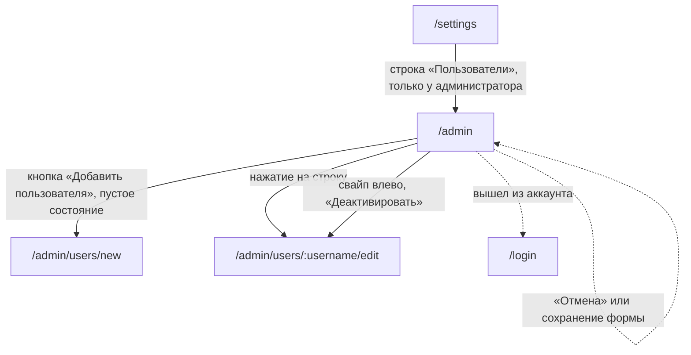

# Аудит пути: Админка

Маршрут: `/admin`, файл: `frontend/src/pages/AdminPanel.tsx`

## Кто это

Единственный экран администратора: список всех учётных записей, создание человека, правка,
деактивация и обратная активация. Права администратора у него ровно одно, и оно не
передаётся: это совпадение логина с записью из конфигурации
(`web/security.py:327-329`, `web/security.py:52`).

- Роли: администратор, то есть тот, чей логин совпадает с `ADMIN_USERNAME`
  (`hooks/useAdmin.ts:13-20`, `web/security.py:329`). Второго администратора быть не может.
- Глубина: экран поверх вкладки «Настройки», строка «Пользователи» в группе
  «Администрирование», которая есть только у администратора (`Settings.tsx:300-310`).
- Войти без прав можно: маршрут под `ProtectedRoute`, а не под проверкой прав
  (`App.tsx:395-402`), проверка сделана внутри экрана (`AdminPanel.tsx:94-113`).

## Пользовательские истории

1. **.** Я администратор, и хочу посмотреть, кто зарегистрирован. Критерий: список с логинами,
   именами, почтой и временем создания (`AdminPanel.tsx:205-247`).
2. **.** Я администратор, и хочу найти человека в длинном списке. Критерий: поиска нет, есть
   только протянуть список вниз (`AdminPanel.tsx:160-166`).
3. **.** Я администратор, и хочу завести человека. Критерий: круглая кнопка «Добавить
   пользователя» ведёт на `/admin/users/new` (`AdminPanel.tsx:260`, `85-88`).
4. **.** Я администратор, и хочу поправить имя или пароль человека. Критерий: нажатие на строку
   ведёт на `/admin/users/<логин>/edit` (`AdminPanel.tsx:202`, `80-83`).
5. **.** Я администратор, и хочу отключить доступ человеку, который больше не пользуется
   Petzy. Критерий: свайп влево открывает «Деактивировать», вопрос «Деактивация пользователя»,
   потом «Пользователь деактивирован» (`AdminPanel.tsx:190-195`, `262-288`).
6. **.** Я администратор, и хочу вернуть доступ. Критерий: у отключённого свайп влево даёт
   «Активировать» и «Пользователь активирован» (`AdminPanel.tsx:185-189`, `57`).
7. **.** Я не администратор, и случайно открыл адрес. Критерий: «У вас нет прав доступа к
   админ-панели», см. «Найденное» про то, как долго это видно.

## Граф переходов

Пунктиром возврат: форма человека уходит через `goBack` (`utils/navigation.ts:46-52`,
`UserForm.tsx:93,109,125,290`).

## Путь по шагам

| Шаг | Действие | Что видит | Чем может кончиться |
| --- | --- | --- | --- |
| 1 | Нажал «Пользователи» | «Админ-панель» и скелетоны | Список |
| 2 | Список пришёл | По карточке на человека: логин, чип «Деактивирован» если отключён, имя, почта, «Создан <дата>», шеврон | Правка или отключение |
| 3 | Нажал на карточку | Форма человека | Сохранение или отмена |
| 4 | Свайпнул строку вправо | «Изменить» | Форма человека |
| 5 | Свайпнул строку влево | «Деактивировать» | Вопрос подтверждения |
| 6 | Свайпнул свою строку влево | Ничего не открывается: у своей строки этого действия нет | |
| 7 | Нажал «Деактивировать» | «Деактивация пользователя», «Пользователь «<логин>» потеряет доступ к аккаунту. Его можно будет активировать обратно в любой момент» | «Пользователь деактивирован» |
| 8 | Нажал «Активировать» у отключённого | Сразу «Пользователь активирован», без вопроса | |
| 9 | Нажал круглую кнопку | Форма нового человека | Сохранение или отмена |
| 10 | Список пуст | «Пользователей пока нет», «Добавьте первого пользователя: у каждого будут свои питомцы и права» | Кнопка создания |
| 11 | Протянул список вниз | Список обновился | |
| 12 | Открыл адрес без прав | «Админ-панель» и на 3 секунды «У вас нет прав доступа к админ-панели» | Пустая страница, уйти стрелкой в шапке |

## Состояния экрана

| Состояние | Покрыто | Где в коде |
| --- | --- | --- |
| Проверка прав | Да, крутилка | `AdminPanel.tsx:90-92` |
| Нет прав | Да, но текст живёт 3 секунды, потом страница пустая | `AdminPanel.tsx:94-113`, `components/Alert.tsx:20-48` |
| Загрузка списка | Да, скелетоны | `AdminPanel.tsx:145-148` |
| Список пуст | Да | `AdminPanel.tsx:149-156` |
| Есть пользователи | Да | `AdminPanel.tsx:157-256` |
| Отключённый человек | Да, чип «Деактивирован» и другое действие в свайпе | `AdminPanel.tsx:221-228`, `185-189` |
| Своя строка | Да, без действия отключения | `AdminPanel.tsx:185` |
| Нет имени | Имя просто не рисуется | `AdminPanel.tsx:231-233` |
| Нет почты | Почта просто не рисуется | `AdminPanel.tsx:234-236` |
| Идёт действие | Весь список выключен свайпом | `AdminPanel.tsx:196` |
| Ошибка действия | Да, текст сервера в тосте | `AdminPanel.tsx:48-50,60-62` |
| Успех действия | Да, тост на 3 секунды | `AdminPanel.tsx:43-47` |
| Ошибка загрузки списка | Нет: список пуст, рисуется «Пользователей пока нет» | `AdminPanel.tsx:29-33,149-156` |
| Офлайн | Нет, см. выше | |

## Точки входа и выхода

Вход:

- настройки, строка «Пользователи», только у администратора (`Settings.tsx:300-310`);
- прямой адрес `/admin`;
- возврат с формы человека.

Выход:

- кнопка «Добавить пользователя» и нажатие на строку ведут в форму;
- стрелка в шапке (`Navbar.tsx:94-96`) уводит туда, откуда пришли;
- нижних вкладок на экране нет ни одной подсвеченной, см. «Найденное»;
- выход из аккаунта есть только в настройках (`Settings.tsx:314-319`).

## Правила и валидация

- Список это `GET /api/users`, админский маршрут (`web/users.py:33-47`): отдаёт всех, включая
  отключённых, сортировка новые первыми, постраничности нет.
- Пароль при входе на этот маршрут не спрашивается, только проверка прав
  (`AdminPanel.tsx:90-113`).
- Запрос списка выключен для не-администратора (`AdminPanel.tsx:32`), но страница всё равно
  показывается.
- Отключение это `DELETE /api/users/<логин>`, который на самом деле ставит `is_active: false`
  и отзывает сессии (`web/users.py:289-304`). Название «удалить» не используется, в коде это
  осознанно (`AdminPanel.tsx:36-40`).
- Администратора отключить нельзя: сервер отвечает «Нельзя деактивировать администратора»
  (`web/users.py:292-293`). Экран не даёт и не начать: у своей строки этого действия нет
  (`AdminPanel.tsx:185`), а совпадение «я» и «администратор» здесь всегда (`web/security.py:329`).
- Обратная активация это `PUT` с `is_active: true` (`AdminPanel.tsx:54`).
- Правка человека это отдельная форма и отдельные маршруты (`App.tsx:404-418`).
- Ни один маршрут не выдаёт права администратора другому человеку, потому что право это
  сравнение с конфигурацией (`web/security.py:327-329`).

## Доступность

- Заголовок `h1` «Админ-панель», в обоих состояниях (`AdminPanel.tsx:106`, `125`), второй
  уровень `h2` «Пользователи» (`AdminPanel.tsx:142`).
- Строка это `div` с `onClick` внутри `SwipeableRow`, а не ссылка и не кнопка
  (`AdminPanel.tsx:200-250`). Класс `card-soft--interactive` даёт вид нажимаемого, но в дереве
  доступности это обычный блок без роли, без подписи и без `tabindex`: с клавиатуры строку не
  открыть.
- Клавиатурный доступ даёт только кнопка действий у `SwipeableRow`
  (`components/SwipeableRow.tsx:161-164`), она появляется по фокусу с подписью «Действия:
  <логин>».
- Свайп вправо это «Изменить», свайп влево это «Деактивировать» или «Активировать»
  (`AdminPanel.tsx:179-195`).
- Круглая кнопка несёт подпись в `aria-label`, а `aria-haspopup` у неё не проставлен, потому что
  открывается страница, а не окно (`components/Fab.tsx:12`, `AdminPanel.tsx:260`).
- Вопрос отключения: опасное действие первым (`AdminPanel.tsx:270-286`).
- Чего не хватает: у пустого состояния заголовок `h2` внутри экрана с `h1`, это нормально;
  сообщения об ошибке и об успехе не объявляются скринридером, потому что `Alert` отдаёт их
  тостом (`components/Alert.tsx:47`).

## Найденное

| Что | Где | Почему это важно | Тяжесть | Предложение |
| --- | --- | --- | --- | --- |
| Человеку без прав показывают пустую страницу через 3 секунды | `AdminPanel.tsx:94-113`, `components/Alert.tsx:12-48` | Отказ выводится компонентом `Alert`, который рисует тост и возвращает `null`, то есть на странице ничего нет. Сообщение живёт 3 секунды, после чего остаётся белый экран с одним заголовком «Админ-панель» и стрелкой в шапке. Для того, кто открыл адрес по ссылке, это выглядит как поломка | важно | Рисовать запрет содержимым страницы, как пустое состояние, с объяснением и кнопкой «Назад в настройки» |
| Ни одна вкладка не подсвечена | `BottomTabBar.tsx:15`, `Navbar.tsx:60,94` | Регулярка `SETTINGS_PATH` перечисляет `settings`, `event-types`, `users/`, но не `admin`. На `/admin`, `/admin/users/new` и `/admin/users/:username/edit` не подсвечено ничего, хотя экран открыт из «Настроек», а `/users/:username` в списке есть. В шапке при этом стрелка назад и нет переключателя питомцев, то есть экран выглядит отдельным | важно | Добавить `admin` в `SETTINGS_PATH`, чтобы «Настройки» оставалась подсвеченной |
| Список без поиска и постраничности | `web/users.py:39`, `AdminPanel.tsx:160-166` | Сервер отдаёт всех пользователей одним ответом, на экране нет ни поиска, ни постраничности, ни сортировки. Чем больше людей, тем больше лишней загрузки и тем дальше искать нужного | важно | Постраничный ответ и поиск по логину, как в `/users/search` (`web/users.py:50-86`) |
| Сбой загрузки выглядит как «Пользователей пока нет» | `AdminPanel.tsx:29-33,149-156` | При ошибке запроса `users` остаётся пустым, и рисуется пустое состояние с призывом создать первого пользователя. Администратор видит ложное «никого нет» и может начать заводить дубли | важно | Различать загрузку, ошибку и пустой список, с кнопкой «Повторить» |
| Пустое состояние обещает то, чего выдать нельзя | `AdminPanel.tsx:153`, `web/security.py:327-329` | Текст «у каждого будут свои питомцы и права» обещает права. Права администратора это сравнение логина с записью в конфигурации, ни один маршрут их не выдаёт, поэтому второй администратор получиться не может | важно | Убрать «и права» или объяснить, что новый человек будет обычным |
| Строка списка не нажимается с клавиатуры | `AdminPanel.tsx:200-250`, `components/SwipeableRow.tsx:161-164` | Это `div` с `onClick` без роли, без `tabindex` и без подписи. С клавиатуры работает только кнопка «Действия: <логин>» у строки, то есть правка человека с клавиатуры требует лишнего шага, а чтения списка не будет вовсе | важно | Сделать строку ссылкой или кнопкой с подписью, а `SwipeableRow` оставить как сокращение |
| Обёртки вокруг сообщений мёртвые | `AdminPanel.tsx:128-137` | Компонент `Alert` возвращает `null` (`components/Alert.tsx:47`), а вокруг него стоят контейнеры с отступами. Разметка ничего не даёт, но её правят как будто она рисует | мелочь | Заменить на `showToast` из `utils/toast.ts`, как на остальных экранах |
| Текст успеха берётся из двух разных мест | `AdminPanel.tsx:45`, `web/messages.py:43`, `AdminPanel.tsx:57` | Для отключения текст берётся из ответа сервера, для активации зашит в экран. При переводе сервера один из двух перестанет совпадать | мелочь | Брать оба текста из ответа или оба зашивать в экран |
| Отключение не говорит про открытые устройства | `AdminPanel.tsx:266`, `web/users.py:299-304` | Вопрос говорит «потеряет доступ к аккаунту». Правда в том, что у человека прямо сейчас вылетят все открытые сессии, потому что сервер их отзывает. Формулировка это допускает, но не говорит прямо | мелочь | Добавить в вопрос, что открытые устройства выйдут из аккаунта |

## Вопросы к владельцу

- Должен ли экран вообще существовать как отдельная страница, или списка пользователей внутри
  настроек хватит. Он единственный, у кого нет нижней подсвеченной вкладки.
- Нужен ли счётчик пользователей рядом со строкой «Пользователи» в настройках.
- Нужно ли показывать администратору, у скольких человек отключён доступ и с какого времени.
- Стоит ли администратору видеть, кто и когда отключил человека. В базе это пишется в лог
  (`web/users.py:301-303`), но не в самом аккаунте.
- Что делать с людьми, отключёнными раньше: стоит ли приглашать их снова одним нажатием из
  этого экрана.

## Связанные экраны

- [settings.md](settings.md), настройки, строка «Пользователи»
- [user-form.md](user-form.md), форма человека, оба маршрута отсюда
- [user-profile.md](user-profile.md), карточка человека обычным, не админским способом
- [register.md](register.md), обычная регистрация, где пароль проверяется полным списком правил
- [account-delete.md](account-delete.md), удаление аккаунта, недоступное администратору
- [login.md](login.md), вход, откуда приходит человек, которого отключили