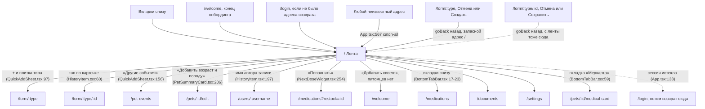

# Аудит пути: Лента

Маршрут: `/`. Файл: `frontend/src/pages/Dashboard.tsx`

## Кто это

Главный экран и первая вкладка: карточка выбранного питомца, ближайший приём лекарства и все записи
питомца по дням, новые сверху. Сюда человек попадает после входа и после любого сохранения из формы
записи, если открывал её с ленты.

- Роли: владелец и приглашённый член семьи, у обоих один и тот же путь. Аноним сюда не попадает:
  маршрут обёрнут в `ProtectedRoute` (`frontend/src/App.tsx:274-280`). Права на записи проверяет
  сервер: `@require_pet_access` на `GET /api/history/timeline` (`web/events.py:626`).
- Глубина: вкладка нижнего меню, первый в списке `MAIN_TAB_PATHS` (`frontend/src/utils/navigation.ts:4`),
  вкладка «Лента» (`frontend/src/components/BottomTabBar.tsx:18`).

## Пользовательские истории

1. **Открыть и понять, что с питомцем сегодня.** Я владелец, чтобы увидеть состояние питомца и
   последние записи, открываю приложение. Критерий: сверху карточка питомца, под ней ближайший
   приём лекарства или строка «Все приёмы на сегодня отмечены», ниже записи по дням с заголовками
   «Сегодня», «Вчера» или датой.
2. **Записать событие в одно-два нажатия.** Я владелец, чтобы записать кормление, нажимаю «+» и
   выбираю плитку. Критерий: открывается форма `/form/<тип>`, дата и время уже текущие, после
   сохранения плашка «Запись «Кормление» добавлена» с «Отменить» и возврат на ленту.
3. **Отметить приём лекарства.** Я владелец, чтобы не забыть дозу, нажимаю «Дали сейчас» на карточке
   приёма. Критерий: плашка «<лекарство>: приём отмечен» с «Отменить», карточка приёма уходит с
   экрана, запись приёма появляется в ленте.
4. **Исправить записанное.** Я владелец, чтобы поправить вес, нажимаю на карточку записи. Критерий:
   открывается `/form/<тип>/<id>`, после сохранения «Запись «Вес» обновлена» и возврат на ленту на ту
   же позицию прокрутки.
5. **Удалить запись по ошибке и вернуть.** Я владелец, чтобы убрать ошибочную запись, смахиваю её
   влево. Критерий: карточка исчезает сразу, внизу «Удалена запись: <вид>» с «Отменить» на шесть
   секунд (`frontend/src/utils/snackbar.ts:31`).
6. **Переключить питомца.** Я владелец двух питомцев, чтобы посмотреть записи второго, нажимаю
   переключатель в шапке. Критерий: карточка, приём и записи перезапрашиваются под другого
   питомца, вкладка «Медкарта» указывает на его карту (`frontend/src/components/BottomTabBar.tsx:59`).

## Граф переходов

## Путь по шагам

| Шаг | Действие | Что видит | Чем может кончиться |
| --- | --- | --- | --- |
| 1 | Открывает приложение | Скелетон ленты, пока грузится (`Dashboard.tsx:231`), либо сразу карточка и записи из кэша | Питомцев не загрузились: «Не удалось загрузить питомцев» и «Повторить» (`Dashboard.tsx:155`) |
| 2 | Смотрит верх ленты | Карточка питомца, ближайший приём лекарства или «Все приёмы на сегодня отмечены» (`NextDoseWidget.tsx:160`) | Приёма нет: виджеты просто не рисуются (`NextDoseWidget.tsx:153-156`) |
| 3 | Нажимает «Дали сейчас» | Плашка «<лекарство>: приём отмечен» с «Отменить» на десять секунд (`INTAKE_UNDO_MS`, `NextDoseWidget.tsx:112`) | Без связи: «Нет связи. Отметка сохранена на телефоне и отправится сама» и полоса «Не отправлено» (`NextDoseWidget.tsx:96`, `PendingIntakesNotice.tsx:28`) |
| 4 | Нажимает «+» | Лист «Что записать?» с плитками типов (`QuickAddSheet.tsx:65`) | Все плитки скрыты: «В окне «+» ничего нет: добавьте события питомца» и ссылка «Добавить события» (`QuickAddSheet.tsx:71-81`) |
| 5 | Выбирает тип, заполняет форму | Заголовок «Записать: <тип>», чипы «Сейчас», «Час назад», «2 часа назад», «Вчера в это время», поля типа, «Комментарий (необязательно)» | Обязательное поле не заполнено: ошибка под полем, экран прокручивается к первому полю с ошибкой (`formErrors.ts:21-38`) |
| 6 | Нажимает «Создать» | Плашка «Запись «<тип>» добавлена» с «Отменить» (`messages.py:48`), возврат на ленту (`HealthRecordForm.tsx:360`) | Нет ответа сервера: «Сервер не ответил. Попробуйте ещё раз», форма остаётся с введённым (`apiError.ts:11`) |
| 7 | Возвращается и проверяет ленту | Новая запись первой в своём дне, кэш ленты обновлён (`HealthRecordForm.tsx:303-306`) | Нажал «Отменить» в плашке: запись уходит, «Отменено» (`undo.ts:36`) |
| 8 | Смахивает запись влево | Запись исчезает сразу, внизу «Удалена запись: <вид>» с «Отменить» (`HistoryItem.tsx:104-116`) | Ушёл со страницы раньше шести секунд: DELETE всё равно уходит (`deferredDelete.ts:95-105`); не получилось: «Не удалось удалить, запись возвращена» |

Отмена: на самой ленте отменять нечего, у неё нет полей. Возврат: вкладка «Лента» нажата повторно
не открывает новую запись, а прокручивает страницу наверх (`BottomTabBar.tsx:70-75`). Ошибка сети
разобрана в разделе «Состояния экрана».

## Состояния экрана

| Состояние | Что на экране | Покрыто |
| --- | --- | --- |
| Первая загрузка | `DashboardSkeleton` (`Dashboard.tsx:231`) | Да, но скелетон выше реальной карточки: в скелетоне блок фото 180 px (`Skeletons.tsx:62`), настоящая карточка это строка 112 px (`PetSummaryCard.tsx:30`) |
| Список питомцев не пришёл | «Не удалось загрузить питомцев», «Повторить», при отсутствии связи «Нет связи с интернетом. Когда связь появится, нажмите «Повторить»» (`Dashboard.tsx:155`, `LoadError.tsx:39`) | Да |
| Лента не пришла | «Не удалось загрузить ленту», «Повторить» (`Dashboard.tsx:233`) | Да |
| Питомцев нет, пришло приглашение | «<владелец> приглашает вас вести дневник питомца <питомец>» с «Принять» и «Отклонить», рядом «Добавить своего питомца» (`Dashboard.tsx:165-174`) | Да |
| Питомцев нет, приглашений нет | Уход в онбординг (`Dashboard.tsx:179`), иначе «Питомцев пока нет» или «Доступ к питомцу закрыт» с «Добавить своего» (`Dashboard.tsx:186-193`) | Да |
| Лента пуста | «Лента пока пуста. Нажмите «+», чтобы записать первое событие», без кнопки (`Dashboard.tsx:241-243`) | Текст есть, действия нет, хотя в `EmptyState` кнопка предусмотрена (`EmptyState.tsx:97`) |
| Подсказка о свайпе | «Смахните запись влево, чтобы удалить, вправо, чтобы изменить» и «Понятно», один раз на устройство (`Dashboard.tsx:264`, ключ `petzy:swipeHintSeen` в `Dashboard.tsx:48`) | Да, но только на ленте: на «Истории» той же подсказки нет, а свайпы там те же (`HistoryItem.tsx:121-133`) |
| Много записей | Страница 20 записей (`Dashboard.tsx:71`), автоподгрузка за 300 px до конца списка плюс кнопка «Загрузить ещё» (`Dashboard.tsx:329-341`, порог в `Dashboard.tsx:40`) | Да |
| Удаление | Запись исчезает сразу, «Удалена запись: <вид>» с «Отменить» на шесть секунд (`deferredDelete.ts:63-91`) | Да, кроме случая двух удалений подряд, см. «Найденное» |
| Длинные тексты | Комментарий и значения обрезаются тремя строками на карточке, полный текст остаётся в записи (`HistoryItem.tsx:231-237`) | Да |
| Чужой автор | Под именем карточки появляется кнопка с аватаром, ведёт на `/users/:username` (`HistoryItem.tsx:192-217`) | Да |

### Офлайн

Путь человека без связи на ленте зависит от того, открыто ли приложение.

1. Приложение запускают без связи. До ленты не доходят: запрос сессии не отвечает, `ProtectedRoute`
   показывает «Не удалось связаться с сервером» и «Повторить» (`ProtectedRoute.tsx:31-52`). Проверка
   сессии повторяется один раз (`useSession.ts:49`).
2. Приложение уже открыто, связь пропала. Лента остаётся нарисованной: запросы переиспользуют кэш
   (свежесть 30 секунд, хранение 5 минут, `App.tsx:100-101`). Новые записи не приходят, `refetchOnWindowFocus`
   на ленте включён (`Dashboard.tsx:103`), но запрос уйдёт в пустоту и тихо ничего не изменит.
3. Удаление свайпом без связи. Запись исчезает с экрана, реальный DELETE не проходит, через шесть
   секунд возвращается с «Не удалось удалить, запись возвращена» (`deferredDelete.ts:80-87`).
4. Отметка приёма без связи. Отметка не теряется: она попадает в очередь на телефоне, тост
   «Нет связи. Отметка сохранена на телефоне и отправится сама» (`NextDoseWidget.tsx:95-97`,
   `duplicateIntake.ts:32-34`), над лентой стоит полоса «Не отправлено: <лекарства>. Отправим, когда
   появится связь» с кнопкой «Отправить» (`PendingIntakesNotice.tsx:28-31`). Очередь уходит сама при
   возврате связи, при возврате приложения на экран и раз в тридцать секунд (`App.tsx:157-172`).
   Отметка, дошедшая до сервера с ответом «уже отмечен», из очереди выбрасывается и повторно не
   записывается (`offlineIntakes.ts:79-83`, подтверждение «Приём уже отмечен» в
   `duplicateIntake.ts:39-44`). Ушедшая очередь сообщает «Отметка отправлена», отметка, которую сервер
   отверг насовсем, даёт «<лекарство>: отметку не удалось отправить, отметьте приём ещё раз»
   (`offlineIntakes.ts:81`, `offlineIntakes.ts:89-90`).
5. Запись о здоровье без связи. Очереди для записей нет: только отметки приёма (`offlineIntakes.ts:16-19`).
   Форма сообщает «Нет связи с интернетом. Ничего не сохранилось, попробуйте ещё раз, когда связь
   появится» (`apiError.ts:10`) и остаётся открытой с введённым.

Зависания кнопки без связи нет: у запроса есть предел 30 секунд (`api.ts:22`), а у мутаций стоит
`networkMode: 'always'`, то есть отправка сразу падает, а не ждёт сети (`App.tsx:104-107`). Подробности
о повторной отправке в [health-record-form.md](health-record-form.md).

## Точки входа и выхода

Вход: вкладка «Лента» (`BottomTabBar.tsx:18`), конец онбординга (`Onboarding.tsx:254`), вход без
адреса возврата (`returnTo.ts:9`), любой незнакомый адрес (`App.tsx:567`), возврат из формы записи
(`HealthRecordForm.tsx:360`), возврат из экрана входа после истёкшей сессии (`App.tsx:129-134`).

Выход: `/form/:type` и `/form/:type/:id` через `goBack` (`HealthRecordForm.tsx:360`, правило в
`navigation.ts:19-52`), `/pet-events` (`QuickAddSheet.tsx:156`), `/pets/:id/edit`
(`PetSummaryCard.tsx:206`), `/users/:username` (`HistoryItem.tsx:197`),
`/medications?restock=:id` (`NextDoseWidget.tsx:254`), `/welcome` (`Dashboard.tsx:193`), четыре
соседние вкладки (`BottomTabBar.tsx:59-62`), `/login` при истёкшей сессии (`App.tsx:133`).

Кнопки «назад» у экрана нет: это вкладка, в шапке логотип (`Navbar.tsx:90-96`). Назад уводит на
предыдущую страницу браузера, позиция прокрутки возвращается (`ScrollManager.tsx:66-69`).

Перехода на `/history` с ленты нет: в `Dashboard.tsx` слово `/history` не встречается ни разу. Во
всём фронтенде этот адрес есть только в таблице маршрутов (`App.tsx:290`), в форме записи как запасной
адрес выхода (`HealthRecordForm.tsx:264`, `HealthRecordForm.tsx:360`, `HealthRecordForm.tsx:512`,
`HealthRecordForm.tsx:536`), на медкарте (`pages/MedicalCardSection.tsx:122`), в форме визита
(`MedicalRecordForm.tsx:758`) и в настройках (`Settings.tsx:200`). Подробности в «Найденное».

## Правила и валидация

На самой ленте полей нет, правил на ней тоже нет: запись создаётся и проверяется в
[health-record-form.md](health-record-form.md). Что важно знать про ленту:

- Запрос: `GET /api/history/timeline` с `pet_id`, `page`, `page_size`, `type=all`
  (`healthRecords.service.ts:90-100`). Сортировка на сервере убывающая по `date_time`
  (`web/events.py:660`), поэтому дни в ленте идут от новых к старым, а порядок внутри дня задан
  порядком ответа.
- Группировка по дню берёт первые десять знаков `date_time` (`Dashboard.tsx:119`). Время записи
  переводится на часы устройства по сохранённому поясу (`healthRecords.service.ts:27-29`), поэтому
  граница суток совпадает с местной.
- Заголовок дня: «Сегодня», «Вчера», иначе `дд.мм.гггг` (`Dashboard.tsx:138-141`). На «Истории» та же
  функция (`History.tsx:42-44`), а группы там дополнительно сортируются по убыванию даты
  (`History.tsx:157`).
- Из списка выбрасываются записи, удалённые с отложенным подтверждением (`useHiddenRecords`,
  `Dashboard.tsx:107`), и записи типа, которого больше нет в каталоге и который уже нельзя нарисовать
  (`Dashboard.tsx:108-116`).
- Отметка приёма уходит в `POST` с курсом и временем, «Дали сейчас» пишет момент нажатия, а не
  время по расписанию, и закрывает именно тот слот, к которому прикасались
  (`NextDoseWidget.tsx:76-93`).
- Метка автора скрывается, если запись сделана тем же человеком (`HistoryItem.tsx:42`).

## Доступность

Сделано:

- Заголовок первого уровня для скринридера «Лента», хотя визуально его нет
  (`Dashboard.tsx:205-207`). Заголовки дней это `h2` (`Dashboard.tsx:297`).
- «+» это настоящая кнопка с именем «Добавить запись» и `aria-haspopup="dialog"`
  (`Fab.tsx:12`), в портале, поэтому её не двигают страничные блоки (`Fab.tsx:11-16`).
- Карточка записи это `role="button"` с `tabIndex={0}`, имя «<вид>, <когда>, открыть», Enter и
  пробел открывают её (`HistoryItem.tsx:143-155`). То же сделано для плиток «Запоминается»
  (`HealthRecordForm.tsx:460`).
- Лист «Что записать?» и лист фильтра это диалоги: `role="dialog"`, `aria-modal`, имя
  («Что записать?», «Фильтр по типу записи»), закрытие по Escape и по свайпу вниз
  (`DraggableSheetBody.tsx:84`, `DraggableSheetBody.tsx:142-144`, имя листа в `QuickAddSheet.tsx:54`).
- Полоса «Не отправлено» это `role="status"` (`PendingIntakesNotice.tsx:14`), строка «Все приёмы на
  сегодня отмечены» тоже `role="status"` (`NextDoseWidget.tsx:158`).
- Каждая плашка сообщается вслух через `announce` (`snackbar.ts:88`), ошибки assertive.
- Кликабельные строки antd, в том числе поля выбора в форме, получают `role="button"` и
  `tabindex=0` (`antdA11y.ts:34-46`); метки полей связаны с полями, обязательные помечены
  `aria-required` (`antdA11y.ts:56-70`).

Не хватает:

- Кнопки «Изменить» и «Удалить» на карточке скрыты (`clip-path` и `opacity: 0`,
  `SwipeableRow.css:124-126`) и появляются только при фокусе с клавиатуры. На сенсорном экране
  свайп остаётся единственным путём к удалению. В списке документов те же кнопки показаны постоянно:
  там передан `menuVisible` (`DocumentsList.tsx:375`, правило `SwipeableRow.css:146-155`).
- График приёма и вес на карточке питомца не читаются: у `PetSummaryCard` в ленте нет веса и нет
  последнего кормления, это осознанно (`PetSummaryCard.tsx:4-9`), но числовых подписей на самой
  карточке тоже нет.
- Текст полосы об отправке не называет время отметки, только лекарство
  (`PendingIntakesNotice.tsx:28`), при двух питомцах непонятно, чья это отметка.

## Найденное

| Что | Где | Почему это важно | Тяжесть | Предложение |
| --- | --- | --- | --- | --- |
| С ленты некуда перейти в «Историю»: в `Dashboard.tsx` нет ни одного `navigate('/history')`, в общем графе `README.md` при этом есть ребро `Feed --> History` | `Dashboard.tsx:1-363`, поиск `'/history'`: только `Settings.tsx:200` и `pages/MedicalCardSection.tsx:122` | Человек, которому нужен фильтр по типу или график, ищет путь вслух: с ленты его нет, вкладки «История» снизу тоже нет (`BottomTabBar.tsx:17-23`) | важно | Ссылка «Вся история» под последней записью ленты или в шапке ленты |
| «Лента пока пуста» показывается, пока грузится список питомцев: запрос ленты выключен без выбранного питомца (`Dashboard.tsx:101`), у выключенного запроса `isLoading` ложный, и пустой список попадает под ветку пустоты | `Dashboard.tsx:101`, `Dashboard.tsx:230-244`, авто-выбор питомца `usePet.ts:126-131` | Человек с записями видит «Лента пока пуста», жмёт «+» и пишет первое событие заново; через секунду записи появляются сами | важно | Ждать `petsFetched`, как в ветке «питомцев нет» (`Dashboard.tsx:161`), и различать «ещё грузим» и «правда пусто» |
| Второе удаление подряд отменяется без спроса: новая плашка заменяет прежнюю (`snackbar.ts:82`), а отложенное удаление по этой замене уходит сразу (`deferredDelete.ts:78`) | `deferredDelete.ts:77-79`, `HistoryItem.tsx:104` | Два свайпа подряд, и у первой записи нет ни «Отменить», ни подтверждения: она удалена окончательно | мелочь | Либо очередь плашек с отменой по каждой, либо подтверждение, когда заменяется плашка удаления |
| Полоса «Не отправлено» не называет время отметки и питомца | `PendingIntakesNotice.tsx:28`, очередь хранит только лекарство и ввод `offlineIntakes.ts:16-19` | При двух питомцах или вечерней дозе непонятно, что именно ждёт отправки | мелочь | Добавить время и, если писем несколько, имя питомца |
| Подсказка о свайпе есть только на ленте, а свайпы в ленте и в истории одни и те же | `Dashboard.tsx:247-293`, `HistoryItem.tsx:121-133` | Тот, кто сначала открыл «Историю», не узнает про свайпы; ключ в localStorage ставится лентой на всё устройство | мелочь | Показывать подсказку на обоих экранах по одному ключу |
| Пустое состояние ленты обходится без кнопки, хотя в `EmptyState` она есть | `Dashboard.tsx:235-244`, `EmptyState.tsx:97` | На ленте один способ добавить запись это круглая «+», и подсказка про неё даётся текстом, а не кнопкой | мелочь | Либо оставить как есть осознанно, либо дать кнопку «Записать первое событие» |
| Скелетон ленты выше настоящей карточки питомца: 180 px против 112 px | `Skeletons.tsx:61-62`, `PetSummaryCard.tsx:30` | При загрузке список прыгает вверх, когда скелетон сменяется содержимым | мелочь | Привести силуэт скелетона к высоте настоящей карточки |

Продолжает старую историю: A2-16 (много записей и подгрузка) закрыта кодом, A2-13 (жесты без
подсказки) закрыта частично, см. строку про подсказку выше; A2-29 (запись без сети) для записей о
здоровье не закрыта, см. [health-record-form.md](health-record-form.md).

## Вопросы к владельцу

1. Нужен ли переход с ленты в «Историю». Если да, где он должен быть: ссылка в конце списка,
   пункт в шапке или пункт в настройках плитки ленты. Сейчас в общем графе `README.md` ребро есть,
   а в коде перехода нет.
2. Что делать с двумя удалениями подряд: давать «Отменить» на каждую запись или оставить одну
   плашку на последнее действие.
3. Нужно ли в полосе «Не отправлено» называть время отметки и питомца, если писем в очереди
   несколько.
4. Пустое состояние ленты должно остаться без кнопки (один способ добавить это «+») или получить
   действие.

## Связанные экраны

- [health-record-form.md](health-record-form.md), форма записи: открывается с ленты и уводит назад
  сюда
- [history.md](history.md), вся история и графики: тот же список записей с фильтром
- [medications-list.md](medications-list.md), куда ведёт «Пополнить» на карточке приёма
- [medical-card-section.md](medical-card-section.md), откуда открывается форма веса
- [pet-events.md](pet-events.md), «Другие события» из листа «+»
- [pet-form.md](pet-form.md), «Добавить возраст и породу» из карточки питомца
- [onboarding.md](onboarding.md), куда уходят с пустой лентой
- [README.md](README.md), сквозные правила и общий граф