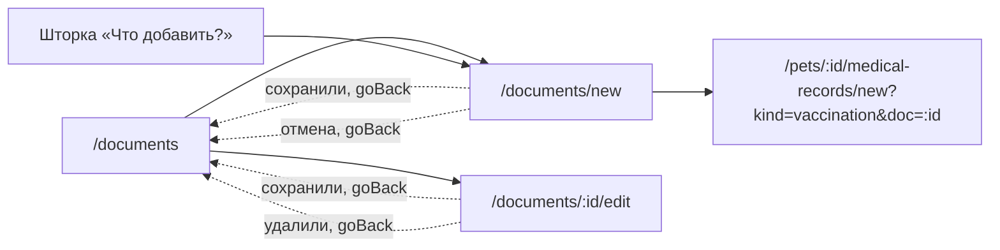

# Аудит пути: Форма документа

Маршрут: `/documents/new` и `/documents/:id/edit`, файл: `frontend/src/pages/DocumentForm.tsx`

## Кто это

Форма, которая даёт файлу имя и категорию. Файл обычно уже выбран: человек сфотографировал
или взял его из файлов в шторке списка документов, и форма открылась с ним. При правке
файл не трогается, меняется только описание.

- Роли: владелец и приглашённый с доступом к питомцу, все внутри `ProtectedRoute`
  (`App.tsx:453-470`). `/documents/new` обёрнут в `RequirePet what="Документы"`
  (`App.tsx:456-459`), `/documents/:id/edit` нет, но питомец там и так есть
- Глубина: экран поверх вкладки «Документы». В шапке есть кнопка «назад»
  (`components/Navbar.tsx:60`, `utils/navigation.ts:4`)

## Пользовательские истории

1. **Назвать загруженный файл.** Я владелец, чтобы справка нашлась потом, вписываю название.
   Критерий: поле обязательное, без него «Добавить» не проходит, ошибка под полем
   (`pages/DocumentForm.tsx:41-42`, `:595-603`)
2. **Выбрать категорию.** Я владелец, чтобы файл попал в нужную секцию, открываю «Категория».
   Критерий: шесть категорий, выбор сохраняется, у прививки под полем появляется
   напоминание про оформление в медкарте (`:549-593`, `:561-563`)
3. **Загрузить архив снимков.** Я владелец, чтобы положить в Petzy МРТ и КТ, выбираю архив.
   Критерий: категория сама переключается на «Снимки», файл идёт отдельным каналом счётчиком
   и кнопкой «Остановить» (`:214-216`, `:468-534`)
4. **Задать срок.** Я владелец, чтобы напомнило об истечении страховки или прививки, ставлю
   «Действует до». Критерий: колесо даты с годами от двух лет назад до десяти лет вперёд,
   значение можно убрать (`:615-688`)
5. **Сохранить без потерь.** Я владелец, чтобы уйти со страницы и не потерять написанное,
   нажимаю вкладку или системную «назад». Критерий: «Выйти без сохранения?» и два ответа,
   «Остаться» возвращает к форме (`hooks/useUnsavedChangesGuard.tsx:40-52`)
6. **Удалить документ.** Я владелец, нажимаю «Удалить документ» внизу формы. Критерий:
   вопрос с обещанием «Файл будет стёрт насовсем», после удаления возврат на список
   (`:722-740`)

## Граф переходов

Отмена и уход из формы идут через `goBack(navigate, '/documents')`
(`pages/DocumentForm.tsx:718`, `:737`), то есть туда, откуда форма была открыта, если
история в сессии есть (`utils/navigation.ts:46-52`).

## Путь по шагам

| Шаг | Действие | Что видит | Чем может кончиться |
| --- | --- | --- | --- |
| 1 | Приходит с выбранным файлом | Форма уже с именем файла и размером, если файл взят из шторки списка (`utils/pendingDocumentFile.ts`, `pages/DocumentForm.tsx:220-225`) | Заполнение описания |
| 2 | Приходит по ссылке с категорией | Категория уже подставлена: `?category=imaging` из шторки снимков (`:64-68`) | Заполнение описания |
| 3 | Выбирает категорию | Список из шести категорий, при выборе другой у архива файл сбрасывается с объяснением (`:573-590`) | Категория выбрана |
| 4 | Вписывает название | Подсказка «Например, Прививка от бешенства», счётчик до 100 символов (`:599-601`) | Название готово |
| 5 | Ставит срок | Колесо даты; у уже заданного срока рядом «Убрать» (`:643-661`) | Срок задан или нет |
| 6 | «Добавить» | Документ сохранён; для прививки полоса «Документ добавлен» с действием «В медкарту» вместо обычного тоста (`:250-267`) | Возврат на список |
| 7 | Файл не выбран | Подпись под полем «Файл»: «Выберите фото или PDF» или «Выберите снимки: фото, PDF или архив» (`:346-356`) | Можно выбрать файл и продолжить |
| 8 | Отмена | Возврат на список, файл не сохранён | Ничего не изменилось |
| 9 | Пропала связь во время загрузки | Тост «Не удалось добавить документ» или «Не удалось загрузить снимки», форма остаётся с файлом (`:269-271`, `:298-300`) | Можно повторить |

## Состояния экрана

| Состояние | Что показывает | Ссылка |
| --- | --- | --- |
| Загрузка при правке | Крутилка | `pages/DocumentForm.tsx:358-360` |
| Файл не выбран | Подпись «Выберите фото или PDF», для снимков «Выберите снимки: фото, PDF или архив» | `:410-411`, `:434` |
| Файл не тот | Сообщение с именем файла: «подходят фото и PDF», а для снимков добавлено «а снимки МРТ и КТ принимаются архивом» | `:194-195` |
| Файл больше 10 МБ | «Файл больше 10 МБ. Если это снимки, упакуйте их в ZIP: архивы принимаются до 500 МБ» | `:197-201` |
| Архив, а снимки выключены | «Архивы сейчас не принимаются. Загрузите фото или PDF» | `:187` |
| Идёт загрузка | Счётчик «Загружено X из Y», кнопка «Остановить», полоса прогресса с `aria-valuenow` | `:468-534` |
| Правка | Имя файла и размер, заменить файл нельзя: «Чтобы заменить файл, удалите документ и загрузите новый» | `:385-402`, `:543` |
| Нет питомца | «Сначала добавьте питомца» | `App.tsx:456-459`, `components/RequirePet.tsx:10` |
| Файл вернулся после сессии | Введённые поля восстанавливаются, файл приходится выбирать заново | `hooks/useSessionDraft.ts:39-46`, `pages/DocumentForm.tsx:237-238` |

## Точки входа и выхода

Вход: шторка «Что добавить?» из списка документов
(`components/DocumentSheet.tsx:42`, `:47`), кнопка «Добавить документ» из пустого
состояния (`pages/DocumentsList.tsx:334-335`), круглая «+» (`components/DocumentSheet.tsx:14`),
свайп «Изменить» по карточке (`pages/DocumentsList.tsx:380`), кнопка «Изменить» в
просмотрщике файла (`pages/DocumentsList.tsx:637-640`), ссылки с `?category=` из медкарты
(`pages/DocumentForm.tsx:64-68`).

Выход: список документов через `goBack`, и, для свежего сертификата о прививке, новая
запись медкарты с формой, уже заполненной из документа (`pages/DocumentForm.tsx:257-264`).

## Правила и валидация

Схема: категория обязательна, название обязательно и до 100 символов, заметка до 500
(`pages/DocumentForm.tsx:41-45`). Проверка режима `onTouched`: ошибка поля появляется
после того, как человек ушёл с него, и при неверной отправке страница скроллится к первому
ошибку (`pages/DocumentForm.tsx:96-99`, `utils/formErrors.ts`).

Файл при создании обязателен, и эта проверка идёт первой, до остальных полей
(`pages/DocumentForm.tsx:346-356`). Проверки файла на клиенте повторяют серверные: тип по
`file.type` или по имени, если браузер тип не заполнил (это путь HEIC с телефона),
10 МБ, архив только в «Снимки» (`pages/DocumentForm.tsx:184-203`, `:214-216`).

Заголовок приходит multipart и остаётся текстом, поэтому «2025» не станет числом
(`web/pydantic_helpers.py:110`, `web/app.py:137`). Название, категория и заметка в одну
строку, лишние пробелы схлопываются (`web/schemas.py:1863-1866`).

Что сохраняется при уходе: введённые поля возвращаются после оборванной сессии, файл нет
(`pages/DocumentForm.tsx:237-238`). Пока форма грязная или выбран файл, уход спрашивает
«Выйти без сохранения?» (`pages/DocumentForm.tsx:103`, `hooks/useUnsavedChangesGuard.tsx:40-52`).

Загрузка архивов идёт в обход прокси и отменяется, если уйти со страницы
(`pages/DocumentForm.tsx:86-90`). Обычная загрузка фото или PDF короче 10 МБ и такого
счётчика не имеет (`pages/DocumentForm.tsx:240-249`).

## Доступность

Ошибка поля идёт подписью в `Form.Item`, а не поповером у заголовка, и ставит
`aria-invalid` и `aria-describedby` на само поле (`components/FieldError.tsx:14-39`).
Файл выбирается скрытым, но не `display:none` полем, он остаётся в порядке обхода Tab
(`pages/DocumentForm.tsx:456-458`). Счётчик загрузки имеет `role="progressbar"`,
`aria-label="Загрузка снимков"` и `aria-valuenow` (`:511-517`). Кнопки снятия срока и
остановки загрузки подписаны (`aria-label="Убрать срок действия"`, `:645`; текст
«Остановить», `:508`). Диалог удаления и диалог несохранённых правок сделаны через antd.

## Найденное

| Что | Где | Почему это важно | Тяжесть | Предложение |
| --- | --- | --- | --- | --- |
| Файл с телефона (HEIC) показывается только именем: превью не рисуется нигде в форме, `utils/drawableImage.ts` не используется, хотя сервер наверняка отдаёт WebP (`pages/DocumentForm.tsx:426-447`) | `pages/DocumentForm.tsx:426-447` | Человек не видит, тот ли файл он выбрал, до самого сохранения. Для справки, где страницы перепутаны, ошибка обнаружится только на медосмотре у врача | важно | Показывать миниатюру выбранного изображения через `drawableImage` (`utils/drawableImage.ts:12-27`), она уже умеет просить у сервера WebP и ничего не хранит |
| Замена файла при правке невозможна, об этом сказано одной строкой внизу формы: «Чтобы заменить файл, удалите документ и загрузите новый» (`pages/DocumentForm.tsx:543`) | `pages/DocumentForm.tsx:385-402`, `:543` | Ошибочно загруженный скан приходится удалять вместе со всей записью, а удаление необратимо (`pages/DocumentForm.tsx:726`). Человек теряет название, заметку и срок, если не догадался их переписать | важно | Разрешить замену файла при правке тем же путём, что и создание, с теми же ограничениями |
| Обычная загрузка фото или PDF идёт без счётчика и без отмены: счётчик и «Остановить» есть только у архивов (`pages/DocumentForm.tsx:468-534`), а `cancelUpload` работает только при `uploadProgress !== null` (`:362`) | `pages/DocumentForm.tsx:362`, `:240-249` | На плохой связи файл до 10 МБ грузится вслепую, кнопка «Добавить» просто крутится, а «Отмена» уходит со страницы и отменяет загрузку через `useEffect` на размонтировании (`:90`) | важно | Показать прогресс и кнопку «Остановить» для всех файлов, а не только для архивов |
| Файл из шторки списка документов лежит в памяти между экранами (`utils/pendingDocumentFile.ts`) и забирается один раз при открытии формы (`pages/DocumentForm.tsx:220-225`). Если форма не открылась, файл остаётся ждать и попадёт в следующую | `utils/pendingDocumentFile.ts:1-13` | Файл, выбранный на телефоне, может молча появиться в форме, открытой позже совсем по другому поводу. Нигде не сказано, что он выбран, пока человек не дойдёт до поля «Файл» | важно | Сбрасывать ожидающий файл, если его не забрали за разумный срок, или хранить его вместе с именем экрана, который его запросил |
| Название и категория это единственные обязательные поля, но форма не сообщает, что именно отсутствует, когда «Добавить» нажата с пустым файлом и пустым названием: показывается только ошибка файла (`pages/DocumentForm.tsx:346-356`) | `pages/DocumentForm.tsx:346-356` | Комментарий в коде объясняет, что порядок проверок выбран намеренно, чтобы не было «одно за другим», но в итоге первое нажатие даёт одну ошибку, а второе другую. Два круга вместо одного | мелочь | Показывать все ошибки формы сразу, а ошибку файла ставить первой по порядку на экране |
| При ошибке загрузки файла остаётся выбранным, но код не гасит кнопку и не говорит, что повтор возможен (`pages/DocumentForm.tsx:269-271`) | `pages/DocumentForm.tsx:269-271` | При обрыве связи человек ждёт, ничего не происходит, и не понимает, надо ли выбирать файл заново | мелочь | Оставлять файл и явно говорить, что он на месте и достаточно нажать «Добавить» ещё раз |
| Загрузка архива отменяется при уходе со страницы (`pages/DocumentForm.tsx:88-90`), но грязная форма при этом спрашивает «Выйти без сохранения?», и только «Выйти» действительно прерывает загрузку | `pages/DocumentForm.tsx:88-90`, `:103` | Человек, который хочет отменить загрузку, должен пройти через вопрос, который тут вообще не про то | мелочь | Во время загрузки спрашивать прямо «Прервать загрузку?» вместо общего вопроса о несохранённых полях |
| Категория «Прививки» обещает оформление в медкарте, но это обещание висит подсказкой, а после сохранения действие спрятано в полосу «В медкарту», которая живёт несколько секунд (`pages/DocumentForm.tsx:254-264`, `:561-563`) | `pages/DocumentForm.tsx:254-264` | Пропустил полосу, потом ищи в медкарте сам. Срок следующей прививки и напоминание так и не появятся | мелочь | Дать перейти в медкарту из готового документа в списке (там есть кнопка «Оформить в медкарте», `pages/DocumentsList.tsx:429-452`), и упомянуть это в подсказке |
| Срок действия проверяется на сервере с потолком в десять лет (`web/schemas.py:1868-1878`), и колесо в форме повторяет этот потолок (`pages/DocumentForm.tsx:143-157`) | `pages/DocumentForm.tsx:143-157`, `web/schemas.py:1868-1878` | Потолки совпадают, это сделано правильно. Замечание к формулировке: подсказка под полем срока на английском задумана как «срок следующей прививки», но на форме она показывается только для категории «Прививки» (`pages/DocumentForm.tsx:561-563`) | мелочь | Оставить как есть, но проверить, что подсказка не обещает напоминание там, где его не будет |

## Вопросы к владельцу

- Разрешать ли замену файла у уже сохранённого документа. Сейчас нет, и это стоит
  описания: удаление необратимо.
- Показывать ли превью выбранного файла в форме, учитывая, что файл может быть архивом
  на 500 МБ и показывать там нечего.
- Что делать с файлом, выбранным на списке, если форма так и не открылась: он останется
  ждать в памяти до перезагрузки страницы.
- Говорить ли перед уходом во время загрузки архива, что загрузка будет прервана, или
  молча обрывать.

## Связанные экраны

- [documents-list.md](documents-list.md): список, откуда форма открывается и куда возвращает
- [medical-record-form.md](medical-record-form.md): форма записи, в которую ведёт «В медкарту» после сертификата
- [medical-card.md](medical-card.md): откуда приходит ссылка с подставленной категорией
- [medications-list.md](medications-list.md): соседняя вкладка, из шторки снимков туда же ведёт путь
- [dashboard.md](dashboard.md): лента, где появляется новый документ после сохранения