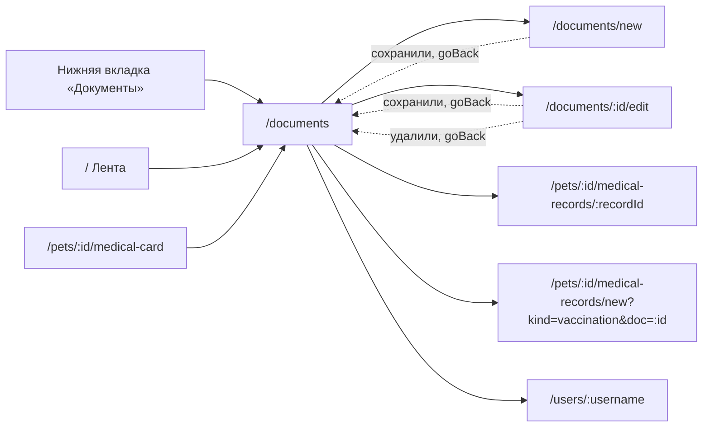

# Аудит пути: Документы

Маршрут: `/documents`, файл: `frontend/src/pages/DocumentsList.tsx`

## Кто это

Список файлов питомца: справки, анализы, снимки, страховка, разложенные по категориям.
Человек приходит либо открыть нужный файл, либо загрузить новый, либо найти старый по
записи медкарты.

- Роли: владелец и приглашённый с доступом к питомцу, все внутри `ProtectedRoute`
  (`App.tsx:445-452`). Гость по ссылке сюда не попадает
- Глубина: нижняя вкладка сама по себе. `MAIN_TAB_PATHS` содержит `/documents`
  (`utils/navigation.ts:4`), поэтому в шапке нет кнопки «назад» и есть переключатель
  питомца (`components/Navbar.tsx:60`)

## Пользовательские истории

1. **Открыть файл.** Я владелец, чтобы посмотреть справку или снимок, нажимаю на карточку.
   Критерий: фото открывается просмотрщиком, PDF во встроенном окне с запасным
   «Не видно файл? Открыть в браузере», архив скачивается
   (`pages/DocumentsList.tsx:232-265`, `:687-716`)
2. **Загрузить файл с телефона.** Я владелец, чтобы сохранить фото чека, нажимаю круглую
   «+», затем «Сфотографировать». Критерий: камера открывается, форма приходит уже с
   выбранным файлом (`components/DocumentSheet.tsx:53`, `:59`)
3. **Загрузить снимки МРТ или КТ.** Я владелец, чтобы положить в Petzy архив исследований,
   в шторке выбираю «Снимки МРТ, КТ, архив». Критерий: форма открывается уже в категории
   «Снимки», файл принимается до 500 МБ и пошёл счётчик загрузки
   (`components/DocumentSheet.tsx:47`, `pages/DocumentForm.tsx:410-411`)
4. **Найти нужный файл.** Я владелец, чтобы вспомнить, где рентген, ввожу «рентген ортовета»
   в поиск. Критерий: остаются файлы, у которых это слово есть в названии, категории, записи
   или имени файла (`utils/documentSearch.ts:10-32`)
5. **Перейти от документа к записи.** Я владелец, чтобы увидеть, при каком визите сделан
   снимок, нажимаю «Из записи: <название>». Критерий: открывается запись медкарты
   (`pages/DocumentsList.tsx:469-485`)
6. **Убрать лишний файл.** Я владелец, чтобы удалить ошибочно загруженный документ, свайпаю
   строку. Критерий: карточка уходит сразу, «Отменить» её возвращает, по истечении паузы
   уходит DELETE (`utils/deferredDelete.ts:63-91`)

## Граф переходов

## Путь по шагам

| Шаг | Действие | Что видит | Чем может кончиться |
| --- | --- | --- | --- |
| 1 | Открывает вкладку | Заголовок «Документы», поиск «Название, запись, диагноз, клиника», при более чем десяти файлах ряд чипов по категориям с количествами (`pages/DocumentsList.tsx:296-322`) | Список по категориям |
| 2 | Ищет файл | Совпадения по названию, категории, заметке, имени файла, сроку и по тексту записей медкарты (`utils/documentSearch.ts:10-32`) | Список отфильтрован, либо «Ничего не найдено» (`:337-342`) |
| 3 | Открывает карточку | Фото открывается просмотрщиком с отдельной кнопкой закрытия, PDF в окне с заголовком, «Изменить» и «Закрыть» (`:539-584`, `:586-720`) | Файл прочитан |
| 4 | Нажимает «+» | Шторка «Что добавить?»: «Сфотографировать», «Фото или PDF из файлов», «Снимки МРТ, КТ, архив» (`components/DocumentSheet.tsx:55-64`) | Переход на `/documents/new` |
| 5 | Файл выбран | Файл лежит в памяти (`utils/pendingDocumentFile.ts`), форма открывается уже с ним (`pages/DocumentForm.tsx:220-225`) | Заполнение описания |
| 6 | «Добавить» | Документ сохранён, тост «Документ добавлен»; для прививки вместо тоста полоса «Документ добавлен» с действием «В медкарту» (`pages/DocumentForm.tsx:250-267`) | Возврат на список |
| 7 | Отмена | Возврат на список, ничего не сохранено | Без изменений |
| 8 | Ошибка сети | «Не удалось открыть файл» тостом; для архива при 403 или 404 карточка уходит из списка и перезапрашивается (`:247-253`) | Понятно, что файл не открылся |

## Состояния экрана

| Состояние | Что показывает | Ссылка |
| --- | --- | --- |
| Загрузка | Три скелета карточек | `pages/DocumentsList.tsx:325-326` |
| Пусто | «Здесь будут документы питомца», кнопка «Добавить документ» | `:329-336` |
| Ошибка сети при загрузке | «Не удалось загрузить документы» с повтором | `:327-328` |
| Нет питомца | «Сначала добавьте питомца» | `:279-281` |
| Ничего не найдено | «Ничего не найдено. Попробуйте изменить запрос» | `:337-342` |
| Нет сети при открытии файла | Тост об ошибке, для архива плюс обновление списка | `:241-253` |
| Файл, прикреплённый к записи | Строка «Из записи: <название>, <дата>» и, при нескольких, «и ещё N» | `:469-485` |
| Файл, уже оформленный в медкарту | Скрыта плашка срока, вместо неё кнопка «Оформить в медкарте» или её отсутствие | `:367`, `:429-452` |

## Точки входа и выхода

Вход: нижняя вкладка «Документы» (`components/BottomTabBar.tsx:21`), переход из ленты и
из медкарты (`docs/ux/README.md`), адрес с параметром `?open=<id>`: запись медкарты
ссылается на свой файл, и список открывает его один раз, убирая параметр
(`pages/DocumentsList.tsx:230-231`, `:267-277`).

Выход: форма документа, запись медкарты и её создание из сертификата, профиль другого
человека. Кнопки «назад» на этом экране нет, экран вкладка.

## Правила и валидация

Файл обязателен при создании, и проверка идёт до валидации остальных полей, чтобы
человеку не пришлось чинить одно за другим (`pages/DocumentForm.tsx:346-356`). Проверки
до загрузки повторяют серверные: 10 МБ, поддерживаемые типы, архив только в «Снимки»
(`pages/DocumentForm.tsx:185-203`). Название из multipart остаётся текстом, поэтому
документ с названием «2025» не превращается в число (`web/pydantic_helpers.py:110`,
`web/app.py:137`).

Удаление идёт через отложенное удаление с отменой (`utils/deferredDelete.ts:63-91`):
карточка скрыта сразу, DELETE уходит, только когда «Отменить» не нажали. Если запрос
не прошёл, карточка вернётся сама (`utils/deferredDelete.ts:83-87`).

Поиск идёт по нормализованному тексту, «ё» приравнивается к «е», и каждое слово запроса
должно найтись (`utils/documentSearch.ts:3`, `:27-32`). Категории показываются чипами
только когда файлов больше десяти (`pages/DocumentsList.tsx:175-176`).

## Доступность

Поиск и кнопка «Оформить в медкарте» подписаны текстом, у «Оформить в медкарте» есть
собственный `onClick` с остановкой всплытия (`:430-451`). Кнопка закрытия просмотрщика
есть отдельной разметкой с `aria-label="Закрыть"` (`:563`), у файлового окна есть
`role="dialog"`, `aria-modal` и подпись названием (`:588-592`). Esc закрывает оба
просмотрщика (`:145-154`). «Добавил(а)» ведёт в профиль человека (`:500-523`).

## Найденное

| Что | Где | Почему это важно | Тяжесть | Предложение |
| --- | --- | --- | --- | --- |
| Просмотрщик фото не переживает формат, который браузер не рисует: подпись под карточкой прямо признаёт, что для HEIC вне Safari картинка не отображается (`pages/DocumentsList.tsx:546-554`), а файл открывается как есть (`pages/DocumentsList.tsx:259-261`). На телефоне это HEIC с камеры | `pages/DocumentsList.tsx:259-261` | Человек тапает снимок из ленты и видит пустой чёрный экран. Спасение есть, кнопка «Закрыть» поверх (`:555-584`), но самого файла нет, а предпросмотр на сервере (`utils/drawableImage.ts:12-27`) в списке не используется, только в формах | важно | Показывать превью через `POST /api/images/preview` (как это делает `utils/drawableImage.ts`), а в просмотрщике для нерисуемых типов показывать имя файла и кнопку «Открыть в браузере», как у PDF (`:694-716`) |
| Архив скачивается через `window.location.assign(link)` (`pages/DocumentsList.tsx:244`), то есть уход со страницы | `pages/DocumentsList.tsx:244` | Установленное как PWA приложение теряет экран, и тост «Скачивание началось» (`:245`) может не быть виден вообще. Комментарий в коде утверждает обратное: «ссылка сама скачивается (отдана вложением), поэтому переход оставляет приложение там же» (`:237-240`) | важно | Проверить живьём на установленном PWA и, если страница уезжает, перейти на скачивание без смены адреса |
| Удаление документа из списка не спрашивает, куда денется файл, если документ прикреплён к записям медкарты: вопрос появляется только в форме (`pages/DocumentForm.tsx:726`), из списка он короче (`pages/DocumentsList.tsx:732-733`) | `pages/DocumentsList.tsx:732-733` | Разница в словах одного и того же действия на двух экранах. Из формы обещают «Файл будет стёрт насовсем», из списка нет | мелочь | Взять из формы общую формулировку и для диалога списка |
| Поиск есть всегда, а ряд категорий появляется только от десяти файлов (`pages/DocumentsList.tsx:301-308`, `:175-176`), и при его появлении число на чипе считает все документы, а не результаты поиска (`:177-185`) | `pages/DocumentsList.tsx:177-185` | Человек ищет «мрт», видит «Снимки 4», а под фильтром оказывается один файл. Число обещает не то, что отфильтровано | мелочь | Считать количества по результатам поиска, а не по всему списку |
| Карточка не показывает, что файл прикреплён к нескольким записям, пока их больше одной: видно только «и ещё N» (`:482`) | `pages/DocumentsList.tsx:469-485` | Продолжение A4-19. Человек не понимает, куда ещё привязан документ, и насколько много он потеряет при удалении | мелочь | Называть виды записей или их число словами, а не цифрой |
| Плашка срока скрывается, если документ привязан к записи медкарты (`:367`), но кнопка «Оформить в медкарте» есть только для категории «Прививки» (`:429`) | `pages/DocumentsList.tsx:367`, `:429` | Продолжение A4-13. У прививки без повтора документ молчит о сроке, а способа увидеть, что срок есть и напоминания не будет, у него нет | мелочь | Показывать «Действует до <дата>» вторичным текстом, когда плашка скрыта, и говорить, что напоминание придёт из записи |
| Отметка «Добавлен <дата и время>» считается по локальному времени устройства (`pages/DocumentsList.tsx:497`, `utils/relativeTime.ts` через `utcStampToLocal`), это A4-18, помеченный как исправленный | `pages/DocumentsList.tsx:497` | Старый аудит счёл это исправленным, но код по-прежнему приводит метку сервера к местному времени устройства, а не к времени события в его зоне | важно | Если правка A4-18 была в другом поле, оставить здесь ссылку на то место, где время приводится к зоне события, иначе переоткрыть историю |

## Вопросы к владельцу

- Что показывать на месте снимка из телефона, который браузер не рисует: имя файла с
  кнопкой открыть, или просить загрузить заново в JPEG.
- Считать ли архив снимков нажатием на карточку или отдельной кнопкой «Скачать»:
  сейчас это свайп и тап, и обе ведут в скачивание (`pages/DocumentsList.tsx:232-244`,
  `:372`).
- Должен ли поиск показывать, по чему он нашёл файл (например, подсветкой совпадения в
  записи медкарты), или список совпадений без объяснения достаточно.

## Связанные экраны

- [document-form.md](document-form.md): форма, куда ведут тап по кнопке «+», шторка и «Изменить»
- [medical-record-form.md](medical-record-form.md): запись медкарты, из которой приходит `?open=` и куда ведёт «Из записи»
- [medical-card.md](medical-card.md): откуда в список приходят ссылки на документы
- [medications-list.md](medications-list.md): соседняя вкладка на того же питомца
- [history.md](history.md): другой путь к записям, по которым ищет этот список
- [user-profile.md](user-profile.md): тап по «Добавил(а)»