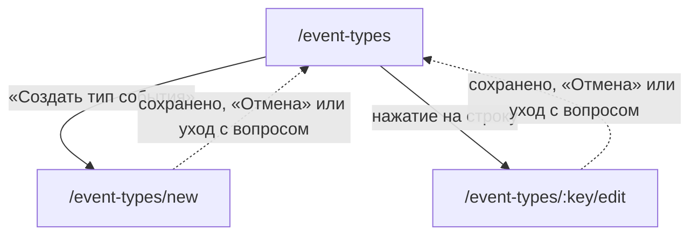

# Аудит пути: Форма типа события

Маршруты: `/event-types/new` и `/event-types/:key/edit`, файл:
`frontend/src/pages/EventTypeForm.tsx`

## Кто это

Фабрика типа записи: название, иконка, цвет, свои поля и то, как тип будет выглядеть на
графике. Одна форма обслуживает и создание, и правку, в том числе встроенных типов, если
человек администратор.

- Роли: вошедший человек. Свой тип правит его автор, встроенный администратор, чужой не
  может никто, это проверяет сервер (`web/events.py:196-198,246-249`).
- Глубина: экран поверх вкладки «Настройки» (подсвечена, `BottomTabBar.tsx:15`), приходит
  только со списка типов.
- Это единственная форма в приложении на обычном `useState`, а не на react-hook-form: список
  полей динамический, и автор это объясняет в шапке файла (`EventTypeForm.tsx:1-9`).

## Пользовательские истории

1. **.** Я человек, который хочу записать что-то своё, и хочу создать тип. Критерий: заполнить
   название, выбрать иконку и цвет, добавить поля, нажать «Создать»
   (`EventTypeForm.tsx:266,272-289,297-309,323-398,446-454`).
2. **.** Я человек, который создал тип, и хочу добавить ему поле. Критерий: «Добавить поле» и
   карточка «Поле 1» с подписью, типом, вариантами и переключателем «Обязательное»
   (`EventTypeForm.tsx:389-398,325-385`).
3. **.** Я человек, который хочу считать не количество, а значение. Критерий: «Показывать
   значение числового поля», выбор поля и подпись оси (`EventTypeForm.tsx:403-434`).
4. **.** Я администратор, и хочу переименовать встроенный тип. Критерий: правка сохраняется и
   меняется у всех (`web/events.py:190-195`).
5. **.** Я человек, и хочу уйти, не потеряв написанное. Критерий: «Выйти без сохранения?»
   (`hooks/useUnsavedChangesGuard.tsx:40-52`, `EventTypeForm.tsx:112`).
6. **.** Я человек, и хочу понять, что изменится у всех людей. Критерий: на форме встроенного
   типа об этом не сказано нигде, см. «Найденное».

## Граф переходов

Пунктиром возврат: и `goBack` после сохранения (`EventTypeForm.tsx:224`), и вопрос
`useUnsavedChangesGuard` при уходе с несохранённым (`EventTypeForm.tsx:112`, `460`).

## Путь по шагам

| Шаг | Действие | Что видит | Чем может кончиться |
| --- | --- | --- | --- |
| 1 | Пришёл на `/event-types/new` | «Новый тип события», пустое название, иконка отмечена лапкой, цвет отмечен синим, полей нет, график «Считать количество за день» | Заполнить |
| 2 | Ввёл название | То же, поле занято | Дальше |
| 3 | Выбрал иконку | Выбранная клетка обведена и залита выбранным цветом | Дальше |
| 4 | Выбрал цвет | Кружок обведён, иконки сразу перекрашиваются в него | Дальше |
| 5 | Нажал «Добавить поле» | Карточка «Поле 1»: подпись, тип поля, переключатель «Обязательное», корзина удаления | Заполнить |
| 6 | Выбрал тип поля «Выбор из списка» | Появляется поле «Варианты, по одному на строку» | Вписать варианты |
| 7 | Нажал корзину у поля | Поле исчезает, у другого поля номер уменьшается | Дальше |
| 8 | Выбрал «Показывать значение числового поля» | Появляются выбор числового поля и «Подпись оси» | Дальше |
| 9 | Нажал «Создать» без названия | Тост «Укажите название типа» | Ввести название |
| 10 | Нажал «Создать», у поля нет подписи | Тост «У каждого поля должна быть подпись» | Ввести подпись |
| 11 | Нажал «Создать», у поля выбора нет вариантов | Тост «Для поля «Выбор из списка» укажите хотя бы один вариант» | Вписать вариант |
| 12 | Нажал «Создать», две подписи совпали | Тост «Подписи полей не должны повторяться» | Переименовать |
| 13 | Нажал «Создать», график по значению, а числовых полей нет | Тост «Для графика по значению нужно хотя бы одно числовое поле» | Добавить поле |
| 14 | Нажал «Создать» | Крутилка на кнопке | «Тип события создан» и возврат на список |
| 15 | Название совпало с чужим | Тост «Тип события с таким названием уже есть. Назовите свой тип иначе» | Поменять название |
| 16 | Открыл правку | Поля заполнены из сохранённого типа, кнопка «Сохранить» | Правка и сохранение |
| 17 | Правки не менял, нажал «Сохранить» | «Тип события обновлён» | Возврат на список |
| 18 | Открыл несуществующий ключ по адресу | «Тип события не найден» и кнопка «Назад» | Только назад |

## Состояния экрана

| Состояние | Покрыто | Где в коде |
| --- | --- | --- |
| Загрузка реестра при правке | Да, полноэкранная крутилка | `EventTypeForm.tsx:232-234` |
| Тип не найден | Да, текст и «Назад» | `EventTypeForm.tsx:236-243` |
| Реестр не пришёл | Нет, выглядит как «Тип события не найден» | `hooks/useEventTypes.ts:12-25`, `EventTypeForm.tsx:236` |
| Новый тип | Да, пустые значения по умолчанию | `EventTypeForm.tsx:79-85` |
| Правка | Да, значения берутся из реестра один раз | `EventTypeForm.tsx:91-104` |
| Нет названия | Да, тостом | `EventTypeForm.tsx:159-162` |
| Нет подписи поля | Да, тостом | `EventTypeForm.tsx:163-166` |
| Нет вариантов у выбора | Да, тостом | `EventTypeForm.tsx:167-170` |
| Совпали подписи полей | Да, тостом | `EventTypeForm.tsx:177-186` |
| График по значению без числа | Да, тостом | `EventTypeForm.tsx:187-190` |
| Поле-основа графика удалено | Да, выбор молча переезжает на другое число | `EventTypeForm.tsx:139-143` |
| Ошибка сохранения | Да, тост с текстом сервера | `EventTypeForm.tsx:228-230` |
| Нет прав на правку | Сервер отвечает отказом, экран остаётся с введённым | `web/events.py:196-198` |
| Успех | Да, тост и возврат | `EventTypeForm.tsx:222-224` |
| Длинное название | Обрезается на 100 символах, счётчика нет | `EventTypeForm.tsx:266` |
| Офлайн | Да, текстом «Нет связи с интернетом. Ничего не сохранилось, попробуйте ещё раз, когда связь появится» | `utils/apiError.ts:10`, `EventTypeForm.tsx:229` |

## Точки входа и выхода

Вход:

- список типов: «Создать тип события» (`EventTypesSettings.tsx:173-183,92`) и нажатие на
  строку (`EventTypesSettings.tsx:119-120`);
- прямой адрес `/event-types/new` или `/event-types/:key/edit`.

Выход:

- «Отмена» (`EventTypeForm.tsx:455-457`);
- автоматически на `/event-types` после сохранения (`EventTypeForm.tsx:224`);
- уход стрелкой в шапке или свайпом с вопросом «Выйти без сохранения?» (`EventTypeForm.tsx:112`);
- из состояния «не найден» только «Назад» (`EventTypeForm.tsx:238`).

## Правила и валидация

- Сохраняет `POST /api/event-types` или `PUT /api/event-types/<key>` без повторов
  (`EventTypeForm.tsx:220-222`, `services/eventTypes.service.ts:49-75`).
- Название обязательно, подпись каждого поля обязательна, у поля выбора нужен хотя бы один
  вариант, подписи полей не повторяются, для графика по значению нужно числовое поле. Все
  пять проверок живут в обработчике и показываются тостом, а не у поля
  (`EventTypeForm.tsx:158-190`).
- Имя поля в латинице генерируется из подписи и уникально дополняется суффиксом
  (`utils/slugify.ts:22-38`, `EventTypeForm.tsx:114-122`). Если из подписи не остаётся букв,
  будет `field` (`utils/slugify.ts:28-30`).
- Варианты выбора: одна строка, значение равно тексту, пробелы обрезаются, пустые строки
  пропускаются (`EventTypeForm.tsx:195-196`).
- Пустая подпись оси сохраняется как «Значение» на сервере (`EventTypeForm.tsx:216`).
- Сервер проверяет уникальность названия и возвращает свой текст
  (`web/events.py:203-208`).
- Тип без создания невозможен: сервер сам придумывает ключ (`web/events.py:118-123`), человек
  его не видит и не вводит.
- Встроенный тип правит только администратор, чужой тип только автор
  (`web/events.py:196-198,246-249`).

## Доступность

- Заголовок `h1`: «Новый тип события» или «Редактировать тип» (`EventTypeForm.tsx:260`),
  разделы это `h2` («Название», «Иконка», «Цвет», «Поля (N)», «График в истории»)
  (`EventTypeForm.tsx:265,270,294,316-317,402`).
- Иконки: 24 кнопки 44 на 44 с `aria-pressed` у выбранной (`EventTypeForm.tsx:273-285`).
- Цвета: кружки с подписями по-русски и `aria-pressed` (`EventTypeForm.tsx:297-309`,
  `utils/constants.ts:20-32`).
- Переключатель «Обязательное» с подписью `Обязательное, поле N`
  (`EventTypeForm.tsx:378-383`).
- Корзина у поля с подписью «Удалить поле» (`EventTypeForm.tsx:333-341`).
- Вопрос о несохранённом: действие первым опасное «Выйти», вторым «Остаться»
  (`hooks/useUnsavedChangesGuard.tsx:47-51`).
- Чего не хватает: подписи иконок это английские ключи реестра
  (`EventTypeForm.tsx:277`, `utils/iconRegistry.ts:31-67`), то есть скринридер читает
  «utensils» и «toothbrush» в русском интерфейсе. Плюс у сетки иконок нет
  `role="group"` и подписи, связанной с заголовком «Иконка».

## Найденное

| Что | Где | Почему это важно | Тяжесть | Предложение |
| --- | --- | --- | --- | --- |
| Правка встроенного типа молча стирает границы чисел и пороги аномалий | `EventTypeForm.tsx:195-201`, `web/events.py:212-213`, `web/builtin_event_types.py:39-45,62-70` | Форма собирает поля только из `name`, `label`, `type`, `required`, `options`, а сервер заменяет `fields` целиком. У встроенных типов в полях лежат `min`, `max`, `step` и `deviation_threshold`, и `deviation_threshold` читается при расчёте тревоги по тренду (`web/events.py:402`, `web/trend_alerts.py:40-58`). Администратор, который открыл «Вес» и поменял название, теряет границы 0,01 и 100 и шаг 0,01, а в «Кормлении» ещё и порог 35%, который специально поставлен, чтобы обычный разброс порции не давал ложных сигналов (`web/builtin_event_types.py:40-45`). Обратно эти границы может вернуть только `ensure_builtin_event_types`, а он лишь дополняет отсутствующие ключи (`web/builtin_event_types.py:511-531`) | важно | Прокидывать `min`, `max`, `step`, `deviation_threshold` из сохранённого типа в сохранение и показывать их в форме, хотя бы для встроенных типов |
| Подписи иконок английские | `EventTypeForm.tsx:277`, `utils/iconRegistry.ts:31-67` | 24 кнопки с `aria-label` равным ключу: «utensils», «toothbrush», «syringe». Скринридер в русском интерфейсе читает латиницу, и понять, какая иконка выбрана, нельзя. Цвета в той же форме подписаны по-русски (`utils/constants.ts:20-32`), то есть разнобой внутри одного экрана | важно | Добавить русские подписи к иконкам в реестре и использовать их в `aria-label` |
| Пять проверок только тостами, без привязки к полю | `EventTypeForm.tsx:158-190` | «Укажите название типа» появляется на экране в несколько экранов длиной, поле не помечается, фокус никуда не переносится. В форме человека тот же набор правил отдаёт `onInvalidSubmit`, который прокручивает и ставит фокус (`utils/formErrors.ts`, `UserForm.tsx:282`) | важно | Показывать ошибку у поля через `FieldError` и прокручивать к первому ошибочному, как делает остальное приложение |
| Удаление поля молча меняет график | `EventTypeForm.tsx:139-143` | Если поле, на котором стоял «Показывать значение», удалено или переведено из «Число» в другой тип, выбор молча переезжает на другое числовое поле, и сохранится уже оно. Человек об этом не узнает | важно | Спросить, что делать с графиком, либо оставить пустое значение и показать, что поле для графика надо выбрать заново |
| Сбой загрузки реестра выглядит как «Тип события не найден» | `hooks/useEventTypes.ts:12-25`, `EventTypeForm.tsx:236-243` | Хук не отдаёт ошибку, поэтому при недоступном сервере человек видит ложное «Тип события не найден» и уходит, хотя его тип на месте и правка правда не сохранилась бы | важно | Отдавать ошибку и различать «нет такого» и «не загрузилось», с кнопкой «Повторить» |
| На правке встроенного типа нет слова «это увидят все» | `EventTypeForm.tsx:232-263` | В списке подпись «Встроенный» есть (`EventTypesSettings.tsx:104-105`), а на форме ничего. Администратор правит общий тип, думая, что это его личный | мелочь | На форме встроенного типа показать пояснение, что изменение увидят все, кто пользуется Petzy |
| Счётчика у ограничений нет | `EventTypeForm.tsx:266,351,433` | Название, подпись поля и подпись оси ограничены 100, 100 и 50 символами, но ввод просто обрывается. В других формах для этого есть `fieldNote` (`DocumentForm.tsx:599`, `MedicalProfileForm.tsx:412`) | мелочь | Передать `fieldNote({ value, max })` в `description` полей |
| Форма правки чужого типа открывается целиком и падает только на сохранении | `EventTypeForm.tsx:91-104`, `web/events.py:196-198` | По адресу `/event-types/<чужой ключ>/edit` форма заполняется чужими данными и вся выглядит рабочей. Отказ «Этот тип создал другой пользователь» приходит только после нажатия «Сохранить» | мелочь | Проверять право на экране тем же способом, что и список (`EventTypesSettings.tsx:100-102`), и показывать форму только для чтения |
| «Назад» в состоянии «не найден» ведёт по истории, а не в список | `EventTypeForm.tsx:238` | Это единственная кнопка на экране, и она пользуется `goBack`, то есть уходит туда, откуда пришли. При прямом адресе истории нет и сработает запасной путь `/event-types`, а вот при возврате из настроек уведёт обратно в настройки, что здесь неожиданно | мелочь | На этом состоянии вести в `/event-types` напрямую |

## Вопросы к владельцу

- Должен ли обычный человек видеть встроенные типы в форме. Сейчас по адресу он может открыть
  любой из них и потратить время на правку, которая не сохранится.
- Нужно ли в форме числового поля задавать границы (минимум, максимум, шаг). Сейчас их нет
  ни в интерфейсе, ни в том, что форма отправляет, и для своих типов это тоже недоступно.
- Стоит ли объяснять, что подпись поля становится названием в истории и в медкарте, и что
  переименование поля не переименует уже записанные значения.
- Нужен ли предпросмотр того, как тип будет выглядеть в истории, до сохранения.

## Связанные экраны

- [event-types-settings.md](event-types-settings.md), список типов, откуда форма и куда возврат
- [pet-events.md](pet-events.md), «События питомца», куда тип добавляется
- [health-record-form.md](health-record-form.md), форма записи, где поля типа становятся полями
- [medical-card-section.md](medical-card-section.md), график по значению, который настраивается здесь
- [dashboard.md](dashboard.md), лента, где видно результат этих настроек
- [account-delete.md](account-delete.md), удаление аккаунта, где свои типы переходят или исчезают
- [settings.md](settings.md), настройки, строка «Типы событий»