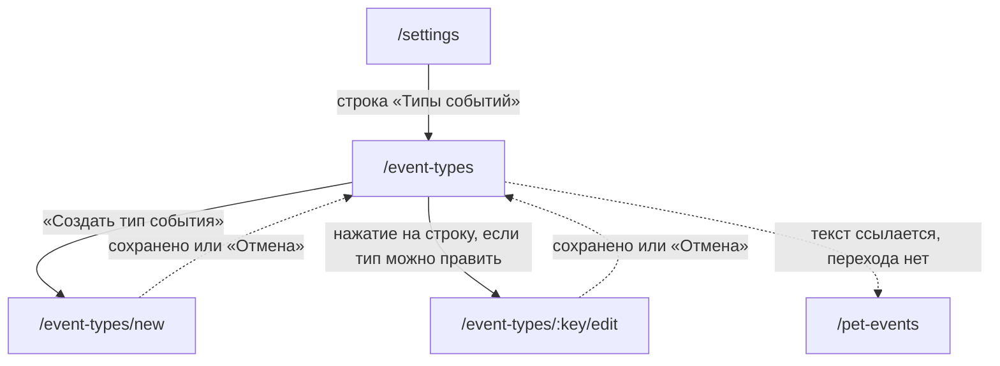

# Аудит пути: Типы событий

Маршрут: `/event-types`, файл: `frontend/src/pages/EventTypesSettings.tsx`

## Кто это

Список типов записей, которые человек может добавить питомцу: свои, сделанные в семействе, и
встроенные (их правит администратор). Отсюда создаётся, правится и удаляется тип, и видно,
кто его сделал.

- Роли: вошедший человек. Аноним не попадёт: маршрут под `ProtectedRoute`
  (`App.tsx:545-552`).
- Глубина: экран поверх вкладки «Настройки», строка «Типы событий» в группе «Записи»
  (`Settings.tsx:221-227`).

## Пользовательские истории

1. **.** Я человек, который хочу записать что-то своё, и хочу создать тип события. Критерий:
   «Создать тип события» ведёт на `/event-types/new`
   (`EventTypesSettings.tsx:173-183`, `92`).
2. **.** Я человек, который уже сделал тип, и хочу его настроить. Критерий: нажатие на строку
   ведёт на `/event-types/<key>/edit` (`EventTypesSettings.tsx:119-120`).
3. **.** Я человек, который сделал лишний тип, и хочу его убрать. Критерий: иконка корзины
   у своей строки, вопрос «Удаление типа события» (`EventTypesSettings.tsx:151-161`, `183-195`).
4. **.** Я человек, у которого тип с записями, и хочу понять, чем это грозит. Критерий: второй
   вопрос «У типа есть записи» со счётчиком (`EventTypesSettings.tsx:46-53`).
5. **.** Я человек, у которого нет своих типов, и хочу понять, что здесь вообще делать.
   Критерий: «Своих типов пока нет» и объяснение, что встроенные типы добавляются в
   «События питомца» (`EventTypesSettings.tsx:88-92`).
6. **.** Я со-владелец, у которого тип сделал другой человек в семье. Критерий: подпись
   «Добавил(а) <логин>», нажатие на строку не работает
   (`EventTypesSettings.tsx:103-107`, `113`).

## Граф переходов

Пунктиром возврат: форма уходит через `goBack` (`utils/navigation.ts:46-52`,
`EventTypeForm.tsx:224,455`). Вкладка «Настройки» на всех трёх маршрутах подсвечена
(`BottomTabBar.tsx:15`).

## Путь по шагам

| Шаг | Действие | Что видит | Чем может кончиться |
| --- | --- | --- | --- |
| 1 | Нажал «Типы событий» | Заголовок, абзац про свои типы, сразу «Создать тип события» | Дальше по списку |
| 2 | Своих типов нет | «Своих типов пока нет», описание и ещё одна кнопка «Создать тип события» | Форма нового типа |
| 3 | Список есть | По строке на тип: иконка цветным квадратом, название, подпись под ним | Правка или удаление |
| 4 | Свой тип | Подпись «Свой, 3 поля», нажатие открывает правку, справа корзина и шеврон | Форма или удаление |
| 5 | Тип сделал другой человек семьи | Подпись «Добавил(а) <логин>», нажатие не делает ничего, корзины нет | Только уйти |
| 6 | Встроенный тип у администратора | Подпись «Встроенный», нажатие открывает правку, корзины нет, шеврон есть | Форма правки |
| 7 | Встроенный тип у обычного человека | Таких строк в списке нет вообще | |
| 8 | Нажал корзину | «Удаление типа события», «Тип и его настройки будут удалены. Это действие необратимо», кнопки «Удалить» и «Отмена» | Удалить |
| 9 | Нажал «Удалить», а у типа есть записи | Второй вопрос: «У типа есть записи», «Записей этого типа: 12. Удалить тип вместе с ними? Вернуть их будет нельзя», кнопки «Удалить тип и записи» и «Оставить» | Оба варианта закрывают вопрос |
| 10 | Тип удалён | «Тип события удалён» | Список обновился сам |
| 11 | Отмена | «Тип события удалён» не показывается, список тот же | |

## Состояния экрана

| Состояние | Покрыто | Где в коде |
| --- | --- | --- |
| Загрузка | Да, крутилка | `EventTypesSettings.tsx:80-81` |
| Ошибка загрузки | Нет: хук не отдаёт ошибку, список пуст и рисуется «Своих типов пока нет» | `hooks/useEventTypes.ts:12-25`, `EventTypesSettings.tsx:82-92` |
| Своих типов нет | Да | `EventTypesSettings.tsx:82-92` |
| Свой тип | Да, «Свой, N полей» | `EventTypesSettings.tsx:103-107` |
| Чужой тип в семье | Да, «Добавил(а) <логин>» | `EventTypesSettings.tsx:106` |
| Встроенный у администратора | Да, «Встроенный» | `EventTypesSettings.tsx:104-105` |
| Встроенный у обычного человека | Такие строки отфильтрованы, в списке их нет | `EventTypesSettings.tsx:37` |
| Диалог удаления | Да | `EventTypesSettings.tsx:183-195` |
| Второй вопрос про записи | Да, со счётчиком из ответа сервера | `EventTypesSettings.tsx:42-53`, `web/events.py:250-256` |
| Идёт удаление | Да, корзина у этой строки выключена | `EventTypesSettings.tsx:157` |
| Ошибка удаления | Да, тост с текстом сервера | `EventTypesSettings.tsx:58-60` |
| Длинное название | Обрезается по `maxLength={100}` в форме, здесь переносится | `EventTypeForm.tsx:266` |
| Офлайн | Нет, см. выше про ошибку загрузки | |

## Точки входа и выхода

Вход:

- настройки, строка «Типы событий» (`Settings.tsx:221-227`);
- прямой адрес `/event-types`;
- после сохранения или отмены формы типа.

Выход:

- кнопка «Создать тип события» и нажатие на строку ведут в форму;
- со списка больше некуда: нижних вкладок пять, из них «Настройки» подсвечена
  (`BottomTabBar.tsx:15-24`), а «События питомца» в тексте упоминаются, но не нажимаются;
- стрелка в шапке (`Navbar.tsx:94-96`) уводит туда, откуда пришли.

## Правила и валидация

- Список это `GET /api/event-types` для любого вошедшего: встроенные плюс те, что сделаны
  домохозяйством, то есть теми, с кем человек делит питомца (`web/events.py:76-96,125-134`).
- Кэш списка на пять минут, обновляется сам после создания, правки и удаления
  (`hooks/useEventTypes.ts:16,28-31`).
- Право на действие определяется на экране: свой тип это свой, встроенный это админский
  (`EventTypesSettings.tsx:100-102`).
- Сервер проверяет то же самое и отвечает отказом: «Этот тип создал другой пользователь»,
  «Встроенный тип общий для всех, его меняет администратор», «Встроенный тип события нельзя
  удалить» (`web/events.py:196-198,246-249`, `web/errors.py:124-135`).
- Название должно быть уникальным в пределах видимых типов, иначе `event_type_label_taken` с
  текстом «Тип события с таким названием уже есть. Назовите свой тип иначе»
  (`web/events.py:203-208`).
- Удаление типа с записями требует второго согласия: сначала сервер отвечает 422 со счётчиком
  в поле `events_count`, клиент спрашивает и повторяет с `with_events=true`
  (`web/events.py:250-260`, `EventTypesSettings.tsx:42-53`).
- Со счётом записей удаляются и сами записи, без возможности вернуть
  (`web/events.py:258-261`).

## Доступность

- Заголовок `h1` «Типы событий» (`EventTypesSettings.tsx:73`), группы оформлены разделом с
  `h2` в форме, здесь заголовка второго уровня нет.
- Строка это `button` с текстом типа и подписью, у недоступной строки `disabled`
  (`EventTypesSettings.tsx:113-127`).
- Текущая строка помечена `aria-pressed` у кнопок иконок в форме
  (`EventTypeForm.tsx:278,303`), здесь у строк состояния нет: человек слышит «Свой, 3 поля»
  как часть названия кнопки.
- Шеврон `›` помечен `aria-hidden`, так что «эта строка открывается» скринридер не сообщает
  (`EventTypesSettings.tsx:165`).
- Корзина это `button` с подписью `Удалить <название>`, то есть имя цели услышано
  (`EventTypesSettings.tsx:153`).
- Диалог удаления: опасное действие первым (`EventTypesSettings.tsx:197`).
- Чего не хватает: у `disabled` кнопки подпись «Встроенный, меняет администратор» или
  «Добавил(а) <логин>» не попадает в дерево доступности так, как её слышит человек, потому
  что disabled убирает фокус, а текст внутри кнопки для скринридера остаётся частью имени
  кнопки. Отдельной строкой-подписью это состояние не вынесено.

## Найденное

| Что | Где | Почему это важно | Тяжесть | Предложение |
| --- | --- | --- | --- | --- |
| Сбой загрузки выглядит как «у вас ничего нет» | `hooks/useEventTypes.ts:12-25`, `EventTypesSettings.tsx:37,82-92` | Хук отдаёт только `isLoading` и данные, ошибки в нём нет. При недоступном сервере список пуст, и человек читает «Своих типов пока нет», то есть ложное утверждение о своих данных | важно | Отдавать из хука ошибку и рисовать отдельное состояние с кнопкой «Повторить» |
| Первый вопрос об удалении умалчивает про записи | `EventTypesSettings.tsx:188-192`, `web/events.py:250-256` | Текст «Тип и его настройки будут удалены. Это действие необратимо» читается как «пропадёт только тип». Что пропадут записи, человек узнаёт из второго вопроса, который появляется после заведомо неуспешного запроса. Старая история A2-22 помечена исправленной, предупреждение и правда есть, но оно во втором диалоге, а не в первом | важно | Считать записи заранее, на том же превью, что и удаление аккаунта, и говорить о них в первом вопросе |
| На пустом экране «Создать тип события» есть дважды | `EventTypesSettings.tsx:88-92,173-183` | Кнопка в пустом состоянии и кнопка внизу экрана одинаковые. Человек видит одно и то же действие в двух местах, а на непустом экране остаётся только нижняя | мелочь | В пустом состоянии не рисовать нижнюю кнопку, как в `AdminPanel.tsx:260` |
| Недоступная строка не читается как причина | `EventTypesSettings.tsx:113-127` | Подпись «Добавил(а) <логин>» или «Встроенный, меняет администратор» лежит внутри `disabled` кнопки. С клавиатуры до неё не дойти, а «почему не нажимается» остаётся загадкой | мелочь | Вынести подпись в отдельную строку и добавить кнопке `aria-disabled` вместо `disabled`, чтобы она оставалась доступной с клавиатуры |
| Встроенных типов обычному человеку не видно, и это нигде не сказано | `EventTypesSettings.tsx:37,104-105` | Список для человека без прав состоит только из семейных типов. Если своих нет, экран почти пуст, а абзац про встроенные типы не отвечает, где их взять | мелочь | Добавить в абзац одну фразу, что готовые типы живут в «События питомца» (это уже есть в пустом состоянии, но не в основном тексте) |
| Шеврон открытия не слышен | `EventTypesSettings.tsx:165` | Он помечен `aria-hidden`, и других признаков нажимаемости нет: человек слышит кнопку с названием типа и не знает, что она ведёт в форму | мелочь | Не прятать шеврон или добавить `title`, либо оставить видимую подпись |
| Длинные названия типов не помещаются | `EventTypesSettings.tsx:135-137` | Название не переносится и не обрезается явно, при `minWidth: 0` и `flex: 1` длинное слово вылезет за строку на узком экране | мелочь | Ограничить одной строкой с многоточием либо переносить |

## Вопросы к владельцу

- Нужно ли обычному человеку видеть встроенные типы в этом списке. Сейчас он их не видит, и
  заголовок «Типы событий» обещает больше, чем есть.
- Нужен ли счётчик своих типов рядом со строкой настроек, чтобы было видно, сколько их.
- Стоит ли объяснять в первом вопросе удаления, что удалятся записи, словами «вместе с
  записями», даже если человек не подтвердил удаление типа.
- Нужно ли показывать в списке дату создания своего типа или число записей в нём.

## Связанные экраны

- [settings.md](settings.md), настройки, строка «Типы событий»
- [event-type-form.md](event-type-form.md), создание и правка типа, оба маршрута отсюда
- [pet-events.md](pet-events.md), «События питомца», куда эти типы добавляются питомцу
- [medical-card-section.md](medical-card-section.md), раздел медкарты, где график по типу и виден
- [dashboard.md](dashboard.md), лента, где ставится запись выбранного типа
- [health-record-form.md](health-record-form.md), форма записи с полями своего типа
- [account-delete.md](account-delete.md), удаление аккаунта, которое решает судьбу своих типов