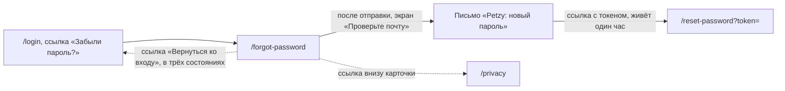

# Аудит пути: Забыл пароль

Маршрут: `/forgot-password`, Файл: `frontend/src/pages/ForgotPassword.tsx`

## Кто это

Форма «Новый пароль» с одним полем: человек вводит логин или почту, а Petzy отправляет на
подтверждённую почту аккаунта ссылку для смены пароля. Сюда приходят с экрана входа по ссылке
«Забыли пароль?».

- Роли: аноним без аккаунта
- Глубина: публичный экран, без нижних вкладок (`utils/publicPages.ts:5`, `components/BottomTabBar.tsx:34`)

## Пользовательские истории

1. **.** Я забыл пароль, чтобы войти снова, ввожу логин и жму «Отправить ссылку». Критерий: вижу
   «Проверьте почту» и текст письма, которое придёт (`pages/ForgotPassword.tsx:50`).
2. **.** Я помню только адрес почты, чтобы восстановить доступ, ввожу его в то же поле. Критерий:
   подпись поля «Логин или почта», подсказка «vera или vera@example.com»
   (`pages/ForgotPassword.tsx:83`).
3. **.** Я не понимаю, что пришло, поэтому открываю письмо. Критерий: письмо «Petzy: новый пароль»
   со ссылкой на `/reset-password?token=...` и текстом «Ссылка работает один час и только один
   раз» (`web/account.py:283`).
4. **.** Я не нахожу письмо, чтобы понять, что делать, читаю подсказку под заголовком. Критерий:
   «Ссылка работает один час. Письма нет? Загляните в «Спам». Если почту к аккаунту не
   привязывали, напишите администратору Petzy» (`pages/ForgotPassword.tsx:53`).
5. **.** Я снова нажал «Отправить ссылку», чтобы убедиться, что письмо отправляется. Критерий: тот
   же экран «Проверьте почту» с тем же текстом, второго письма нет
   (`pages/ForgotPassword.tsx:26`, `web/account.py:271`).
6. **.** Почта на сервере не настроена, чтобы понять, есть ли смысл, открываю `/forgot-password`.
   Критерий: «Восстановление по почте пока не работает. Напишите администратору Petzy, он задаст
   новый пароль» (`pages/ForgotPassword.tsx:38`).

## Граф переходов

## Путь по шагам

| Шаг | Действие | Что видит | Чем может кончиться |
| --- | --- | --- | --- |
| 1 | Открывает `/forgot-password` | Заголовок «Новый пароль», текст «Пришлём ссылку на почту, которую вы подтвердили в аккаунте», одно поле | Если почта не настроена, вместо формы сразу другой экран (`pages/ForgotPassword.tsx:34`) |
| 2 | Вводит логин или почту | Поле с кнопкой очистки, автоподстановка `username` (`pages/ForgotPassword.tsx:84`) | Пустое поле даёт тост «Введите логин или почту» (`pages/ForgotPassword.tsx:20`) |
| 3 | Жмёт «Отправить ссылку» | Кнопка в состоянии загрузки, поле гаснет (`pages/ForgotPassword.tsx:73`) | Успех: экран «Проверьте почту». Ошибка: тост с текстом сервера (`pages/ForgotPassword.tsx:28`) |
| 4 | Ждёт письмо | Текст сервера: «Если у этого аккаунта подтверждена почта, мы отправили на неё ссылку для нового пароля» (`web/messages.py:21`) | Ответ одинаков для существующего и несуществующего логина, это сделано намеренно (`web/account.py:258`) |
| 5 | Возвращается ко входу | Ссылка «Вернуться ко входу» на экране «Проверьте почту» (`pages/ForgotPassword.tsx:56`) | Вход открывается, введённый логин не переносится |

Отмена и возврат: экран без кнопки «назад» в шапке, `Navbar` скрыт (`components/Navbar.tsx:55`).
Отмена сделана ссылкой «Вернуться ко входу», она есть во всех трёх состояниях экрана
(`pages/ForgotPassword.tsx:41`, `:56`, `:78`). Ошибка сети: тост «Нет связи с интернетом. Ничего не
сохранилось, попробуйте ещё раз, когда связь появится», введённое значение остаётся
(`utils/apiError.ts:10`).

## Состояния экрана

- Загрузка: индикатора нет, форма рисуется сразу. Пока не пришёл `GET /api/auth/registration`,
  человек не знает, работает ли восстановление (`pages/ForgotPassword.tsx:17`).
- Почта не настроена: отдельный экран с текстом и ссылкой «Вернуться ко входу»
  (`pages/ForgotPassword.tsx:34`).
- Отправлено: заголовок «Проверьте почту», текст сервера, подсказка про час, «Спам» и администратора,
  ссылка «Вернуться ко входу» (`pages/ForgotPassword.tsx:47`). Кнопки отправки на этом экране нет,
  повторно отправить из него нельзя.
- Ошибка и повтор: тост, форма остаётся, можно отправить снова.
- Офлайн: тот же тост про отсутствие связи.
- Длинные тексты: сервер принимает до 254 символов (`web/schemas.py:96`), поле не ограничено.
- Пустые имена: не применимо.
- Не покрыто: состояние «запрос был, но письма не будет», например аккаунт без подтверждённой
  почты. Текст на экране это проговаривает, но отдельного состояния нет.

## Точки входа и выхода

Вход: ссылка «Забыли пароль?» на `/login` (`pages/Login.tsx:132`), прямой заход, закладка,
`catch-all` для незнакомого адреса (`App.tsx:569`). Выход: на `/login` ссылкой, в `/privacy`
ссылкой внизу карточки (`components/AuthShell.tsx:65`). Прямого перехода на `/reset-password` на
экране нет: этот адрес приходит только письмом (`web/account.py:287`). `goBack` не используется.

## Правила и валидация

- Единственная проверка на клиенте: поле не пустое, иначе тост «Введите логин или почту»
  (`pages/ForgotPassword.tsx:20`).
- Значение обрезается от пробелов при отправке (`pages/ForgotPassword.tsx:26`).
- На сервер уходит `POST /api/auth/password/forgot` с полем `login`
  (`services/auth.service.ts:56`). Сервер ищет по адресу, если в строке есть «@», и только среди
  подтверждённых почт, иначе по логину (`web/account.py:263`).
- Письмо отправляется, только если у аккаунта есть подтверждённая почта и аккаунт активен
  (`web/account.py:270`). Повторная отправка возможна не чаще раза в два минуты на аккаунт
  (`web/account.py:45`, `web/account.py:271`).
- Ограничение на адрес: 5 запросов в час (`web/account.py:253`).
- Ссылка из письма живёт один час и работает один раз (`web/account.py:42`, `web/account.py:288`).
- Ничего не сохраняется при уходе со страницы.

## Доступность

- Фокус после перехода встаёт на логотип «Petzy», а не на заголовок «Новый пароль»
  (`components/AuthShell.tsx:28`, `components/RouteFocus.tsx:26`).
- Подпись поля связана с полем через `linkLabel` (`utils/antdA11y.ts:52`).
- Enter в поле отправляет форму, кнопка помечена `data-enter-submit` (`pages/ForgotPassword.tsx:73`).
- Ошибка пустого поля приходит тостом, который произносится assertive
  (`utils/snackbar.ts:88`), у поля нет `aria-invalid` и подписи под ним.
- Крупные кнопки, ссылка «Вернуться ко входу» обычным цветом акцента, без подписи о цели
  (`pages/ForgotPassword.tsx:41`).
- Чего нет: автозаполнения полем `email` (у поля стоит `autoComplete="username"`
  `pages/ForgotPassword.tsx:84`), объявления, что ссылка придёт не на введённый адрес, а на тот,
  что в аккаунте.

## Найденное

| Что | Где | Почему это важно | Тяжесть | Предложение |
| --- | --- | --- | --- | --- |
| Повторный запрос в течение двух минут молча ничего не делает, экран снова обещает письмо | `pages/ForgotPassword.tsx:26`, `web/account.py:271`, `pages/ForgotPassword.tsx:47` | Человек ждёт второе письмо, которого не будет, и ищет причину в почте | важно | Показывать на экране «Письмо уже отправлено, подождите пару минут», если запрос был не первый, для этого нужен честный ответ сервера |
| После успешной отправки нет кнопки отправить ещё раз | `pages/ForgotPassword.tsx:47` | Если письмо потерялось, единственный путь это уйти назад и повторить всю форму вручную | важно | Оставить кнопку «Отправить ещё раз» на экране успеха |
| Форма рисуется до ответа про почту, и за этот момент можно отправить запрос вслепую | `pages/ForgotPassword.tsx:17`, `pages/ForgotPassword.tsx:34` | При медленной сети человек отправляет запрос, не зная, работает ли восстановление | важно | Показать загрузку или кнопку, неактивную до ответа статуса |
| Ограничение в 5 запросов в час не видно | `web/account.py:253`, `web/app.py:286` | Приходит «Слишком много попыток с этого адреса. Попробуйте через час», форма остаётся без пояснения, что делать | важно | Показывать остаток попыток и время ожидания из `retry_after` (`web/app.py:287`) |
| Вопрос «логин или почта» смешан с адресом почты, который не обязательно совпадёт | `pages/ForgotPassword.tsx:83`, `web/account.py:265` | Если человек вводит неподтверждённую почту, письмо уйдёт на другую и объяснения не будет | важно | Написать в подсказке, что письмо придёт на подтверждённый адрес аккаунта, это уже есть в подзаголовке, но не рядом с полем |
| У поля стоит `autoComplete="username"` | `pages/ForgotPassword.tsx:84` | Браузер и менеджер паролей подставляют логин, хотя поле принимает и почту | мелочь | Использовать `username` для варианта с логином и не мешать менеджеру паролей, либо убрать подсказку |
| Ошибка пустого поля только тостом, без подписи под полем | `pages/ForgotPassword.tsx:20` | Поле не меняется, нет `aria-invalid` | мелочь | Использовать `FieldError` и `useTouched`, как на странице сброса (`pages/ResetPassword.tsx:79`) |
| Нет пути в регистрацию для того, кто ещё не заводил аккаунт | `pages/ForgotPassword.tsx:78` | Человек без аккаунта получает письмо, которого не будет, и уходит без регистрации | мелочь | Добавить ссылку «Создать аккаунт» рядом с «Вернуться ко входу», если регистрация открыта |

## Вопросы к владельцу

- Говорить ли на экране успеха, что письмо может не прийти, и как именно: текущий текст делает вид,
  что отправка состоялась, хотя сервер отвечает одинаково всегда (`web/account.py:258`).
- Считать ли повторное нажатие «Отправить ссылку» ошибкой человека, или показывать, что письмо
  уже ушло.
- Нужен ли на этом экране срок жизни ссылки в часах как отдельное предупреждение до отправки, а не
  только после.

## Связанные экраны

- [Вход](login.md)
- [Сброс пароля](reset-password.md)
- [Регистрация](register.md)
- [Политика и согласие](privacy.md)
