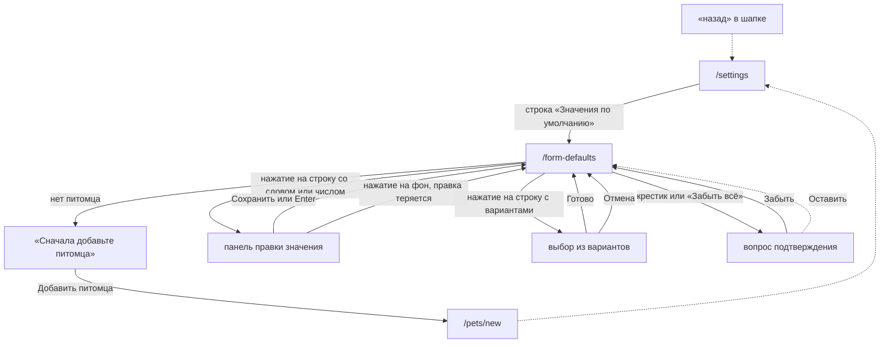

# Аудит пути: Значения по умолчанию

Маршрут: `/form-defaults` Файл: `frontend/src/pages/FormDefaults.tsx`

## Кто это

Экран одного питомца: что подставится в новых записях, поправить это или забыть. Всё, что
запомнено, лежит на питомце, а не на человеке, поэтому список одинаковый у всей семьи.
Своего списка типов на экране нет: показываются только те виды записей, у которых есть
хотя бы одно запомненное значение.

- Роли: любой, у кого есть доступ к питомцу. Менять может не только владелец: сервер отдаёт
  эту настройку всем, кто добавляет записи питомцу (`web/pets.py:573-576`).
- Глубина: экран поверх вкладки «Настройки». В шапке кнопка «назад», переключателя питомцев
  нет: он даётся только вкладкам (`components/Navbar.tsx:60`, `69`).

## Пользовательские истории

1. **.** Я владелец, чтобы проверить, что подставится в новых записях, открываю «Значения по
   умолчанию» из Настроек. Критерий: сверху «Питомец: <имя>», ниже значения по видам записей
   (`FormDefaults.tsx:122`).
2. **.** Я владелец, чтобы исправить ошибочно запомненное значение, нажимаю на строку. Критерий:
   открывается панель с названием «<вид записи>: <поле>» и кнопкой «Сохранить» (`195-211`).
3. **.** Я владелец, чтобы забыть одно значение, нажимаю крестик в строке. Критерий: строка
   исчезает, тост «Забыто» (`155`, `83`).
4. **.** Я владелец, чтобы очистить всё сразу, нажимаю «Забыть всё для этого питомца». Критерий:
   вопрос «Забыть все значения по умолчанию этого питомца? Новые записи будут открываться
   пустыми», кнопки «Забыть» и «Оставить» (`106-110`, `174`).
5. **.** Я приглашённый, чтобы увидеть те же значения, что и владелец, открываю экран. Критерий:
   список тот же, править можно тоже, потому что ограничения только по доступу к питомцу.

## Граф переходов

Других путей нет: экран никуда не ведёт, кроме добавления питомца, и ничего не открывает.

## Путь по шагам

| Шаг | Действие | Что видит | Чем может кончиться |
| --- | --- | --- | --- |
| 1 | Открывает экран из Настроек | «Питомец: <имя>» и абзац о том, как это работает (`122`) | Питомца нет: экран «Сначала добавьте питомца» с кнопкой «Добавить питомца» (`36`) |
| 2 | Смотрит, есть ли что забывать | Карточка «Пока ничего не запомнено, и новые записи этого питомца открываются пустыми» (`129`) | Если значения есть, вместо неё разделы по видам записей |
| 3 | Нажимает на строку со словом или числом | Панель снизу с подписью «<вид записи>: <поле>» и полем «Значение» (`194-207`) | Кнопки закрытия в панели нет, закрывает только тап по фону |
| 4 | Печатает и жмёт «Сохранить» или Enter | Тост «Сохранено» (`83`), панель закрывается (`102`) | При неудаче тост «Не удалось сохранить» и панель остаётся открытой (`71`) |
| 5 | Нажимает на строку с вариантами | Выбор из вариантов с кнопками «Отмена» и «Готово» (`181-193`) | Тост «Сохранено» после «Готово» |
| 6 | Нажимает крестик в строке | Строка исчезает, тост «Забыто» | Без вопроса, отмены нет |
| 7 | Нажимает «Забыть всё для этого питомца» | Вопрос с кнопками «Забыть» и «Оставить» | После «Забыть» список пустеет, появляется карточка из шага 2 |

При отмене: «Отмена» в выборе из вариантов ничего не меняет. В панели правки отмены нет вообще.
При возврате: кнопка «назад» в шапке, набор текста она не спрашивает, потому что
`useUnsavedChangesGuard` к этому экрану не подключён. При ошибке сети: тост
«Не удалось сохранить», значение остаётся на экране, текст сервера не показывается.

## Состояния экрана

| Состояние | Покрыто | Где |
| --- | --- | --- |
| Нет питомца | Да | `NoPetState` с текстом «Когда в Petzy будет питомец, здесь появится раздел «Значения по умолчанию»» (`36`, `components/NoPetState.tsx:13-15`) |
| Пусто | Да | «Пока ничего не запомнено...» (`129`) |
| Вид записи удалён | Да | Заголовок раздела «Удалённый вид записи» (`57`) |
| Поле удалено | Частично | Кнопка неактивна без объяснения, крестик работает (`144`, `154`) |
| Сохранение | Частично | Крестики гаснут, кнопки значения остаются активными (`154`) |
| Ошибка сети | Частично | Один тост без текста сервера и без повтора (`71`) |
| Длинное значение | Да | Поле ограничено 200 символами, как на сервере (`204`, `web/schemas.py:365`) |
| Много разделов | Да | Порядок разделов зависит от порядка ключей в сохранённом объекте |

## Точки входа и выхода

Вход: одна строка в группе «Новые записи» (`pages/Settings.tsx:219`). Больше ниоткуда: ни из формы
новой записи, ни из справки, ни из шапки.

Выход: кнопка «назад» в шапке (`components/Navbar.tsx:46-52`) и единственная ссылка внутри
экрана «Добавить питомца», ведущая на `/pets/new` (`components/NoPetState.tsx:16`).
`goBack` (`utils/navigation.ts:46`) не используется, полей, которые можно потерять, на самом
экране нет.

## Правила и валидация

- Всё, что запомнено, лежит на питомце и общее для семьи: сервер проверяет форму ключей
  (`web/schemas.py:332`) и то, что поле вообще может иметь значение по умолчанию
  (`web/schemas.py:334`).
- Каждое изменение отправляет весь набор целиком и заменяет старый
  (`web/pets.py:572-581`, `web/schemas.py:341-344`). Пустые значения сервер отбрасывает
  (`web/schemas.py:367-368`), поэтому «пустая строка» и «удалить» дают один результат
  (`FormDefaults.tsx:80`).
- Число приводится к числу перед отправкой, запятая заменяется на точку, лишние пробелы
  убираются (`FormDefaults.tsx:94-100`). Не число остаётся на экране с текстом «Введите число,
  например 195,5» (`97`).
- Границы: 200 символов в поле (`204`) и 200 на сервере (`web/schemas.py:365`), до 40 видов
  записей, до 30 полей в виде и до 300 значений всего (`web/schemas.py:335-337`).
- При уходе со страницы ничего не сохраняется и не спрашивается: правка в панели живёт только
  в состоянии экрана (`FormDefaults.tsx:45`). `useUnsavedChangesGuard`
  (`hooks/useUnsavedChangesGuard.tsx`) подключён в формах записи, лекарства, питомца и документа
  (`pages/MedicationForm.tsx:294`, `pages/PetForm.tsx:149`, `pages/DocumentForm.tsx:103`), здесь
  нет.

## Доступность

- У крестика есть имя из контекста: «Забыть: <вид записи>, <поле>»
  (`FormDefaults.tsx:153`), у самой иконки `aria-hidden` (`158`).
- Строка значения это `<button>`, у неё `minHeight: var(--touch-min)`, то есть 44 пикселя
  (`145`), так же и крестик (`156`).
- Подпись панели связана с полем через `<label htmlFor="default-value">` (`195`, `199`), Enter
  сохраняет (`202`).
- Заголовок раздела это `<h2>`, экранный `<h1>` есть (`120`, `134`).
- Не хватает: у панели нет заголовка-элемента и кнопки закрытия, у неактивной строки нет
  объяснения, почему она не нажимается, и её состояние ничем не объявлено, кроме `disabled`.

## Найденное

| Что | Где | Почему это важно | Тяжесть | Предложение |
| --- | --- | --- | --- | --- |
| Две правки подряд теряют первую | `FormDefaults.tsx:144`, `154`, `79` | Крестики гаснут на время сохранения, а кнопки значения остаются активными. Вторая правка строится от старого набора и уходит на сервер вместо первого, а сервер заменяет набор целиком (`web/schemas.py:341-344`) | важно | Гасить и кнопки значения, пока идёт сохранение, либо выстраивать правки в очередь |
| Панель правки закрывается по нажатию на фон, и набранное теряется молча | `FormDefaults.tsx:194` | Справка обещает, что при уходе из формы с набранным приложение спросит (`content/help.ts:217`), здесь вопроса нет | важно | Кнопка закрытия и `useUnsavedChangesGuard`, как в других формах |
| Пустое состояние и текст над ним говорят разное | `FormDefaults.tsx:129` и `122` | Пустое состояние обещает «новые записи этого питомца открываются пустыми», а текст над ним и справка говорят «без запомненного значения выбран первый» (`content/help.ts:195`) | важно | Оставить одно из двух. По коду поле выбора показывает первый вариант (`components/FormField.tsx:226`, `229`), но в запись он попадает только после подтверждения (`components/FormField.tsx:239-243`), то есть оба текста сейчас неточны. Продолжает A2-05 |
| В строке удалённого поля видно машинное имя латиницей | `FormDefaults.tsx:55` | Подпись строки это `def?.label ?? field`, то есть при удалённом поле человек видит `food` вместо «Корм», и заголовок раздела рядом скажет «Удалённый вид записи» | важно | Показывать имя поля в том виде, в каком оно запоминалось, и объяснить, что поле ушло из вида записи |
| Кнопка значения неактивна, и не сказано почему | `FormDefaults.tsx:144` | Человек жмёт и ничего не происходит, а экран молчит | важно | Подпись под значением или подсказка «Поля больше нет в этом виде записи» |
| Экран про выбранного питомца, но переключить питомца на нём нельзя | `components/Navbar.tsx:69`, `App.tsx:520` | Переключатель даётся только вкладкам, а `/form-defaults` вкладкой не является. Имя питомца написано в тексте (`122`), но чтобы посмотреть значения другого питомца, надо вернуться в Настройки и вернуться обратно | важно | Либо показывать переключатель и здесь, либо ставить рядом с именем ссылку «другой питомец» |
| Порядок разделов берётся из порядка ключей в сохранённом объекте | `FormDefaults.tsx:51` | Разделы не совпадают с порядком видов записей в приложении и могут прыгать после сохранения | мелочь | Собирать разделы по списку типов событий, неизвестные класть в конец |
| Текст сервера при ошибке не показывается | `FormDefaults.tsx:71` | Сервер объясняет свои отказы понятным текстом (`web/schemas.py:352`, `366`), а человек видит общее «Не удалось сохранить» | мелочь | Показывать текст ответа, как в строках аккаунта |
| Выбор из вариантов без заголовка | `FormDefaults.tsx:181-193` | Видно только «Отмена» и «Готово», непонятно, какое поле выбирается. В форме новой записи рядом с названием поля стоит подсказка «Значение по умолчанию» (`components/FormField.tsx:230`), здесь её нет | мелочь | Название поля заголовком над выбором |
| «Забыть всё для этого питомца» не говорит, что это у всех, у кого есть доступ | `FormDefaults.tsx:174` | Абзац над списком говорит, что значения общие (`122`), но про то, что кнопка общая, человек узнаёт только оттуда | мелочь | Дописать в вопрос подтверждения |
| Заголовок экрана нарисован инлайн-стилями, без класса `display-headline` | `FormDefaults.tsx:120` | Рядом с `pages/MedicalLinks.tsx:53` тот же заголовок выглядит иначе | мелочь | Взять общий класс |

## Вопросы к владельцу

- Разделы стоит ли упорядочить по видам записей или оставить в порядке, в котором их
  запоминали.
- Показывать ли значения, у которых поле или вид записи уже удалены, как отдельный раздел
  «Больше не используется», или убирать их молча.
- Нужен ли переключатель питомца на этом экране. Сейчас экран привязан к питомцу, но сменить
  его можно только через Настройки.

## Связанные экраны

- [settings.md](settings.md), настройки, единственная строка, из которой открывается экран
- [health-record-form.md](health-record-form.md), форма новой записи, где значение и
  запоминается
- [medical-record-form.md](medical-record-form.md), запись медкарты, тот же список полей
- [event-types-settings.md](event-types-settings.md), типы событий, откуда удаляется то, что тут
  названо «Удалённый вид записи»
- [event-type-form.md](event-type-form.md), форма типа события, где добавляется поле
- [pet-events.md](pet-events.md), события питомца, соседняя строка той же группы Настроек
- [pets.md](pets.md), мои питомцы, куда ведёт «Добавить питомца»
- [help.md](help.md), справка, чей раздел «Значения по умолчанию» описывает этот экран