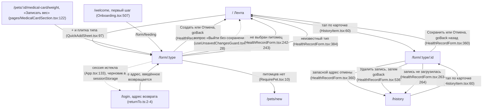

# Аудит пути: Форма записи о здоровье

Маршруты: `/form/:type` и `/form/:type/:id`. Файл: `frontend/src/pages/HealthRecordForm.tsx`

## Кто это

Форма одной записи о здоровье питомца: создание новой и правка существующей. Набор полей не нарисован
вручную, а приходит из каталога типов записей (`useEventTypes`, `web/builtin_event_types.py`), поэтому
одна и та же форма обслуживает и встроенные типы («Вес», «Кормление», «Смена лотка»), и свои типы
семьи.

- Роли: владелец и приглашённый член семьи. Аноним не попадает: оба маршрута обёрнуты в
  `ProtectedRoute` (`App.tsx:377-393`). Создание проверяет `@require_pet_access`, правка и удаление
  проверяют доступ к самой записи (`web/decorators.py:57-77`).
- Глубина: экран поверх вкладки, не вкладка. В шапке у него есть кнопка «Назад» (`Navbar.tsx:90-96`),
  нижние вкладки при этом остаются видны (`App.tsx:574`).
- Разница между двумя маршрутами: `/form/:type` обёрнут в `RequirePet what="Записи"`
  (`App.tsx:381-383`), а `/form/:type/:id` нет (`App.tsx:387-393`).

## Пользовательские истории

1. **Записать событие с ленты в два нажатия.** Я на ленте жму «+», выбираю «Кормление», хочу сразу
   сохранить. Критерий: дата и время уже текущие, порция обязательна, «Создать» сохраняет и уводит на
   ленту.
2. **Сказать «когда было» одним нажатием.** Я вспомнил, что кормил час назад. Критерий: чип «Час назад»
   ставит дату и время сам (`HealthRecordForm.tsx:429-433`).
3. **Ввести вес как на русском.** Я пишу «4,5». Критерий: запятая принимается как десятичная точка,
   пробелы-разделители внутри числа не мешают (`HealthRecordForm.tsx:121-130`).
4. **Не вводить прошлое заново.** Я взвешиваю питомца каждый месяц. Критерий: под числовым полем
   есть чипы «Как раньше» с последними значениями (`HealthRecordForm.tsx:466-478`).
5. **Исправить запись.** Я тапаю карточку в ленте или в истории. Критерий: поля заполнены, в шапке
   «<тип>: правка», под именем питомца «Записал(а): <имя>» (`HealthRecordForm.tsx:403-409`),
   после сохранения «Запись «Вес» обновлена».
6. **Убрать запись по ошибке.** Я в форме жму «Удалить запись». Критерий: возвращает на «Историю»,
   внизу «Запись удалена» с «Отменить» (`HealthRecordForm.tsx:516-542`).
7. **Не потерять набранное.** У меня отвалилась связь посреди заполнения или истёк вход. Критерий:
   спрашивает «Выйти без сохранения?» на любой уход, а после входа возвращает введённое с сообщением
   «Вернули то, что вы вводили до выхода» (`useSessionDraft.ts:44-45`).

## Граф переходов

Пунктир у стрелки к `/login` означает уход приложения, а не нажатие человека: путь запускает не
экран, а обработчик истёкшей сессии (`App.tsx:129-134`). В `goBack` запасной адрес один и тот же для
обоих маршрутов, разница в том, откуда форма пришла: `navigate(-1)` возвращает на ленту, если открыли
с ленты, и на «Историю», если оттуда (`navigation.ts:19-52`, `HealthRecordForm.tsx:360`).

## Путь по шагам

| Шаг | Действие | Что видит | Чем может кончиться |
| --- | --- | --- | --- |
| 1 | Жмёт «+» на ленте или тап по карточке | Лист «Что записать?» с плитками, или сразу форма (`QuickAddSheet.tsx:65`, `HistoryItem.tsx:58-61`) | Питомцев нет: вместо формы «Сначала добавьте питомца» (`RequirePet.tsx:10`) |
| 2 | Форма открывается | Заголовок «Записать: <тип>», строка «Питомец: <имя>», чипы «Когда было» (`HealthRecordForm.tsx:398-402`, `HealthRecordForm.tsx:418-438`) | Тип неизвестен: «Неизвестный тип записи» и «На главную» (`HealthRecordForm.tsx:380-386`) |
| 3 | Правит «когда было» | Чипы «Сейчас», «Час назад», «2 часа назад», «Вчера в это время» ставят дату и время (`HealthRecordForm.tsx:421-438`) | Дата в будущем: «Дата не может быть в будущем» (`FormField.tsx:157-160`); время в будущем: «Время не может быть в будущем» (`FormField.tsx:197-206`) |
| 4 | Заполняет поля типа | Под каждым числовым полем до трёх последних значений («Как раньше»), под заметными чип «Запомнить для этого питомца» (`HealthRecordForm.tsx:457-478`) | Обязательное поле не заполнено: ошибка под полем, экран прокручивается к ней (`formErrors.ts:28-38`) |
| 5 | Пишет комментарий | Многострочное поле «Комментарий (необязательно)», не больше 500 знаков (`FormField.tsx:250-262`) | Длинный текст обрезается вводом, в записи остаётся 500 знаков (`FormField.tsx:259`) |
| 6 | Жмёт «Создать» или «Сохранить» | Кнопка в состоянии ожидания (`HealthRecordForm.tsx:498-508`), затем плашка «Запись «<тип>» добавлена» с «Отменить» (`HealthRecordForm.tsx:335-346`) | Нет ответа: «Сервер не ответил. Попробуйте ещё раз через минуту», поля остаются введёнными (`HealthRecordForm.tsx:362-365`) |
| 7 | Возвращается | Тот экран, откуда открывал, на той же позиции прокрутки (`goBack`, `ScrollManager.tsx:66-69`) | Нажал «Отменить» в плашке: запись уходит, «Отменено» (`undo.ts:36`) |
| 8 | Возвращается, чтобы поправить | Форма открывается сразу из данных карточки, без загрузки (`HistoryItem.tsx:58-61`, `HealthRecordForm.tsx:255-258`) | Данных в состоянии нет или запись удалена: «Не удалось загрузить запись» и переход на «Историю» (`HealthRecordForm.tsx:261-264`) |

Отмена: «Отмена» спрашивает «Выйти без сохранения?» наравне с кнопкой «Назад», если форму покинули,
то есть только при несохранённых изменениях (`useUnsavedChangesGuard.tsx:25-28`, `HealthRecordForm.tsx:512`).
Возврат: `goBack` в `HealthRecordForm.tsx:360`. Ошибка сети разобрана ниже.

## Состояния экрана

| Состояние | Что на экране | Покрыто |
| --- | --- | --- |
| Петля грузится или грузится запись | `LoadingSpinner` на весь экран (`HealthRecordForm.tsx:376-378`) | Да |
| Неизвестный тип записи | Текст «Неизвестный тип записи» и кнопка «На главную» (`HealthRecordForm.tsx:380-386`) | Да |
| Нет выбранного питомца | «Выберите питомца в меню навигации» и уход на `/` (`HealthRecordForm.tsx:368-374`, `HealthRecordForm.tsx:241-244`) | Да, но текст уводит в меню, которого на этом экране нет, см. «Найденное» |
| Питомцев нет вовсе | «Сначала добавьте питомца» и «Добавить питомца» (`RequirePet.tsx:10`, `NoPetState.tsx:13-16`) | Да, но только на маршруте создания, см. «Найденное» |
| Запись не загрузилась | Тост «Не удалось загрузить запись» и переход на «Историю» (`HealthRecordForm.tsx:261-264`) | Тост есть, состояния на самом экране нет, см. «Найденное» |
| Ошибка сохранения | Тост из `getApiErrorMessage`, форма остаётся с введённым (`HealthRecordForm.tsx:362-365`) | Да |
| Несохранённые изменения | Диалог «Выйти без сохранения?», «То, что вы ввели, пропадёт», «Выйти», «Остаться» (`useUnsavedChangesGuard.tsx:43-50`); закрытие вкладки спрашивает сам браузер (`useUnsavedChangesGuard.tsx:30-38`) | Да |
| Истёк вход | Вход с адресом возврата, введённое лежит в `sessionStorage` и возвращается с тостом «Вернули то, что вы вводили до выхода» (`App.tsx:129-134`, `sessionDraft.ts:20-31`, `useSessionDraft.ts:42-45`) | Да |
| Значения подставлены из питомца | Под последним таким полем «Подставлено из значений по умолчанию питомца: <поля>. Чтобы убрать, снимите «Запоминается» под полем» (`HealthRecordForm.tsx:449-455`) | Да |
| Значения по умолчанию не сохранились | Запись сохранена, тост «Запись сохранена, а значения по умолчанию не сохранились» (`HealthRecordForm.tsx:350`) | Да |
| Отметки приёма без связи | На этой форме не встречаются, отметки ставятся виджетом на ленте (`NextDoseWidget.tsx:76-97`) | Неприменимо |

### Офлайн и повторная отправка

Что происходит без связи на этой форме:

1. Кнопка не зависает навсегда. У запроса есть предел 30 секунд (`api.ts:22`), а у всех мутаций стоит
   `networkMode: 'always'`, то есть отправка падает сразу, а не ждёт сети (`App.tsx:104-107`).
2. Что видит человек: тост «Нет связи с интернетом. Ничего не сохранилось, попробуйте ещё раз, когда
   связь появится» (`apiError.ts:10`) или, если сеть формально есть, а ответ не пришёл,
   «Сервер не ответил. Попробуйте ещё раз через минуту» (`apiError.ts:11`).
3. Форма при этом остаётся открытой и все введённые значения на месте, повторное нажатие «Создать»
   ничего не требует заново (`HealthRecordForm.tsx:362-365`).
4. Отложенной очереди для записей о здоровье нет: её хранит только `localStorage` для отметок приёма
   лекарства (`offlineIntakes.ts:16-19`, вызывается из `duplicateIntake.ts:33`). Запись, сделанная без
   связи, в приложении не остаётся: человек вспоминает про неё по памяти.
5. Черновик живёт только при истечении сессии (`sessionDraft.ts:20-31`), обычная неудачная отправка
   черновик не создаёт. Сохраняет человека сама форма тем, что она не закрылась.

Двойная отправка:

- Через повторное нажатие она не проходит: у кнопки есть `loading={isSubmitting}`
  (`HealthRecordForm.tsx:505`), а antd-mobile на время загрузки ставит нативный `disabled`
  (`node_modules/antd-mobile/es/components/button/button.js:26`, `:64`). Пока запрос в полёте, кнопка
  не нажимается.
- Через повтор после сообщения проходит. Если сервер записал запись, а ответ не дошёл, человек видит
   «Сервер не ответил. Попробуйте ещё раз через минуту» и жмёт «Создать» ещё раз: в запросе нет
   ключа идемпотентности (`healthRecords.service.ts:33-39`, `healthRecords.service.ts:53-57`), а сервер повтор одинаковой записи не
   отклоняет. Двойная запись одинакового веса в ленте и истории ничем не помечена. Для отметок
   приёма такой случай закрыт: там ответ «уже отмечено» и очередь (`duplicateIntake.ts:21-44`).
- Ещё одно следствие того же `isSubmitting`: он снимается только после того, как выполнены все
   ожидания подряд, то есть после создания записи ещё обновляются четыре списка и сохраняются
  значения по умолчанию (`HealthRecordForm.tsx:296-330`). Кнопка остаётся в состоянии ожидания
   секунды после того, как запись уже создана, и подпись на ней пропадает.

## Точки входа и выхода

Вход: плитка типа в листе «+» (`QuickAddSheet.tsx:97`), тап или свайп по карточке записи в ленте и
в истории (`HistoryItem.tsx:58-61`), «Записать вес» в медкарте
(`pages/MedicalCardSection.tsx:122`), первый шаг онбординга для кормления (`Onboarding.tsx:507`),
адрес возврата после входа (`returnTo.ts:2-4`), восстановленный черновик после входа
(`sessionDraft.ts:34-45`).

Выход: `goBack` на предыдущий экран, а если его нет, то `/` для новой записи и `/history` для правки
(`HealthRecordForm.tsx:360`); после удаления записи тоже назад, с запасным адресом `/history`
(`HealthRecordForm.tsx:536`); `/` при неизвестном типе (`HealthRecordForm.tsx:384`) и при
отсутствии выбранного питомца (`HealthRecordForm.tsx:242-243`); `/history` при неудачной загрузке
записи (`HealthRecordForm.tsx:263-264`); `/pets/new` из состояния «Сначала добавьте питомца»
(`RequirePet.tsx:10`, `NoPetState.tsx:16`); `/login` при истёкшей сессии (`App.tsx:133`).

Кнопка «назад»: в шапке (`Navbar.tsx:90-96`), при несохранённых изменениях сначала показывает диалог
(`useUnsavedChangesGuard.tsx:25-28`). Свайп с края экрана ловит тот же `useBlocker`
(`useUnsavedChangesGuard.tsx:8-12`).

## Правила и валидация

- Схема собирается из полей типа записи на каждый рендер (`HealthRecordForm.tsx:94-141`).
- Обязательные поля: дата («Укажите дату»), время («Укажите время»), питомец
  (`HealthRecordForm.tsx:96-99`), поля типа: число с нижней и верхней границей («Не меньше <x>»,
  «Не больше <y>»), выбор и текст с «Заполните это поле» (`HealthRecordForm.tsx:134-136`).
- Число принимает русский ввод: запятая как десятичная точка, пробелы и узкие пробелы внутри числа
  отбрасываются (`HealthRecordForm.tsx:121-130`). Поле ввода у числового поля текстовое с
  `inputMode="decimal"`, поэтому и запятая, и точка работают (`FormField.tsx:270-272`).
- Границы берутся и из поля, и из таблицы жёстких пределов для веса и порции
  (`HealthRecordForm.tsx:111-120`, `fieldBounds.ts:4-7`).
- Дата и время не могут быть в будущем: правится на лету в выборе, с тостом и подстановкой текущего
  момента (`FormField.tsx:157-160`, `FormField.tsx:197-206`).
- Проверка идёт по режиму `onTouched`: ошибка появляется, когда поле оставлено, а не только после
  нажатия кнопки (`HealthRecordForm.tsx:190-197`). При отказе экран прокручивается к первой ошибке,
  поле получает фокус, а скринридер слышит, сколько полей надо исправить (`formErrors.ts:21-38`).
- На сервер уходит `pet_id`, `date`, `time`, `comment` и словарь `fields` из данных формы
  (`HealthRecordForm.tsx:284-293`), плюс часовой пояс телефона (`healthRecords.service.ts:54`).
  Сервер проверяет то же самое ещё раз и отвечает своими словами, например
  «Поле «Тип стула» обязательно» (`web/events.py:271-313`). Запись уходит обычным JSON, а правило
  «текст из формы остаётся текстом» в проекте сделано для multipart
  (`web/pydantic_helpers.py:86-102`, `web/app.py:137`), так что запись с названием «7» остаётся «7»,
  а не числом.
- После сохранения обновляются четыре списка по точному имени ключа запроса: «Лента», «История»,
  «Графики» и карточка питомца (`HealthRecordForm.tsx:303-306`).
- Заметные значения уходят на питомца, а не в запись: чип «Запомнить» пишет в настройки питомца
  только для новых записей (`HealthRecordForm.tsx:311-330`). Для типа «Вес» сам вес не запоминается,
  он меняется каждый раз (`HealthRecordForm.tsx:149-151`).
- При уходе с несохранёнными изменениями спрашивают один раз, а не на каждый шаг
  (`useUnsavedChangesGuard.tsx:25-28`).

## Доступность

Сделано:

- Заголовок первого уровня «Записать: <тип>» или «<тип>: правка»
  (`HealthRecordForm.tsx:398-400`).
- Имя питомца и имя автора записи читаются вместе с заголовком, а не прячутся в меню
  (`HealthRecordForm.tsx:403-409`).
- Чипы это группа с именем: «Когда», «Запоминание», «Как раньше» (`ChoiceChips.tsx:6-11`,
  `HealthRecordForm.tsx:424`, `HealthRecordForm.tsx:459`, `HealthRecordForm.tsx:471`).
- У полей обязательность помечена `aria-required`, метки связаны с полями, кликабельные строки
  antd получают роль кнопки и `tabindex` (`antdA11y.ts:34-70`).
- При отказе проверки фокус уходит в первое поле с ошибкой, а число исправлений
  произносится (`formErrors.ts:21-38`).
- Последнее поле не отправляет форму по Enter: клавиатура просто закрывается, чтобы длинная форма не
  сохранилась по случайному Return (`enterKey.ts:8-16`, `enterKey.ts:116-121`).
- Ошибка будущей даты и будущего времени показывается тостом с текстом действия
  (`FormField.tsx:157-160`).

Не хватает:

- Чипы «Когда было» и «Как раньше» всегда нарисованы как невыбранные (`pressed={false}`,
  `HealthRecordForm.tsx:428` и `HealthRecordForm.tsx:472`), хотя по нажатию они ставят значение. После
  нажатия не видно, что выбор сработал, и скринридер говорит «не нажато». У чипа «Запомнить» того же
  типа состояние есть (`HealthRecordForm.tsx:460`).
- Кнопка сохранения это обычная кнопка antd без `aria-busy`, хотя в проекте есть готовая
  `SpinnerButton` с `aria-busy` (`SpinnerButton.tsx:54`). Пока идёт сохранение, скринридер не знает,
  что форма занята.
- Значение выбранного типа показывается текстом внутри кнопки (`PickerValue.tsx:19-31`), это сделано
  специально ради скринридера, но при ошибке обязательного выбора под полем «Заполните это поле» не
  хватает никакого намёка, что поле вовсе не выбрано, см. «Найденное».
- Заголовок «Когда было» помечен `aria-hidden` (`HealthRecordForm.tsx:420`), у него есть только
  невидимая группа «Когда»: человек со скринридером не узнает, что это за группа.

## Найденное

| Что | Где | Почему это важно | Тяжесть | Предложение |
| --- | --- | --- | --- | --- |
| Обязательный выбор показывает первый вариант, а значение при этом пустое, и запись не сохраняется: в строке выбора рисуется первый вариант, когда значения нет (`FormField.tsx:226-229`), а в форму кладётся пустая строка (`HealthRecordForm.tsx:167-169`), и zod требует непустое значение (`HealthRecordForm.tsx:134-136`) | `FormField.tsx:27`, `FormField.tsx:226-230`, `HealthRecordForm.tsx:167-169`, `HealthRecordForm.tsx:134-136`, встроенные типы с обязательным выбором: `web/builtin_event_types.py:82`, `web/builtin_event_types.py:106`, `web/builtin_event_types.py:114`, `web/builtin_event_types.py:128`, `web/builtin_event_types.py:138`, `web/builtin_event_types.py:154`, `web/builtin_event_types.py:170`, `web/builtin_event_types.py:240`, `web/builtin_event_types.py:249`, `web/builtin_event_types.py:257`, `web/builtin_event_types.py:278` | У десяти встроенных типов, включая «Дефекацию» с «Типом стула», есть обязательный выбор. Человек видит «Тип стула: Обычный» как заполненное поле, жмёт «Создать» и получает «Заполните это поле» под строкой, которая выглядит заполненной. Справка при этом обещает обратное: «Там, где есть выбор из вариантов, без запомненного значения выбран первый вариант» (`content/help.ts:195`) | блокер | Либо класть первый вариант и в значение, либо показывать подпись «Выберите», пока выбора нет. Проверить на устройстве: `docs/ux/_existing-audit.md` A2-04 считает «записать смену лотка» закрытым |
| Запись не загрузилась: тост и уход на «Историю» (`HealthRecordForm.tsx:261-264`), а экран своей ошибки не имеет; при этом адрес перехода не зависит от того, откуда форма открыта, и кнопка «Назад» с «Истории» снова открывает форму, которая снова падает и снова уводит на «Историю» | `HealthRecordForm.tsx:263-264`, эффект повторяется при каждом монтировании `HealthRecordForm.tsx:247-274`, правило выхода `navigation.ts:19-52` | Человек открыл запись с ленты, отказ пришёл, его увело в «Историю», а кнопка «Назад» возвращает в ту же сломанную форму: круг из двух экранов, из которого выход только через два назад | важно | Показывать на форме состояние сбоя с кнопкой «Назад» и повтором, а не уводить в «Историю»; уходить туда же, откуда пришли, через `goBack` |
| «Записать» можно только с ленты: на маршруте создания форма обёрнута в `RequirePet`, а правка нет | `App.tsx:377-385` и `App.tsx:387-393` | При прямом заходе на `/form/<тип>/<id>` человек без выбранного питомца видит «Выберите питомца в меню навигации», хотя на этой странице меню выбора питомца нет, переключатель в шапке только у вкладок (`Navbar.tsx:66-67`), и это сделано намеренно, чтобы форма не перескочила на другого питомца (`Navbar.tsx:61-65`) | важно | Обернуть оба маршрута одинаково и на маршруте правки показывать `NoPetState` с кнопкой «Добавить питомца», переключатель в шапке не возвращая |
| После сообщения «Сервер не ответил» повторное нажатие создаёт вторую запись: ключа идемпотентности нет, сервер одинаковую запись не отклоняет | `healthRecords.service.ts:33-39`, `healthRecords.service.ts:53-57`, `HealthRecordForm.tsx:362-365`, серверная проверка обязательных полей `web/events.py:271-313` | Человек выполняет предписанный текстом «Попробуйте ещё раз через минуту» и получает две одинаковые записи в дневнике, который показывают врачу | важно | Либо ключ идемпотентности в запросе, либо после повторного ответа «уже создано» не создавать вторую. Для отметок приёма это уже сделано (`duplicateIntake.ts:21-44`) |
| Кнопка сохранения остаётся в состоянии ожидания после создания записи: `isSubmitting` ждёт ещё обновления четырёх списков и сохранения значений по умолчанию | `HealthRecordForm.tsx:296-306`, `HealthRecordForm.tsx:311-330`, `HealthRecordForm.tsx:505` | Подпись «Создать» исчезает на секунды, и человек решает, что ничего не происходит, и жмёт ещё раз | важно | Снимать ожидание сразу после ответа сервера, а обновление списков делать после ухода с экрана |
| Имя питомца в шапке появляется не всегда: строка скрыта, если имя не найдено, а переключателя на экране нет | `HealthRecordForm.tsx:403`, `HealthRecordForm.tsx:241-244` | Форма без указания питомца это ровно то, чего код избегал, и при двух питомцах запись может уйти не туда | мелочь | Брать имя из питомца по `selectedPetId`, а не только из сохранённого имени |
| Черновик возвращается только после истечения сессии и только по точному адресу | `sessionDraft.ts:20-31`, `sessionDraft.ts:34-45`, `useSessionDraft.ts:39-46` | Смена адреса при возврате, например `/form/weight` вместо `/form/weight?tab=x`, тихо оставит человека с пустой формой | мелочь | Сверять адрес без параметра поиска либо хранить черновик под ключом типа записи |
| Строка «Питомец: <имя>» и строка «Записал(а): <имя>» скрыты целиком, если нет первого | `HealthRecordForm.tsx:403-409` | При правке чужой записью не видно, кто её сделал, если имя питомца не подставилось | мелочь | Показывать «Записал(а):» независимо от строки питомца |
| Свой выбор записи приходит с адреса один раз, а при правке в адрес добавляется неиспользуемый параметр `tab` | `HealthRecordForm.tsx:247-274`, `HistoryItem.tsx:58-60` | Меняется ли что-то при переходе между двумя правками одного типа, код не объясняет, зато адрес засоряется | мелочь | Убрать `?tab=` из перехода или начать его читать |

Продолжает старую историю: A2-03, A2-05, A2-07, A2-08, A2-10, A2-11, A2-14, A2-17, A2-18, A2-29,
A2-30 и A2-33 в `docs/ux/_existing-audit.md`. Про поля вождения «Дали сейчас» этот экран ничего не
решает, см. [dashboard.md](dashboard.md).

## Вопросы к владельцу

1. Обязательный выбор из вариантов должен показывать первый вариант как выбранный (тогда и справка
   права) или оставаться пустым до явного нажатия. От этого зависит, придётся ли лишнее касание на
   каждой смене лотка и каждом приступе.
2. Что делать, если запись не загрузилась: остаться на форме с сообщением и кнопкой «Назад» или
   уводить на «Историю». Сегодня уход на «Историю» сделан без оглядки на то, откуда форма открыта, и
   кнопка «Назад» заводит в ту же сломанную форму.
3. Нужно ли сохранять черновик после неудачной отправки, или текущего правила достаточно, когда
   форма остаётся открытой.
4. Должна ли форма предлагать смену питомца, когда питомцев несколько, или это решение остаётся за
   переключателем в шапке.

## Связанные экраны

- [dashboard.md](dashboard.md), лента: отсюда открывается форма на «+» и сюда возвращает сохранение
- [history.md](history.md), история: отсюда открывается правка и сюда уводит удаление
- [medication-form.md](medication-form.md), форма лекарства: тот же каркас, поля из своего каталога
- [medical-record-form.md](medical-record-form.md), запись визита ветеринару, другой тип с теми же
  полями
- [form-defaults.md](form-defaults.md), «Значения по умолчанию», куда ведут запомненные чипы
- [pet-look-settings.md](pet-look-settings.md), настройка карточки и ленты питомца
- [README.md](README.md), сквозные правила и общий граф