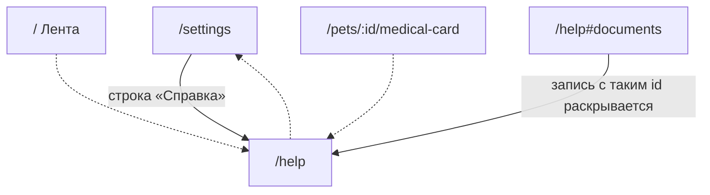

# Аудит пути: Справка

Маршрут: `/help` Файл: `frontend/src/pages/Help.tsx`, содержимое `frontend/src/content/help.ts`

## Кто это

Справочник внутри приложения: восемнадцать частых вопросов и двенадцать экранов, каждый
сворачивается по кнопке, плюс поиск по всем текстам. Текст лежит в коде, а не грузится с сервера,
поэтому он всегда той же версии, что и сборка.

- Роли: любой вошедший. Администратору доступно то же, плюс его экран описан в разделе
  «Настройки» (`content/help.ts:357`).
- Глубина: экран поверх вкладки «Настройки», не вкладка. В шапке кнопка «назад» без логотипа
  и без переключателя питомцев (`components/Navbar.tsx:60`, `69`), вкладка «Настройки» остаётся
  подсвеченной (`components/BottomTabBar.tsx:15`).

## Пользовательские истории

1. **.** Я любой вошедший, чтобы понять, как работает функция, которую я только что увидел,
   открываю «Справка» и ищу по слову. Критерий: найденные записи раскрыты, не найденные убраны
   (`Help.tsx:28`, `56`).
2. **.** Я новый человек, чтобы прочитать, что умеет приложение, читаю «Частые вопросы» сверху
   вниз. Критерий: 18 записей с нажатием на заголовок (`content/help.ts:18-178`).
3. **.** Я пришёл из другого экрана, чтобы прочитать про него, открываю `/help#documents`.
   Критерий: нужная запись раскрыта и поднята наверх (`Help.tsx:61-68`).
4. **.** Я человек, который ищет конкретное слово, пишу «напоминание» и читаю совпадения.
   Критерий: пустое состояние предлагает другие слова (`Help.tsx:90-94`).
5. **.** Я администратор, чтобы проверить, что обещания справки соответны приложению. Критерий:
   каждое обещание либо подтверждается кодом, либо помечено в «Найденное».

## Граф переходов

Со страницы нет ни одной кнопки перехода: весь текст про другие экраны, ни один экран из него
не открывается. Обратный путь один, кнопка «назад» в шапке (`Navbar.tsx:46-52`).

## Путь по шагам

| Шаг | Действие | Что видит | Чем может кончиться |
| --- | --- | --- | --- |
| 1 | Открывает `/help` | Заголовок «Справка», под ним «Ответы на частые вопросы и как устроен каждый экран», поле «Найти в справке» (`Help.tsx:74-89`) | Экран готов, записей много, всё свёрнуто |
| 2 | Нажимает заголовок записи | Запись раскрывается, снизу видна стрелка (`Help.tsx:28-38`) | Человек читает, закрывает тем же нажатием |
| 3 | Вводит слово в «Найти в справке» | Остаются только совпавшие записи, и все они раскрыты (`Help.tsx:28`, `56`) | Разделы, где совпадений нет, исчезают (`Help.tsx:19`) |
| 4 | Ничего не нашлось | «Ничего не нашлось. Попробуйте другое слово, например «напоминание» или «врач»» | Человек меняет запрос или сдаётся |
| 5 | Стирает строку поиска | Возвращаются все записи, но свёрнутые | Уже открытые вручную записи закрываются, см. «Найденное» |
| 6 | Открывает `/help#documents` | Запись с этим `id` раскрыта и поднята наверх (`Help.tsx:61-68`) | Если такого `id` нет, ничего не происходит молча |

Проверка обещаний справки по коду, главное:

| Обещание в справке | Где обещано | Что в коде | Итог |
| --- | --- | --- | --- |
| Кнопка «Отменить» висит шесть секунд | `content/help.ts:32` | `ACTION_MS = 6000` (`utils/snackbar.ts:31`) | Есть |
| «Отменить» возвращает запись, лекарство, документ, питомца и приём | `content/help.ts:53` | `deleteWithUndo` (`utils/deferredDelete.ts:63`), `showUndo` (`utils/undo.ts:22`), `useDeletePet` (`hooks/useDeletePet.ts:5`) | Есть |
| «Удалить запись» внизу формы | `content/help.ts:31` | `pages/HealthRecordForm.tsx:540`, `pages/MedicalRecordForm.tsx:932` | Есть |
| «Пропустить приём» на Ленте и в списке лекарств | `content/help.ts:46` | `pages/MedicationsList.tsx:745`, `components/NextDoseWidget.tsx:308` | Есть |
| «Запомнить для этого питомца» под полем | `content/help.ts:194` | `pages/HealthRecordForm.tsx:461` | Есть |
| Отклонение больше чем на 15%, у кормления 35% | `content/help.ts:117` | `web/trend_alerts.py:31`, `web/builtin_event_types.py:45` | Есть |
| Нужно хотя бы три прошлые записи | `content/help.ts:117` | `MIN_HISTORY_FOR_BASELINE = 3` (`web/trend_alerts.py:19`) | Есть |
| «Напомнить за» по умолчанию 3 дня | `content/help.ts:124` | `inventory_warning_days: 3` (`pages/MedicationForm.tsx:180`) | Есть |
| Фото и PDF до 10 МБ, архивы до 500 МБ, квота 2 ГБ | `content/help.ts:140-145` | `web/documents.py:68`, `web/storage.py:37`, квота описана в `web/openapi_doc.py:71` | Есть |
| Экспорт в CSV, TSV, HTML, Markdown или архивом | `content/help.ts:152` | `components/ExportModal.tsx:67`, `77-81` | Есть |
| Отзыв ссылки в Настройках, «Ссылки на медкарту» | `content/help.ts:167` | `pages/Settings.tsx:163` | Есть |
| После смены пароля на других устройствах надо войти заново | `content/help.ts:355` | `revoke_user_sessions` (`web/account.py:363`) | Есть |
| Нажатие на уведомление открывает страницу, о которой оно | `content/help.ts:338` | `frontend/src/sw.ts:102-118` | Есть |
| На iPhone push работает в приложении, добавленном на экран «Домой», с iOS 16.4 | `content/help.ts:94`, `338` | `needsHomeScreenForPush()` есть (`utils/pushNotifications.ts:26`), но Настройки её не спрашивают (`pages/Settings.tsx:174-177`) | Расходится со строкой в Настройках |
| Если в форме что-то набрано, приложение спросит, выходить ли | `content/help.ts:217` | Всплывающая правка значения на экране «Значения по умолчанию» спрашивает только по нажатию на фон (`pages/FormDefaults.tsx:194`) | Не везде |

## Состояния экрана

| Состояние | Покрыто | Где |
| --- | --- | --- |
| Пустой поиск | Да | «Ничего не нашлось...» с ролью `status` (`Help.tsx:90-94`) |
| Совпадений мало | Частично | Показываются только разделы с совпадениями (`Help.tsx:19`) |
| Раздел без совпадений | Да | Раздел целиком скрыт (`Help.tsx:19`) |
| Якорь не найден | Нет | Молча ничего не делает (`Help.tsx:63-67`) |
| Загрузка | Не нужен | Текст в сборке, сети не нужно (`content/help.ts:18`) |
| Ошибка сети | Не нужен | Страница работает без сети |
| Длинные вопросы | Да | Свёрнуты, читаются по нажатию |

## Точки входа и выхода

Вход: строка «Справка» в группе «О приложении» (`pages/Settings.tsx:280`), глубокая ссылка
`/help#<id>`, закладка. Маршрут обёрнут в `ProtectedRoute` (`App.tsx:537-543`).

Выход: только кнопка «назад» в шапке. Своих кнопок и ссылок внутри нет, поэтому `goBack`
(`utils/navigation.ts:46`) здесь не нужен: `Navbar.tsx:46-52` возвращает предыдущий экран, а при
отсутствии истории вкладки уводит на `/`.

## Правила и валидация

Полей ввода, кроме поиска, нет. Поиск не требует отправки и не ходит на сервер, состояние
живёт в `useState` (`Help.tsx:54`). Текст справки приезжает вместе с кодом: правится только
правкой `content/help.ts` и сборкой, поэтому справка не может разойтись с приложением по
времени, но может разойтись по содержанию, что и проверяется выше.

## Доступность

- Сворачивание на нативном `
` и `
`, то есть с клавиатуры и программой чтения
  работает без правок (`Help.tsx:28-38`).
- Поле поиска: `type="search"`, подсказка «Найти в справке» и `aria-label="Поиск по справке"`
  (`Help.tsx:83-86`).
- Пустое состояние помечено `role="status"` (`Help.tsx:91`).
- Стрелка у заголовка скрыта от программы чтения, сама она не нужна, состояние объявлено
  нативным элементом (`Help.tsx:31`).
- Не хватает: заголовок нарисован инлайн-стилями, без класса `display-headline`, который есть на
  соседних экранах (`pages/Settings.tsx:105`).

## Найденное

| Что | Где | Почему это важно | Тяжесть | Предложение |
| --- | --- | --- | --- | --- |
| Подзаголовок обещает «как устроен каждый экран», а описан 12 экранов из примерно 57 маршрутов | `Help.tsx:78`, `content/help.ts:180-363`, `App.tsx:257-569` | Человек ищет описание экрана, которого нет, и не понимает, нет ли описания или он ищет не там | важно | Либо дописать недостающие экраны, либо честно сузить обещание. Продолжает A1-26, отмеченную как исправленная |
| Поиск требует, чтобы в тексте были все слова запроса сразу | `Help.tsx:56` | Запрос из двух слов почти всегда даёт пусто, и человек считает, что справки нет | важно | Искать по любому из слов, а совпадения подсвечивать |
| Стирание строки поиска закрывает всё, что человек открыл руками | `Help.tsx:28` | Ключ записи меняется вместе с режимом поиска, поэтому открытые записи пересоздаются свёрнутыми | мелочь | Не менять ключ, а запоминать открытые записи |
| Якорь, которого нет, и запись, отфильтрованная поиском, не дают ничего | `Help.tsx:61-68` | Переход по `/help#что-то` выглядит как поломка ссылки | мелочь | Показать «Такого раздела нет» или снять фильтр поиска перед переходом |
| Нет подсветки найденного слова и нет списка совпадений | `Help.tsx:90-97` | Человек не видит, где именно нашлось и сколько совпадений | мелочь | Подсветить слово и показать «Найдено: 3» |
| Заголовок нарисован инлайн-стилями, а не классом `display-headline` | `Help.tsx:74` | Заголовок настроек и медицинских ссылок выглядит иначе при одинаковом размере | мелочь | Взять класс, как в `pages/MedicalLinks.tsx:53` |

## Вопросы к владельцу

- Какие экраны справка обязана описывать. Сейчас двенадцать, и это не выбрано по правилу, а
  сложилось по мере надобности.
- Нужен ли в справке раздел про то, что делать, если напоминание не пришло: на Ленте для этого
  есть отдельная плашка (`components/PushOffNotice.tsx`), а в справке человек попадает в
  «Настройки», где на iPhone сказано «Этот браузер не поддерживает push-уведомления».
- Показывать ли в поиске подсказки по частым запросам вместо текста «Ничего не нашлось».
- Нужны ли разделы про аккаунт: смена почты, смена пароля, удаление аккаунта. Сегодня они
  описаны только строкой внутри раздела «Настройки».

## Связанные экраны

- [settings.md](settings.md), настройки, единственная строка, из которой открывается справка
- [form-defaults.md](form-defaults.md), значения по умолчанию, справка обещает здесь вопрос об
  уходе из формы, а его нет
- [medical-links.md](medical-links.md), ссылки на медкарту, экран, который справка описывает в
  разделе «Настройки»
- [pet-events.md](pet-events.md), события питомца, первый экран в разделе «Экраны»
- [pets.md](pets.md), питомцы, первый раздел справки об общем доступе
- [pet-look-settings.md](pet-look-settings.md), оформление питомца, второй экран справки
- [privacy.md](privacy.md), политика конфиденциальности, читается как документ
- [user-profile.md](user-profile.md), профиль человека, учётные записи в разделе «Настройки»
- [account-email.md](account-email.md), почта, экран, которого в справке нет
- [account-password.md](account-password.md), пароль, экран, которого в справке нет
- [shared-medical-card.md](shared-medical-card.md), медкарта по ссылке, экран без входа