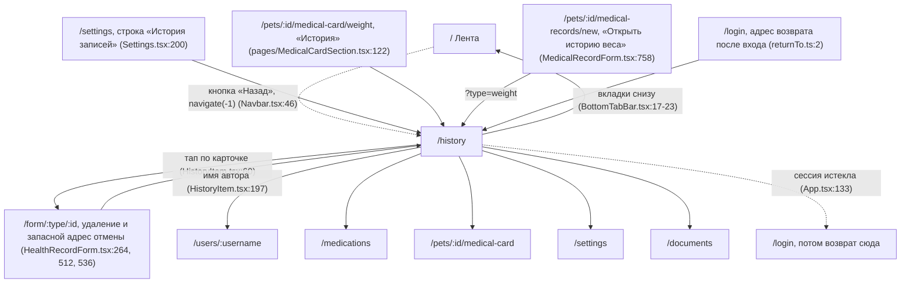

# Аудит пути: История записей

Маршрут: `/history`. Файл: `frontend/src/pages/History.tsx`

## Кто это

Все записи выбранного питомца за всё время с фильтром по типу и графиком по выбранному типу.
Лента отвечает на вопрос «что сегодня», эта страница на вопрос «что было раньше и как менялось».

- Роли: владелец и приглашённый член семьи. Аноним не попадает: маршрут обёрнут в `ProtectedRoute`
  (`frontend/src/App.tsx:288-296`). Права на записи проверяет сервер: `@require_pet_access` на
  `GET /api/history/timeline` (`web/events.py:626`).
- Глубина: экран поверх вкладки, а не вкладка. В `MAIN_TAB_PATHS` его нет
  (`frontend/src/utils/navigation.ts:4`), в нижнем меню его нет (`BottomTabBar.tsx:17-23`), поэтому
  в шапке у него есть кнопка «Назад» (`Navbar.tsx:90-96`), а ни одна вкладка не подсвечена
  (`BottomTabBar.tsx:62`). В настройках это отмечено словами: «История записей: Всё за всё время,
  фильтр по типу и графики» (`Settings.tsx:198-200`).

## Пользовательские истории

1. **Найти запись из прошлого.** Я прихожу к ветеринару, чтобы найти, когда и сколько весил питомец,
   открываю «Историю» из медкарты. Критерий: список сгруппирован по дням, заголовок «Сегодня»,
   «Вчера» или дата, у карточки видны вид записи и время.
2. **Отфильтровать по типу.** Я ищу все прививки, нажимаю плитку фильтра под заголовком и выбираю
   тип. Критерий: подзаголовок и заголовок пустого состояния меняются на «<тип>», в списке остаются
   только записи этого типа (`History.tsx:182`).
3. **Посмотреть, как менялось.** Я отмечаю «Вес», вижу блок «Тренды» с графиком и переключаю период
   «1 мес», «3 мес», «Полгода», «Всё время». Критерий: график строится по этим измерениям
   (`HistoryChart.tsx:339-342`).
4. **Исправить или удалить запись.** Я тапаю карточку и правлю вес. Критерий: открывается форма записи,
   после сохранения «Запись «Вес» обновлена», список обновлён без перезагрузки.
5. **Забрать данные с собой.** Я иду к врачу и хочу файл. Критерий: кнопка «Экспорт» в шапке, выбор
   типа и формата, «Скачать файл», тост «Файл сохранён» (`ExportModal.tsx:97-128`).
6. **Записать, находясь в истории.** Я открыл историю, чтобы свериться, и хочу сразу внести запись.
   Критерий: на экране нет ни круглой «+», ни любой другой кнопки добавления; записать можно только
   из ленты или из уже открытой записи.

## Граф переходов

Из профиля автора на эту страницу попасть нельзя: такого ребра нет ни в таблице маршрутов
(`App.tsx:288-296`), ни в вызовах `navigate`. Стрелки из «Истории» вниз это нажатия вкладок, каждая
перечислена один раз, а стрелка вверх это кнопка «Назад» из шапки (`Navbar.tsx:46-52`, запасной
адрес `/` в строках 48-52).

## Путь по шагам

| Шаг | Действие | Что видит | Чем может кончиться |
| --- | --- | --- | --- |
| 1 | Открывает «Историю» из медкарты или настроек | Скелетон списка на четыре строки (`History.tsx:171`) | Питомцы не пришли: «Сначала добавьте питомца» и «Добавить питомца» (`History.tsx:166`) |
| 2 | Читает шапку | «История», подпись «Все записи за всё время и графики», кнопка «Экспорт» справа (`History.tsx:265-292`) | Имя питомца на экране не написано, см. «Найденное» |
| 3 | Нажимает плитку фильтра | Лист «Фильтр по типу записи» с плитками всех типов, «Все» первой (`HistoryFilterSheet.tsx:66-72`) | Типа нет в фильтре, если у питомца таких записей нет и он скрыт в листе «+»: плитки фильтра строятся по наличию записей и по видимости в «+» (`History.tsx:82-90`) |
| 4 | Выбирает тип | Список и заголовок пустого состояния переключаются на выбранный тип (`History.tsx:182`) | Ничего не нашлось: «<тип>: записей пока нет» и подсказка про «Все» (`History.tsx:183`) |
| 5 | Смотрит блок «Тренды» | График по выбранному типу с периодами «1 мес», «3 мес», «Полгода», «Всё время» (`HistoryChart.tsx:339-342`) | Нет данных за период: «Нет данных за период» (`HistoryChart.tsx:184`); блока «Тренды» вообще нет, если у типа нет ни одной записи (`History.tsx:331`) |
| 6 | Тапает карточку | Форма записи `/form/<тип>/<id>` (`HistoryItem.tsx:60`) | Правка не сохранена: форма спрашивает «Выйти без сохранения?» (`useUnsavedChangesGuard.tsx:31`) |
| 7 | Возвращается | Та же прокрутка, список обновлён из кэша (`HealthRecordForm.tsx:303-306`) | Данные устарели: экран не перезапрашивается при возврате в приложение, нужно потянуть вниз (`History.tsx:343-347`) |
| 8 | Проводит пальцем по записи | Меню «Изменить» и «Удалить» (`HistoryItem.tsx:121-133`) | Удалено: плашка «Удалена запись: <вид>» с «Отменить» на шесть секунд (`deferredDelete.ts:63`) |

Отмена: на самой странице полей нет, отменяется удаление. Возврат: кнопка «Назад» в шапке, `navigate(-1)`
с запасным адресом `/` (`Navbar.tsx:46-52`); прокрутка восстанавливается (`ScrollManager.tsx:66-69`).
Нижние вкладки работают как обычно (`BottomTabBar.tsx:59-75`).

## Состояния экрана

| Состояние | Что на экране | Покрыто |
| --- | --- | --- |
| Первая загрузка | `SkeletonList` на четыре строки (`History.tsx:171`) | Да |
| Питомца нет | «Сначала добавьте питомца», «Когда в Petzy будет питомец, здесь появится раздел «История»», кнопка «Добавить питомца» (`History.tsx:166`, `NoPetState.tsx:13-16`) | Да, но показывается и когда питомец ещё не загрузился, см. «Найденное» |
| Запрос не пришёл | «Не удалось загрузить историю», «Повторить» (`History.tsx:174-176`) | Да |
| Пусто, фильтр «Все» | «Записей пока нет» и «Кормления, вес, лекарства и прививки появятся здесь, как только вы их добавите» (`History.tsx:182-183`) | Да |
| Пусто, выбран тип | «<тип>: записей пока нет» и «Они появятся здесь, как только вы их добавите. Другие записи видны, если выбрать «Все»» (`History.tsx:182-183`) | Да |
| У типа нет записей | Блока «Тренды» нет вовсе, чтобы не ставить два пустых состояния подряд (`History.tsx:322-331`) | Да |
| График без точек | «Нет данных за период», «Переключите вкладку или добавьте записи, и график построится автоматически» (`HistoryChart.tsx:184-185`) | Да |
| Много записей | Страница 100 записей (`History.tsx:119`), кнопка «Загрузить ещё» (`History.tsx:218-239`), тянуть вниз для обновления (`History.tsx:343-349`) | Да |
| Длинные тексты | Комментарий и значения обрезаются тремя строками (`HistoryItem.tsx:231-237`) | Да |
| Запись удаляется | Исчезает сразу, «Удалена запись: <вид>» с «Отменить» (`deferredDelete.ts:63-91`) | Да |
| Типа больше нет | Тип исчез из фильтра, а записи этого типа в списке пропускаются, чтобы не показать пустую карточку (`History.tsx:140-142`, `History.tsx:199-204`) | Да |

### Офлайн

1. Холодный старт без связи: до страницы не доходят, `ProtectedRoute` показывает «Не удалось связаться с
   сервером» и «Повторить» (`ProtectedRoute.tsx:31-52`).
2. Страница уже открыта, связь пропала. Список остаётся нарисованным из кэша (свежесть 30 секунд,
   хранение 5 минут, `App.tsx:100-101`). Новые записи не приходят.
3. Запрос графика уходит и не отвечает. На месте блока «Тренды» появляется LoadError с текстом
   «Не удалось загрузить график» и кнопкой «Повторить» (`HistoryChart.tsx:172-177`, `LoadError.tsx:39`).
4. Удаление свайпом без связи. Запись исчезает с экрана, реальный DELETE не проходит, через шесть
   секунд возвращается с «Не удалось удалить, запись возвращена» (`deferredDelete.ts:80-87`).
5. Экспорт без связи. `handleExport` ловит ошибку и показывает тост из `getApiErrorMessage`
   (`ExportModal.tsx:54-55`): без связи это «Нет связи с интернетом. Ничего не сохранилось, попробуйте
   ещё раз, когда связь появится» (`apiError.ts:10`). Лист при этом остаётся открытым, поля не
   сбрасываются.
6. Заведённого на телефоне списка отметок приёма на этой странице нет: отложенные записи хранит
   `localStorage` (`offlineIntakes.ts:16-19`), они показываются только на ленте
   (`PendingIntakesNotice.tsx:28`). Человек на «Истории» не видит, что накопилось без связи, и решает,
   что всё записано.

Зависания кнопки без связи нет: у запроса предел 30 секунд (`api.ts:22`), у мутаций
`networkMode: 'always'` (`App.tsx:104-107`).

## Точки входа и выхода

Вход: «История» в разделе «Сейчас» на медкарте (`pages/MedicalCardSection.tsx:122`), строка
«История записей» в настройках (`Settings.tsx:200`), «Открыть историю веса» из формы визита
(`MedicalRecordForm.tsx:758`), возврат из формы записи по кнопке «Назад», по отмене или после
удаления (`HealthRecordForm.tsx:264`, `HealthRecordForm.tsx:512`, `HealthRecordForm.tsx:536`), адрес
возврата после входа (`returnTo.ts:2-4`).

Выход: `/form/:type/:id` (`HistoryItem.tsx:60`), `/users/:username` (`HistoryItem.tsx:197`), пять вкладок
нижнего меню (`BottomTabBar.tsx:17-23`), `/login` при истёкшей сессии (`App.tsx:133`).

Кнопка «назад»: в шапке, потому что экран не вкладка (`Navbar.tsx:90-96`), ведёт `navigate(-1)`, а если
истории браузера нет, то на `/` (`Navbar.tsx:46-52`).

## Правила и валидация

Полей на странице нет, правил на ней тоже нет. Что важно знать:

- Запрос: `GET /api/history/timeline` с `pet_id`, `page`, `page_size: 100`, `type`
  (`healthRecords.service.ts:90-100`). Тип уходит прямо в запрос, а не фильтруется на устройстве
  (`History.tsx:107-118`), поэтому смена фильтра начинает свой запрос с первой страницы.
- Тип «Все» отправляется как `all`, а не как пустая строка (`History.tsx:126-127`).
- Порядок групп по дням задан сортировкой ключей по убыванию (`History.tsx:151-158`), записи внутри дня
  приходят в порядке сервера, то есть от новых к старым (`web/events.py:660`). Ключ дня берётся из первых
  десяти знаков `date_time` (`History.tsx:154`).
- Время записи переводится на часы устройства по сохранённому поюсу
  (`healthRecords.service.ts:27-29`), поэтому «Сегодня» и «Вчера» совпадают с местной сутками.
- В фильтр попадают типы, у которых у питомца уже есть записи, плюс видимые в листе «+», плюс
  текущий фильтр (`History.tsx:82-90`). Тип, который скрыли в настройках плиток, но у которого есть
  записи, из фильтра не исчезает. Порядок плиток в фильтре тот же, что на ленте (`History.tsx:86-89`).
- Тип приходит с адреса один раз: `?type=weight` читается при заходе на страницу
  (`History.tsx:55-56`) и дальше живёт в состоянии, адрес не переписывается.
- Записи, удалённые с отложенным подтверждением, из списка выбрасываются, причём до отсева по датам
  (`History.tsx:143-146`).
- Экспорт уходит с признаком «Все типы», который отдаёт архив, а не одну общую таблицу
  (`ExportModal.tsx:64-75`, `History.tsx:368-371`).

## Доступность

Сделано:

- Заголовок первого уровня «История» видимый, заголовки дней это `h2`
  (`History.tsx:265-267`, `History.tsx:192-197`).
- Плитка фильтра это кнопка с `aria-haspopup="dialog"` и именем из названия типа
  (`History.tsx:298-312`), лист фильтра это диалог с именем «Фильтр по типу записи», закрывается по
  Escape и свайпом вниз (`DraggableSheetBody.tsx:84`, `DraggableSheetBody.tsx:142-144`, имя листа в
  `HistoryFilterSheet.tsx:49`).
- Плитки в листе фильтра показывают выбранное состояние через `aria-pressed`
  (`HistoryFilterSheet.tsx:72`).
- Кнопка экспорта имеет имя «Экспорт» и подсказку (`History.tsx:268-273`).
- Карточка записи это `role="button"` с `tabIndex={0}` и именем «<вид>, <когда>, открыть»
  (`HistoryItem.tsx:143-155`).
- Плитки периодов у графика читаются как вкладки (`CapsuleTabs`, `HistoryChart.tsx:335-343`).

Не хватает:

- График это картинка без слов: у него нет ни подписи со значениями, ни таблицы, ни текстовой
  версии (`HistoryChart.tsx:198-329`). Скринридер скажет «график» и всё. Подсказка есть только при
  наведении или тапе на столбик (`HistoryChart.tsx:191-196`), при экранридере её не достать.
- Точки на графике не увеличиваются под палец и не держат удар: при разнице месяцев столбики
  сливаются в полосу (`HistoryChart.tsx:27-33`).
- Кнопки «Изменить» и «Удалить» на карточке скрыты до фокуса с клавиатуры
  (`SwipeableRow.css:124-126`), свайп остаётся единственным путём к удалению, хотя в списке
  документов те же кнопки показаны всегда (`DocumentsList.tsx:375`).
- У кнопки экспорта нет подписи текстом, только иконка и `aria-label`: на экране её смысл угадывается
  (`History.tsx:268-285`).

## Найденное

| Что | Где | Почему это важно | Тяжесть | Предложение |
| --- | --- | --- | --- | --- |
| На «Истории» нельзя записать запись: круглой «+» нет, другой кнопки добавления тоже, а `Fab` на этой странице не вызывается | `History.tsx:1-374`, круглая «+» есть только в `Dashboard.tsx:354` | Тот, кто открыл историю, чтобы что-то внести, должен идти на ленту; назад кнопка «Назад» есть, а вперёд записать нечем | важно | Либо круглая «+» на «Истории», либо кнопка в пустом состоянии «Записать первое событие» |
| Страница не называет питомца и не даёт его сменить: переключатель в шапке показывается только на вкладках (`Navbar.tsx:66-67`), в шапке «Истории» только слово «История» и подпись «Все записи за всё время и графики» | `History.tsx:265-292`, `Navbar.tsx:66-67` | При двух питомцах неясно, чьи записи на экране, и сменить питомца можно только уходом на другую вкладку | важно | Название выбранного питомца в шапке, переключатель рядом с ним |
| «Сначала добавьте питомца» показывается, пока список питомцев ещё грузится: проверка только на `selectedPetId`, без ожидания `petsFetched`, как на ленте | `History.tsx:165-167`, сравните `Dashboard.tsx:161` | Человек с питомцами видит «Сначала добавьте питомца» и жмёт «Добавить питомца», если выбранный питомец ещё не восстановился | важно | Ждать окончания загрузки питомцев, затем решать: пусто или нет |
| Экран не перезапрашивается при возврате в приложение: `refetchOnWindowFocus` включён на ленте, но не здесь, а общий дефолт выключен | `History.tsx:119-136`, `Dashboard.tsx:103`, `App.tsx:91` | Записи, добавленные другим человеком семьи, на экране не появляются, пока не потянешь вниз; человек видит устаревшую картину | мелочь | Включить `refetchOnWindowFocus` на этой странице так же, как на ленте |
| Тип приходит один раз и в адрес не пишется: `?type=weight` читается при монтировании, дальше живёт только в состоянии | `History.tsx:55-56` | Смена фильтра не попадает в адрес, поэтому ссылкой на отфильтрованную историю не поделиться и кнопка «Назад» в браузере фильтр не откатывает | мелочь | Складывать `type` в query и обновлять адрес при смене фильтра |
| График не имеет текстовой версии, столбики не увеличены под палец | `HistoryChart.tsx:198-329`, `HistoryChart.tsx:27-33` | Скринридер и палец не получают значений, ради которых экран и открывают | мелочь | Текстовая сводка под графиком: первое, последнее, изменение |
| Сбой графика показан строкой без кнопки повтора, хотя весь остальной список повторяет | `HistoryChart.tsx:171-177`, для сравнения `LoadError.tsx:32-45` | Человек, у которого пропала связь, увидит красную строку вместо графика и не поймёт, что достаточно потянуть список вниз | мелочь | Показывать `LoadError` с «Повторить», как у списка записей |
| Кнопка экспорта только иконка, смысл угадывается | `History.tsx:268-285` | В шапке рядом с заголовком иконка скачивания читается как «что-то скачать», а что именно, известно только после открытия | мелочь | Подпись «Экспорт» рядом с иконкой или в шапке листа |
| Пустое состояние без кнопки: «Записей пока нет» и текст, но действия нет | `History.tsx:178-186` | Человек, у которого нет записей, видит тупик вместо первой записи | мелочь | Кнопка «Записать первую запись» в пустом состоянии |

Продолжает старую историю: A2-09 (подгрузка и граница) и A2-24 (смена фильтра ломает список) закрыты
кодом, A2-25 (график) закрыта частично, A2-13 (жесты без подсказки) на этой странице не закрыта:
подсказки о свайпе здесь нет.

## Вопросы к владельцу

1. Нужна ли круглая «+» на «Истории». Если да, то откроет ли она тот же лист «Что записать?», что и на
   ленте, и куда уйдёт форма после сохранения.
2. Показывать ли имя питомца в шапке «Истории» и переключатель там же, или оставить переключение
   только на вкладках.
3. Должен ли фильтр по типу попадать в адрес, чтобы ссылкой на отфильтрованную историю можно было
   поделиться и чтобы кнопка «Назад» откатывала фильтр.
4. Нужен ли текстовый дубль графика для скринридера или достаточно подписи с изменением.

## Связанные экраны

- [dashboard.md](dashboard.md), лента: тот же список записей на сегодня и единственное место, где
  стоит «+»
- [health-record-form.md](health-record-form.md), форма записи: открывается отсюда и по кнопке
  «Назад» возвращает сюда
- [medical-card-section.md](medical-card-section.md), откуда приходят в «Историю»
- [settings.md](settings.md), строка «История записей»
- [medical-record-form.md](medical-record-form.md), «Открыть историю веса» из формы визита
- [user-profile.md](user-profile.md), куда ведёт имя автора записи
- [README.md](README.md), сквозные правила и общий граф