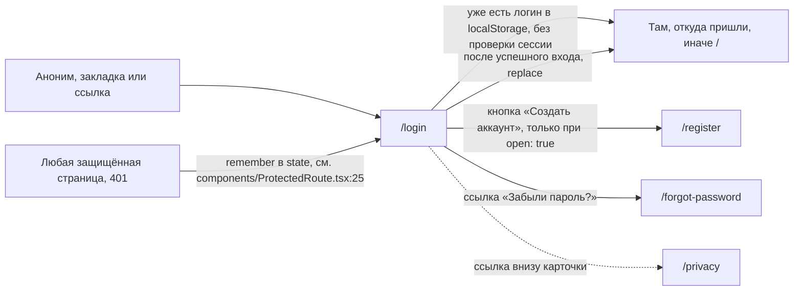

# Аудит пути: Вход

Маршрут: `/login`, Файл: `frontend/src/pages/Login.tsx`

## Кто это

Первый экран, который видит человек, открывший Petzy без сессии: логотип, карточка с логином и
паролем, кнопка «Войти». Сюда же приложение возвращает того, чья сессия закончилась, и тот, кто
забыл пароль.

- Роли: аноним без аккаунта, владелец и приглашённый с истёкшей сессией
- Глубина: публичный экран, без нижних вкладок (`utils/publicPages.ts:5`, `components/BottomTabBar.tsx:34`)

## Пользовательские истории

1. **.** Я постоянный пользователь, чтобы войти в дневник, набираю логин и пароль и жму «Войти».
   Критерий: открывается лента, кнопка на время нажатия читается «Вход...» (`pages/Login.tsx:113`).
2. **.** Я пришёл по внутренней ссылке, а сессии у меня нет, чтобы вернуться туда же, откуда меня
   выкинуло, ввожу пароль. Критерий: над формой написано «Войдите, и вы вернётесь на тот же экран,
   где были», после входа открывается именно тот адрес (`pages/Login.tsx:87`, `utils/returnTo.ts:7`).
3. **.** Я никогда не пользовался Petzy, чтобы завести аккаунт, нажимаю «Создать аккаунт» под
   кнопкой входа. Критерий: открывается `/register` (`pages/Login.tsx:125`).
4. **.** Я забыл пароль, чтобы получить ссылку для нового, жму «Забыли пароль?». Критерий: открывается
   `/forgot-password` (`pages/Login.tsx:132`).
5. **.** Я ошибаюсь в пароле, чтобы понять, что делать дальше, жму «Войти» с неверными данными.
   Критерий: снизу появляется «Неверный логин или пароль», форма остаётся с введённым логином
   (`pages/Login.tsx:69`, `web/errors.py:44`).
6. **.** Я нажал шесть раз подряд и уперся в ограничение, чтобы понять, когда можно повторить.
   Критерий: приходит «Слишком много попыток с этого адреса. Попробуйте через минуту»
   (`web/app.py:286`, `web/configs.py:66`).

## Граф переходов

## Путь по шагам

| Шаг | Действие | Что видит | Чем может кончиться |
| --- | --- | --- | --- |
| 1 | Открывает `/login` | Логотип «Petzy», поля «Логин» и «Пароль», кнопка «Войти» (`components/AuthShell.tsx:28`, `pages/Login.tsx:97`) | Если в localStorage лежит логин, экран сразу уходит на цель (`pages/Login.tsx:40`) |
| 2 | Набирает логин | Поле `Логин`, подсказка «Введите логин», автоподстановка `username` (`pages/Login.tsx:147`) | Ввод обрезается от пробелов при отправке, но не при наборе (`pages/Login.tsx:61`) |
| 3 | Набирает пароль | Поле `Пароль` с типом `password` и кнопкой очистки, автоподстановка `current-password` (`pages/Login.tsx:164`) | Пароль не видно, кнопки «показать» нет |
| 4 | Жмёт «Войти» | «Вход...», поля и кнопки заблокированы (`pages/Login.tsx:101`) | Успех: переход на цель. Ошибка: тост с текстом сервера |
| 5 | Читает ошибку | Тост внизу, произнесённый скринридером (`utils/snackbar.ts:88`) | Повтор возможен сразу, поля очищаются только вручную |

Отмена и возврат: отдельной кнопки «назад» на экране нет, `Navbar` и нижние вкладки скрыты
(`components/Navbar.tsx:55`, `components/BottomTabBar.tsx:50`). Уход с экрана не спросит ничего, то
есть введённый пароль просто теряется. Кнопка браузера «назад» после успешного входа ничего не
возвращает, переход сделан с `replace` (`pages/Login.tsx:62`). Ошибка сети: если ответа не было
вообще, `getApiErrorMessage` даёт «Нет связи с интернетом. Ничего не сохранилось, попробуйте ещё
раз, когда связь появится» или «Сервер не ответил. Попробуйте ещё раз»
(`utils/apiError.ts:10`).

## Состояния экрана

- Загрузка: отдельного загрузчика нет, форма рисуется сразу, кнопка «Создать аккаунт» появляется
  только после ответа `GET /api/auth/registration` (`pages/Login.tsx:34`). Пока ответа нет, человек
  видит форму без единого пути в регистрацию.
- Пусто: поля пустые, подсказки в `placeholder`, ошибок нет.
- Ошибка и повтор: тост на 5 секунд (`utils/snackbar.ts:30`), форма остаётся, повтор доступен.
- Нет доступа: не применимо, экран публичный.
- Офлайн: попытка входа даёт «Нет связи с интернетом...», форма не блокируется.
- Длинные тексты: логин до 50 символов на сервере (`web/schemas.py:196`), поле не ограничено.
- Пустые имена: логин приводится к `trim()` только при отправке, в поле остаётся как введено.
- Не покрыто: состояние «слишком много попыток» ничем не отличается от других ошибок, кроме текста
  тоста, кнопка остаётся активной (`pages/Login.tsx:70`).

## Точки входа и выхода

Вход: прямой заход, закладка, `/login` из `catch-all` для незнакомого адреса (`App.tsx:569`),
переход из любой защищённой страницы после 401 (`components/ProtectedRoute.tsx:25`,
`App.tsx:133`). Выход: на `target` (путь из `state`, иначе `/`), на `/register`, на
`/forgot-password`, на `/privacy` обычной ссылкой `<a>`, то есть с перезагрузкой страницы
(`components/AuthShell.tsx:65`). `goBack` на этом экране не используется.

## Правила и валидация

- Пустые поля проверяются на клиенте и показываются тостом «Введите логин» и «Введите пароль»
  (`pages/Login.tsx:45`), без подписи под полем и без `aria-invalid` (нет `FieldError`, сравните
  `pages/Register.tsx:97`).
- Логин отправляется с отброшенными краями: `username.trim()`, пароль как есть
  (`pages/Login.tsx:61`). Регистр логина на клиенте не меняется, сервер сам приводит к нижнему
  регистру, если такого логина нет (`web/auth.py:251`).
- На сервер уходит `POST /api/auth/login` с `username` и `password`
  (`services/auth.service.ts:70`). Токены приходят только cookie `httpOnly`.
- После успеха `useAuth.login` пишет логин в localStorage, снимает «защёлку» истечения сессии,
  чистит кэш запросов и заранее спрашивает `/api/auth/session` (`hooks/useAuth.ts:64`).
- При ошибке входа `useAuth.login` стирает логин из localStorage (`hooks/useAuth.ts:47`).
- Ничего не сохраняется при уходе со страницы, подтверждения несохранённого нет.

## Доступность

- `h1` это слово «Petzy» в `AuthShell` (`components/AuthShell.tsx:28`), и именно на него
  `RouteFocus` ставит фокус и берёт заголовок вкладки (`components/RouteFocus.tsx:26`). Заголовок
  «Petzy» совпадает с именем приложения, поэтому вкладка называется «Petzy» и на `/register`
  тоже, где заголовок второго уровня «Новый аккаунт» (`pages/Register.tsx:102`).
- Поля связаны с подписями через `linkLabel` в `utils/antdA11y.ts:52`, кнопка «очистить» поле
  помечена как кнопка вне порядка обхода (`utils/antdA11y.ts:65`).
- Enter на первом поле уводит на пароль, на пароле отправляет форму, кнопка помечена
  `data-enter-submit` (`utils/enterKey.ts:64`, `pages/Login.tsx:104`).
- Ошибки приходят только тостом: он произносится assertive при ошибке
  (`utils/snackbar.ts:88`), но рядом с полем ничего не меняется, у поля нет `aria-invalid`.
- Подсказка о возврате помечена `role="status"` (`pages/Login.tsx:88`), кнопки крупные
  (`size="large"`), контейнер уважает безопасные зоны экрана (`components/AuthShell.tsx:15`).
- Чего нет: «показать пароль», счётчика попыток, объявления ограничения в 5 попыток в минуту
  (`web/configs.py:66`).

## Найденное

| Что | Где | Почему это важно | Тяжесть | Предложение |
| --- | --- | --- | --- | --- |
| Кнопка «Создать аккаунт» зависит от запроса, который не повторяется, и при ошибке не появляется | `pages/Login.tsx:34`, `pages/Login.tsx:117` | Новый человек, у которого `GET /api/auth/registration` не прошёл, не видит единственный путь в регистрацию, кроме адресной строки | важно | Показывать кнопку всегда, а закрытость регистрации объяснять после клика на `/register` (`pages/Register.tsx:81` это уже делает) |
| Ограничение 5 попыток в минуту не видно и не считается | `web/configs.py:66`, `web/auth.py:235`, `pages/Login.tsx:70` | Человек набирает пароль с ошибкой несколько раз подряд и получает «Попробуйте через минуту» без счётчика и без блокировки кнопки | важно | Показывать остаток попыток или блокировать кнопку до конца окна, когда пришёл `retry_after` из `web/app.py:287` |
| Ошибки пустых полей показываются тостом, а не под полем | `pages/Login.tsx:45` | Поле не меняется, у него нет `aria-invalid` и подписи об ошибке, человек должен связывать текст тоста с полем | мелочь | Использовать `FieldError` и `useTouched`, как на регистрации (`pages/Register.tsx:97`) |
| Оптимистичный переход по логину из localStorage без проверки сессии | `pages/Login.tsx:40`, `hooks/useAuth.ts:39` | При истёкших cookie человек видит мигание: `/login` уходит на цель, `ProtectedRoute` возвращает обратно (`components/ProtectedRoute.tsx:25`) | мелочь | Оставить как есть, но при возврате на `/login` с показанным `state` не показывать форму, пока идёт проба сессии |
| Заголовок вкладки и фокус после перехода всегда «Petzy» | `components/RouteFocus.tsx:26`, `components/AuthShell.tsx:28` | Скринридер объявляет логотип, а не назначение экрана, на всех шести публичных экранах сразу | важно | Дать `AuthShell` принимать заголовок и рисовать его `h1`, а логотип оставить безымянным для скринридера |
| Ссылка на политику это обычный `<a href>`, а не `Link` | `components/AuthShell.tsx:65` | Переход на `/privacy` перезагружает приложение, введённый логин и пароль теряются | мелочь | Заменить на `Link` из роутера, если нестандартное поведение не нужно |
| Нет подсказки про демо-аккаунты и про то, что логин не чувствителен к регистру | `pages/Login.tsx:139` | Не подтверждается кодом, что это нужно, см. «Вопросы к владельцу» | мелочь | Решить вместе с владельцем |

## Вопросы к владельцу

- Нужен ли вход по адресу почты. Сейчас поле подписано «Логин», а восстановление пароля принимает
  «Логин или почту» (`pages/ForgotPassword.tsx:83`), и это расхождение может смутить.
- Что показывать на экране, когда человек уже вошёл, но cookie протухли: пустую форму, сообщение о
  завершении сессии или только «Войдите заново» (в `web/errors.py:43` такой текст есть, но форма его
  не показывает).
- Нужно ли объяснять ограничение в пять попыток заранее, до шестой ошибки.

## Связанные экраны

- [Регистрация](register.md)
- [Забыл пароль](forgot-password.md)
- [Политика и согласие](privacy.md)
- [Настройки](settings.md)
- [Первый запуск](onboarding.md)
