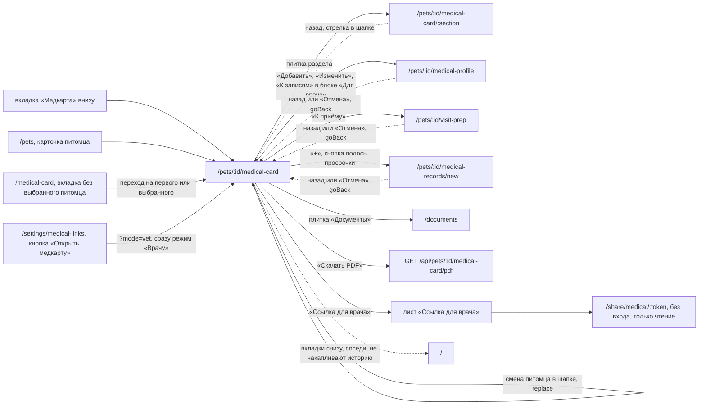

# Аудит пути: Медкарта

Маршрут: `/pets/:id/medical-card`, Файл: `frontend/src/pages/MedicalCard.tsx`

## Кто это

Главный экран медкарты питомца: то, что врач спрашивает в первую очередь, собранное из
записей, которые человек уже ведёт. Здесь два режима, «Записи» (рабочий, с правкой и
плитками разделов) и «Врачу» (то, что показывают на приёме, без кнопок правки).

- Роли: владелец и приглашённый, у которых есть доступ к питомцу. Аноним сюда не попадает:
  маршрут внутри `ProtectedRoute` (`App.tsx:322`, `:325`), его карту по ссылке открывает
  другой экран, `/share/medical/:token` (`App.tsx:259`)
- Глубина: нижняя вкладка сама по себе. `isMainTabPath` считает этот путь вкладкой
  (`utils/navigation.ts:7`, `:16`), поэтому в шапке нет кнопки «назад» и есть переключатель
  питомца (`components/Navbar.tsx:60`, `:69`)
- Доступ на сервере: `GET /api/pets/<id>/medical-card` зовёт
  `get_pet_and_validate(pet_id, username, require_owner=False)` (`web/medical_card.py:378`,
  маршрут `:385`), то есть править может любой, кому открыт питомец

## Пользовательские истории

1. **.** Я владелец, чтобы понять, что уже есть в карте, открываю вкладку «Медкарта».
   Критерий: заголовок «Медкарта», переключатель «Записи» и «Врачу», плитки восьми
   разделов (`pages/MedicalCard.tsx:907`, `:909`, `:920`).
2. **.** Я открыл медкарту с телефонного напоминания, чтобы не искать её, жму на уведомление.
   Критерий: открывается карта нужного питомца, и его же предлагает переключатель в шапке:
   адрес карты делает питомца выбранным (`pages/MedicalCard.tsx:843`). В коде нет ни одного
   push, который ведёт на этот адрес (`web/trend_alerts.py`, `web/push.py`), так что этот
   вход пока не подтверждён.
3. **.** Я хочу показать карту врачу на приёме, переключаю на «Врачу». Критерий: блок без
   кнопок правки, сверху «Скачать PDF» и «Ссылка для врача», внизу «К записям»
   (`pages/MedicalCard.tsx:914`, `:820`).
4. **.** Я веду карту с нуля, чтобы не потерять завтра, жму «+» справа внизу. Критерий: лист
   «Что записать?» с тремя группами, выбор открывает нужную форму сразу
   (`components/RecordSheet.tsx:57`, `:27`).
5. **.** У меня просрочена прививка, чтобы исправить это, жму красную полосу вверху. Критерий:
   «Просрочено на 8 дней» и кнопка «Записать повторную прививку», которая открывает форму,
   заполненную по старой записи (`pages/MedicalCard.tsx:397`, `:406`, `components/RecordSheet.tsx:31`).
6. **.** Я хочу понять, что карта уже годится врачу, читаю блок готовности. Критерий:
   «Заполнено 3 из 5», следующий шаг с кнопкой и подсказкой, остальные списком
   (`pages/MedicalCard.tsx:428`, `utils/medicalReadiness.ts:26`).

## Граф переходов

## Путь по шагам

| Шаг | Действие | Что видит | Чем может кончиться |
| --- | --- | --- | --- |
| 1 | Жмёт вкладку «Медкарта» или карточку питомца в `/pets` (`components/BottomTabBar.tsx:59`, `pages/Pets.tsx:349`) | Переключатель питомца в шапке, заголовок «Медкарта», переключатель «Записи» и «Врачу» (`components/Navbar.tsx:99`, `pages/MedicalCard.tsx:907`) | Если питомца нет, вкладка ведёт на `/medical-card`, а тот показывает «Действующих ссылок нет» в блоке ссылок или пусто (`components/RequirePet.tsx:21`) |
| 2 | Смотрит, что просрочено | Красная полоса под переключателем с самым просроченным и счётчиком «И ещё 2» (`pages/MedicalCard.tsx:397`, `:414`) | В режиме «Врачу» полоса есть, а кнопки в ней нет (`pages/MedicalCard.tsx:911`) |
| 3 | Читает, что карта готова | «Заполнено 3 из 5», подпись следующего шага, кнопка шага и список «Потом» (`pages/MedicalCard.tsx:446`, `:450`, `:457`) | Кнопка ведёт туда, где заполняется: `/medical-profile`, `/medical-records/new?kind=…`, `/form/weight` (`utils/medicalReadiness.ts:28`, `:36`, `:60`) |
| 4 | Открывает плитку раздела | Экран раздела со своим заголовком и именем питомца (`components/MedicalSummary.tsx:133`, `pages/MedicalCardSection.tsx:256`) | Плитка «Документы» уходит на `/documents`, а не в раздел (`components/MedicalSummary.tsx:133`) |
| 5 | Жмёт «+» | Лист «Что записать?»: «В медкарту», «Данные для врача», «Рядом с картой» (`components/RecordSheet.tsx:29`, `:38`, `:45`) | Выбор открывает форму с питомцем уже в адресе (`components/RecordSheet.tsx:25`) |
| 6 | Переключает на «Врачу» | Тот же заголовок и переключатель, ниже то, что читают на приёме, без кнопок правки (`pages/MedicalCard.tsx:909`, `:913`) | «Скачать PDF» и «Ссылка для врача» есть только когда заполнены два пункта из пяти (`pages/MedicalCard.tsx:914`) |
| 7 | Отдаёт карту врачу | Лист «Ссылка для врача»: срок, адрес один раз, «Скопировать», «Поделиться», список действующих ссылок с «Отозвать» (`components/MedicalShareSheet.tsx:72`, `:89`, `:113`) | Адрес не восстанавливается: сервер хранит только хеш (`components/MedicalShareSheet.tsx:20`) |

Отмена и возврат: у вкладки кнопки «назад» в шапке нет, выход это нижние вкладки или
переключатель питомца. Формы, открытые с карты, уходят через `goBack`: назад по истории, а
при прямой ссылке на адрес медкарты (`utils/navigation.ts:46`).
Ошибка сети: на самой карте тоста нет, вместо неё весь экран заменяется на «Не удалось
загрузить медкарту» с «Повторить», при отсутствии связи с текстом «Нет связи с интернетом.
Когда связь появится, нажмите «Повторить»» (`pages/MedicalCard.tsx:877`,
`components/LoadError.tsx:39`).

## Состояния экрана

- Загрузка: скелет заголовка и шести строк, экран помечен `aria-busy` (`pages/MedicalCard.tsx:888`).
  Карта всегда запрашивается заново при открытии (`staleTime: 0`, `refetchOnMount: 'always'`,
  `pages/MedicalCard.tsx:853`), поэтому возврат из формы показывает свежие данные.
- Пусто: пустой питомец это норма, а не ошибка. Блок готовности показывает «Заполнено 0 из 5»,
  плитки пишут «Не заполнено», «Нет записей», «Не указан» (`pages/MedicalCard.tsx:446`,
  `components/MedicalSummary.tsx:64`, `:77`, `:91`).
- Просрочено: полоса вверху, красная плитка «Профилактика» с подписью «Нужно повторить» и
  точка на вкладке снизу (`pages/MedicalCard.tsx:397`, `components/MedicalSummary.tsx:78`,
  `components/BottomTabBar.tsx:45`).
- Нет доступа или питомца: отдельно от остальной ошибки, «Питомец не найден» и «Возможно, его
  удалили или закрыли вам доступ», кнопка «К питомцам» (`pages/MedicalCard.tsx:875`).
- Офлайн: `LoadError` сам различает отсутствие связи и ответ сервера
  (`components/LoadError.tsx:38`).
- Длинные тексты: жалобы и заметки показываются как есть, строки переносятся, счётчик под
  полем ограничивает ввод (`pages/MedicalCard.tsx:250`, `components/FieldNote.tsx:31`).
- Имя питомца: приходит из карточки питомца и на экране нигде не проверяется, в переключателе
  шапки оно попадает в `aria-label` целиком (`web/medical_card.py:321`,
  `components/Navbar.tsx:115`).

## Точки входа и выхода

Вход: вкладка «Медкарта» (`components/BottomTabBar.tsx:59`), `/medical-card` без выбранного
питомца (`components/RequirePet.tsx:19`), карточка в списке питомцев (`pages/Pets.tsx:349`),
`/settings/medical-links` с `?mode=vet` (`pages/MedicalLinks.tsx:74`), переключатель питомца
в шапке (`components/Navbar.tsx:43`).
Выход: восемь разделов, `/pets/:id/medical-profile`, `/pets/:id/visit-prep`,
`/pets/:id/medical-records/new`, `/documents`, PDF, лист «Ссылка для врача», нижние вкладки.
Кнопки «назад» в шапке нет, экран сам является вкладкой.

## Правила и валидация

Экран ничего не сохраняет сам: все правки идут через формы. Что он делает сам, без формы:

- «Скачать PDF» (`pages/MedicalCard.tsx:857`): запрос `GET /api/pets/<id>/medical-card/pdf`
  (`services/medicalCard.service.ts:163`), тосты «PDF сохранён» и «Не удалось сформировать PDF»
- «Больше не делаем» у просроченной записи (`pages/MedicalCard.tsx:475`): сразу шлёт `PUT`
  с пустым `next_due`, тост не показывает, вместо него полоса «Отменить» с тем же `PUT` обратно
  (`pages/MedicalCard.tsx:484`, `utils/undo.ts:22`). Запись остаётся в истории, но больше не
  считается просроченной
- «Заполнено X из 5» считается по пяти пунктам из `utils/medicalReadiness.ts:26`: аллергии,
  прививка, обработка, клиника, вес. Пропущенным считается и «аллергий нет»
  (`utils/medicalReadiness.ts:34`)

Режим не запоминается: карта всегда открывается в «Записях», иначе тот, кто пришёл записать
визит, увидел бы вид без «+» (`pages/MedicalCard.tsx:897`). Единственный вход с выбором режима
это `?mode=vet` из настроек ссылок.

## Доступность

- Переключатель режимов это группа с `aria-pressed` у каждого режима
  (`pages/MedicalCard.tsx:572`, `:576`), полоса просрочки объявлена `role="status"`
  (`pages/MedicalCard.tsx:408`), значит смена срока читается скринридером
- Блок готовности: заголовок «Заполнено 3 из 5» это `h2`, список остальных шагов помечен
  `aria-label="Потом"` (`pages/MedicalCard.tsx:442`, `:456`)
- Плитка раздела это `button` с полным `aria-label`: название, значение и подпись
  (`components/MedicalSummary.tsx:132`)
- Строка записи объявляет не только «открыть запись», но и срок и дату повтора
  (`pages/MedicalCard.tsx:301`)
- Цели нажатия: у ссылок и действий класса `touch-target`, у плиток обёртка `tap-feedback`
  (`pages/MedicalCard.tsx:327`, `components/MedicalSummary.tsx:131`)
- Всё, что сделано через `utils/antdA11y.ts`, здесь не нужно: на карте нет кликабельных
  `List.Item` и форм, есть только собственные `button` с `role` и подписями

## Найденное

| Что | Где | Почему это важно | Тяжесть | Предложение |
| --- | --- | --- | --- | --- |
| Блок «Для врача» появляется только при двух пунктах из пяти, и в режиме «Записи», где человек и наполняет карту, никакого объяснения этому нет | `pages/MedicalCard.tsx:941`, `:897` | Объяснение есть только в режиме «Врачу» («Карта почти пуста. Заполните её в «Записях», и здесь появится PDF», `pages/MedicalCard.tsx:695`). В «Записях» блок просто исчезает, и человек не понимает, куда делись кнопки | важно | Показывать блок всегда, а при нехватке данных писать под ним ту же строку про пустую карту |
| Плитка «Документы» открывает `/documents`, а не свой раздел медкарты | `components/MedicalSummary.tsx:133` | Семь плиток ведут в раздел `medical-card/:section`, восьмая уходит на другую вкладку с другой шапкой, и назад из неё попадаешь не туда. Раздел `documents` при этом написан и работает (`pages/MedicalCardSection.tsx:155`), но из интерфейса в него не попасть | важно | Либо вести в раздел, либо убрать его из `TITLES` и из кода раздела |
| Комментарий обещает ссылку из ленты с `?mode=fill`, такой ссылки в коде нет | `pages/MedicalCard.tsx:836`, поиск по `frontend/src` | Единственный, кто передаёт `mode`, это `/settings/medical-links` и только `vet` (`pages/MedicalLinks.tsx:74`). Читающий код будет искать вход из ленты, которого нет | мелочь | Поправить комментарий на фактический источник |
| По ссылке врачу PDF отдаётся всегда, а владельцу только при двух пунктах из пяти | `pages/SharedMedicalCard.tsx:83` против `pages/MedicalCard.tsx:914` | Владелец видит «PDF не предлагаем, карта пустая», а врач по его же ссылке получает PDF такой карты. Расхождение ничем не объяснено | мелочь | Либо объяснить в листе ссылки, либо применять то же правило на странице ссылки |
| Поле `can_edit` приходит с сервера и не читается нигде во фронтенде | `web/medical_card.py:354`, `web/schemas.py:2393`, `services/medicalCard.service.ts:131` | Ответ сервера «владелец ли текущий пользователь» есть, но граница «своя карта» и «карта члена семьи» держится только на маршрутах и компонентах. Поле молча устаревает, если правило поменяется | мелочь | Либо использовать поле в шапке, либо убрать из ответа |
| Ссылка «Вес» в блоке готовности единственная уходит без питомца в адресе | `utils/medicalReadiness.ts:60` | Остальные пять ведут `/pets/<id>/…`. Работает только потому, что карта заранее сделала питомца выбранным (`pages/MedicalCard.tsx:843`); при другом входе откроется форма того питомца, который выбран в шапке | мелочь | Вести на `/pets/<id>/…` или явно положиться на выбранного питомца |
| Пустая карта в режиме «Врачу» не говорит, что именно пусто | `pages/MedicalCard.tsx:670` | Разделы пишут «Не указаны» (`pages/MedicalCard.tsx:730`), «Не указана» (`:761`), «Сейчас ничего не принимает» (`:710`), но нигде нет одной строки «карта пока пустая». Человек показывает врачу пустой экран без пояснения | важно | Собрать отсутствующие разделы в одну фразу над «Лекарствами» |
| Карта грузится заново при каждом открытии, отдельного состояния загрузки для отправленных форм нет | `pages/MedicalCard.tsx:853` | Это сделано правильно (свежие данные после сохранения), но при возврате из формы виден скелет на 1–2 экрана даже при живом кеше | мелочь | Оставить как есть, отметить в аудите как осознанное решение |

## Вопросы к владельцу

- Плитка «Документы» ведёт на вкладку «Документы». Это осознанно (документы это отдельный
  раздел приложения, и у них своя шапка) или раздел `medical-card/documents` нужно вернуть в
  обход плитки? Код не отвечает: тело раздела написано и работает, но ссылок на него нет.
- Блок «Для врача» в режиме «Записи» появляется с двух пунктов из пяти. Нужен ли счётчик
  рядом с ним («Осталось 3»), или текущего молчания достаточно, если человек видит блок
  готовности прямо над ним?
- Кто делает ссылку для врача: только владелец или любой, у кого есть доступ? Сервер отдаёт
  `can_edit`, но форма его не спрашивает, а доступ на сервере общий для всех, у кого открыт
  питомец (`web/medical_card.py:378`).
- Пустой карте в режиме «Врачу» лучше показать пустые разделы как сейчас или сразу короткое
  сообщение о том, что записать ещё нечего? Тон и объём текста по коду не выводятся.

## Связанные экраны

- [README](README.md), [_existing-audit.md](_existing-audit.md): истории A4-01, A4-09, A4-10,
  A4-11, A4-12, A4-15, A4-20
- [Раздел медкарты](medical-card-section.md)
- [Данные для врача](medical-profile-form.md)
- [К приёму](visit-prep-form.md)
- [Запись медкарты](medical-record-form.md)
- [Медкарта по ссылке](shared-medical-card.md): тот же `VetView` и `OverdueStrip` без кнопок
- [Ссылки на медкарту](medical-links.md): единственный вход с `?mode=vet`
- [Питомцы](pets.md), [Лента](dashboard.md), [Документы](documents-list.md)