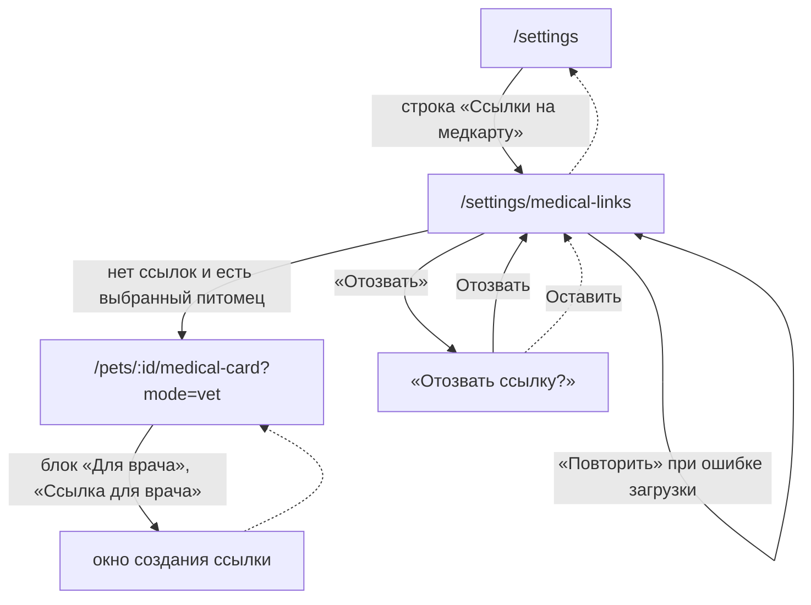

# Аудит пути: Ссылки на медкарту

Маршрут: `/settings/medical-links` Файл: `frontend/src/pages/MedicalLinks.tsx`

## Кто это

Список всех ссылок, которые ещё работают, по всем питомцам сразу: до какого срока, кто сделал
и кнопка «Отозвать». Сами ссылки делаются не здесь, а в медкарте питомца, откуда их и забывают,
поэтому здесь они собраны и отзываются в одно место.

- Роли: любой, у кого есть доступ хотя бы к одному питомцу. Отозвать ссылку может не только
  владелец, но и приглашённый: сервер спрашивает доступ к питомцу, а не владение
  (`web/medical_share.py:113`, `131`).
- Глубина: экран поверх вкладки «Настройки». Кнопка «назад» есть, переключателя питомцев нет:
  он и не нужен, экран и так показывает всех (`components/Navbar.tsx:60`, `69`).

## Пользовательские истории

1. **.** Я владелец, чтобы найти все ссылки, которые раздал врачам, открываю «Ссылки на
   медкарту» из Настроек. Критерий: список разбит по питомцам, у каждой сроки и кто её сделал
   (`MedicalLinks.tsx:81-94`).
2. **.** Я владелец, чтобы отозвать ссылку, которую больше не нужно, жму «Отозвать». Критерий:
   вопрос «Отозвать ссылку?» с кнопками «Отозвать» и «Оставить», после отзыва тост «Ссылка
   отозвана» (`34-42`, `29`).
3. **.** Я владелец, у которого ссылок ещё нет, ищу, как её сделать. Критерий: «Действующих
   ссылок нет» и кнопка «Открыть медкарту», которая ведёт в медкарту в режиме «Врачу»
   (`69-75`).
4. **.** Я приглашённый, чтобы убедиться, что мою ссылку никто не раздал, посмотреть список.
   Критерий: вижу все ссылки питомца, включая сделанные владельцем.

## Граф переходов

Путь один: из Настроек. Из самого экрана можно уйти только назад или, когда ссылок нет, в
медкарту выбранного питомца (`MedicalLinks.tsx:74`).

## Путь по шагам

| Шаг | Действие | Что видит | Чем может кончиться |
| --- | --- | --- | --- |
| 1 | Открывает экран из Настроек | «Ссылки, по которым врач открывает карту без входа. Здесь видно все действующие и можно отозвать любую», под ним «Загружаем» (`54`, `58`) | Списки грузятся по одному запросу на питомца (`22-24`) |
| 2 | Ждёт или смотрит список | Разделы по питомцам, в каждом «До <дата и время>», ниже «Сделал <логин>, <дата>» (`82-88`) | Если запрос по питомцу не прошёл, вместо его раздела сообщение с кнопкой «Повторить» (`60-67`) |
| 3 | Жмёт «Отозвать» | Вопрос «Врач, у которого она открыта, сразу потеряет доступ к карте. Новую ссылку можно сделать в любой момент» (`37`) | «Оставить» ничего не делает, «Отозвать» убирает строку и показывает тост «Ссылка отозвана» |
| 4 | Видит, что ссылок нет | «Действующих ссылок нет» и «Ссылку для врача делают в медкарте, в режиме «Врачу»: на день, неделю или месяц» (`72-73`) | Кнопка «Открыть медкарту» есть только если выбран питомец (`74`) |

При отмене: «Оставить» в вопросе возвращает список без изменений. При возврате: кнопка «назад»
в шапке, `goBack` (`utils/navigation.ts:46`) не нужен, на экране нет полей. При ошибке сети:
сообщение по каждому питомцу отдельно и кнопка «Повторить» возле него (`60-67`), остальные
питомцы при этом показываются как обычно.

## Состояния экрана

| Состояние | Покрыто | Где |
| --- | --- | --- |
| Загрузка | Да | «Загружаем» с `aria-busy` (`58`) |
| Пусто, питомцы есть | Да | «Действующих ссылок нет» и кнопка «Открыть медкарту» (`69-76`) |
| Пусто, питомцев нет | Нет | То же самое состояние, но без кнопки: человеку некуда идти (`74`) |
| Ошибка по одному питомцу | Да | Сообщение с именем питомца и «Повторить» (`60-67`) |
| Ошибка отзыва | Частично | Тост «Не удалось отозвать ссылку», строка остаётся (`31`) |
| Длинное имя питомца | Да | Заголовок раздела `<h2>` в одну строку (`82`) |
| Удалённый аккаунт автора | Да | «Сделал бывший участник» (`88`) |
| Много питомцев | Да | По одному запросу на питомца, без общего списка (`22-24`) |

## Точки входа и выхода

Вход: одна строка в группе «Медкарта» (`pages/Settings.tsx:163`). Внутри ссылок на этот экран
нет, хотя обратный путь из справки упомянут (`content/help.ts:167`).

Выход: кнопка «назад» в шапке (`components/Navbar.tsx:46-52`) и пустое состояние, ведущее на
`/pets/:id/medical-card?mode=vet` (`MedicalLinks.tsx:74`). Такой адрес медкарта понимает и
открывается сразу в режиме «Врачу» (`pages/MedicalCard.tsx:837-838`).

## Правила и валидация

Полей ввода нет. Отправляется только отзыв: `DELETE /api/pets/<id>/medical-card/shares/<share>`
(`services/medicalShare.service.ts:31-33`). Ссылка считается действующей, пока не отозвана и не
прошёл срок (`web/medical_share.py:65-66`), поэтому список показывает только рабочие, а
закончившиеся и отозванные не показывает вовсе, хотя база хранит их ещё 30 дней
(`web/medical_share.py:43`, `116`). Адрес ссылки не восстанавливается никогда: сервер хранит
только хэш секрета (`web/medical_share.py:92`, `components/MedicalShareSheet.tsx:20-21`).

## Доступность

- Раздел по питомцу помечен `aria-label` с именем (`MedicalLinks.tsx:81`), список настоящий
  `ul` (`83`).
- «Повторить» это кнопка, а не текст (`63`), и сообщение помечено `role="alert"` (`61`).
- Иконка вопроса у «Отозвать» не нужна программе чтения: у кнопки есть текст (`90-92`).
- Кнопка «Отозвать» помечена опасным цветом (`color="danger"`), но это не само по себе
  сообщение: смысл считывается из вопроса, а он вызывается по нажатию (`90`).
- Чего не хватает: у списка нет заголовка уровня `h1` для самой страницы, он есть (`53`), но у
  разделов по питомцам повторяется один и тот же уровень без пояснения, что это один список по
  разным питомцам.

## Найденное

| Что | Где | Почему это важно | Тяжесть | Предложение |
| --- | --- | --- | --- | --- |
| Экран считает число действующих ссылок и нигде его не показывает | `MedicalLinks.tsx:46` | Человек не видит, сколько ссылок у него всего и сколько ещё можно сделать | важно | Показать счётчик над списком, раз он уже считается |
| Лимит в 10 действующих ссылок не виден нигде | `web/medical_share.py:41`, `84-85` | Одиннадцатую ссылку сервер не даст сделать и скажет «Слишком много действующих ссылок. Отзовите ненужные», но до этого человек не предупреждён ни на этом экране, ни в окне создания (`components/MedicalShareSheet.tsx:12-16`) | важно | Писать в шапке этого экрана и в окне создания, сколько занято из десяти |
| Пустое состояние у человека, у которого нет питомцев | `MedicalLinks.tsx:69-76` | Текст «Действующих ссылок нет» и подсказка «Ссылку для врача делают в медкарте» тут бесполезны, а кнопки «Открыть медкарту» нет, потому что питомца нет (`74`). Условие проверяет только `total === 0` и отсутствие ошибок | важно | Отдельное состояние «Сначала добавьте питомца», как на других экранах (`components/NoPetState.tsx`) |
| Отозвать ссылку может любой, у кого есть доступ, а строка в Настройках говорит «Кому вы дали доступ» | `web/medical_share.py:113`, `131`, `pages/Settings.tsx:161` | Приглашённый видит ссылки, которых не делал, и может отозвать чужую. Справка при этом говорит, что доступ может менять только владелец (`content/help.ts:110`) | важно | Либо ограничить отзыв владельцем, либо честно написать в строке, что видны и ссылки других |
| После неудачного отзыва строка остаётся и повторить нельзя | `MedicalLinks.tsx:31` | Если ссылка закончилась между загрузкой и нажатием, человек видит тост и ту же строку, «Повторить» есть только у ошибки загрузки (`63`) | мелочь | При неудаче обновлять список, чтобы исчезла |
| Отозванные и закончившиеся ссылки не показываются вообще | `web/medical_share.py:116` | Человек не может вспомнить, кому и когда он давал доступ. В базе такие записи ещё 30 дней (`web/medical_share.py:43`) | мелочь | Показывать недельным списком «недавно закончились» под действующими |
| Список собирается отдельным запросом на каждого питомца | `MedicalLinks.tsx:22-24`, `staleTime: 0` | У человека с десятью питомцами экран делает десять запросов при каждом открытии, и `staleTime: 0` запрещает использовать кэш | мелочь | Один запрос за ссылки по всем питомцам либо общий срок кэша |
| Ссылка на медицинскую карту видна всем, у кого есть доступ к питомцу, а не только владельцу | `web/medical_share.py:131` | То же, что выше, но про безопасность: адрес врача виден приглашённому | мелочь | Вопрос владельцу, см. ниже |

## Вопросы к владельцу

- Должен ли отзыв ссылки быть правом владельца. Сейчас он есть у любого, у кого есть доступ к
  питомцу, и строка в Настройках об этом не говорит.
- Показывать ли закончившиеся и отозванные ссылки, чтобы человек видел историю выданного
  доступа, или экран строго про то, что работает сейчас.
- Где объяснять лимит в десять ссылок: в шапке этого экрана, в окне создания или в обоих
  местах.
- Нужен ли заголовок со счётчиком, например «Действующих ссылок: 3».

## Связанные экраны

- [settings.md](settings.md), настройки, единственная строка, из которой открывается экран
- [medical-card.md](medical-card.md), медкарта, где создаётся ссылка и где её можно отозвать сразу
- [medical-card-section.md](medical-card-section.md), раздел медкарты с блоком «Для врача»
- [shared-medical-card.md](shared-medical-card.md), страница, которую врач открывает по ссылке
- [form-defaults.md](form-defaults.md), соседний экран, где список собирается из данных питомца
- [help.md](help.md), справка, её раздел «Настройки» описывает этот экран в одной строке