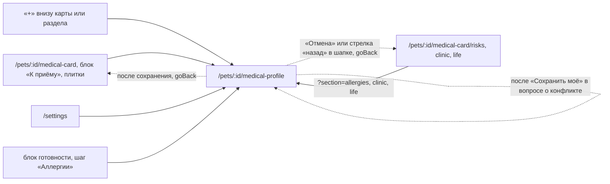

# Аудит пути: Данные для врача

Маршрут: `/pets/:id/medical-profile`, Файл: `frontend/src/pages/MedicalProfileForm.tsx`

## Кто это

Форма того, что врач спрашивает первым: аллергии и хронические состояния, группа крови и
номер чипа, чем кормят и где живёт питомец, клиники и врачи. Пишут сюда один раз, потом
эти данные видит любой, у кого есть доступ к питомцу, и врач в PDF.

- Роли: владелец и приглашённый с доступом к питомцу. Сервер правит профиль по
  `get_pet_and_validate(..., require_owner=False)` (`web/medical_card.py:476`, маршрут `:455`),
  аноним сюда не попадает: маршрут внутри `ProtectedRoute` (`App.tsx:338`)
- Глубина: экран поверх вкладки «Медкарта», вкладкой не считается
  (`utils/navigation.ts:7`), поэтому в шапке кнопка «назад» и нет переключателя питомца
  (`components/Navbar.tsx:60`, `:69`)
- Адрес может называть часть формы: `?section=allergies`, `?section=conditions`,
  `?section=clinic`, `?section=life`, `?section=id`
  (`pages/MedicalProfileForm.tsx:204`)

## Пользовательские истории

1. **.** Я впервые завожу медкарту, чтобы отметить, что аллергий нет, открываю форму из
   блока готовности и включаю переключатель. Критерий: сохранение и сообщение «Данные для
   врача сохранены. Заполнено 1 из 5» (`utils/medicalReadiness.ts:74`).
2. **.** Я иду с приёма, чтобы записать, что нашёл, жму «+ Аллергия» в листе «Что записать?».
   Критерий: форма открыта сразу на блоке аллергий, курсор в поле «Например, курица», готовая
   пустая строка (`pages/MedicalProfileForm.tsx:250`, `components/RecordSheet.tsx:40`).
3. **.** Я не хочу набирать «Сухой корм», жму подсказку под полем. Критерий: в поле
   «Например, сухой корм, два раза в день» появляется «Сухой корм»
   (`pages/MedicalProfileForm.tsx:510`).
4. **.** Пока я правил, другой человек сохранил профиль, чтобы не потерять его правку, я
   сохраняю. Критерий: вопрос «Профиль изменили» с двумя ответами
   (`pages/MedicalProfileForm.tsx:310`).
5. **.** Мой питомец наблюдается в трёх клиниках, чтобы это записать, я добавляю вторую и
   третью строки. Критерий: кнопка «+ Добавить клинику» есть до пяти клиник
   (`pages/MedicalProfileForm.tsx:544`, `:170`).
6. **.** Я заполнил форму и передумал, чтобы выйти без потери, жму «Отмена». Критерий: вопрос
   «Несохранённые изменения» (`hooks/useUnsavedChangesGuard.tsx:20`).

## Граф переходов

## Путь по шагам

| Шаг | Действие | Что видит | Чем может кончиться |
| --- | --- | --- | --- |
| 1 | Открывает форму | Заголовок «Данные для врача», имя питомца и строка «Это видят все, у кого есть доступ к питомцу Рекс, и врач в PDF» (`pages/MedicalProfileForm.tsx:359`, `:361`) | При `?section=` форма прокручивается к нужному блоку и ставит курсор в первое поле (`pages/MedicalProfileForm.tsx:246`) |
| 2 | Заполняет аллергии | Переключатель «Аллергий нет» с пояснением «Врач увидит «не выявлено», а не «не указаны»», за ним строки «На что» и «Как проявляется» (`pages/MedicalProfileForm.tsx:374`, `:403`) | Включённый переключатель очищает список при сохранении, без вопроса (`pages/MedicalProfileForm.tsx:276`) |
| 3 | Заполняет состояния | «Состояние или диагноз», «С какого года» с проверкой года, «Заметка» (`pages/MedicalProfileForm.tsx:440`, `:449`) | Год вне диапазона даёт ошибку «С 1950 по 2026» под полем (`pages/MedicalProfileForm.tsx:46`) |
| 4 | Заполняет чип и кровь | «Группа крови» и «Номер чипа или клейма», оба необязательные, у каждого счётчик символов (`pages/MedicalProfileForm.tsx:489`, `:498`) | Пустые значения уходят на сервер как `null` (`pages/MedicalProfileForm.tsx:267`) |
| 5 | Заполняет питание и условия | «Чем кормят», «Условия жизни», «Репродуктивный статус», у первых двух подсказки-чипы (`pages/MedicalProfileForm.tsx:510`, `:520`) | Чип дописывает свои слова к уже набранному, а не заменяет их (`pages/MedicalProfileForm.tsx:89`) |
| 6 | Заполняет клиники | Блок «Название», «Телефон», список врачей с «Специальность», кнопка «+ Добавить клинику» (`pages/MedicalProfileForm.tsx:126`, `:544`) | Пустые строки выбрасываются перед сохранением без ошибки (`pages/MedicalProfileForm.tsx:326`) |
| 7 | Жмёт «Сохранить» | Кнопка в состоянии ожидания, экран уходит сам (`pages/MedicalProfileForm.tsx:552`) | Успех: «Данные для врача сохранены. Заполнено X из 5», затем возврат (`utils/medicalReadiness.ts:74`) |
| 8 | Сохраняет после вопроса о конфликте | «Показать актуальный» или «Сохранить моё» (`pages/MedicalProfileForm.tsx:310`) | Первый показывает чужую версию и тост «Показали актуальный профиль. Внесите правки ещё раз», второй сохраняет поверх (`:318`) |

Отмена и возврат: «Отмена» и стрелка «назад» уходят через `goBack`, то есть назад по истории,
а при прямой ссылке на адрес медкарты (`utils/navigation.ts:46`, `pages/MedicalProfileForm.tsx:561`).
При несохранённом изменениях `useUnsavedChangesGuard` показывает вопрос поверх любого ухода,
включая уход через нижние вкладки (`pages/MedicalProfileForm.tsx:236`).
Ошибка сети: тост с текстом сервера, введённое остаётся на месте
(`pages/MedicalProfileForm.tsx:302`, `utils/toast.ts:43`).

## Состояния экрана

- Загрузка: `LoadingSpinner` (`pages/MedicalProfileForm.tsx:351`).
- Пусто: форма открывается с одной пустой строкой клиники и без строк аллергий и состояний
  (`pages/MedicalProfileForm.tsx:79`). При `?section=allergies` или `?section=conditions`
  пустая строка добавляется сама (`pages/MedicalProfileForm.tsx:252`).
- Ошибка загрузки: «Не удалось загрузить данные для врача» с «Повторить» и отдельным текстом
  про отсутствие связи (`pages/MedicalProfileForm.tsx:346`, `components/LoadError.tsx:39`).
  Ответа 403 и 404 здесь нет, в отличие от медкарты и её раздела
  (`pages/MedicalCard.tsx:875`, `pages/MedicalCardSection.tsx:235`).
- Конфликт правок: вопрос с двумя ответами, пока сервер отдаёт 409
  (`pages/MedicalProfileForm.tsx:297`, `web/medical_card.py:463`).
- Счётчик под полем: появляется у 80 процентов лимита, а не с начала набора
  (`components/FieldNote.tsx:31`).
- Офлайн: сообщение «Нет связи с интернетом. Когда связь появится, нажмите «Повторить»»
  (`components/LoadError.tsx:39`).
- Черновик на время сессии: если экран закрыли вкладкой или ушли далеко, значения
  восстанавливаются (`hooks/useSessionDraft.ts:20`, `pages/MedicalProfileForm.tsx:263`).

## Точки входа и выхода

Вход: плитки медкарты и её разделов через «Изменить» или «Указать»
(`pages/MedicalCardSection.tsx:43`, `:178`, `:193`), блок «К приёму» медицинских данных,
лист «Что записать?» с пунктами «Аллергия» и «Хроническое состояние»
(`components/RecordSheet.tsx:40`), шаг «Аллергии» в блоке готовности
(`utils/medicalReadiness.ts:28`), `/settings` (вкладка настроек ведёт на эту форму для
выбранного питомца, `pages/Settings.tsx:156`; без выбранного питомца приложение отвечает
«Сначала выберите питомца»).
Выход: только назад. Форма никуда не ведёт сама: ни ссылок на разделы, ни на записи.

## Правила и валидация

Схема на клиенте (`pages/MedicalProfileForm.tsx:28`), проверка идёт в режиме `onTouched`
(`pages/MedicalProfileForm.tsx:230`):

- название аллергена: обрезается, обязательное, до 100 символов, ошибка «Укажите, на что
  аллергия» (`pages/MedicalProfileForm.tsx:37`)
- состояние: обязательное, до 100 символов, ошибка «Укажите состояние или диагноз»
  (`pages/MedicalProfileForm.tsx:43`)
- год: четыре цифры или пусто, ошибки «Четыре цифры, например 2023» и «С 1950 по 2026»
  (`pages/MedicalProfileForm.tsx:46`)
- клиника: до пяти, имя до 100, телефон до 30, врач обязателен в своей строке
  (`pages/MedicalProfileForm.tsx:52`, `:60`, `:82`)

Что уходит на сервер (`pages/MedicalProfileForm.tsx:265`):

- включённый «Аллергий нет» отправляет пустой список аллергий, то есть написанные аллергены
  пропадают (`:276`)
- строка, в которой не заполнено ничего, до запроса не доходит: `pruneEmptyRows` убирает её
  сама (`:326`, `:539`)
- пустая клиника и пустой врач внутри клиники тоже не отправляются (`:287`)
- все значения обрезаются, пустые строки становятся `null` (`:266`)
- `base_version` уходит с запросом: сервер отвечает 409, если профиль меняли после того, как
  форма открылась (`pages/MedicalProfileForm.tsx:289`, `web/medical_card.py:463`)

Черновик на время сессии переживает уход со страницы, но не переживает перезагрузку
(`hooks/useSessionDraft.ts:47`).

## Доступность

- Подпись поля ошибки ставится через `FieldError` как `description`, а не `help`
  (`pages/MedicalProfileForm.tsx:403`, `components/FieldError.tsx:6`), ошибка связана с полем
  через `aria-invalid` и `aria-describedby` (`components/FieldError.tsx:26`)
- Подсказки-чипы это группа с подписью, у каждого чипа `aria-pressed`, а нажатие мышью не
  забирает фокус у поля (`components/ChoiceChips.tsx:8`, `:21`, `:24`)
- Кнопки удаления строк подписаны по месту: «Убрать аллергию 1», «Убрать клинику 1»
  (`pages/MedicalProfileForm.tsx:418`, `:176`)
- Кнопка сохранения липкая и всегда в доступе, потому что форма длинная
  (`pages/MedicalProfileForm.tsx:551`, `styles/globals.css:2204`)
- Кликабельные `Form.Item` здесь есть («Клиники» используют `Form.Item` без полей), поэтому
  правки `utils/antdA11y.ts` задействованы (`utils/antdA11y.ts:4`)

## Найденное

| Что | Где | Почему это важно | Тяжесть | Предложение |
| --- | --- | --- | --- | --- |
| Переключатель «Аллергий нет» молча выбрасывает уже вписанные аллергены при сохранении | `pages/MedicalProfileForm.tsx:276`, `:374` | Человек может набить три аллергена, потом включить переключатель, сохранить и увидеть, что в карте их нет. Отмены у этого нет: `release()` и уход сразу после успеха (`:293`) | важно | Перед сохранением спрашивать, или прятать список, когда переключатель включён |
| Ответа 403 и 404 на форме нет, в отличие от медкарты и её раздела | `pages/MedicalProfileForm.tsx:346` против `pages/MedicalCard.tsx:875` | Питомец удалён или доступ закрыт: человек видит «Не удалось загрузить данные для врача» и «Повторить», который повторяет ту же ошибку. На медкарте тот же случай объяснён словами «Возможно, его удалили или закрыли вам доступ» | важно | Повторить ветку 403 и 404 с пустым состоянием «Питомец не найден» |
| Форма не выбирает питомца из адреса | `pages/MedicalProfileForm.tsx:212` | Карта и её раздел адрес другого питомца делают выбранным (`pages/MedicalCard.tsx:843`, `pages/MedicalCardSection.tsx:216`). Форма этого не делает, поэтому переключатель в шапке и вкладка «Медкарта» продолжают показывать прежнего питомца, пока форма открыта по прямой ссылке | важно | Повторить effect из карты: адрес решает, чей это питомец |
| Кнопки, закрывающие форму, свёрстаны инлайном вместо `.form-actions` | `pages/MedicalProfileForm.tsx:559`, `styles/globals.css:2224` | В `globals.css` есть готовый класс для кнопок, закрывающих форму, с теми же отступами. Тот же приём в трёх формах медкарты | мелочь | Взять `.form-actions`, убрав ручные отступы |
| Пять клиник это молчаливый предел: кнопка «+ Добавить клинику» просто исчезает | `pages/MedicalProfileForm.tsx:544`, `:82` | Человек на седьмой клинике не понимает, куда делась кнопка и есть ли предел | мелочь | Писать счётчик «Ещё можно 2» или подпись под последней строкой |
| Каждое сохранение профиля отправляет пустой объект `clinic` из трёх `null` | `pages/MedicalProfileForm.tsx:286`, `web/schemas.py:844` | Поле оставлено на сервере для старых клиентов и не имеет формы в интерфейсе. Оно молча едет в каждом запросе и выглядит как забытая часть контракта | мелочь | Убрать из запроса, если сервер сделает поле необязательным |
| Счётчик символов появляется только у 80 процентов лимита, а у полей вроде «Репродуктивный статус» человек упирается в него без предупреждения | `components/FieldNote.tsx:6` | Поведение описано в коде как осознанное и одинаковое для всех форм. В аудит попадает как ограничение, а не дефект | мелочь | Оставить как есть |

## Вопросы к владельцу

- Если человек включил «Аллергий нет», а список аллергенов остаётся на экране, он понимает,
  что счётчик «0» в медкарте получился из выключателя? Может, список надо прятать сразу, при
  переключении.
- Нужен ли вопрос при сохранении, если в форме пустые строки выбрасываются? Сейчас это
  сделано молча, и это спасает от ошибок про «Укажите состояние», но человек не видит, что
  строка исчезла.
- Порядок клиник это часть данных для врача или просто порядок ввода? Сейчас он приходит с
  сервера и не помечен как важный.

## Связанные экраны

- [README](README.md), [_existing-audit.md](_existing-audit.md): истории A4-02, A4-20, A4-21
- [Медкарта](medical-card.md): откуда приходят «Изменить» и шаги блока готовности
- [Раздел медкарты](medical-card-section.md): «Аллергии и состояния», «Клиника», «Питание и условия»
- [Запись медкарты](medical-record-form.md): сюда же ведут «Аллергия» и «Хроническое состояние»
  из листа «Что записать?»
- [Медкарта по ссылке](shared-medical-card.md): что из этой формы видит врач без входа