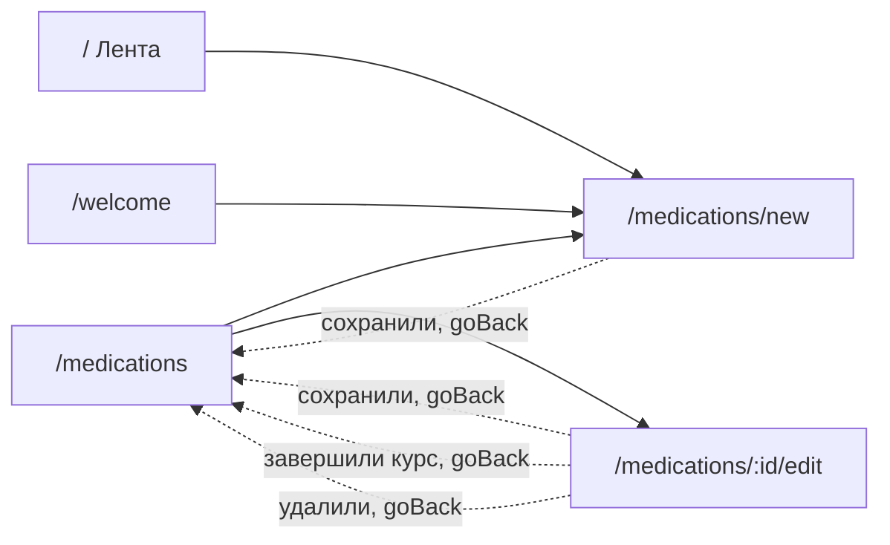

# Аудит пути: Форма лекарства

Маршрут: `/medications/new` и `/medications/:id/edit`, файл: `frontend/src/pages/MedicationForm.tsx`

## Кто это

Форма курса: название, форма выпуска, доза, расписание, остаток и границы курса. Здесь
заводят лекарство, которое потом видно на вкладке «Лекарства», и правят уже существующее.

- Роли: владелец и приглашённый с доступом к питомцу, все внутри `ProtectedRoute`
  (`App.tsx:427-444`). `/medications/new` обёрнут в `RequirePet what="Лекарства"`
  (`App.tsx:430-433`), `/medications/:id/edit` нет, но питомец там и так есть
- Глубина: экран поверх вкладки «Лекарства». В шапке есть кнопка «назад»
  (`components/Navbar.tsx:60`, `utils/navigation.ts:4`)

## Пользовательские истории

1. **Завести лекарство по названию.** Я владелец, чтобы не набирать форму с нуля, нажимаю
   «Название» и выбираю из списка. Критерий: каталог с группами, сверху «Ранее у питомца»,
   найденное для этого питомца, и Enter принимает единственное совпадение
   (`components/ProductPickerSheet.tsx:58-88`, `:110-114`)
2. **Выбрать форму и дозу.** Я владелец, чтобы дозировка была верной, выбираю форму из
   списка или пишу свою. Критерий: единица измерения и вид подставляются сами, при
   подозрении на «50 мг вместо 50 таблеток» появляется предупреждение
   (`pages/MedicationForm.tsx:446-468`, `:504-517`)
3. **Задать расписание.** Я владелец, выбираю дни недели чипами и время колесом. Критерий:
   время можно добавлять («+ Время») и убирать, дубли времени не пропускаются
   (`:606-691`, `:76-79`)
4. **Отметить «по необходимости».** Я владелец, чтобы не планировать приёмы заранее,
   переключаю «Как давать» на «По необходимости». Критерий: расписание скрыто и заменено
   объяснением, курс уходит без напоминаний (`:584-604`)
5. **Включить учёт остатка.** Я владелец, чтобы знать, на сколько хватит, включаю «Учёт
   остатков» и вписываю остаток. Критерий: под полем живёт подсчёт «Хватит примерно на
   N дней», предупреждение за сколько дней приходит из переключателя
   (`:213-220`, `:720-809`)
6. **Не потерять написанное.** Я владелец, ухожу со страницы с заполненной формой.
   Критерий: «Выйти без сохранения?», после обрыва сессии поля вернутся
   (`hooks/useUnsavedChangesGuard.tsx:40-52`, `hooks/useSessionDraft.ts:39-46`)

## Граф переходов

Возврат идёт через `goBack(navigate, '/medications')`
(`pages/MedicationForm.tsx:368`, `:314`, `:338`, `:953`), то есть на экран, который
открыл форму, если история в сессии есть (`utils/navigation.ts:46-52`).

## Путь по шагам

| Шаг | Действие | Что видит | Чем может кончиться |
| --- | --- | --- | --- |
| 1 | Открывает форму | «Новое лекарство», поля ниже: название, форма, «На упаковке» (`:391-393`, `:408`) | Заполнение |
| 2 | Выбирает название | Шторка «Лекарство» с поиском и группами; Enter берёт единственное совпадение или написанное (`:961-969`, `components/ProductPickerSheet.tsx:82-88`) | Название, форма, крепость и единица подставлены (`:285-291`) |
| 3 | Выбирает форму | Колесо со списком форм и «Другое»; при «Другом» появляется текстовое поле «Какая форма» (`:446-471`, `:441-444`) | Форма выбрана |
| 4 | Вписывает дозу | Поле с запятой, рядом выбор единицы из «таб/мл/кап/мг/шт/ед» (`:519-578`) | Доза готова |
| 5 | Задаёт расписание | «Как давать»: по расписанию или по необходимости; при расписании дни и время (`:584-718`) | Расписание готово |
| 6 | Включает остаток | Переключатель, «Остаток», «В упаковке», «Напомнить за N дней» (`:720-811`) | Учёт включён |
| 7 | «Создать» | Тост «Лекарство добавлено», возврат на список (`:362-369`) | Курс в списке |
| 8 | Ошибка валидации | Сообщения у полей, страница прокручена к первому (`:62-92`, `utils/formErrors.ts`) | Можно исправить и повторить |
| 9 | «Отмена» | Возврат на список, если форма грязная, сначала вопрос «Выйти без сохранения?» (`:910-917`) | Без изменений |

## Состояния экрана

| Состояние | Что показывает | Ссылка |
| --- | --- | --- |
| Загрузка при правке | Крутилка | `pages/MedicationForm.tsx:379` |
| Нет питомца | «Сначала добавьте питомца» | `App.tsx:430-433`, `components/RequirePet.tsx:10` |
| Название не выбрано | Подпись «Выберите или впишите» | `:421` |
| Своя форма | Дополнительное поле «Какая форма», обязательное | `:441-444` |
| По необходимости | Вместо расписания объяснение «Без расписания и напоминаний. Приём отмечается кнопкой «Дали сейчас» на карточке, когда лекарство дали» | `:600-603` |
| Остаток включён | Поля остатка и предупреждения, живой подсчёт дней | `:733-811`, `:213-220` |
| Доза похожа на крепость | Жёлтое предупреждение «... за раз? Если это миллиграммы с упаковки, впишите их выше...» | `:510-513` |
| Ошибка сети | Тост «Не удалось сохранить», форма остаётся с данными (`:370-372`) | Можно повторить |
| Форма восстановлена после сессии | Тост «Вернули то, что вы вводили до выхода» | `hooks/useSessionDraft.ts:45` |
| Курс завершён | Кнопка «Возобновить курс» вместо «Завершить курс» | `:918-943` |

## Точки входа и выхода

Вход: тап по карточке курса в списке (`pages/MedicationsList.tsx:439`), свайп вправо
«Изменить» (`pages/MedicationsList.tsx:427`), круглая «+»
(`pages/MedicationsList.tsx:670`), кнопка из пустого состояния
(`pages/MedicationsList.tsx:392-393`), первый курс из онбординга
(`docs/ux/README.md`, `Welcome --> MedForm`).

Выход: список лекарств через `goBack` во всех четырёх случаях: сохранение, завершение
курса, возобновление, удаление (`pages/MedicationForm.tsx:368`, `:314`, `:338`, `:953`).

## Правила и валидация

Схема (`pages/MedicationForm.tsx:36-92`): название обязательно, форма обязательна, доза
больше нуля, единица и крепость необязательны, расписание обязательно, кроме режима «по
необходимости», остаток обязателен, если учёт включён. Проверки, которые зависят от
нескольких полей, живут в `superRefine`: окончание не раньше начала (`:63-65`), нужен
хотя бы один день и одно время (`:70-75`), одно время не указано дважды (`:76-79`),
остаток не меньше нуля и упаковка больше нуля (`:86-91`).

Режим `onTouched`: ошибка поля появляется, как только человек ушёл с него, а при отправке
страница скроллится к первому ошибочному полю (`:158-165`, `utils/formErrors.ts`).

Суммы принимают и запятую, и точку, и остаются текстом, пока вводят
(`:34`, `utils/stock.ts:19-21`). Редактируемая загрузка: одно время на курс означает,
что в графике по нему одна отметка (`:68`).

Что сохраняется при уходе: все поля вернутся после обрыва сессии
(`:294-295`, `hooks/useSessionDraft.ts:39-46`). Пока форма грязная, уход спрашивает
«Выйти без сохранения?» (`hooks/useUnsavedChangesGuard.tsx:40-52`).

«По необходимости» на сервер уходит с пустым расписанием, а не с выбранным
(`:346-355`). При правке режим восстанавливается по пустому расписанию сохранённого
курса (`:238`).

Удаление курса спрашивает отдельно, с объяснением, что пропадёт и что можно вернуть
(`utils/medicationDelete.ts:6-7`, `:945-956`). Завершение курса идёт с полосой «Отменить»
(`:306-313`).

## Доступность

Ошибки полей подписаны через `FieldError`, который ставит `aria-invalid` и
`aria-describedby` (`components/FieldError.tsx:14-39`). Переключатели и выборы единицы
имеют `aria-label` (`:557`, `:727`). У полей времени в расписании есть подпись с номером
(`aria-label="Изменить время приёма ${index+1}"`, `:649`), у крестика удаления времени
своя (`aria-label="Удалить это время"`, `:676`). Поле ввода дозы объявлено как числовое
через `inputMode="decimal"` (`:526`). Форма с react-hook-form, Enter идёт по полям через
глобальный `installEnterKey` (`main.tsx:18`).

## Найденное

Решено:

- Правка курса ищет его в списке выбранного питомца, поэтому курс другого питомца отвечал
  «Такого лекарства нет, его удалили или он не открыт вашему питомцу». Теперь курс спрашивается
  по своему адресу, а его питомец становится выбранным (`pages/MedicationForm.tsx:224-244`), и
  форма не рисуется, пока это не произошло: иначе она показала бы чужое имя и сохранила курс
  под ним. Проверяет `e2e/check_medication_links.py`.

Осталось:

| Что | Где | Почему это важно | Тяжесть | Предложение |
| --- | --- | --- | --- | --- |
| Форму («Название») и расписание нельзя заполнить с клавиатуры в поле: это строки, открывающие шторку или колесо (`pages/MedicationForm.tsx:413-422`, `:631-669`). Ввод возможен только через поиск в шторке (`components/ProductPickerSheet.tsx:95`) | `pages/MedicationForm.tsx:413-422` | Продолжение A2-05. Название лекарства набирается не в поле формы, а в строке поиска всплывающего окна, и Enter там означает разное: в шторке это «взять название» (`components/ProductPickerSheet.tsx:82-88`), а на форме он не заполнен | важно | Оставить рядом со строкой кнопку вписать вручную, как это уже сделано для «Другое» (`:441-444`), либо объяснить подсказкой, что название вводится в поиске |
| Режим «по необходимости» при правке определяется пустым расписанием, а не отдельным признаком (`:238`), и при переключении обратно в расписание дни сбрасываются в пустые (`:593-596`) | `pages/MedicationForm.tsx:238`, `:593-596` | Человек переключил на «По необходимости» и обратно, чтобы поправить время, и потерял выбранные дни. Причина в схеме: у курса нет отдельного поля режима | важно | Хранить дни и время в форме при переключении режима, отправляя пустое расписание только для «по необходимости» |
| «Напомнить за» ограничен 60 днями (`pages/MedicationForm.tsx:54`), и про это сказано только в ошибке, которая появится после ввода | `pages/MedicationForm.tsx:54`, `:791-795` | Для курса, который надо закончить через полгода, поле просто не даст ввести. Причина ограничения в коде не объяснена | мелочь | Написать в подписи под полем, почему больше 60 нельзя, или снять ограничение |
| Порядок полей формы обходит логику дозы: сначала «Форма» и «На упаковке», потом «За один приём», а предупреждение про «50 мг вместо 50 таблеток» стоит под полем дозы (`:476-517`) | `pages/MedicationForm.tsx:476-517` | Порядок выбран верно, но подпись «Сколько вещества в одной таблетке или в 1 мл, как написано на коробке» (`:483`) стоит в необязательном поле и легко остаётся незамеченным, из-за чего человек пишет 50 туда, куда надо 0,5 | мелочь | Сделать подсказку про коробку заметнее или перенести её в подпись поля дозы рядом с предупреждением |
| Кнопка «Создать» и кнопка «Сохранить» на одном месте, но текст верхней кнопки один на два экрана (`:903-909`) | `pages/MedicationForm.tsx:903-909` | Заголовок различает режимы («Новое лекарство» и «Изменить лекарство», `:392`), а нижняя кнопка тоже различает, это сделано правильно. Замечание к тому, что «Создать» звучит холоднее «Добавить лекарство» на соседних экранах | мелочь | Оставить «Добавить» для симметрии с формой документа, где кнопка «Добавить» (`pages/DocumentForm.tsx:711`) |
| Проверка дозы против крепости срабатывает только для штучных единиц (`pages/MedicationForm.tsx:207`): для «мл» тот же ввод 50 мл пройдёт молча | `pages/MedicationForm.tsx:207` | Продолжение A2-08. Предупреждение есть, оно работает там, где ошибка вероятнее всего, но не во всех случаях | мелочь | Оставить как есть, но упомянуть в вопросах к владельцу, нужно ли расширять правило |

## Вопросы к владельцу

- Должно ли расписание сохраняться при переключении «по необходимости» и обратно, или
  сброс считается правильным.
- Нужно ли ограничение «напомнить за N дней» в 60, и если да, что человек должен увидеть
  при вводе, а не после.
- Достаточно ли для названия лекарства ввода в поиске шторки, или рядом нужна строка
  для ручного ввода, как у формы выпуска.
- Что показывать на форме правки, если лекарство удалили другим членом семьи.

## Связанные экраны

- [medications-list.md](medications-list.md): список, откуда форма открывается и куда возвращает
- [onboarding.md](onboarding.md): первый курс добавляется отсюда
- [dashboard.md](dashboard.md): лента, где виджет ближайшего приёма приводит в этот же раздел
- [medical-card.md](medical-card.md): курс виден и там, удаление убирает его из карты
- [form-defaults.md](form-defaults.md): значения по умолчанию для форм (`docs/ux/README.md`), файл ещё не написан
- [pet-form.md](pet-form.md): другой пример формы с тем же способом ухода и черновиком