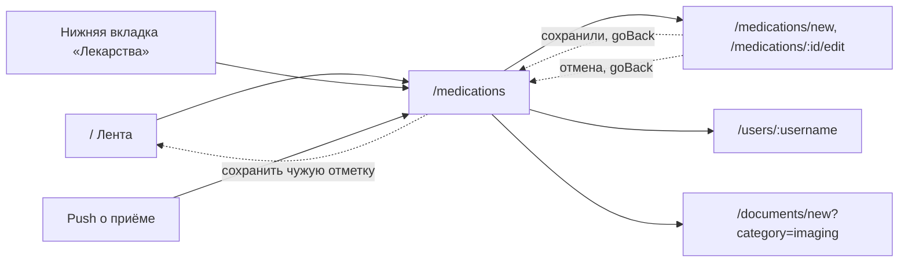

# Аудит пути: Лекарства

Маршрут: `/medications`, файл: `frontend/src/pages/MedicationsList.tsx`

## Кто это

Список курсов лекарства питомца с остатком и приёмами: что дали сегодня, что закончилось,
что пора дать. Человек приходит сюда либо отметить приём одним нажатием, либо разобраться
с остатком, либо завести новый курс.

- Роли: владелец и приглашённый с доступом к питомцу, все внутри `ProtectedRoute`
  (`App.tsx:419-426`). Гость по ссылке сюда не попадает: публичная карта это
  `/share/medical/:token` (`App.tsx:259`)
- Глубина: нижняя вкладка сама по себе. `MAIN_TAB_PATHS` содержит `/medications`
  (`utils/navigation.ts:4`), поэтому в шапке нет кнопки «назад» и есть переключатель
  питомца (`components/Navbar.tsx:60`)

## Пользовательские истории

1. **Отметить приём.** Я владелец, чтобы не забыть про лекарство, нажимаю «Дали сейчас»
   на карточке. Критерий: слот закрывается, карточка показывает прогресс дня, а внизу
   появляется полоса «Отменить» на 10 секунд (`utils/stock.ts:59`)
2. **Отметить приём задним числом или другой дозой.** Я владелец, чтобы внести то, что
   забыл вчера, открываю «Другое время или доза». Критерий: в шторке есть «Сейчас»,
   время слота, «15 минут назад», «Час назад», «Вчера вечером» и «Выбрать время»
   (`pages/MedicationsList.tsx:706-731`)
3. **Пополнить остаток.** Я владелец, чтобы внести купленную упаковку, нажимаю «Пополнить»
   на карточке. Критерий: диалог с полем и единицей измерения, после сохранения остаток
   пересчитан, показано «Остаток пополнен: N доз» (`pages/MedicationsList.tsx:587-595`,
   `:299-303`)
4. **Закончить или возобновить курс.** Я владелец, чтобы убрать курс из ежедневного списка,
   нажимаю «Завершить курс». Критерий: курс уходит в завершённые, полоса «Отменить» его
   возвращает (`pages/MedicationsList.tsx:641-654`, `:199-222`)
5. **Найти лекарство в длинном списке.** Я владелец, у которого больше шести курсов,
   ввожу название в «Найти лекарство». Критерий: остаются только совпавшие по названию
   (`pages/MedicationsList.tsx:411-413`, `:126-129`)
6. **Убрать ненужное.** Я владелец, чтобы удалить ошибочно заведённый курс, свайпаю строку
   вправо. Критерий: карточка уходит сразу, «Отменить» её возвращает, а по истечении
   паузы серверу уходит DELETE (`utils/deferredDelete.ts:63-91`)

## Граф переходов

Возврат с формы идёт через `goBack(navigate, '/medications')`
(`pages/MedicationForm.tsx:368`), то есть на тот экран, который её открыл, если
история в этой сессии есть (`utils/navigation.ts:46-52`).

## Путь по шагам

| Шаг | Действие | Что видит | Чем может кончиться |
| --- | --- | --- | --- |
| 1 | Открывает вкладку | Заголовок «Лекарства», ниже полоса «Не отправлено», если есть неотправленные отметки, и плашка про push (`pages/MedicationsList.tsx:409-410`) | Список курсов, или пустое состояние «Здесь будут лекарства питомца» (`:387-394`) |
| 2 | Находит нужный курс | Карточка: иконка формы, название, метка курса, «По N ед.», расписание, период курса, «От чего», прогресс дня, остаток и «Пополнить» (`:447-598`) | Решение: отметить приём |
| 3 | Нажимает «Дали сейчас» | Кнопка на 3 секунды гаснет, чтобы палец не попал дважды, шторки не будет (`:255-265`) | Полоса «Отметка отмечена» с «Отменить» (`:177-190`) |
| 4 | Сервер отвечает | Слот закрывается, список, лента, история и точка на вкладке обновляются (`utils/intakeViews.ts:9-17`) | Приём записан |
| 5 | Нужен другой момент | «Другое время или доза» открывает шторку с дозой и чипами времени (`:673-753`) | «Записать» или «Отмена» |
| 6 | Отмена | Шторка закрывается, запись не уходит | Ничего не изменилось |
| 7 | Ошибка сети | «Нет связи. Отметка сохранена на телефоне и отправится сама», полоса «Не отправлено» (`:168-171`) | Отметка уедет сама при появлении связи |

Отдельно про отмену и удаление: свайп вправо открывает «Изменить», свайп влево «Удалить»
(`:420-434`). По «Удалить» сначала диалог «Удаление лекарства» с объяснением, что
пропадёт и что можно вернуть (`:807-835`, `utils/medicationDelete.ts:6-7`).

## Состояния экрана

| Состояние | Что показывает | Ссылка |
| --- | --- | --- |
| Загрузка | Три скелета карточек | `pages/MedicationsList.tsx:379-384` |
| Пусто | «Здесь будут лекарства питомца», кнопка «Добавить лекарство» | `:387-394` |
| Ошибка сети при загрузке | «Не удалось загрузить лекарства» с повтором | `:385-386`, `components/LoadError.tsx` |
| Нет питомца | Пустое состояние про лекарства без объяснения, что нужен питомец: `RequirePet` этот маршрут не оборачивает (`App.tsx:419-426`), а `medications.length === 0` даёт то же состояние, что и пустой список | `:387-394` |
| Офлайн, есть неотправленные | Полоса «Не отправлено: <названия>. Отправим, когда появится связь» с кнопкой «Отправить» | `components/PendingIntakesNotice.tsx:28-31` |
| Нет напоминаний | Плашка про push, если есть хоть один курс по расписанию | `pages/MedicationsList.tsx:410` |
| Завершённые курсы | Свёрнуты под «Завершённые курсы: N» | `:659-663` |
| Длинный список | Поиск появляется от шести курсов | `:411-413` |

## Точки входа и выхода

Вход: нижняя вкладка «Лекарства» (`components/BottomTabBar.tsx:19`), переход из ленты,
кнопка «Добавить лекарство» из пустого состояния (`:392-393`), круглая «+»
(`:670`), адрес с параметром `?restock=<id>` из виджета ближайшего приёма в ленте
(`:313-326`).

Выход: форма лекарства, форма документа из раздела снимков, профиль другого человека
(`:524-546`), вкладки. Кнопки «назад» на этом экране нет, экран вкладка.

## Правила и валидация

Приём это слот, а не счётчик, и защита от двойной отметки сделана на сервере:
`duplicate_intake` приходит, если по этому курсу есть не пропущенный приём в
окне ±30 минут (`web/medications.py:448-474`, `web/dose_slots.py:24`). Лекарство
«по необходимости» и пропуск приёма этой проверке не подлежат
(`web/medications.py:448`). Клиент на 409 показывает вопрос с именем и временем чужой
отметки (`utils/duplicateIntake.ts`).

Доза в шторке проверяется на клиенте: пустое или неположительное значение даёт тост
«Укажите, сколько дали» (`pages/MedicationsList.tsx:269-273`). Время в «Когда дали»
не может быть в будущем (`components/IntakeTimePicker.tsx:33-36`), назад доступна
неделя (`utils/intakeWhen.ts:5`).

Офлайн: отметка не теряется, а кладётся в очередь и уходит сама
(`utils/offlineIntakes.ts:69-91`). Если сервер в ответ на очередь сказал 409, отметка
просто выбрасывается без сообщения (`utils/offlineIntakes.ts:80-82`).

## Доступность

Кнопки приёма идут с `aria-label`, который читает и состояние, и название
(`pages/MedicationsList.tsx:610`, `:620`, `:633`, `:648`). Свайп дублирован видимой
кнопкой «Изменить» на карточке файла, здесь карточка сама открывает форму
(`:436-439`). Диалоги, шторки и полоса «Отменить» сделаны через antd, поправки
`utils/antdA11y.ts` на них распространяются. Цель нажатия у свайпа и у полосы
не меньше 44px (`components/SwipeableRow.tsx`, `--touch-min`).

## Найденное

| Что | Где | Почему это важно | Тяжесть | Предложение |
| --- | --- | --- | --- | --- |
| Слот защищён окном времени, а не самим слотом: 409 срабатывает, если рядом есть приём в ±30 минут от указанного `date_time` (`web/medications.py:448-457`, `web/dose_slots.py:24`). Отметка «В 08:00» слотом не закрывает ничего сама по себе: слот закрывается из `slot_date`/`slot_time`, которые клиент шлёт вместе с отметкой (`web/medications.py:543-546`, `pages/MedicationsList.tsx:164`) | `web/medications.py:448`, `pages/MedicationsList.tsx:164` | Два человека отметят один слот без ошибки, если отметки разойдутся больше чем на полчаса: один нажал «Дали сейчас» в 08:02, второй выбрал «В 08:00» в 08:40, время 08:00 и 08:02 попали в окно и сработал 409, но если первый отметил «Сейчас» в 12:00 через «Другое время или доза», а второй выбрал «В 08:00» в 08:05, разрыв 4 часа и оба приёма записались. Приём при этом один, а в истории два | важно | Считать слот занятым, если на него уже есть отметка: искать по `slot_date`/`slot_time`, а не по близости `date_time`, и в этом случае спрашивать «Слот уже отмечен», а не «Приём уже отмечен» |
| Доза, отмеченная офлайн, не появляется на карточке до отправки: `onSuccess` при `queued` выходит раньше `refreshAfterIntake` (`pages/MedicationsList.tsx:167-172`), а очередь живёт в localStorage и на список не влияет (`utils/offlineIntakes.ts`) | `pages/MedicationsList.tsx:167-172` | Человек отметил приём, увидел «Отметка сохранена на телефоне», но карточка всё ещё предлагает «Дали сейчас». Повторное нажатие пройдёт (защита 3 секунды уже истекла, `:260`), и в очередь ляжет вторая отметка того же приёма | важно | Показывать на карточке пометку «не отправлено» применительно к этому курсу, а не только общей полосой сверху, и гасить кнопку на всё время ожидания отправки |
| Отметка из очереди, на которую сервер ответил 409, удаляется без единого сообщения (`utils/offlineIntakes.ts:80-82`) | `utils/offlineIntakes.ts:81` | Человек считал, что отметка есть, а её нет, и узнаёт об этом только потому, что цифра в ленте не совпала. Для чужой отметки это правильно, для своей нет | мелочь | Различать `existing.own` из ответа 409 и говорить «Этот приём отметили вы, когда связи не было», а не молчать |
| Нет питомца: маршрут не обёрнут в `RequirePet` (`App.tsx:419-426`), пустое состояние списка не отличает «нет питомца» от «нет лекарств» (`pages/MedicationsList.tsx:387-394`). Вкладка «Документы» на том же месте это различает (`pages/DocumentsList.tsx:279-281`) | `App.tsx:419-426`, `pages/MedicationsList.tsx:387-394` | Продолжение A1-05. Человек без питомца видит «Здесь будут лекарства питомца» и нажимает «Добавить лекарство», и только форма отвечает «Сначала добавьте питомца» (`components/RequirePet.tsx:10`). Лишний шаг и ощущение, что список сломан | мелочь | Обернуть `/medications` в `RequirePet what="Лекарства"`, как `/documents` |
| «Пополнить» с карточки открывает диалог, где сумма не проверяется на лету: поле принимает пустое значение, ошибка приходит тостом уже после нажатия «Добавить» (`pages/MedicationsList.tsx:327-336`, `:769-789`) | `pages/MedicationsList.tsx:329-333` | Продолжение A3-20. Диалог сам предлагает сумму упаковки (`:311`), так что чаще всего всё верно, но опечатка «0,» остаётся незамеченной до нажатия | мелочь | Показывать подпись под полем в том же диалоге, а не тостом после |
| Карточка курса не показывает, кто отметил приём сегодня: имя автора курса есть (`pages/MedicationsList.tsx:524-546`), имени отметившего нет | `pages/MedicationsList.tsx:508-518` | Продолжение A3-16. В доме с двумя людьми по карточке нельзя понять, кто уже дал дозу, и приходится открывать ленту | мелочь | Добавить в строку «Сегодня давали» имя последнего отметившего, когда оно не совпадает с текущим |
| Время в карточке выводится через `toLocaleTimeString('ru-RU')` без указания часового пояса, рядом с локальным временем устройства (`pages/MedicationsList.tsx:347`), хотя сервер отдаёт время с `tz` приёма (`pages/MedicationsList.tsx:516`, `web/medications.py:539-540`) | `pages/MedicationsList.tsx:347`, `:516` | Продолжение A3-30. У члена семьи в другом часовом поясе «Последний приём» может читаться как время его машины, а не время приёма | мелочь | Форматировать через `toDeviceClock` так же, как уже сделано в той же строке для даты приёма |

## Вопросы к владельцу

- Считать ли отметку «В 08:00», сделанную в 12:00, закрытием слота 08:00 и запрещать ли
  вторую отметку того же слота принципиально, даже когда между ними прошли часы. Это
  продуктовое решение, в коде ответа нет.
- Что должен видеть человек, который только что отметил приём офлайн: серую пометку
  «не отправлено» на самой карточке или только полосу сверху, как сейчас.
- Показывать ли имя человека, отметившего приём, в самой карточке курса или оставить
  это только ленте и истории.
- Уместно ли «Завершить курс» прямо на карточке в списке, где рядом «Дали сейчас» и
  «Пополнить»: кнопок на карточке много, и три из них меняют состояние курса.

## Связанные экраны

- [medication-form.md](medication-form.md): форма курса, куда ведут тап по карточке, свайп и «+»
- [dashboard.md](dashboard.md): лента, где доза отмечена и откуда приходит `?restock`
- [documents-list.md](documents-list.md): соседняя вкладка, на тот же питомец
- [onboarding.md](onboarding.md): первый курс добавляется отсюда
- [medical-card.md](medical-card.md): удаление курса убирает его и оттуда
- [user-profile.md](user-profile.md): тап по «Добавил(а)»
- [pets.md](pets.md): питомец, без которого экран пуст