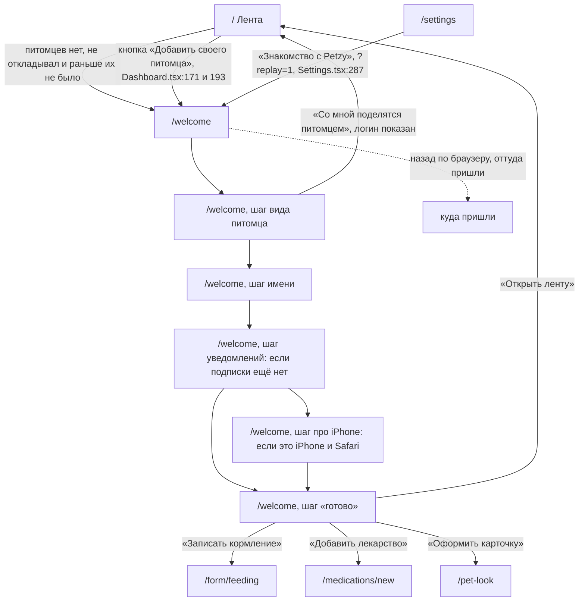

# Аудит пути: Первый запуск

Маршрут: `/welcome`, файл: `frontend/src/pages/Onboarding.tsx`

## Кто это

Первый экран, который видит человек после входа, и единственный экран, который занимает
весь экран: и шапка, и нижние вкладки на `/welcome` скрыты (`Navbar.tsx:32,55`,
`BottomTabBar.tsx:34`). Здесь приложение рассказывает, что оно делает, и заканчивается
созданием первого питомца.

- Роли: только вошедший (`ProtectedRoute`, `App.tsx:266-269`). Аноним сюда не попадает,
  его отправляет `/login`.
- Глубина: экран, который владеет экраном целиком. Он не часть вкладки и не поверх неё.

Два потока на одном маршруте (`Onboarding.tsx:69`):

- новый человек, у которого нет питомцев: пять вводных слайдов, затем вид, имя,
  при необходимости уведомления, затем «готово»;
- человек, у которого питомцы уже есть, и повторный запуск из настроек: только пять
  вводных слайдов, без создания питомца.

## Пользовательские истории

1. **.** Я новый человек, чтобы понять, что мне здесь нужно, пройти пять вводных
   слайдов и добавить первого питомца. Критерий: питомец создан, его имя и фото видны
   на последнем шаге («Рекс теперь в Petzy»).
2. **.** Я новый человек, чтобы сразу записать первое кормление, нажать «Записать
   кормление» на последнем шаге. Критерий: открылась форма кормления уже для этого
   питомца (`Onboarding.tsx:505-508`).
3. **.** Я новый человек, чтобы не добавлять питомца сейчас, потому что им со мной
   поделятся, нажать «Со мной поделятся питомцем» на шаге вида питомца. Критерий: показан
   мой логин, вкладка закрыта, лента больше не отправляет в `/welcome`
   (`Onboarding.tsx:240-255`, `Dashboard.tsx:179`).
4. **.** Я человек с питомцами, чтобы пересмотреть, как устроено приложение, открыть
   «Знакомство с Petzy» в настройках. Критерий: пять слайдов и кнопка «Закрыть», которая
   возвращает в настройки (`Settings.tsx:284-288`, `Onboarding.tsx:154-158`).
5. **.** Я новый человек, чтобы включить напоминания сразу, нажать «Включить» на шаге
   уведомлений. Критерий: подписка создана, показан тост «Уведомления включены»
   (`Onboarding.tsx:227-238`).
6. **.** Я на iPhone, чтобы понять, почему нет напоминаний, прочитать шаг про экран
   «Домой». Критерий: показаны три шага добавления приложения на домашний экран
   (`Onboarding.tsx:473-487`).

## Граф переходов

Пунктиром возврат системной кнопкой «назад». Из шага вида питомца она уводит на ленту, а
лента без питомцев снова открывает `/welcome` (`Dashboard.tsx:179`), то есть человек
возвращается на тот же экран. Своей кнопки «назад» у экрана нет, когда `canGoBack` ложно
(`Onboarding.tsx:163,547-553`).

## Путь по шагам

Шаги и их тексты (`Onboarding.tsx:96-104`): `welcome`, `diary`, `care`, `family`, `look`,
`species`, `name`, `notify` или `install`, `done`. Шаг уведомлений попадает в список только
если подписки ещё нет, шаг про iPhone только если это iPhone с Safari (`Onboarding.tsx:82-94`).

| Шаг | Действие | Что видит | Чем может кончиться |
| --- | --- | --- | --- |
| 1 | Открыл `/welcome` из ленты | «Забота о питомце в одном месте», кнопка «Начать», полоска прогресса, «Пропустить» | Дальше, или «Пропустить» перепрыгивает сразу на шаг вида питомца (`Onboarding.tsx:149-152`) |
| 2 | «Дальше» | «Вся жизнь питомца в одной ленте» | Шаг `care` |
| 3 | «Дальше» | «Напомнит о лекарствах и прививках» | Шаг `family` |
| 4 | «Дальше» | «Медкарта для врача и семья рядом» | Шаг `look` |
| 5 | «Добавить питомца» | «Сделайте карточку по-своему» | Шаг вида питомца |
| 6 | Выбрал вид, или «Другой вид» | «Кто живёт у вас?», плитки видов, «Добавить день рождения» доступно позже | Через 260 мс шаг имени (`Onboarding.tsx:190`) |
| 7 | Ввёл имя, нажал «Добавить питомца» | «Рекс теперь в Petzy», кнопки «Записать кормление», «Добавить лекарство», «Оформить карточку», «Открыть ленту» | Любая из четырёх кнопок, см. граф |
| 7а | Шаг уведомлений, если он есть | «Включить уведомления?» и «Не сейчас» | Дальше; «Не теперь» отвечает «Не сейчас» |
| 7б | Шаг про iPhone, если он есть | «Напоминания на iPhone», три шага, «Понятно» | Шаг «готово» |

Отмена и возврат:

- «Пропустить» на вводных слайдах не выходит из экрана, а переходит на шаг вида питомца
  (`Onboarding.tsx:149-152`). Выйти можно только кнопкой «Со мной поделятся питомцем» на
  шаге вида.
- «Со мной поделятся питомцем» открывает диалог «С вами поделятся питомцем?» с текстом
  «Попросите владельца открыть питомца и выбрать «Поделиться доступом»» и логином
  человека. «Понятно» закрывает экран, «Добавлю своего» возвращает на шаг вида
  (`Onboarding.tsx:240-255`).
- Кнопка «Назад» есть на всех шагах, кроме первого, кроме «готово» и, после создания
  питомца, шага уведомлений (`Onboarding.tsx:163`).
- Свайп влево и вправо листает только вводные слайды (`Onboarding.tsx:165-175`).

Ошибка сети и отказ:

- создание питомца: тост с текстом сервера, иначе «Не удалось добавить питомца»
  (`Onboarding.tsx:221`);
- включение уведомлений: тост «Не удалось включить уведомления», человек остаётся на шаге
  и может повторить или нажать «Не сейчас» (`Onboarding.tsx:233-237`);
- не удалось открыть снимок: «Не удалось открыть фото. Попробуйте другой снимок», шаг
  имени остаётся (`Onboarding.tsx:199`);
- уведомления недоступны: подписка не создаётся, шаг уведомлений пропускается
  (`Onboarding.tsx:88-94`).

## Состояния экрана

| Состояние | Покрыто | Где в коде |
| --- | --- | --- |
| Загрузка | Да, до того как известен список питомцев: `LoadingSpinner` | `Onboarding.tsx:66-68` |
| Список питомцев не загрузился | Нет, `isError` не проверяется, шаги показываются как есть | `Onboarding.tsx:66` |
| Пусто | Неприменимо, экран сам создаёт питомца | |
| Ошибка создания | Да, тост с текстом сервера | `Onboarding.tsx:220-222` |
| Нет питомца | Это и есть основной случай | `Onboarding.tsx:161-163` |
| Нет доступа | Неприменимо, доступ есть у вошедшего | `App.tsx:266-269` |
| Офлайн | Нет: без сети экран выглядит рабочим, провал виден только после нажатия | |
| Длинные тексты | Да, у имени `maxLength={100}`, заголовок и подпись переносятся | `Onboarding.tsx:404` |
| Пустое имя | Кнопка «Добавить питомца» неактивна, Enter ничего не делает | `Onboarding.tsx:204,435` |

## Точки входа и выхода

Вход (`App.tsx:265-270`):

- лента без питомцев: `Dashboard.tsx:179` перенаправляет на `/welcome` с заменой истории;
- лента, кнопка «Добавить своего питомца» (`Dashboard.tsx:171`) и пустое состояние ленты
  «Добавить своего» (`Dashboard.tsx:192-193`);
- настройки, строка «Знакомство с Petzy» с `?replay=1` (`Settings.tsx:284-288`).

Выход (`Onboarding.tsx:505-533`):

- «Записать кормление» в `/form/feeding`, «Добавить лекарство» в `/medications/new`,
  «Оформить карточку» в `/pet-look`, «Открыть ленту» в `/`, все с `replace` для `/`;
- «Со мной поделятся питомцем» в `/`;
- повторный запуск из настроек: `navigate(-1)`, а если истории нет, то в `/`
  (`Onboarding.tsx:154-158`);
- правило `goBack` из `utils/navigation.ts` здесь не используется: экран не форма, у него
  нет верхней кнопки «назад».

## Правила и валидация

- Имя: обязательное, до 100 символов, обрезается пробелами (`trim()` в
  `Onboarding.tsx:203`, `maxLength` в `Onboarding.tsx:404`).
- Вид питомца: одна из плиток `TILE_SPECIES` или «Другой вид» со списком
  (`species.ts:258-259`). Отправляется ключ вида (`Onboarding.tsx:209`).
- Дата рождения: необязательна, пинкер ограничен от 1 января года минус 30 и сегодняшним
  днём (`Onboarding.tsx:423-424`). Значение уходит в `birth_date` (`Onboarding.tsx:210`).
- Фото: `accept="image/*"`, HEIC сначала делается пригодным для отрисовки через
  `drawableImage`, потом открывается обрезка на квадрат (`Onboarding.tsx:197-199`,
  `PhotoCropModal.tsx`).
- На сервер уходит `POST /api/pets` с `tiles_settings` вида по умолчанию: у рыбки сразу
  есть «Вода», у кошки «Лоток» (`Onboarding.tsx:213`, `species.ts:248-255`).
- Многострочных правил для имени нет: переносы строк внутри не отбрасываются на клиенте,
  но имя приходит в `FormData` текстом (`pets.service.ts:118-134`) и на сервере обрезается
  по краям (`web/pets.py:366-367`).
- Черновик ввода не сохраняется: `useSessionDraft` на этом экране не используется, шаг
  помнится только в `sessionStorage` и только для вводных слайдов
  (`Onboarding.tsx:106-123`).

## Доступность

- Заголовок экрана это `h1` на каждом шаге, у слайдов он один и меняется (`Onboarding.tsx:586`).
- Полоска прогресса: `role="progressbar"`, имя «Знакомство с Petzy», значение
  «Шаг 3 из 7» (`Onboarding.tsx:554-561`).
- Кнопка «Назад» имеет имя «Назад» (`Onboarding.tsx:548`).
- Сетка видов это группа с именем «Вид питомца» (`Onboarding.tsx:317`).
- Аватар это настоящая кнопка с именем «Добавить фото» или «Сменить фото», а скрытый
  `input` файла ею вызывается (`Onboarding.tsx:382-393,432`).
- Поле имени помечено `enterKeyHint="done"` и само обрабатывает Enter, поэтому
  `utils/enterKey.ts` его не перехватывает (`Onboarding.tsx:406-407`, `enterKey.ts:69-71`).
- Кнопки «Пропустить» и «Закрыть» в шапке мелкие, но у них есть класс `touch-target`
  (`Onboarding.tsx:574`).
- Чего не хватает: у полосы прогресса нет текстового названия текущего шага для
  скринридера, значение «Шаг 3 из 7» не говорит, какой это шаг; у счётчика шагов нет
  `aria-live`.

## Найденное

| Что | Где | Почему это важно | Тяжесть | Предложение |
| --- | --- | --- | --- | --- |
| После создания питомца на iPhone кнопка «Назад» со шага про iPhone возвращает на шаг имени, где «Добавить питомца» создаст второго питомца | `Onboarding.tsx:163`, `Onboarding.tsx:435`, `Onboarding.tsx:473-487` | Условие `!(createdPet && step === 'notify')` закрывает только шаг уведомлений, хотя комментарий на `Onboarding.tsx:161-162` говорит про оба шага после создания. Человек получит второго питомца вместо того, чтобы вернуться к записи | важно | Закрывать «Назад» на всех шагах после создания питомца, а не только на шаге уведомлений |
| До создания питомца из `/welcome` не выйти: шапка и вкладки скрыты, «Пропустить» ведёт на шаг вида питомца | `Navbar.tsx:32,55`, `BottomTabBar.tsx:34`, `Onboarding.tsx:149-152,574-576` | Человек, который хочет сначала посмотреть приложение, не может попасть в настройки или список питомцев. Единственный выход, «Со мной поделятся питомцем», звучит не как выход | важно | Либо крестик в углу на шаге вида питомца, либо «Пропустить» в `/` с отметкой в `utils/onboarding.ts` |
| Возврат назад из `/welcome` на ленту, у которой нет питомцев, снова открывает `/welcome` | `Dashboard.tsx:179`, `Onboarding.tsx:61-63` | Системная кнопка «назад» выглядит как тупик: человек возвращается на тот же экран | мелочь | Проверить в браузере, что это так, и решить, должен ли «назад» из первого запуска выходить из приложения |
| Шаг помнится только для вводных слайдов, перезагрузка на шаге имени теряет имя и фото | `Onboarding.tsx:106-123` | `sessionStorage` пишет только при `index < INTRO_STEPS.length`, а введённое имя и выбранный снимок живут только в состоянии экрана | мелочь | Либо `useSessionDraft`, либо явная подсказка, что введённое не сохранится |
| Два разных выбора даты рождения с разными границами | `Onboarding.tsx:419-431` (от 30 лет назад, максимум сегодня) и `PetForm.tsx:215-219,633-635` (51 год, будущая дата тихо заменяется на сегодня) | Один и тот же вопрос на двух экранах ведёт себя по-разному, и в форме при неверной дате ещё и появляется тост | важно | Оставить один компонент выбора даты с одной границей |
| Enter в поле имени при пустом поле ничего не делает и ни о чём не говорит | `Onboarding.tsx:204,407,435` | Кнопка неактивна, но Enter выглядит как действие | мелочь | Показывать «Введите имя питомца», как в форме питомца |
| Воронки первого запуска нет в аналитике | `utils/observability.ts:43-76` | Есть только ошибки и трассировки Sentry, поэтому доля брошенных на шаге вида питомца не видна | мелочь | Решить, нужны ли события воронки, и не собирать персональные данные |

## Вопросы к владельцу

- Пять вводных слайдов перед первым питомцем: это осознанно? Человек без питомца видит
  приложение целиком в рассказе о нём.
- Нужен ли выход из `/welcome` без создания питомца, и если да, то куда: в настройки, в
  ленту или закрыть приложение.
- Пять слайдов можно листать свайпом, но это нигде не сказано на экране.
- На шаге вида питомца есть «Добавить день рождения» только на следующем шаге: стоит ли
  спросить дату сразу, раз человек уже выбирает вид.
- Стоит ли спрашивать про уведомления до первого питомца или после, как сейчас.

## Связанные экраны

- [dashboard.md](dashboard.md), лента, откуда приходит первый запуск и куда уходит
- [pets.md](pets.md), список питомцев, который откроется после первого питомца
- [pet-form.md](pet-form.md), форма питомца, полная версия того же создания
- [pet-look-settings.md](pet-look-settings.md), оформление, кнопка «Оформить карточку»
- [medication-form.md](medication-form.md), форма лекарства, кнопка «Добавить лекарство»
- [health-record-form.md](health-record-form.md), запись, кнопка «Записать кормление»
- [settings.md](settings.md), откуда открывается повторный просмотр