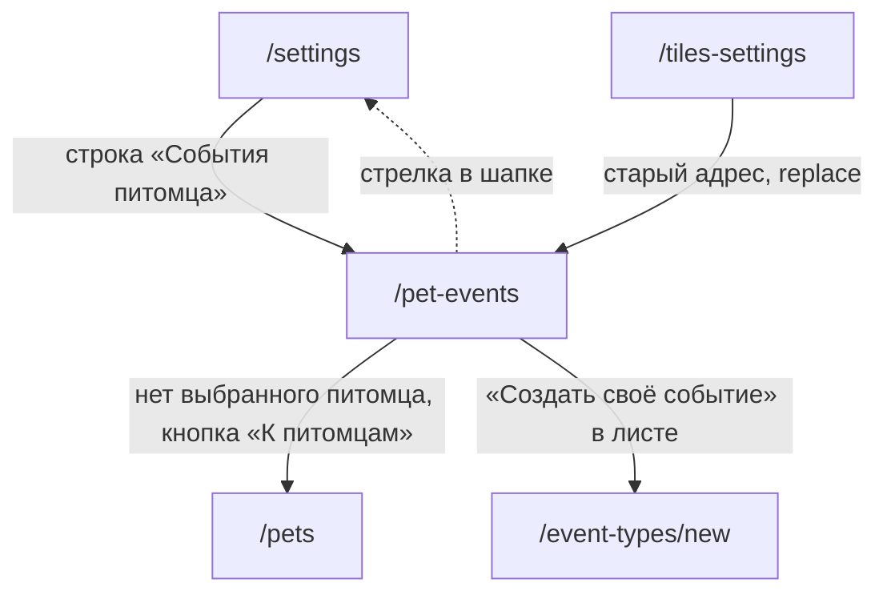

# Аудит пути: События питомца

Маршрут: `/pet-events`, файл: `frontend/src/pages/PetEvents.tsx`

## Кто это

Настройка того, какие события стоят в круглой кнопке «+» и в каком порядке. Отдельный
питомец, отдельный набор: полем на форме питомца это не настроить.

- Роли: владелец настраивает, приглашённый смотрит и не может изменить
  (`PetEvents.tsx:89,154-158`). На сервере настройка доступна владельцу
  (`web/pets.py:320`, та же проверка, что и у правки карточки).
- Глубина: ветка настроек. Открывается из строки настроек, подсвечивается вкладка
  «Настройки» (`BottomTabBar.tsx:15`). Старый адрес `/tiles-settings` открывает этот же
  экран с заменой истории (`App.tsx:536`).

## Пользовательские истории

1. **.** Я владелец, чтобы убрать лишнее из окна «+», нажать крестик у строки. Критерий:
   строка исчезает, счётчик «В окне «+»» уменьшается, изменения сохранены сразу
   (`PetEvents.tsx:160-162,171`).
2. **.** Я владелец, чтобы вернуть удалённое, нажать «Добавить событие» и выбрать тип из
   листа. Критерий: тост «Добавлено: кормление», строка вернулась в конец списка
   (`PetEvents.tsx:122-125,179-187`).
3. **.** Я владелец, чтобы поменять порядок, потянуть строку за ручку. Критерий: строка
   встала на новое место, порядок сохранён без кнопки
   (`PetEvents.tsx:114-120,55-63`).
4. **.** Я владелец, чтобы вернуть набор нового питомца, нажать «Вернуть набор для кота».
   Критерий: вопрос «Вернуть набор событий для кота? Порядок и состав станут такими,
   какими были у нового питомца», после «Вернуть» список становится стартовым
   (`PetEvents.tsx:129-136,189-196`).
5. **.** Я владелец, чтобы найти нужное среди десятков типов, открыть «Добавить событие» и
   ввести название в поиск. Критерий: список сгруппирован, первая группа «Подойдёт для
   кота» (`PetEvents.tsx:202-209`, `components/EventCatalogSheet.tsx:55-64`).
6. **.** Я приглашённый, чтобы понять, почему не могу поменять набор, открыть экран.
   Критерий: надпись «События меняет владелец питомца», список приглушён и не нажимается
   (`PetEvents.tsx:154-159`).

## Граф переходов

Пунктиром возврат: маршрут не вкладка, поэтому в шапке есть стрелка назад
(`utils/navigation.ts:4,15-17`).

## Путь по шагам

| Шаг | Действие | Что видит | Чем может кончиться |
| --- | --- | --- | --- |
| 1 | Открыл `/pet-events` | Заголовок «События питомца», под ним «Питомец: Рекс. Что предлагается в окне «+» и в каком порядке. Потяните за ручку, чтобы поменять порядок. Изменения сохраняются сразу» | Список или пустое состояние |
| 2 | Список пришёл | «В окне «+»: 5», строки с ручкой слева и крестиком справа, кнопка «Добавить событие», внизу «Вернуть набор для кота» | Любое из трёх действий |
| 3 | Нажал крестик у строки | Строка исчезла без вопроса и без сообщения, счётчик уменьшился | `PetEvents.tsx:127` |
| 4 | Нажал «Добавить событие» | Лист «Добавить событие»: поиск «Найти событие», группы «Подойдёт для кота», «Питание и вода», «Туалет» и другие, внизу «Создать своё событие» | Тип добавлен, лист остаётся открытым, или «Создать своё событие» в `/event-types/new` |
| 5 | Потянул строку за ручку | Строка едет за пальцем, порядок в списке меняется, отпустил, порядок сохранён | `PetEvents.tsx:114-120` |
| 6 | Нажал «Вернуть набор для кота» | Вопрос с двумя кнопками «Вернуть» и «Оставить» | После «Вернуть» список стартовый для вида |
| 7 | Открыл экран, не выбрав питомца | «Сначала выберите питомца» и кнопка «К питомцам» | `PetEvents.tsx:150-151` |

Отмена и возврат:

- у «Вернуть набор» есть «Оставить», у листа выбора есть закрытие по маске
  (`EventCatalogSheet.tsx:67`);
- у удаления строки и у перетаскивания отмены нет: оба действия уходят на сервер сразу,
  вернуть можно только через «Добавить событие» или «Вернуть набор»;
- вопроса перед уходом с экрана нет: `useUnsavedChangesGuard` не используется, потому что
  сохраняется всё сразу (`PetEvents.tsx`, сохранение в `usePetTilesSettings.ts:27-46`).

Ошибки:

- сервер отказал: список возвращается к тому, что на сервере, и показывается тост с
  текстом сервера, иначе «Не удалось сохранить плитки»
  (`usePetTilesSettings.ts:41-45`);
- набор событий не пришёл: `usePetTilesSettings` берёт настройки из списка питомцев, при
  отсутствии показывает пустой набор по умолчанию, то есть все типы из реестра
  (`usePetTilesSettings.ts:20-25`, `utils/tilesConfig.ts:50-53`).

## Состояния экрана

| Состояние | Покрыто | Где в коде |
| --- | --- | --- |
| Нет выбранного питомца | Да, «Сначала выберите питомца» | `PetEvents.tsx:150-151` |
| Пустой набор | Да, «Пока ничего. Добавьте события, которые вы записываете чаще всего» | `PetEvents.tsx:164-165` |
| Приглашённый | Да, подпись и `inert` | `PetEvents.tsx:154-159` |
| В листе ничего не нашлось | Да, «Ничего не найдено. Можно создать своё событие» | `EventCatalogSheet.tsx:99-103` |
| В листе всё уже добавлено | Да, «Всё, что есть, уже в окне «+». Можно создать своё событие» | `EventCatalogSheet.tsx:101` |
| Загрузка | Нет, у экрана нет ни крутилки, ни скелетона | |
| Ошибка загрузки типов | Нет | |
| Офлайн | Нет, изменения выглядят применёнными, пока сервер не ответит | |
| Длинные названия событий | Да, переносы в строках | `PetEvents.tsx:68` |

## Точки входа и выхода

Вход:

- настройки, строка «События питомца»;
- старый адрес `/tiles-settings`, он открывает этот экран с заменой истории
  (`App.tsx:536`);
- из формы питомца в тексте раздела о доступе упомянуто «плитки», это тот же набор
  (`PetForm.tsx:766`).

Выход:

- кнопка «К питомцам» в `/pets`;
- «Создать своё событие» в `/event-types/new` (`EventCatalogSheet.tsx:153-163`);
- стрелка в шапке возвращает в то, откуда пришли, `/pets` не в списке вкладок, поэтому
  `/pet-events` показывает её (`utils/navigation.ts:4,15-17`).

## Правила и валидация

- Настройки хранятся у питомца, а не у человека: `PUT /api/pets/:id` с полем
  `tiles_settings` (`usePetTilesSettings.ts:32`, `services/pets.service.ts`).
- `order` хранит только показанные типы, скрытые и лекарства дописываются в конец при
  открытии экрана (`PetEvents.tsx:111-112`).
- `visible` это словарь «тип или нет»; отсутствие ключа значит «показано» для первых
  восьми типов, своих событий и лекарств (`utils/tilesConfig.ts:50-66`).
- Оптимистичное сохранение: список меняется сразу, сервер подтверждает потом, при отказе
  список возвращается и говорит почему (`usePetTilesSettings.ts:34-45`).
- Набор нового питомца считается по виду: у кошки пять типов, у рыбки четыре, и среди них
  нет «Лотка» (`utils/species.ts:43-60`).
- Валидации на этом экране нет: набор произвольный, можно убрать все и оставить пустым.

## Доступность

- Заголовок экрана это `h1` «События питомца» (`PetEvents.tsx:142`).
- Ручка перетаскивания это кнопка с именем «Переместить: Кормление», работает и с
  клавиатуры через `KeyboardSensor` (`PetEvents.tsx:55-63,92-95`).
- Крестик назван «Убрать из окна «+»: Кормление» и имеет размер `--touch-min`
  (`PetEvents.tsx:69-77`).
- Строка приглашённого помечена `inert`, ни крестик, ни ручка не берут фокус
  (`PetEvents.tsx:159`).
- Подпись приглашённого помечена `role="note"` (`PetEvents.tsx:155`).
- Лист выбора: поле поиска со скрытой подписью «Найти событие», группы это `section` с
  `aria-label`, кнопки с именами «Добавить: Кормление»
  (`EventCatalogSheet.tsx:73-74,106,117`).
- Чего не хватает: после перетаскивания и после удаления нет объявления для скринридера,
  нет `aria-live` на счётчике «В окне «+»: 5», и порядок не объявляется, только имя кнопки
  «Переместить».

## Найденное

| Что | Где | Почему это важно | Тяжесть | Предложение |
| --- | --- | --- | --- | --- |
| Убрать строку можно одним касанием, вернуть можно только через «Добавить событие» | `PetEvents.tsx:127,171` | Добавление показывает тост «Добавлено: кормление», удаление не показывает ничего и не спрашивает, а отмены нет. Ряд пропадает и счётчик меняется молча | важно | Сделать как у добавления: сообщение и полоса с «Отменить» |
| Экран называется «События питомца», а ошибка сохранения говорит «Не удалось сохранить плитки» | `usePetTilesSettings.ts:44`, `PetEvents.tsx:142` | Человек видит слово, которого на экране нет | важно | Заменить на «Не удалось сохранить события» |
| «Вернуть набор» возвращает скрытые свои события в окно «+» | `PetEvents.tsx:129-136`, `utils/species.ts:248-255`, `utils/tilesConfig.ts:62-66` | Новый набор содержит только встроенные типы, ключ `visible` для своего типа в нём отсутствует, а отсутствие ключа значит «показано» | важно | Сохранять скрытое состояние своих типов при возврате набора |
| Выбранного питомца не сменить прямо на экране | `PetEvents.tsx:143-147`, `Navbar.tsx:60,69` | Переключатель питомцев в шапке есть только на вкладках, а экран не вкладка. Если питомцев несколько, человек увидит «Питомец: Рекс» и поедет оформлять чужого питомца | важно | Либо показывать переключатель, либо дать смену питомца на самом экране |
| Свои события и лекарства после перетаскивания уезжают в конец | `PetEvents.tsx:111-112` | В `order` пишутся только показанные типы, остальные дописываются после, поэтому следующая сортировка их не сдвигает | мелочь | Проверить, заметно ли это, и оставить или хранить полный порядок |
| У экрана нет ни загрузки, ни ошибки загрузки | `PetEvents.tsx:138-199` | Пока типы событий едут, виден пустой список с текстом «Пока ничего» | мелочь | Показать скелетон или пустое состояние «Пока ничего» только после загрузки |
| Подпись под заголовком длинная и всегда одна и та же | `PetEvents.tsx:145` | Четыре предложения обучения висят над списком на каждом заходе | мелочь | Оставить первую фразу, остальное показать один раз |
| Порядок событий сохраняется на каждый питомец, а не на человека | `usePetTilesSettings.ts:10-17`, `web/pets.py:380-381` | Это верно, но в вопросе «Вернуть набор» не сказано, что набор станет как у нового питомца именно этого вида | мелочь | Оставить как есть, текст вопроса уже это говорит |
| В комментарии `tilesConfig.ts` осталось имя снятого экрана | `utils/tilesConfig.ts:51` | В коде написано «see TilesEditor», такого компонента больше нет | мелочь | Обновить комментарий на `/pet-events` |
| Приглашённому экран почти недостижим | `pages/Settings.tsx:141-145`, `PetForm.tsx:881-895`, `components/QuickAddSheet.tsx:68-84` | У приглашённого в настройках строки нет, а строка «События питомца» в форме питомца лежит внутри неактивной части. Остаётся один путь: в листе «+», когда в окне скрыты все события | мелочь | Либо оставить как есть, либо дать вход из формы и из настроек |

## Вопросы к владельцу

- Нужен ли заголовок «События питомца» или достаточно «Что в окне «+»», что ближе к
  смыслу экрана.
- «В окне «+»: 5» считает только показанные типы, а лекарства в этом окне тоже есть.
  Считать их и говорить «7» или оставить как есть.
- «Вернуть набор» спрашивает и меняет всё сразу. Не лучше ли, как у удаления питомца,
  спрашивать числами: сколько строк вернётся и сколько пропадёт.
- Нужен ли поиск прямо на экране, а не только в листе добавления. При тридцати типах
  убирать строку искать в листе.
- Перетаскивание: стоит ли рядом кнопки «вверх» и «вниз» для тех, кто не готов тянуть
  пальцем по списку.

## Связанные экраны

- [settings.md](settings.md), настройки, откуда открывается экран
- [event-types-settings.md](event-types-settings.md), типы событий и кнопка
  «Создать своё событие»
- [pet-form.md](pet-form.md), форма питомца, где этот набор задан один раз при создании
- [pets.md](pets.md), список питомцев, кнопка «К питомцам»
- [pet-look-settings.md](pet-look-settings.md), соседняя ветка настроек того же питомца