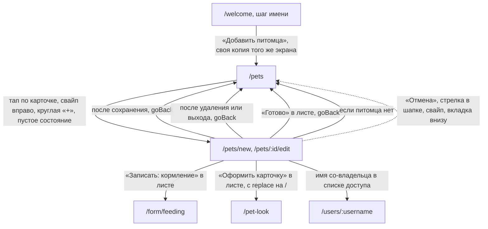

# Аудит пути: Форма питомца

Маршруты: `/pets/new` и `/pets/:id/edit`, файл: `frontend/src/pages/PetForm.tsx`

## Кто это

Форма карточки питомца. Одним маршрутом создаётся питомец и редактируется существующий.
Владелец видит всю форму и раздел «Поделиться доступом», приглашённый видит ту же форму, но
неизменяемой, с объяснением почему.

- Роли: владелец (`current_user_is_owner`, `PetForm.tsx:141`) и приглашённый со-владелец,
  которому форма открывается только для чтения. Третьих ролей нет: правку карточки сервер
  отдаёт только владельцу (`web/pets.py:320`).
- Глубина: экран поверх экрана. Открывается из списка питомцев (`Pets.tsx:41-42`), из
  карточки свайпом и из круглой «+». `RequirePet` не используется, состояние «нет питомца»
  у формы своё (`PetForm.tsx:355-369`).

## Пользовательские истории

1. **.** Я человек, чтобы завести питомца, заполнить имя и вид и нажать «Добавить».
   Критерий: питомец создан, открылся лист «Рекс добавлен» с первым действием
   (`PetForm.tsx:334-338`, `components/PetAddedSheet.tsx`).
2. **.** Я человек, чтобы поменять возраст или породу питомца, открыть его карточку и
   сохранить. Критерий: тост «Питомец обновлён», возврат на список питомцев
   (`PetForm.tsx:341-342`).
3. **.** Я человек, чтобы положить фото, нажать «Добавить» под полем «Фото» и обрезать
   снимок на квадрат. Критерий: квадратный снимок в поле и в карточке после сохранения
   (`PetForm.tsx:436-452`, `PetForm.tsx:963-977`).
4. **.** Я владелец, чтобы позвать человека, найти его по полному логину и нажать его в
   списке. Критерий: человек в списке с пометкой «приглашение уйдёт при сохранении», после
   сохранения полоса «Приглашение отправлено: ivan» с «Отменить»
   (`PetForm.tsx:768-820,313-321,872`).
5. **.** Я приглашённый, чтобы посмотреть карточку, открыть её свайпом по карточке в
   списке. Критерий: форма целиком не меняется, видно «Карточку питомца меняет владелец.
   Вам можно смотреть её и добавлять записи, а когда питомец больше не нужен, выйти из
   доступа» (`PetForm.tsx:386-392`).
6. **.** Я приглашённый, чтобы выйти из доступа, нажать «Выйти из доступа» внизу формы.
   Критерий: вопрос с именем питомца, после подтверждения питомца нет в списке
   (`PetForm.tsx:942-953`).

## Граф переходов

Пунктиром то, что спрашивает «Выйти без сохранения?» и только потом уходит.

## Путь по шагам

Создание, `/pets/new`:

| Шаг | Действие | Что видит | Чем может кончиться |
| --- | --- | --- | --- |
| 1 | Открыл форму | Заголовок «Добавить питомца», карточка «О питомце»: вид, имя, фото и строка «Ещё о питомце» | Сохранение или отмена |
| 2 | Нажал «Ещё о питомце» | Раскрываются порода, дата рождения, пол, стерилизация (только для млекопитающих) и заметки о здоровье | Те же кнопки |
| 3 | Ввёл имя, нажал «Добавить» | Лист «Рекс добавлен»: «В окне «+» уже есть: кормление, вес, лоток, рвота, вычёсывание» | «Записать: кормление», «Оформить карточку», «Готово» |

Правка, `/pets/:id/edit`:

| Шаг | Действие | Что видит | Чем может кончиться |
| --- | --- | --- | --- |
| 1 | Открыл форму | Пока грузится, крутилка, потом вся форма целиком | |
| 2 | Поменял поля, нажал «Сохранить» | Сначала поля, потом приглашения, потом уход | Тост «Питомец обновлён» и возврат на список |
| 3 | Добавил человека из поиска | Строка «приглашение уйдёт при сохранении» | После сохранения полоса с «Отменить» |
| 4 | Нажал корзину у человека с доступом | Вопрос «Закрыть доступ»: «ivan больше не увидит «Рекс» и его записи. Доступ закроется после «Сохранить»» | «Закрыть доступ» убирает строку, «Оставить» ничего не делает |
| 5 | Нажал «Удалить питомца» | Вопрос с числами: сколько записей, лекарств, документов и записей медкарты пропадёт, сколько человек потеряет доступ | «Удалить»: питомца больше нет, полоса «Рекс» удалён с «Отменить» |
| 6 | Нажал «Выйти из доступа» (приглашённый) | «Больше не видеть «Рекс»? Его записи останутся у владельца, он сможет пригласить вас снова» | «Выйти», возврат на список |

Возврат и отмена:

- «Отмена» у владельца это `goBack(navigate, '/pets')` (`PetForm.tsx:925-928`); у
  приглашённого та же кнопка называется «Назад»;
- при несохранённых изменениях спрашивает «Выйти без сохранения?» с текстом «То, что вы
  ввели, пропадёт» (`hooks/useUnsavedChangesGuard.tsx:40-53`). Вопрос ловит и свайп, и
  стрелку в шапке, и вкладку внизу;
- изменениями считаются не только поля, но и добавленный или убранный доступ и
  выбранное или снятое фото (`PetForm.tsx:145-149`);
- если сессия оборвалась, введённое возвращается подсказкой «Вернули то, что вы вводили до
  выхода» (`hooks/useSessionDraft.tsx:45`, `PetForm.tsx:187`);
- закрыть вкладку браузер тоже спросит, пока есть несохранённое
  (`useUnsavedChangesGuard.tsx:30-38`).

Ошибки:

- пустое имя: «Введите имя питомца», первое поле получает фокус
  (`PetForm.tsx:48`, `utils/formErrors.ts:21-38`);
- не прошла сохранка: тост с текстом сервера, иначе «Не удалось сохранить»
  (`PetForm.tsx:343-345`);
- не открылся снимок: «Не удалось открыть фото. Попробуйте другой снимок»
  (`PetForm.tsx:451`);
- выбрана дата в будущем: тост «Дата рождения не может быть позже сегодняшней», и в поле
  встаёт сегодняшняя дата (`PetForm.tsx:633-636`);
- питомца нет или доступа нет: «Питомец не найден», «Возможно, его удалили или закрыли вам
  доступ» и кнопка «К питомцам» (`PetForm.tsx:355-369`).

## Состояния экрана

| Состояние | Покрыто | Где в коде |
| --- | --- | --- |
| Загрузка карточки | Да, крутилка | `PetForm.tsx:351-353` |
| Питомца нет | Да, пустое состояние с кнопкой | `PetForm.tsx:355-369` |
| Сеть не пришла | Да, тот же текст «Питомец не найден», хотя причина может быть другой | `PetForm.tsx:355-369` |
| Только просмотр | Да, форма приглушена и помечена `inert` | `PetForm.tsx:386-392` |
| Ошибка валидации | Да, подпись поля и фокус на нём | `PetForm.tsx:419`, `utils/formErrors.ts` |
| Длинное имя | Да, 100 символов и счётчик | `PetForm.tsx:428`, `PetForm.tsx:419` |
| Пустое имя при создании | Да, кнопка «Добавить» неактивна | `PetForm.tsx:435` |
| Питомец без фото | Да, кнопка «Добавить» с иконкой камеры | `PetForm.tsx:541-550` |
| Фото выбрано, обрезка не закончена | Да, полноэкранная обрезка с «Отмена» и «Готово» | `components/PhotoCropModal.tsx:108-157` |
| Офлайн | Нет | |
| Поле породы у рыбы | Да, называется не «Порода» | `PetForm.tsx:571`, `utils/species.ts:166-167` |

## Точки входа и выхода

Вход:

- список питомцев: тап по карточке, свайп вправо, круглая «+», пустое состояние
  (`Pets.tsx:41-42,94-95,127,222`);
- шаг имени в первом запуске ведёт в свою копию этого экрана, а не сюда
  (`Onboarding.tsx:435`).

Выход:

- `goBack(navigate, '/pets')` после сохранения, удаления, выхода и закрытия листа
  (`PetForm.tsx:342,938,950,982`), то есть форма возвращается на тот список, который её
  открыл, вместе с позицией прокрутки (`utils/navigation.ts:46-51`);
- «Записать: кормление» уводит в `/form/feeding`, «Оформить карточку» в `/pet-look`, и
  оба раза с `replace` на `/` (`PetForm.tsx:983-990`);
- имя со-владельца в списке доступа открывает его карточку `/users/:username`
  (`PetForm.tsx:843`);
- нижняя вкладка «Настройки» остаётся подсвеченной (`BottomTabBar.tsx:15`).

## Правила и валидация

Поля (`PetForm.tsx:47-55`):

- имя: обязательное, `min(1)` с текстом «Введите имя питомца», до 100 символов;
- порода: необязательно, до 100 символов, название поля зависит от вида
  (`PetForm.tsx:571,582`);
- дата рождения: необязательно, колесо на 51 год назад от текущего
  (`PetForm.tsx:216-219`), дата в будущем заменяется сегодняшней с тостом
  (`PetForm.tsx:633-636`);
- пол: необязательно, «Мальчик», «Девочка», «Не указан»
  (`utils/constants.ts:54-58`);
- стерилизация: только для млекопитающих (`PetForm.tsx:683`), подпись зависит от пола:
  «Кастрация», «Стерилизация» или «Кастрация или стерилизация»
  (`utils/species.ts:237-241`);
- заметки о здоровье: необязательно, до 1000 символов, при правке подсказка «Аллергии,
  хронические состояния и прививки вносятся в медкарте» (`PetForm.tsx:728-739`).

Что уходит на сервер:

- всё отправляется `multipart/form-data`, чтобы не потерять текст: имя «7» остаётся
  именем «7» (`services/pets.service.ts:132-135`, `web/pydantic_helpers.py`);
- создание: `POST /api/pets` плюс `tiles_settings` набора событий по виду
  (`PetForm.tsx:294`, `utils/species.ts:248-255`);
- правка: `PUT /api/pets/:id`, и сервер отдаёт 422 «Нет данных для обновления», если пусто
  (`web/pets.py:408-409`);
- фото: новый файл или `remove_photo=true`; присланный клиентом `photo_url` сервер не
  принимает (`web/pets.py:383-404`);
- приглашения: после успешного сохранения карточки, отдельными запросами, и только их
  провал роняет всю операцию (`PetForm.tsx:299-322`).

Отмена доступа:

- у приглашённого вопрос с именем и обещанием, что доступ закроется после «Сохранить»
  (`PetForm.tsx:261-266`);
- у владельца в форме удаление питомца (`PetForm.tsx:930-941`), у приглашённого выход из
  доступа (`PetForm.tsx:942-953`); оба закрываются отменой и не откатываются, кроме
  отправленного приглашения, у которого есть «Отменить» (`PetForm.tsx:313-320`).

## Доступность

- Заголовок формы это `h1`: «Редактировать питомца» или «Добавить питомца»
  (`PetForm.tsx:381-383`).
- Поля «Имя» и порода помечены `required`, у них есть подписи из `fieldNote`
  (`PetForm.tsx:416-434,570-576`).
- Файл фото спрятан через `sr-only`, а не `display: none`, поэтому он остаётся в порядке
  обхода и открывает выбор с клавиатуры (`PetForm.tsx:441-443`).
- Кнопки удаления доступа названы словами: «Закрыть доступ для ivan» или «Отменить
  приглашение для ivan» (`PetForm.tsx:833`).
- Форма для приглашённого помечена `inert`, поэтому ни одно поле не берёт фокус и не
  реагирует на нажатие (`PetForm.tsx:392`).
- Проверка полей объявляется скринридеру через `announce` и ставит фокус в первое поле с
  ошибкой (`utils/formErrors.ts:21-38`).
- Чего не хватает: кнопка сохранения не помечена `data-enter-submit`, поэтому Enter на
  последнем поле её не нажимает, а скрытая кнопка `type="submit"` на строке 908 ни к какой
  форме не относится: тега `<form>` в приложении нет вообще (`PetForm.tsx:908-912`).
  Клавиатура доходит до кнопки через Tab, но не через Enter.

## Найденное

| Что | Где | Почему это важно | Тяжесть | Предложение |
| --- | --- | --- | --- | --- |
| Провал одного приглашения выглядит как провал всего сохранения | `PetForm.tsx:289-322,343-345` | Карточка уже сохранена запросом `PUT`, потом приглашения уходят отдельными запросами через `Promise.all`, и отказ любого из них попадает в общий `catch` с текстом сервера: «Доступ уже предоставлен этому пользователю». Человек уходит с ощущением, что ничего не сохранилось | важно | Отделить сохранение карточки от приглашений: провал приглашения говорить своей строкой, карточку считать сохранённой |
| Добавление человека, у которого уже есть доступ, ничем не пресекается | `PetForm.tsx:250-256`, `services/users.service.ts:49-50`, `web/users.py:50-62` | Поиск отдаёт людей из своего круга без оглядки на этот питомец, клиент проверяет только свои строки, сервер отвечает 422 «Доступ уже предоставлен этому пользователю» (`web/errors.py:117-118`). Сценарий достижим и заканчивается сообщением об ошибке при успешном сохранении | важно | Убирать из результатов тех, кто уже в доступе, или помечать их «уже есть доступ» |
| Правка грузит весь список питомцев вместо одного питомца | `PetForm.tsx:131-139`, `services/pets.service.ts:108-111` | Ради одного питомца скачивается весь список, тем более у человека, у которого их много | мелочь | Брать `GET /api/pets/:id`, он уже есть |
| Форма создаёт питомца, а раздел «Поделиться доступом» появляется только при правке | `PetForm.tsx:758` | Человек, который заводит питомца сразу для двоих, должен сохранить, потом вернуться и снова открыть форму | мелочь | Спросить доступ сразу после создания, в листе «Рекс добавлен» |
| В вопросе об удалении сказано «выгрузите записи в Настройках», а выгрузка там работает по выбранному питомцу | `components/PetDeleteSummary.tsx:26`, `pages/Settings.tsx:202-206,353` | Если удаляют не тот питомец, который выбран, инструкция ведёт в выгрузку чужого питомца | мелочь | Назвать питомец прямо в тексте вопроса |
| Два календаря рождения с разными границами и разным поведением | `PetForm.tsx:216-219,633-636`, `Onboarding.tsx:419-431` | Здесь 51 год назад и тихая замена будущей даты на сегодня, в первом запуске 30 лет и запрет будущих дат | важно | Один компонент и одна граница на обоих экранах |
| В строке пола «Не выбран», в списке выбора «Не указан» | `PetForm.tsx:663`, `utils/constants.ts:55` | Одно и то же состояние названо двумя словами на одном экране | мелочь | Оставить одно слово |
| Поле «Порода» у питомца без вида называется по-разному | `PetForm.tsx:571-582`, `utils/species.ts:166-167` | Подсказка в поле меняется вместе с видом, это сделано намеренно, но стоит знать, что при смене вида на рыбу подпись меняется на ходу | мелочь | Оставить как есть |
| Раздел о доступе говорит «плитки», а экран называется «События питомца» | `PetForm.tsx:766`, `pages/PetEvents.tsx:142` | Внутри приложения один и тот же список называется двумя словами | важно | Заменить «плитки» на «события» во всех текстах |
| Кнопка «Сохранить» недостижима по Enter | `PetForm.tsx:908-918` | Скрытая кнопка `type="submit"` не принадлежит ни одной форме, тега `<form>` в приложении нет | мелочь | Пометить кнопку `data-enter-submit`, если решено, что на такой форме Enter сохраняет |
| При правке приглашённого форма выглядит как обычная, но приглушена | `PetForm.tsx:392` | Это сделано осознанно, но приглушение без подписи прямо над полем легко не заметить | мелочь | Оставить, подпись над формой уже есть |

## Вопросы к владельцу

- Нужен ли заголовок «Добавить питомца» с маленькой подписью «Имя и вид, остальное позже»:
  сейчас подсказка живёт только на свёрнутой строке «Ещё о питомце».
- Стоит ли спрашивать день рождения в этой форме обязательным. Сейчас необязательно, и на
  первом запуске его тоже спрашивают.
- Заметки о здоровье на 1000 символов: достаточно, или нужен вход в медкарту прямо с
  этого экрана.
- Раздел «Поделиться доступом» длинный: стоит ли свернуть его, чтобы он не удлинял форму
  каждого питомца.
- Нужен ли заголовок «О питомце» и второй «Поделиться доступом», когда на экране уже есть
  заголовок формы.

## Связанные экраны

- [pets.md](pets.md), список питомцев, откуда форма открывается и куда возвращается
- [onboarding.md](onboarding.md), первый запуск, где тот же вопрос задаётся в своём виде
- [pet-look-settings.md](pet-look-settings.md), оформление, кнопка «Оформить карточку»
- [user-profile.md](user-profile.md), карточка человека, по имени в списке доступа
- [health-record-form.md](health-record-form.md), запись, кнопка «Записать: кормление»
- [medical-card.md](medical-card.md), куда ведёт совет про PDF в вопросе об удалении
- [event-types-settings.md](event-types-settings.md), свои типы событий, о которых
  говорит «Аллергии, хронические состояния и прививки вносятся в медкарте»