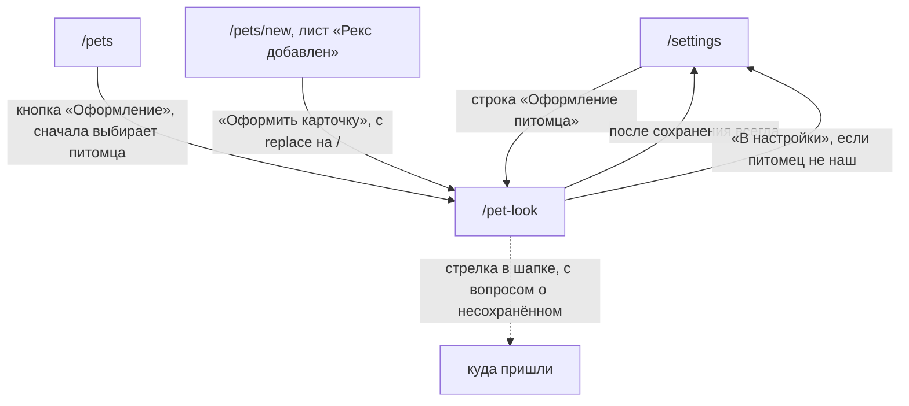

# Аудит пути: Оформление питомца

Маршрут: `/pet-look`, файл: `frontend/src/pages/PetLookSettings.tsx`

## Кто это

Настройка того, как питомец выглядит в приложении: подпись под именем, цвет, шрифт имени,
рамка для фото, подложка карточки и фон ленты. Настройка одна на питомца, её видят все, у
кого есть доступ, и менять её может только владелец.

- Роли: владелец настраивает; приглашённый видит экран с объяснением и без настроек
  (`PetLookSettings.tsx:63-87`). На сервере то же: правка оформления доступна владельцу
  (`web/pets.py:595-597`).
- Глубина: ветка настроек, вкладка «Настройки» остаётся подсвеченной
  (`BottomTabBar.tsx:15`).

## Пользовательские истории

1. **.** Я владелец, чтобы подобрать оформление целиком, открыть вкладку «Образы» и выбрать
   готовый набор. Критерий: карточка сверху тут же меняется, кнопка «Сохранить» доступна
   (`PetLookSettings.tsx:307-312,369-399`).
2. **.** Я владелец, чтобы поменять только цвет, открыть «Цвет» и выбрать круг. Критерий:
   цвет меняется в карточке и в акцентах приложения, пока выбран этот питомец
   (`PetLookSettings.tsx:411-416`).
3. **.** Я владелец, чтобы написать подпись, открыть «Имя» и ввести до 40 символов.
   Критерий: счётчик «24 из 40», Enter сохраняет (`PetLookSettings.tsx:418-452`).
4. **.** Я владелец, чтобы кадр фото попал в окно рамки, нажать «Кадрировать фото под
   рамку». Критерий: полноэкранный выбор, после сохранения обрезки фото садится в рамку
   (`PetLookSettings.tsx:540-560,586-599`).
5. **.** Я владелец, чтобы отменить все свои изменения, нажать «Сбросить оформление».
   Критерий: цвет, шрифт, рамка, подложка и фон возвращаются к исходным
   (`PetLookSettings.tsx:322-328,400-407`).
6. **.** Я приглашённый, чтобы понять, почему не могу поменять вид питомца, открыть экран.
   Критерий: «Питомец: Рекс. Оформление меняет только владелец, вы видите его таким, каким
   его выбрали» и кнопка «В настройки» (`PetLookSettings.tsx:72-87`).

## Граф переходов

Пунктиром возврат: маршрут не вкладка, поэтому в шапке есть стрелка, а уход спрашивает
«Выйти без сохранения?».

## Путь по шагам

| Шаг | Действие | Что видит | Чем может кончиться |
| --- | --- | --- | --- |
| 1 | Открыл `/pet-look` | Заголовок «Оформление питомца», под ним «Питомец: Рекс. Оформление видят все, у кого есть доступ к питомцу, а менять его можете только вы», прибитая сверху карточка и шесть вкладок | Выбор любой вкладки |
| 2 | Вкладка «Образы» | Подсказка «Готовый набор одним нажатием: цвет, шрифт, рамка и фон. Потом можно поменять по отдельности», наборы, внизу «Сбросить оформление» | Любой набор, кнопка сброса |
| 3 | Вкладка «Цвет» | Круг «Терракот» и остальные цвета, каждый со своим названием | Цвет применён к карточке и акцентам |
| 4 | Вкладка «Имя» | Поле «Подпись», пример «Например, хозяин дивана», счётчик, сетка шрифтов с именем питомца в каждом | Подпись и шрифт применены, Enter сохраняет |
| 5 | Вкладка «Рамка» | Группы рамок, у каждой своё окно для фото; если у питомца есть фото и выбрана рамка, снизу «Кадрировать фото под рамку» | Рамка применена, можно кадрировать |
| 6 | Вкладка «Подложка» | Узоры, включая фото питомца, если оно есть | Подложка применена |
| 7 | Вкладка «Фон» | Фоны за записями, в цвете питомца | Фон применён |
| 8 | Нажал «Сохранить» | Кнопка крутится, потом тост «Оформление сохранено» | Уход в `/settings` |
| 9 | Нажал стрелку в шапке, ничего не меняя | Экран закрывается | Возврат туда, откуда пришли |
| 10 | Нажал стрелку, что-то поменяв | Вопрос «Выйти без сохранения?» | «Выйти» или «Остаться» |

Отмена и возврат:

- пока экран открыт, приложение показывает черновик целиком: карточка, шапка, нижние
  вкладки (`utils/petLookPreview.ts:1-14`), и возвращается к сохранённому, когда экран
  закрывается (`PetLookSettings.tsx:306-312`);
- «Сбросить оформление» меняет черновик, но ничего не отправляет: кнопка «Сохранить»
  остаётся нужной (`PetLookSettings.tsx:322-328`);
- несохранённое ловится на уходе любым способом, включая свайп и вкладку внизу
  (`PetLookSettings.tsx:331-333`, `hooks/useUnsavedChangesGuard.tsx:25-28`).

Ошибки:

- сервер отказал: тост «Не удалось сохранить оформление» без текста сервера, экран остаётся
  с черновиком (`PetLookSettings.tsx:344-346`);
- питомца нет: «Сначала добавьте питомца» и «Когда в Petzy будет питомец, здесь появится
  раздел «Оформление питомца»» (`PetLookSettings.tsx:65`, `components/NoPetState.tsx:11-17`);
- шрифты грузятся только при открытии вкладки «Имя», примерно 320 КБ (`PetLookSettings.tsx:279-282`).

## Состояния экрана

| Состояние | Покрыто | Где в коде |
| --- | --- | --- |
| Питомец не выбран | Да, `NoPetState` с кнопкой «Добавить питомца» | `PetLookSettings.tsx:65` |
| Не владелец | Да, `OwnerOnly` с кнопкой «В настройки» | `PetLookSettings.tsx:67,72-87` |
| Сохранение | Да, кнопка крутится | `PetLookSettings.tsx:579` |
| Ошибка сохранения | Текст есть, причины нет | `PetLookSettings.tsx:344-346` |
| Нет фото у питомца | Да, в рамках и подложках показан значок вида, кнопки кадрирования нет | `PetLookSettings.tsx:527-531,540` |
| Пустая подпись | Да, поле пустое, счётчик «0 из 40» | `PetLookSettings.tsx:423-451` |
| Крупный шрифт системы | Да, карточка и вкладки перестают быть прибитыми и уезжают вверх | `PetLookSettings.tsx:291-304` |
| Офлайн | Нет | |
| Длинное имя питомца | Да, имя в образцах шрифтов обрезается | `PetLookSettings.tsx:491` |

## Точки входа и выхода

Вход:

- настройки, строка «Оформление питомца» (`pages/Settings.tsx`, ветка настроек);
- список питомцев, кнопка «Оформление» на карточке: питомец сначала выбирается, потом
  открывается экран (`Pets.tsx:366-375`);
- лист «Рекс добавлен» после создания питомца, кнопка «Оформить карточку», с `replace` на
  `/` (`PetForm.tsx:987-990`).

Выход:

- после «Сохранить» экран всегда уходит в `/settings` (`PetLookSettings.tsx:343`);
- «В настройки» на экране приглашённого тоже ведёт в `/settings` (`PetLookSettings.tsx:81`);
- стрелка в шапке возвращает туда, откуда пришли, но сам экран `goBack` не вызывает
  (`PetLookSettings.tsx` не импортирует его, `utils/navigation.ts:46-51`).

## Правила и валидация

- Подпись: до 40 символов на клиенте (`utils/petLook.ts:14`, `PetLookSettings.tsx:426`), на
  сервере та же длина и нормализация в одну строку (`web/schemas.py:455-460`);
- на сервер уходит весь черновик целиком, пустые значения означают «сбросить»
  (`web/pets.py:599-613`); если всё пустое, `look` убирается из документа целиком
  (`web/pets.py:613`);
- кадрирование хранится отдельно для каждой рамки, у каждой своё окно, и все накопленные
  обрезки уходят с оформлением (`PetLookSettings.tsx:269-270,593-597`,
  `web/schemas.py:451-453`);
- шрифты грузятся по вкладке, а не сразу (`PetLookSettings.tsx:279-282`);
- несохранённое определяется сравнением снимка черновика и сохранённого, в сравнение входит
  и кадрирование (`PetLookSettings.tsx:331-332`);
- экран меняется по питомцу: при смене выбранного питомца форма пересоздаётся
  (`PetLookSettings.tsx:68-69`).

## Доступность

- Вкладки это `role="tablist"` с именем «Что менять», стрелки влево и вправо переключают,
  `Home` и `End` идут по краям (`PetLookSettings.tsx:201-228`).
- Панель подписана `role="tabpanel"` и связана со своей вкладкой (`PetLookSettings.tsx:368`).
- Цвета это одна группа переключателей с именем «Цвет питомца», у каждого круга своё
  название и `title` (`PetLookSettings.tsx:90-117`).
- Шрифты и рамки это группы переключателей с обходом стрелками
  (`PetLookSettings.tsx:457-467,502-511`).
- У каждого варианта шрифта имя питомца входит в имя кнопки, иначе сетка была бы из
  безымянных кнопок (`PetLookSettings.tsx:468`).
- Поле подписи связано с подписью через `htmlFor` и `id` (`PetLookSettings.tsx:420-424`).
- Группы рамок помечены `aria-label`, хотя их заголовки и так есть (`PetLookSettings.tsx:502-505`).
- Чего не хватает: счётчик «24 из 40» не связан с полем и не объявляется, а кнопка
  «Сохранить» не помечена `data-enter-submit`, поэтому Enter сохраняет только из поля
  подписи (`PetLookSettings.tsx:429-434`).

## Найденное

| Что | Где | Почему это важно | Тяжесть | Предложение |
| --- | --- | --- | --- | --- |
| После сохранения экран всегда уходит в настройки | `PetLookSettings.tsx:343`, `utils/navigation.ts:19-51` | Правило `goBack` говорит, что форма возвращается на то, откуда пришла. Здесь приход может быть из списка питомцев, из настроек или из листа «Рекс добавлен», а уходит всегда в `/settings`, и `goBack` на этом экране не используется вовсе | важно | Взять `goBack(navigate, '/settings')`, как в форме питомца |
| «Сбросить оформление» не сбрасывает подпись и кадрирование | `PetLookSettings.tsx:322-328`, `PetLookSettings.tsx:331` | Кнопка обещает сбросить оформление целиком, но `tagline` и `crops` остаются, а `crops` входит в сравнение черновика, то есть останется и в сохранённом оформлении | важно | Сбрасывать подпись и кадрирование тоже, либо назвать кнопку «Сбросить цвет, шрифт, рамку и фон» |
| Кнопка «Сохранить» в самом низу, а список рамок длинный | `PetLookSettings.tsx:501-560`, `PetLookSettings.tsx:578-582` | Прибиты сверху только карточка и вкладки, кнопка уезжает вместе с контентом. На вкладке «Рамка» это три группы плиток подряд | важно | Прибить кнопку снизу средствами `.form-sticky-action`, как у других форм |
| Выбранного питомца нельзя сменить на самом экране | `PetLookSettings.tsx:63-69`, `Navbar.tsx:60,69`, `Pets.tsx:372-375` | Переключатель питомцев есть только на вкладках. С настроек открывается оформление выбранного питомца, и если питомцев несколько, оформлять придётся не тот | важно | Либо показывать переключатель, либо дать выбор питомца на экране |
| Текст ошибки сервера не показывается | `PetLookSettings.tsx:344-346`, `web/schemas.py:459-460` | Сервер отвечает «Подпись не длиннее 40 символов», экран заменяет это на «Не удалось сохранить оформление». Сейчас почти всегда хватает ограничения на клиенте, но при других полях человек не поймёт причину | мелочь | Показывать текст сервера, как в форме питомца |
| Счётчик считает символы с конца строки, а сохраняется обрезанная строка | `PetLookSettings.tsx:276,451` | Можно увидеть «40 из 40», а в карточке будет 38 символов | мелочь | Считать `tagline.trim().length` |
| Enter в подписи сохраняет всё оформление, а не только подпись | `PetLookSettings.tsx:429-434` | Человек правит подпись, а Enter молча сохраняет и цвет, и рамку, которые он тоже менял | мелочь | Оставить как есть или убрать и обойтись кнопкой |
| Обрезки накапливаются для рамок, которые сейчас не выбраны | `PetLookSettings.tsx:269-270,593-597` | После «Сбросить оформление» старые обрезки остаются в оформлении и уезжают с ним на сервер, хотя рамки у питомца уже нет | мелочь | Чистить обрезки рамок, которых больше нет, при сохранении |
| Цвет меняет акценты всего приложения, пока открыт экран | `PetLookSettings.tsx:413`, `utils/petLookPreview.ts` | Это обещано в подсказке на вкладке «Цвет», но на вкладках «Образы» и «Рамка» смена цвета меняет интерфейс вокруг, и это нигде не сказано | мелочь | Сказать про это в подсказке на вкладке «Образы» |
| При смене выбранного питомца несохранённое пропадает без вопроса | `PetLookSettings.tsx:68-69`, `PetLookSettings.tsx:331-333` | Форма пересоздаётся по ключу питомца, а `useBlocker` ловит только смену маршрута. Переключателя питомцев на этом экране нет, но он есть на вкладках, и смена питомца там меняет только состояние, не маршрут | мелочь | Проверить в браузере: спросит ли приложение, если выбрать другого питомца на вкладке и вернуться |
| Экран приглашённому почти недостижим: все входы отданы владельцу | `pages/Settings.tsx:135`, `Pets.tsx:367`, `PetForm.tsx:758`, `App.tsx:511-518` | В настройках у приглашённого строки нет, на карточке в списке кнопки «Оформление» нет, раздел доступа только для владельца. Ветка «Оформление меняет только владелец» открывается только по прямой ссылке | мелочь | Либо оставить как защиту от старой ссылки, либо дать приглашённому вход, чтобы сообщение можно было увидеть |

## Вопросы к владельцу

- Шесть вкладок: «Образы», «Цвет», «Имя», «Рамка», «Подложка», «Фон». Стоит ли оставить
  все шесть или часть спрятать за «Образы».
- «Подложка» и «Фон» звучат похоже, а делают разное: узор на карточке и фон за записями.
  Нужны ли оба слова.
- Подпись питомца видна всем, у кого есть доступ, и это видно на общей карточке. Не
  слишком ли это для личной заметки.
- Кадрирование под каждую рамку это правильно: рамка меняется, обрезка остаётся. Или лучше
  один кадр на все рамки.
- Стоит ли на этом экране показывать, что оформление видят другие, чаще подсказкой на
  вкладке «Цвет», где меняется интерфейс у всех.

## Связанные экраны

- [pets.md](pets.md), список питомцев, кнопка «Оформление» на карточке
- [pet-form.md](pet-form.md), форма питомца, откуда открывается лист «Рекс добавлен»
- [onboarding.md](onboarding.md), первый запуск, кнопка «Оформить карточку»
- [settings.md](settings.md), настройки, откуда открывается экран и куда он уходит
- [pet-events.md](pet-events.md), соседняя ветка настроек того же питомца
- [medical-card.md](medical-card.md), медкарта, где оформление видно вместе с записями