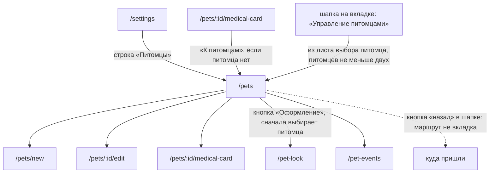

# Аудит пути: Питомцы

Маршрут: `/pets`, файл: `frontend/src/pages/Pets.tsx`

## Кто это

Список питомцев человека: карточка с фото, возрастом, породой, полом и последним весом.
Здесь питомца заводят, открывают его карточку, его медкарту и оформление, и отсюда же
удаляют или из него выходят.

- Роли: владелец, приглашённый со-владелец и человек, который ждёт приглашения. Владелец
  видит в строке кнопку «Удалить», приглашённый вместо неё видит «Выйти»
  (`Pets.tsx:205-217`). Права определяет `current_user_is_owner` из ответа сервера
  (`web/pets.py:284-287`).
- Глубина: экран поверх вкладки. Он открывается из настроек, из ленты и из шапки, но сам
  частью вкладки «Настройки» считается: нижняя вкладка остаётся подсвеченной
  (`BottomTabBar.tsx:15`).

## Пользовательские истории

1. **.** Я человек с питомцами, чтобы увидеть всех сразу, открыть `/pets`. Критерий: карточка
   каждого питомца с именем, возрастом или породой и весом, если он есть
   (`Pets.tsx:112-121,297-342`).
2. **.** Я человек без питомцев, чтобы понять, что делать, увидеть пустое состояние.
   Критерий: «Здесь будут ваши питомцы», кнопка «Добавить питомца» (`Pets.tsx:90-96`).
3. **.** Я человек, чтобы поменять карточку питомца, нажать на карточку или свайпнуть
   вправо. Критерий: открылась форма питомца этого питомца (`Pets.tsx:225,197-202`).
4. **.** Я владелец, чтобы удалить питомца, свайпнуть влево или нажать «Удалить».
   Критерий: питомца спросили сначала и дали «Отменить» (`Pets.tsx:129-154`,
   `useDeletePet.ts:47-58`).
5. **.** Я приглашённый, чтобы перестать видеть чужого питомца, нажать «Выйти». Критерий:
   вопрос «Больше не видеть «Рекс»?», после подтверждения питомца нет в списке
   (`Pets.tsx:136,205-217`).
6. **.** Я приглашённый, чтобы принять приглашение и получить питомца, увидеть блок
   приглашений над списком. Критерий: карточка приглашения с кнопкой ответа
   (`Pets.tsx:73-75`, `components/PendingInvites.tsx`).

## Граф переходов

Пунктиром то, что возвращает назад: кнопка в шапке. Переключатель питомцев на самом
`/pets` не показывается, потому что маршрут не вкладка (`Navbar.tsx:60,69`).

## Путь по шагам

| Шаг | Действие | Что видит | Чем может кончиться |
| --- | --- | --- | --- |
| 1 | Открыл `/pets` | Пока грузится список, два скелета карточек (`Pets.tsx:84-85`) | Список или пустое состояние |
| 2 | Список пришёл | Блок приглашений, если есть, заголовок «Мои питомцы», карточки, круглая кнопка «+» снизу справа | Выбрал карточку или свайпнул |
| 3 | Нажал карточку или свайпнул вправо | Форма питомца | Сохранение возвращает сюда же (`goBack`, `PetForm.tsx:342`) |
| 4 | Нажал «Оформление» на карточке | Питомец сначала выбирается, потом открывается `/pet-look` | Сохранение оформления уходит в `/settings`, а не сюда (`PetLookSettings.tsx:343`) |
| 5 | Свайпнул влево, владелец | Вопрос «Удаление питомца» с тем, что удалится вместе с питомцем (`PetDeleteSummary`) | «Удалить» и питомец исчезает сразу, снизу полоса «Рекс» удалён с «Отменить» на 6 секунд (`snackbar.ts:31`) |
| 6 | Свайпнул влево, приглашённый | Вопрос «Выйти из доступа» | «Выйти», питомец исчезает после ответа сервера, «Отменить» не предлагается (`useDeletePet.ts:63-65`) |
| 7 | Нажал круглую «+» или «Добавить питомца» в пустом состоянии | `/pets/new` | Сохранение открывает лист «Рекс добавлен» (`PetForm.tsx:334-338`) |
| 8 | Потянул список вниз | Список обновляется сам, без слова об этом | `Pets.tsx:98-105` |

Отмена, возврат и ошибка:

- вопрос об удалении закрывается «Отменой», список не меняется (`Pets.tsx:148-152`);
- если удаление не прошло, питомец возвращается в список с текстом «Не удалось удалить
  «Рекс», питомец на месте» (`useDeletePet.ts:51`);
- список не пришёл: «Не удалось загрузить питомцев» с повтором (`Pets.tsx:87-88`,
  `LoadError`);
- фото на карточке открывается в просмотрщик, а не в форму (`Pets.tsx:231-243`).

## Состояния экрана

| Состояние | Покрыто | Где в коде |
| --- | --- | --- |
| Загрузка | Да, два скелета карточек | `Pets.tsx:84-85` |
| Пусто | Да, «Здесь будут ваши питомцы» и кнопка | `Pets.tsx:90-96` |
| Ошибка и повтор | Да, `LoadError` с повтором | `Pets.tsx:87-88` |
| Есть приглашения | Да, блок над списком | `Pets.tsx:73-75` |
| Нет питомца | То же, что пусто, экран не оборачивается в `RequirePet` | `App.tsx`, маршрут без обёртки |
| Нет доступа | Неприменимо, недоступные питомцы не приходят вовсе | `web/pets.py:118-163` |
| Офлайн | Нет, экран выглядит рабочим | |
| Длинные имена | Да, имя на две строки с обрезкой | `Pets.tsx:297-310` |
| Питомец без фото | Да, иконка вида на цветной подложке | `Pets.tsx:219,257-264` |
| Питомец без даты, породы и пола | Да, показан вид питомца | `Pets.tsx:321` |
| Питомец удалён, но «Отменить» ещё можно нажать | Да, питомца уже нет в списке | `usePet.ts:51-52` |

## Точки входа и выхода

Вход:

- настройки, строка «Питомцы» (`pages/Settings.tsx:124`);
- медкарта и её разделы, кнопка «К питомцам», когда питомца нет
  (`pages/MedicalCard.tsx:875`, `pages/MedicalCardSection.tsx:235`);
- форма питомца, когда адрес питомца не ведёт ни к чему (`PetForm.tsx:364`);
- шапка на любой вкладке: лист выбора питомца заканчивается кнопкой «Управление
  питомцами», она показывается, когда питомцев не меньше двух (`Navbar.tsx:106,248-260`);
- `/pet-events`, кнопка «К питомцам» в пустом состоянии (`PetEvents.tsx:151`).

Выход:

- `/pets/new`, `/pets/:id/edit`, `/pets/:id/medical-card`, `/pet-look`, `/pet-events`;
- кнопка «назад» в шапке: `/pets` не входит в `MAIN_TAB_PATHS`
  (`utils/navigation.ts:4,15-17`), поэтому на экране есть стрелка назад, которая уводит
  туда, откуда пришли. `goBack` сам список не использует: он возвращает из формы
  (`PetForm.tsx:342`);
- нижние вкладки остаются на месте, подсвечена «Настройки» (`BottomTabBar.tsx:15`).

## Правила и валидация

Список только читает:

- `GET /api/pets` (`services/pets.service.ts`), сервер отдаёт чужих питомцев, к которым
  есть доступ, и `current_user_is_owner` для каждого (`web/pets.py:118-163`);
- удаление: `DELETE /api/pets/<id>` с задержкой, реальный запрос уходит, когда истекло
  время «Отменить» (`utils/deferredDelete.ts:63-91`). Если вкладка закрывается или
  приложение уходит в фон, запрос уходит сразу (`deferredDelete.ts:95-108`);
- выход: `POST /api/pets/<id>/leave` без «Отменить», с тостом «Вы больше не видите этого
  питомца» (`useDeletePet.ts:62-65`);
- вес на карточке: отдельный запрос на каждого питомца, `GET /api/records?type=weight`,
  кеш 30 секунд (`Pets.tsx:188-194`);
- скрытые питомцы (удалённые, ждущие запроса) убираются из `pets` в `usePet`
  (`usePet.ts:50-52`), отдельного фильтра в списке нет.

## Доступность

- Каждая карточка это `div` с `onClick` и `cursor: pointer`, без роли и без
  `tabIndex` (`Pets.tsx:225`). С клавиатуры до неё не дойти: `SwipeableRow` прячет кнопку
  «Действия» до фокуса, но она остаётся в порядке обхода и в дереве доступности
  (`SwipeableRow.tsx:159-171`).
- Фото питомца это настоящая кнопка с именем «Открыть фото Рекс», а без фото это
  `aria-hidden` (`Pets.tsx:231-243`).
- Кнопки «Медкарта» и «Оформление» названы: у второй есть `aria-label` «Оформление: Рекс»
  (`Pets.tsx:371`).
- Круглая «+» это `aria-label` «Добавить питомца» (`components/Fab.tsx:9-13`). На этом
  экране `aria-haspopup` не появляется, потому что кнопка ведёт на другой маршрут, а не
  открывает окно.
- Скелетон карточек не имеют подписи для скринридера, экран при загрузке молчит
  (`components/Skeletons.tsx:26-37`).
- Строка списка и вопрос об удалении не имеют `role="alert"`, об удалении узнаёт только
  полоса внизу, и она объявляется через `announce` (`utils/snackbar.ts:88`).
- Чего не хватает: у заголовка «Мои питомцы» есть `h1`, но у экрана нет
  `aria-describedby` для счётчика питомцев, его и нет.

## Найденное

| Что | Где | Почему это важно | Тяжесть | Предложение |
| --- | --- | --- | --- | --- |
| Экран подсвечивает вкладку «Настройки», но в шапке у него стрелка назад и нет переключателя питомцев | `BottomTabBar.tsx:15`, `utils/navigation.ts:4,15-17` | Человек видит вкладку «Настройки» и одновременно экран, который туда не относится: вкладка обещает, что это её раздел, шапка говорит, что это отдельный экран | важно | Либо `/pets` сделать отдельной вкладкой, либо считать `/pets` экраном поверх и убрать его из `SETTINGS_PATH` |
| У приглашённого удаление без «Отменить», у владельца с отменой, вопрос при этом один и тот же | `Pets.tsx:129-154`, `useDeletePet.ts:44-65` | Выйти из доступа необратимо без владельца, а полосы «Отменить» нет: `useLeavePet` ждёт ответ сервера и только затем убирает питомца | важно | Дать «Отменить» и на выход из доступа, через `deleteWithUndo` |
| Владелец удалил последнего питомца, и под полосой «Рекс» удалён» сразу появляется пустое состояние «Здесь будут ваши питомцы» | `Pets.tsx:89-96`, `usePet.ts:50-52`, `snackbar.ts:31` | Несколько секунд экран одновременно говорит «питомец удалён» и «здесь будут ваши питомцы», а кнопка «Добавить питомца» зовёт нажать, пока «Отменить» ещё можно | мелочь | Держать карточку удалённого питомца видимой до конца окна отмены, с пометкой |
| Карточка питомца это `div` с `onClick`, недоступна с клавиатуры и не видна скринридеру как ссылка | `Pets.tsx:225` | Человек на клавиатуре доходит до карточки только через скрытую кнопку «Действия» | важно | Сделать карточку ссылкой или кнопкой, а не `div` с обработчиком |
| Один запрос веса на каждого питомца в списке | `Pets.tsx:188-194` | На десяти питомцах список делает десять запросов при открытии, и каждый ждёт своей карточки | мелочь | Брать вес из данных медкарты или тянуть одним запросом на список |
| Полоса «Отменить» исчезает досрочно, если на экране появится любая другая полоса | `utils/snackbar.ts:82`, `utils/deferredDelete.ts:77-79` | Новое сообщение отправляет удаление питомца на сервер раньше, чем человек успел нажать «Отменить» | мелочь | Для удаления питомца не давать новой полосе вытеснить старую |
| Заголовок «Мои питомцы» стоит в строке, где справа пусто | `Pets.tsx:61-71` | Пустое место в шапке списка выглядит как недоделанная кнопка | мелочь | Убрать `justifyContent: space-between`, если справа ничего не будет |
| На самом списке переключателя питомцев в шапке нет | `Navbar.tsx:60,69,106` | `/pets` не вкладка, поэтому шапка показывает стрелку назад и пустое место справа. При двух и более питомцах переключать их приходится, возвращаясь на вкладку | мелочь | Показывать переключатель и на `/pets`, или оставить список без шапки |

## Вопросы к владельцу

- «Мои питомцы»: список ли это питомцев для управления или место, где начинают писать
  записи. Сейчас это второе по подписи «Добавьте первого, и Petzy будет считать кормления»,
  но экрана записи здесь нет.
- Нужен ли заголовок и его точный текст: сейчас «Мои питомцы», у приглашённого питомцы не
  его.
- Нужен ли счётчик «3 питомца» над списком.
- Пустые имена и породы закрыты, а очень длинные имена обрезаются на две строки: этого
  достаточно.
- Выход из доступа без отмены: это осознанно или стоит сделать так же, как удаление.

## Связанные экраны

- [pet-form.md](pet-form.md), форма питомца, куда ведут карточка, «+» и свайп вправо
- [pet-look-settings.md](pet-look-settings.md), оформление, кнопка «Оформление» на карточке
- [pet-events.md](pet-events.md), события питомца, кнопка «К питомцам»
- [medical-card.md](medical-card.md), медкарта, кнопка «Медкарта» на карточке
- [settings.md](settings.md), настройки, откуда открывается список
- [dashboard.md](dashboard.md), лента, один из входов и место, куда уходит удаление