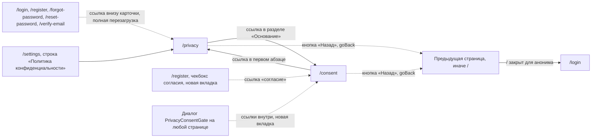

# Аудит пути: Политика и согласие

Маршруты: `/privacy` и `/consent`, Файл: `frontend/src/pages/Privacy.tsx`

## Кто это

Два публичных документа в приложении: «Политика конфиденциальности» и «Согласие на обработку
персональных данных». Первый читают, чтобы узнать, какие данные Petzy хранит и где, второй нужен,
чтобы понять, на что именно человек соглашается. Оба собраны из одного каркаса `LegalPage`
(`pages/Privacy.tsx:62`), тексты живут в коде, а факты об операторе и стране сервера приходят с
сервера (`web/legal.py:46`).

- Роли: аноним без аккаунта, владелец и приглашённый под входом
- Глубина: публичные экраны, без нижних вкладок и без шапки (`utils/publicPages.ts:5`,
  `components/BottomTabBar.tsx:34`, `components/Navbar.tsx:55`)

## Пользовательские истории

1. **.** Я читаю политику перед регистрацией, чтобы понять, что с моими данными, открываю ссылку
   «Политика конфиденциальности» под карточкой. Критерий: открывается `/privacy` с датой редакции
   и разделами от «Кто обрабатывает данные» до «Изменения» (`pages/Privacy.tsx:106`, `:219`).
2. **.** Я даю согласие и хочу прочитать его целиком, нажимаю ссылку в чекбоксе регистрации.
   Критерий: `/consent` открывается в новой вкладке, форма регистрации остаётся
   (`pages/Register.tsx:213`).
3. **.** Мне пришло требование показать, где хранятся данные, я ищу оператора и страну сервера.
   Критерий: раздел «Кто обрабатывает данные» и «Где хранятся данные и кто их видит»
   (`pages/Privacy.tsx:106`, `:149`).
4. **.** Приложение просит согласие заново, потому что текст изменился, я читаю новую редакцию.
   Критерий: над заголовком «Редакция от 28 сентября 2026» (`pages/Privacy.tsx:78`),
   а вопрос задаёт диалог `components/PrivacyConsentGate.tsx:55`.
5. **.** Я хочу узнать, куда писать о своих данных, ищу адрес. Критерий: адрес выводится как ссылка
   `mailto:` в трёх местах, а если он не задан, пишется «напишите оператору»
   (`pages/Privacy.tsx:48`, `:53`).
6. **.** Я открыл `/privacy` по прямой ссылке из письма и хочу вернуться туда, откуда пришёл.
   Критерий: кнопка «Назад» (`pages/Privacy.tsx:73`).

## Граф переходов

## Путь по шагам

| Шаг | Действие | Что видит | Чем может кончиться |
| --- | --- | --- | --- |
| 1 | Открывает `/privacy` | Кнопка «Назад», заголовок «Политика конфиденциальности», спиннер, пока не пришли факты (`pages/Privacy.tsx:73`, `:86`) | Если оператор не задан, предупреждение о том, что владелец сервера себя ещё не указал (`pages/Privacy.tsx:79`) |
| 2 | Читает документ | Десять разделов, список хранимых данных, список стран, сроки хранения, права, cookies, защита, изменения (`pages/Privacy.tsx:116` и далее) | Текст вставляет «пока не указан» там, где сервер не ответил данными (`pages/Privacy.tsx:21`) |
| 3 | Переходит к согласию | Ссылка «согласие на обработку персональных данных» в разделе «Основание» (`pages/Privacy.tsx:142`) | Открывается `/consent` в том же окне, вкладка браузера меняется на заголовок согласия |
| 4 | Возвращается кнопкой «Назад» | `goBack` уводит на предыдущий адрес, а при его отсутствии на `/` (`pages/Privacy.tsx:73`, `utils/navigation.ts:46`) | Для анонима `/` закрыт, `ProtectedRoute` отправляет на `/login` (`components/ProtectedRoute.tsx:25`) |

Два маршрута, одна разница: `/privacy` длинный документ из десяти разделов, `/consent` короткий
из пяти, оба в одном каркасе, с одной кнопкой «Назад» и одной датой редакции
(`pages/Privacy.tsx:92`, `:230`). Ссылка из политики на согласие и ссылка из согласия на политику
есть в тексте, отдельной навигации между документами нет. Подтверждение согласия на этой странице
не принимается: кнопка «Даю согласие» есть только в диалоге на защищённых страницах
(`components/PrivacyConsentGate.tsx:67`).

Отмена и возврат: возврат только кнопкой «Назад» в начале текста и кнопкой браузера. Маска и
свайп не закрывают документ, его нечего закрывать: это страница, а не слой. Ошибка сети: отдельного
состояния нет, при недоступности `GET /api/legal` страница рисуется целиком и молча заменяет все
факты на «пока не указан» (`pages/Privacy.tsx:86`).

## Состояния экрана

- Загрузка: `LoadingSpinner` на месте текста, заголовок и кнопка «Назад» уже на экране
  (`pages/Privacy.tsx:86`).
- Ошибка: не покрыта. После неудачи `isPending` становится ложным, `info` остаётся неопределённым,
  и `children(undefined)` рисует документ с «пока не указан» в каждом месте, где нужен факт
  (`pages/Privacy.tsx:108`, `:151`).
- Пусто: сервер может вернуть пустые строки, тогда показывается «пока не указан» и отдельное
  предупреждение об операторе (`pages/Privacy.tsx:21`, `:79`).
- Нет доступа: не применимо, маршруты публичные.
- Офлайн: то же, что ошибка, без объяснения.
- Длинные тексты: документы и есть длинные тексты, ширина ограничена 38rem, шрифт `--text-md`,
  межстрочный 1.6 (`styles/globals.css:1868`). Ссылки внутри абзаца переносятся вместе со строкой.
- Пустые имена: не применимо.
- Повторный запрос: `staleTime` один час, при переходе между `/privacy` и `/consent` данные берутся
  из кэша, а не идут снова (`pages/Privacy.tsx:67`).

## Точки входа и выхода

Вход: ссылка «Политика конфиденциальности» под карточкой на всех пяти остальных публичных экранах
(`components/AuthShell.tsx:65`, это обычный `<a href>`, то есть с перезагрузкой страницы), ссылки
в чекбоксе регистрации (`pages/Register.tsx:213`, `:217`), строка «Политика конфиденциальности» в
Настройках (`pages/Settings.tsx:291`), ссылки внутри диалога о согласии
(`components/PrivacyConsentGate.tsx:60`), плюс прямой заход, закладка и `catch-all` (`App.tsx:569`).
Выход: между документами по ссылкам в тексте, кнопкой «Назад» (`pages/Privacy.tsx:73`), из диалога
о согласии только кнопки диалога. В `Настройках` есть только ссылка на политику, ссылки на
`/consent` там нет.

## Правила и валидация

- Данные документа: `GET /api/legal` без входа (`services/legal.service.ts:16`, `web/legal.py:46`).
  Поля: `policy_version`, `operator`, `contact_email`, `server_location`, `backups_kept_days`.
- Пустые значения показываются как «пока не указан», а не как пустое место
  (`pages/Privacy.tsx:21`).
- Дата редакции это первые десять символов версии, то есть дата, без суффикса второй редакции за
  тот же день (`pages/Privacy.tsx:34`).
- Срок хранения резервных копий берётся из `backups_kept_days` и склоняется по-русски
  (`pages/Privacy.tsx:42`). Минимум одна единица обеспечивается на сервере (`web/legal.py:56`).
- Список стран передачи данных: страна сервера, если она отличается от страны пользователя, плюс
  Нидерланды и Германия (`pages/Privacy.tsx:25`).
- Версия текста живёт в коде приложения, версия согласия в `PRIVACY_POLICY_VERSION` на сервере
  (`web/legal.py:35`). Смена версии заставляет всех подписавшихся согласиться заново
  (`web/legal.py:42`), вопрос задаёт `components/PrivacyConsentGate.tsx:31`.
- Если версия в диалоге успела устареть, сервер отвечает `privacy_version_outdated`
  (`web/legal.py:71`), и диалог показывает тост через `getApiErrorMessage`
  (`components/PrivacyConsentGate.tsx:42`).
- Ничего не отправляется с этих страниц, кроме вопроса о согласии в диалоге на других экранах
  (`services/legal.service.ts:21`).

## Доступность

- `h1` это заголовок документа, фокус после перехода встаёт на него, вкладка браузера называется
  «Политика конфиденциальности, Petzy» или «Согласие на обработку персональных данных, Petzy»
  (`components/RouteFocus.tsx:26`, `components/RouteFocus.tsx:29`).
- Кнопка «Назад» это настоящий `button` с иконкой `aria-hidden` и подписью, зона не меньше
  `--touch-min` (`pages/Privacy.tsx:73`, `styles/globals.css:1927`).
- Разделы это `h2`, структура документа честная, по ней можно идти Tab
  (`pages/Privacy.tsx:106`, `:140`).
- Ссылки на почту это `mailto:` (`pages/Privacy.tsx:49`), внутренние переходы это `Link` с
  `href`, а не кнопки (`pages/Privacy.tsx:142`).
- Спиннер идёт без подписи, экран при этом пустой, кроме заголовка
  (`pages/Privacy.tsx:86`).
- Чего нет: оглавления с якорями у длинного документа, сносок и ссылок на пункты законов
  персональными данными, печатной версии.

## Найденное

| Что | Где | Почему это важно | Тяжесть | Предложение |
| --- | --- | --- | --- | --- |
| При недоступности `GET /api/legal` страница молча показывает «пока не указан» вместо текста об ошибке | `pages/Privacy.tsx:86`, `pages/Privacy.tsx:21` | Человек читает юридический документ, в котором оператор, страна сервера и срок хранения выглядят как факты, хотя это заглушка | блокер | Показывать состояние ошибки с кнопкой «Повторить», как на защищённых страницах (`components/ProtectedRoute.tsx:31`), и не рисовать текст без данных |
| Кнопка «Назад» с прямой ссылки уводит на `/`, а для анонима это экран входа | `pages/Privacy.tsx:73`, `utils/navigation.ts:46`, `components/ProtectedRoute.tsx:25` | Человек, открывший политику из письма, нажимает «Назад» и попадает на форму входа, а не на исходный адрес | важно | Для публичных страниц запасной адрес сделать `/login` или саму `/privacy`, а не закрытый `/` |
| Ссылка внизу карточки на `/privacy` это `<a href>`, то есть полная перезагрузка | `components/AuthShell.tsx:65` | С пяти экранов входа уход в документ перезагружает приложение и теряет введённое | важно | Использовать `Link` из роутера |
| В Настройках есть только ссылка на политику, на согласие нет | `pages/Settings.tsx:291` | Тот, кому нужно проверить основание согласия, ищет его в Настройках и не находит | мелочь | Добавить строкой «Согласие на обработку персональных данных» рядом с политикой |
| Нет оглавления у документа из десяти разделов | `pages/Privacy.tsx:106`, `pages/Privacy.tsx:219` | На телефоне это длинная прокрутка, вернуться к нужному разделу можно только пальцем | мелочь | Список разделов ссылками в начале страницы |
| Дата редакции теряет номер второй редакции за тот же день | `pages/Privacy.tsx:34`, `web/legal.py:35` | Версия `2026-09-28.3` показывается как «28 сентября 2026», хотя редакций в этот день было три | мелочь | Показывать суффикс, когда он есть, например «28 сентября 2026, редакция 3» |
| В ссылках из диалога и из чекбокса нет подсказки, что откроется новая вкладка | `components/PrivacyConsentGate.tsx:49`, `pages/Register.tsx:213` | Скринридер не читает ничего о новой вкладке, а человек теряет заполненную форму | мелочь | Добавить подпись к ссылкам |
| Диалог о согласии не закрывается по маске и без выбора остаётся на месте | `components/PrivacyConsentGate.tsx:64` | На защищённой странице человек застревает в диалоге, если передумал соглашаться, кроме как уйти или удалить аккаунт | важно | Оставить как есть, но проверить тон: сейчас выбор сформулирован тремя действиями без четвёртой возможности «позже» |
| Страница не знает, что читающий подписан, и не показывает его версию согласия | `web/legal.py:38`, `components/PrivacyConsentGate.tsx:31` | Не видно, какая редакция принята этим аккаунтом | мелочь | Показывать в тексте принятую версию, если её знает сервер |

## Вопросы к владельцу

- Что должно быть видно, если оператор, адрес или страна сервера не заданы в окружении: сейчас
  документ показывает «пока не указан», и по коду не видно, считает ли владелец это приемлемым для
  продакшена (`web/legal.py:53`).
- Нужно ли давать на `/consent` кнопку согласия прямо на странице, или согласие принимается только
  в диалоге на защищённых экранах и в чекбоксе регистрации.
- Какая редакция политики считается приемлемой для показа людям, у которых согласие уже дано на
  старую версию: сейчас вопрос задаётся всем сразу (`web/legal.py:42`).
- Нужен ли русский текст сносками к законам или достаточно номера и даты, как сейчас
  (`pages/Privacy.tsx:30`).

## Связанные экраны

- [Регистрация](register.md)
- [Вход](login.md)
- [Настройки](settings.md)
- [Удаление аккаунта](account-delete.md)
- [Помощь](help.md)
