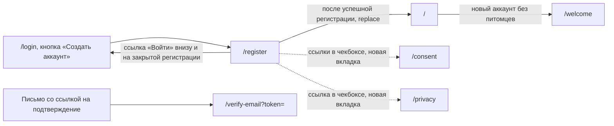

# Аудит пути: Регистрация

Маршрут: `/register`, Файл: `frontend/src/pages/Register.tsx`

## Кто это

Форма создания аккаунта: логин, имя, почта, пароль дважды и согласие на обработку персональных
данных. Сюда приходят те, кто ещё не пользовался Petzy, по кнопке «Создать аккаунт» на экране входа
или по прямой ссылке.

- Роли: аноним без аккаунта
- Глубина: публичный экран, без нижних вкладок (`utils/publicPages.ts:5`, `components/BottomTabBar.tsx:34`)

## Пользовательские истории

1. **.** Я новый человек, чтобы начать вести дневник, заполняю логин, имя, почту и пароль и жму
   «Создать аккаунт». Критерий: открывается лента, аккаунт создан, cookie выданы
   (`pages/Register.tsx:73`, `web/auth.py:231`).
2. **.** Я не понимаю правил логина, чтобы не ошибиться, ввожу его и читаю подсказку под полем.
   Критерий: под полем «По нему вас найдут для общего доступа», а после ухода с поля
   «От 3 до 30 символов: латинские буквы, цифры, точка, дефис или подчёркивание, начиная с буквы или
   цифры» (`pages/Register.tsx:39`, `pages/Register.tsx:133`).
3. **.** Я ошибаюсь в повторе пароля, чтобы не поставить неверный пароль, заполняю оба поля.
   Критерий: под вторым полем «Пароли не совпадают» (`pages/Register.tsx:56`).
4. **.** Я хочу прочитать согласие, прежде чем его давать, нажимаю на ссылку в чекбоксе. Критерий:
   `/consent` и `/privacy` открываются в новой вкладке, форма не теряется
   (`pages/Register.tsx:213`).
5. **.** Я не согласен с политикой, чтобы не давать согласие вслепую, оставляю чекбокс и жму
   «Создать аккаунт». Критерий: под чекбоксом «Без согласия аккаунт не создать», запрос не уходит
   (`pages/Register.tsx:57`, `pages/Register.tsx:203`).
6. **.** Регистрация на сервере закрыта, чтобы понять, что делать, открываю `/register`. Критерий:
   «Регистрация сейчас закрыта. Попросите администратора Petzy создать вам аккаунт» и ссылка «Войти»
   (`pages/Register.tsx:84`).

## Граф переходов

## Путь по шагам

| Шаг | Действие | Что видит | Чем может кончиться |
| --- | --- | --- | --- |
| 1 | Открывает `/register` | «Новый аккаунт», поля логина, имени, пароля и повтора, чекбокс согласия, кнопка «Создать аккаунт» (`pages/Register.tsx:102`) | Поле «Почта» появляется только после ответа сервера, до этого его нет (`pages/Register.tsx:47`) |
| 2 | Вводит логин | Ввод сразу приводится к нижнему регистру и обрезается (`pages/Register.tsx:140`) | После ухода с поля появляется текст правила, до этого только подсказка |
| 3 | Вводит имя | Поле «Как к вам обращаться», подсказка «Видят те, с кем вы делитесь питомцем», длина до 100 (`pages/Register.tsx:147`) | Пустое имя даёт «Напишите имя» (`pages/Register.tsx:45`) |
| 4 | Вводит почту, если поле появилось | `type="email"`, проверка адреса на клиенте (`pages/Register.tsx:52`) | Адрес не проходит формат: «Проверьте адрес почты» |
| 5 | Вводит пароль дважды | Минимум 8 символов, сверка повтора (`pages/Register.tsx:55`) | Несовпадение или короткий пароль останавливают отправку |
| 6 | Ставит чекбокс согласия | Текст «Даю согласие на обработку персональных данных на условиях политики конфиденциальности» (`pages/Register.tsx:212`) | Ссылки открываются в новой вкладке, форма остаётся |
| 7 | Жмёт «Создать аккаунт» | Кнопка блокируется, поля гасятся (`pages/Register.tsx:114`) | Успех: переход на `/`. Ошибка: тост с текстом сервера (`pages/Register.tsx:75`) |

Отмена и возврат: ссылки «Войти» ведут на `/login`, но введённое не переносится, уходя на `/login`
теряется форма. Кнопки «назад» на экране нет, `Navbar` и вкладки скрыты
(`components/Navbar.tsx:55`). Выход по браузерному «назад» работает как обычно, экран
перерисовывается с пустыми полями, так как состояние живёт в `useState` (`pages/Register.tsx:24`).
Ошибка сети: тост «Нет связи с интернетом. Ничего не сохранилось, попробуйте ещё раз, когда связь
появится», форма остаётся заполненной (`utils/apiError.ts:10`).

## Состояния экрана

- Загрузка: форма рисуется сразу, без индикатора. Пока не пришёл `GET /api/auth/registration`,
  поля «Почта» нет и кнопка не знает, открыта ли регистрация (`pages/Register.tsx:34`).
- Закрытая регистрация: весь экран заменяется текстом и ссылкой «Войти» (`pages/Register.tsx:81`).
- Ошибка и повтор: тост на 5 секунд, все значения остаются, повтор возможен сразу.
- Поля с ошибками: ошибка появляется после ухода с поля, а не при наборе
  (`hooks/useTouched.ts:19`), под полем через `FieldError`, который ставит `aria-invalid`
  (`components/FieldError.tsx:26`).
- Офлайн: запрос уходит и падает, текст «Нет связи с интернетом...».
- Длинные тексты: имя ограничено 100 символами на клиенте и на сервере, почта 254, логин 30
  правилом (`pages/Register.tsx:153`, `pages/Register.tsx:170`, `web/auth.py:60`).
- Пустые имена: имя из одних пробелов считается пустым (`pages/Register.tsx:45`).
- Не покрыто: гонка «пользователь успел отправить форму раньше, чем пришёл статус», при которой
  аккаунт уходит без почты при настроенной почте.

## Точки входа и выхода

Вход: кнопка «Создать аккаунт» на `/login` (`pages/Login.tsx:125`), прямой заход и закладка, а
также `catch-all` для незнакомого адреса (`App.tsx:569`). Выход: на `/` с `replace` после
успеха, на `/login` ссылкой, в `/consent` и `/privacy` новой вкладкой через `<a href target="_blank">`
(`pages/Register.tsx:213`). `goBack` не используется, `returnTo` не читается: с `/register` вход не
отправляет, значит возвращаться на предыдущий экран некуда.

## Правила и валидация

- Логин проверяется регулярным выражением на клиенте, тем же, что на сервере
  (`pages/Register.tsx:15`, `web/auth.py:60`). Ввод приводится к нижнему регистру и обрезается на
  лету (`pages/Register.tsx:140`).
- Имя: обязательное, не длиннее 100, обрезается от пробелов при отправке
  (`pages/Register.tsx:67`), сервер проверяет то же самое (`web/auth.py:191`).
- Почта: спрашивается только при `mail_enabled` (`pages/Register.tsx:47`), регулярное выражение на
  клиенте (`pages/Register.tsx:52`) и на сервере `EMAIL_RE` (`web/account.py:46`). На сервере при
  настроенной почте пустая почта даёт `register_email_required` (`web/auth.py:196`).
- Пароль: клиент проверяет только длину 8 (`pages/Register.tsx:55`). Сервер дополнительно отклоняет
  пароль длиннее 72 байт, из известных словарей и с тремя или меньше разными символами
  (`web/auth.py:107`).
- Согласие: `privacy_consent: true` уходит обязательно, без него сервер отвечает
  `privacy_consent_required` (`pages/Register.tsx:69`, `web/auth.py:173`).
- На сервер уходит `POST /api/auth/register` (`services/auth.service.ts:46`), ответ сразу входит в
  аккаунт: `useAuth.register` пишет логин, чистит кэш и спрашивает сессию
  (`hooks/useAuth.ts:53`).
- Ничего не сохраняется при уходе со страницы, вопроса о несохранённом нет.

## Доступность

- Заголовок первого уровня это логотип «Petzy» (`components/AuthShell.tsx:28`), и на него
  `RouteFocus` ставит фокус, а заголовок вкладки остаётся «Petzy»
  (`components/RouteFocus.tsx:26`, `pages/Register.tsx:102`).
- Подписи полей связаны с полями и помечены обязательными через `linkLabel`
  (`utils/antdA11y.ts:52`), ошибки связаны через `aria-describedby` и `aria-invalid`
  (`components/FieldError.tsx:26`).
- Enter идёт по полям, на последнем текстовом поле отправляет форму, кнопка помечена
  `data-enter-submit` (`utils/enterKey.ts:64`, `pages/Register.tsx:117`).
- Ссылки в чекбоксе не меняют состояние чекбокса, `onClick` останавливает всплытие
  (`pages/Register.tsx:213`), но у ссылок нет подписи «откроется в новой вкладке».
- Размер поля чекбокса увеличен до 20px иконки, строки 10px (`pages/Register.tsx:209`), кнопки
  крупные.
- Чего нет: показа пароля, кнопки «показать все пароли», подсказки о правилах сервера для пароля
  (длина 72 байта, словарь) до отправки.

## Найденное

| Что | Где | Почему это важно | Тяжесть | Предложение |
| --- | --- | --- | --- | --- |
| Поле «Почта» появляется только после ответа сервера, отправка раньше этого приводит к 422 | `pages/Register.tsx:47`, `pages/Register.tsx:61`, `web/auth.py:196` | На медленной сети человек заполняет форму, жмёт кнопку и получает тост «Укажите почту: на неё придёт ссылка, если забудете пароль» при пустом на видом месте поле | важно | Показывать поле сразу, а при `mail_enabled: false` убирать, или блокировать кнопку до ответа статуса |
| Клиент проверяет только длину пароля, сервер отвергает ещё три правила | `pages/Register.tsx:55`, `web/auth.py:107` | Человек узнаёт о «Такой пароль легко угадать» или о слишком длинном пароле только после заполнения всей формы | важно | Повторить на клиенте проверку из `password_problem`: 72 байта, три разных символа, не из словаря |
| Кнопка «Создать аккаунт» появляется на `/login` только после успешного ответа статуса | `pages/Login.tsx:34`, `pages/Login.tsx:117` | При недоступности `/api/auth/registration` путь в регистрацию пропадает совсем | важно | Резервная ссылка на `/register` под кнопкой входа |
| Запрос статуса на этой странице повторяется один раз, на странице входа повторов нет | `pages/Register.tsx:34`, `pages/Login.tsx:37` | На нестабильной сети регистрация делает два одинаковых запроса, а вход один, поведение разное | мелочь | Одинаковая политика повторов на обоих экранах |
| Возраст пароля на сервере: имена вроде «admin» в пароле не проверяются на клиенте | `pages/Register.tsx:55`, `web/auth.py:115` | Совпадение пароля с логином отвергается только сервером, форму приходится перезаполнять | мелочь | Проверять на клиенте, правило одно на все три формы с паролем |
| Ссылки на тексты в чекбоксе не объявляют, что откроется новая вкладка | `pages/Register.tsx:213` | Скринридер читает «ссылка» без подсказки, человек теряет заполненную форму по нажатию | мелочь | Добавить визуальную и голосовую подсказку, либо открывать тексты в том же окне с возвратом по `returnTo` |
| Заголовок вкладки и фокус после перехода всегда «Petzy» | `components/RouteFocus.tsx:26`, `components/AuthShell.tsx:28` | Заголовок «Новый аккаунт» есть, но до него ни экран, ни скринридер не доходят | важно | Рисовать заголовок экрана как `h1`, логотип оставить безымянным |
| Нет вопроса о несохранённом при уходе со страницы | `pages/Register.tsx:24` | Уход на `/login` или по «назад» теряет шесть полей без вопроса | мелочь | Спросить через `useUnsavedChangesGuard`, как на других формах |

## Вопросы к владельцу

- Нужен ли на этом экране заголовок «Новый аккаунт» в шапке вкладки браузера, или достаточно слова
  «Petzy».
- Показывать ли правила сервера про пароль на клиенте, или оставить их как ответ сервера, чтобы
  список правил не пугал при регистрации.
- Что делать, если почта не подтвердилась: сейчас пароль сбросить нельзя, а экран после ссылки
  предлагает менять почту в Настройках (`pages/VerifyEmail.tsx:34`).

## Связанные экраны

- [Вход](login.md)
- [Подтверждение почты](verify-email.md)
- [Политика и согласие](privacy.md)
- [Первый запуск](onboarding.md)
- [Настройки](settings.md)
