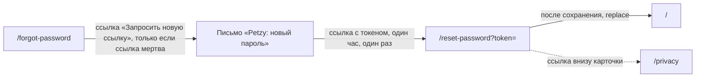

# Аудит пути: Сброс пароля

Маршрут: `/reset-password?token=`, Файл: `frontend/src/pages/ResetPassword.tsx`

## Кто это

Экран, который открывается из письма «Petzy: новый пароль»: человек задаёт новый пароль два раза и
сразу попадает в приложение. Сессию на этом экране создавать не нужно, аккаунт открывается по
ссылке.

- Роли: аноним по ссылке из письма, владелец или приглашённый, у которого пароль нужно сменить
- Глубина: публичный экран, без нижних вкладок (`utils/publicPages.ts:5`, `components/BottomTabBar.tsx:34`)

## Пользовательские истории

1. **.** Я пришёл по ссылке из письма, чтобы задать новый пароль, ввожу его дважды и жму
   «Сохранить и войти». Критерий: тост «Пароль изменён» и открывается лента
   (`pages/ResetPassword.tsx:38`, `:39`).
2. **.** Я не помню требований, чтобы не ошибиться, читаю подсказку под полем. Критерий: «Не короче
   8 символов» (`pages/ResetPassword.tsx:79`).
3. **.** Я ошибся в повторе, чтобы не поставить неверный пароль, правлю второе поле. Критерий: под ним
   «Пароли не совпадают» после ухода с поля (`pages/ResetPassword.tsx:29`).
4. **.** Ссылка протухла или уже открыта, чтобы понять, что делать, открываю ссылку и ввожу пароль.
   Критерий: «Ссылка устарела или уже использована. Запросите новую, она придёт на ту же почту» и
   ссылка «Запросить новую ссылку» (`pages/ResetPassword.tsx:54`).
5. **.** Я открыл ссылку без параметра, чтобы понять, что это, захожу на `/reset-password` вручную.
   Критерий: сразу экран протухшей ссылки, форма не показывается (`pages/ResetPassword.tsx:26`).
6. **.** Я сменил пароль, чтобы узнать, не взломали ли аккаунт, иду в почту. Критерий: приходит
   письмо «Petzy: пароль изменён» с просьбой запросить новую ссылку, если это не я
   (`web/account.py:331`).

## Граф переходов

## Путь по шагам

| Шаг | Действие | Что видит | Чем может кончиться |
| --- | --- | --- | --- |
| 1 | Открывает ссылку из письма | «Придумайте новый пароль», поля «Новый пароль» и «Ещё раз», кнопка «Сохранить и войти» (`pages/ResetPassword.tsx:66`) | Если в адресе нет `token`, сразу экран протухшей ссылки (`pages/ResetPassword.tsx:26`) |
| 2 | Вводит пароль | Подсказка «Не короче 8 символов», кнопка очистки, `autoComplete="new-password"` (`pages/ResetPassword.tsx:81`) | Короткий пароль даёт ошибку под полем после ухода с поля |
| 3 | Вводит пароль ещё раз | Второе поле без подсказки, пока всё совпадает (`pages/ResetPassword.tsx:85`) | Несовпадение останавливает отправку (`pages/ResetPassword.tsx:33`) |
| 4 | Жмёт «Сохранить и войти» | Кнопка в загрузке, поля гаснут (`pages/ResetPassword.tsx:71`) | Успех: тост и переход в ленту. Ссылка мертва: экран протухшей ссылки. Прочее: тост с ошибкой |
| 5 | Попадает в приложение | Аккаунт уже открыт, `signedIn` пишет логин, чистит кэш и спрашивает сессию (`hooks/useAuth.ts:64`) | Другие сессии аккаунта на этом устройстве и в других закрыты (`web/account.py:328`) |

Отмена и возврат: своей кнопки «назад» нет, `Navbar` скрыт (`components/Navbar.tsx:55`). На
экране протухшей ссылки единственный выход это «Запросить новую ссылку» на
`/forgot-password` (`pages/ResetPassword.tsx:58`); на форме выхода вообще нет, только браузерная
кнопка «назад». Ошибка сети: тост «Нет связи с интернетом. Ничего не сохранилось, попробуйте ещё
раз, когда связь появится», поля остаются заполненными (`utils/apiError.ts:10`).

## Состояния экрана

- Загрузка: отдельного загрузчика нет, форма рисуется сразу, токен из адреса читается синхронно
  (`pages/ResetPassword.tsx:17`).
- Пусто: оба поля пустые, подсказка про длину пароля видна сразу.
- Ошибка и повтор: ошибки полей под полями через `FieldError` с `aria-invalid`
  (`hooks/useTouched.ts:19`, `components/FieldError.tsx:26`), серверные ошибки тостом.
- Ссылка мертва: отдельный экран вместо формы, `linkDead` ставится и без токена, и по коду
  `account_link_invalid` (`pages/ResetPassword.tsx:41`).
- Нет доступа: не применимо, экран публичный, проверки пароля на сервере нет.
- Офлайн: запрос падает, тост про отсутствие связи, ссылка не тратится, потому что сервер сначала
  проверяет токен и только потом меняет пароль (`web/account.py:310`).
- Длинные тексты: сервер принимает пароль до 256 символов и отклоняет длиннее 72 байт
  (`web/schemas.py:101`, `web/auth.py:112`).
- Пустые имена: не применимо, логина на экране нет, он приходит в ответе
  (`services/auth.service.ts:61`).
- Не покрыто: проверка токена при открытии экрана. Живой или мёртвый токен известен только после
  отправки формы.

## Точки входа и выхода

Вход: только ссылка из письма «Petzy: новый пароль» (`web/account.py:287`), плюс прямой заход и
`catch-all` для незнакомого адреса (`App.tsx:569`). Выход: на `/` с `replace` после успеха, на
`/forgot-password` с экрана мёртвой ссылки, в `/privacy` ссылкой внизу карточки
(`components/AuthShell.tsx:65`). `goBack` не используется, `returnTo` не читается: адрес с токеном
нельзя восстановить из `state`, поэтому возврата на `/login` на этом экране нет.

## Правила и валидация

- Пароль: минимум 8 символов на клиенте (`pages/ResetPassword.tsx:28`), второй раз должен совпасть
  (`pages/ResetPassword.tsx:29`).
- Клиент не проверяет то, что проверяет сервер: 72 байта, три разных символа, пароль не равен
  логину и не из словаря (`web/auth.py:107`). Эти ответы приходят тостом уже после отправки.
- На сервер уходит `POST /auth/password/reset` с `token` и `password`
  (`services/auth.service.ts:62`). Токен одноразовый, хранится только его SHA-256
  (`web/account.py:53`).
- Сервер проверяет токен до проверки пароля, поэтому неудачный пароль не тратит ссылку
  (`web/account.py:308`).
- Ограничение на адрес: 20 запросов в час (`web/account.py:298`).
- После смены пароля все сессии аккаунта, кроме текущей, отзываются (`web/account.py:328`).
- Введённый пароль нигде не сохраняется, вопроса о несохранённом нет.

## Доступность

- Фокус после перехода встаёт на логотип «Petzy», а не на заголовок «Придумайте новый пароль»
  (`components/AuthShell.tsx:28`, `components/RouteFocus.tsx:26`).
- Подписи полей связаны с полями через `linkLabel`, ошибки через `aria-describedby`
  (`utils/antdA11y.ts:52`, `components/FieldError.tsx:26`).
- Enter на первом поле ведёт на второе, на втором отправляет форму
  (`utils/enterKey.ts:64`, `pages/ResetPassword.tsx:71`).
- Экран протухшей ссылки меняет содержимое карточки целиком и не объявляет смену: `role="status"`
  на экране есть только у `/verify-email` (`pages/VerifyEmail.tsx:43`), здесь его нет.
  Сообщение об ошибке приходит тостом и произносится assertive (`utils/snackbar.ts:88`).
- Крупная кнопка во всю ширину, поля с кнопкой очистки вне порядка обхода
  (`utils/antdA11y.ts:65`).
- Чего нет: кнопки «показать пароль», предупреждения, что пароль изменится на всех устройствах,
  и ссылки «Войти без смены пароля».

## Найденное

| Что | Где | Почему это важно | Тяжесть | Предложение |
| --- | --- | --- | --- | --- |
| Мёртвая ссылка обнаруживается только после заполнения формы | `pages/ResetPassword.tsx:26`, `pages/ResetPassword.tsx:33` | Человек тратит время на два поля, чтобы услышать «Ссылка устарела или уже использована», хотя токен можно проверить сразу | важно | Сделать проверку токена при открытии, как на `/verify-email` (`pages/VerifyEmail.tsx:18`), и сразу показывать экран протухшей ссылки |
| На форме нет выхода, кроме браузерной кнопки «назад» | `pages/ResetPassword.tsx:64` | Тот, кто передумал менять пароль, оказывается в тупике, особенно на телефоне без кнопки у адресной строки | важно | Добавить ссылку «Вернуться ко входу», как на странице восстановления (`pages/ForgotPassword.tsx:78`) |
| Клиент не знает правил сервера для пароля | `pages/ResetPassword.tsx:28`, `web/auth.py:107` | Ответ «Такой пароль легко угадать» или «Пароль слишком длинный» приходит после отправки, поле уже заполнено | важно | Повторить на клиенте проверки из `password_problem`, как это предлагается для регистрации |
| Смена пароля закрывает все сессии аккаунта, экран об этом не говорит | `web/account.py:328`, `pages/ResetPassword.tsx:66` | Человек узнаёт об этом, только когда его выкинет на другом устройстве | важно | Написать под заголовком, что после смены пароля на других устройствах придётся войти снова |
| Токен лежит в адресной строке и остаётся в истории браузера | `pages/ResetPassword.tsx:17`, `web/account.py:53` | Ссылка одноразовая, но её копия остаётся в истории, журнале переходов и в автозаполнении адреса | мелочь | После смены пароля чистить адрес через `navigate('/', { replace: true })`, это уже частично происходит |
| Нет ограничения на ввод пароля длиной экрана | `web/schemas.py:101` | В длинном пароле не видно середины, опечатку в конце не заметить | мелочь | Ограничить длину на клиенте тем же, что на сервере |
| Смена состояния экрана не объявляется | `pages/ResetPassword.tsx:41` | Скринридер не узнает, что форма исчезла и появился другой текст | мелочь | Пометить абзац в состоянии `linkDead` ролью `status`, как на `/verify-email` (`pages/VerifyEmail.tsx:43`) |
| Заголовок вкладки и фокус после перехода всегда «Petzy» | `components/RouteFocus.tsx:26`, `components/AuthShell.tsx:28` | Заголовок «Придумайте новый пароль» есть, но в заголовок вкладки не попадает | мелочь | Рисовать заголовок экрана как `h1` |

## Вопросы к владельцу

- Показывать ли предупреждение про закрытие других сессий до или после смены пароля.
- Нужно ли объяснять, что ссылка одноразовая, на самой странице: сейчас это написано только в
  письме (`web/account.py:288`).
- Что показывать тому, кто пришёл по ссылке, но не помнит, для какого аккаунта она: сейчас логина
  на экране нет вовсе.

## Связанные экраны

- [Забыл пароль](forgot-password.md)
- [Вход](login.md)
- [Пароль в настройках](account-password.md)
- [Политика и согласие](privacy.md)
