# Аудит пути: Настройки

Маршрут: `/settings` Файл: `frontend/src/pages/Settings.tsx`

## Кто это

Вкладка нижнего меню и хаб: отсюда открываются почти все остальные экраны приложения, кроме
Ленты, Лекарств, Документов и самой Медкарты. Восемнадцать строк в десяти группах, из них две
работают не по переходу, а сразу: выключатель уведомлений и выбор темы.

- Роли: любой вошедший. Дополнительно группа «Администрирование» только у администратора
  (`Settings.tsx:300`), строка «Удалить аккаунт» наоборот скрыта у него (`Settings.tsx:320`).
- Глубина: вкладка (`utils/navigation.ts:4`, `MAIN_TAB_PATHS` содержит `/settings`).
  В шапке логотип и переключатель питомцев, кнопки «назад» нет
  (`components/Navbar.tsx:60`, `91-97`, `69`).

## Пользовательские истории

1. **.** Я любой вошедший, чтобы найти и поменять настройки питомца, открываю вкладку
   «Настройки». Критерий: внизу пять вкладок, «Настройки» подсвечена, сверху список групп.
2. **.** Я приглашённый, чтобы понять, что мне нельзя менять, читаю подписи строк. Критерий: у
   «Оформления питомца» и «Событий питомца» подпись «Меняет только владелец питомца», а
   нажать их нельзя, шеврона нет (`Settings.tsx:129-145`).
3. **.** Я владелец, чтобы включить напоминания на этом телефоне, переключаю выключатель в
   группе «Уведомления». Критерий: при включении тост «Уведомления включены»
   (`Settings.tsx:71`).
4. **.** Я владелец, чтобы выгрузить записи питомца, нажимаю «Экспорт записей». Критерий:
   открывается окно с заголовком «Экспорт: <имя питомца>», выбором типа и формата и кнопкой
   «Скачать файл» (`components/ExportModal.tsx:97`, `120-127`).
5. **.** Я владелец, чтобы посмотреть и отозвать выданные врачам ссылки, открываю «Ссылки на
   медкарту». Критерий: список по всем питомцам с датой конца и кнопкой «Отозвать»
   (`pages/MedicalLinks.tsx:84-93`).
6. **.** Я человек, чтобы выйти или удалить аккаунт, дохожу до последней группы «Выход».
   Критерий: «Выйти из аккаунта» спрашивает подтверждение, «Удалить аккаунт» ведёт на
   отдельный экран (`Settings.tsx:334-351`, `327`).

## Граф переходов

```mermaid
graph TD
  Лента["/ Лента"]
  Войти["/login"]
  Онбординг["/welcome"]
  Медкарта["/pets/:id/medical-card"]

  Настройки["/settings"]

  Лента --> Настройки
  Войти -.-> Настройки
  Онбординг -.-> Настройки
  Медкарта -.-> Настройки

  Питомцы["/pets"]
  Оформление["/pet-look"]
  События["/pet-events"]
  Профиль["/pets/:id/medical-profile"]
  Ссылки["/settings/medical-links"]
  История["/history"]
  Экспорт["окно «Экспорт»"]
  Значения["/form-defaults"]
  Типы["/event-types"]
  Почта["/settings/email"]
  Пароль["/settings/password"]
  Справка["/help"]
  Знакомство["/welcome?replay=1"]
  Политика["/privacy"]
  Админ["/admin"]
  Удаление["/settings/delete-account"]

  Настройки --> Питомцы
  Настройки --> Оформление
  Настройки --> События
  Настройки --> Профиль
  Настройки --> Ссылки
  Настройки --> История
  Настройки --> Экспорт
  Настройки --> Значения
  Настройки --> Типы
  Настройки --> Почта
  Настройки --> Пароль
  Настройки --> Справка
  Настройки --> Знакомство
  Настройки --> Политика
  Настройки --> Админ
  Настройки --> Удаление

  Оформление -.-> Настройки
  События -.-> Настройки
  Значения -.-> Настройки
  Типы -.-> Настройки
  Справка -.-> Настройки
  Ссылки -.-> Настройки
  Почта -.-> Настройки
  Пароль -.-> Настройки
  Политика -.-> Настройки
  Админ -.-> Настройки
  Удаление -.-> Настройки

  Настройки --> Выход["диалог «Выход из аккаунта»"]
  Выход -->|"подтвердил «Выйти»"| Выйти["/login"]
```

Профиль для врача и окно экспорта открываются только при выбранном питомце, иначе строка
показывает тост «Сначала выберите питомца» (`Settings.tsx:156`, `207`). «Оформление питомца»
и «События питомца» при выбранном питомце, которым человек не владеет, не переходят вовсе.

## Путь по шагам

Основной сценарий: открыть вкладку, найти группу, нажать строку.

| Шаг | Действие | Что видит | Чем может кончиться |
| --- | --- | --- | --- |
| 1 | Нажимает вкладку «Настройки» | Заголовок «Настройки» (`Settings.tsx:109`) и группы списком | Ничего, экран открыт |
| 2 | Читает группы сверху вниз | «Питомцы», «Медкарта», «Уведомления», «Записи», «Новые записи», «Внешний вид», «Аккаунт», «О приложении», у админа «Администрирование», «Выход» | Порядок групп задан в коде, не настраивается |
| 3 | Жмёт строку с шевроном | Открывается экран, у которого своя кнопка «назад» (`Navbar.tsx:60`) | Вкладка «Настройки» остаётся подсвеченной на всех этих экранах, кроме «Истории записей» (`BottomTabBar.tsx:15`) |
| 4 | Жмёт «Данные для врача» или «Экспорт записей» без питомца | Тост «Сначала выберите питомца» | Экран не открывается, остаётся тот же |
| 5 | Переключает выключатель уведомлений | Тост «Уведомления включены» или «Уведомления отключены» | При отказе тост с текстом ошибки (`Settings.tsx:88`) |
| 6 | Выбирает тему в «Внешний вид» | Тема меняется сразу, тремя кнопками «Светлая», «Тёмная», «Как в системе» | Выбор пишется в localStorage этого браузера (`context/ThemeContext.tsx:43-46`) |
| 7 | Жмёт «Выйти из аккаунта» | Диалог «Выход из аккаунта» с текстом «Вы уверены, что хотите выйти?» и кнопками «Выйти» и «Отмена» | После «Выйти» приложение открывает `/login` с заменой истории (`Settings.tsx:96-98`) |

Куда ведёт каждая строка:

| Группа | Строка | Куда ведёт | Условие |
| --- | --- | --- | --- |
| Питомцы | Мои питомцы | `/pets` | Всегда (`Settings.tsx:124`) |
| Питомцы | Оформление питомца | `/pet-look` | Только владелец питомца (`135`) |
| Питомцы | События питомца | `/pet-events` | Только владелец питомца (`145`) |
| Медкарта | Данные для врача | `/pets/:id/medical-profile` | Нужен выбранный питомец, иначе тост (`156`) |
| Медкарта | Ссылки на медкарту | `/settings/medical-links` | Всегда, питомец не нужен (`163`) |
| Уведомления | Push-уведомления | Не переходит, только выключатель | Выключатель неактивен при `null`, `unsupported`, `denied` и во время запроса (`186`) |
| Записи | История записей | `/history` | Всегда (`200`) |
| Записи | Экспорт записей | Окно «Экспорт» поверх экрана | Нужен выбранный питомец, иначе тост (`207`, `353`) |
| Новые записи | Значения по умолчанию | `/form-defaults` | Всегда (`219`), экран сам скажет, если питомца нет |
| Новые записи | Типы событий | `/event-types` | Всегда (`226`), питомец не нужен |
| Внешний вид | Тема оформления | Не переходит, три кнопки | Всегда (`235-244`) |
| Аккаунт | Почта | `/settings/email` | Всегда (`263`) |
| Аккаунт | Пароль | `/settings/password` | Всегда (`270`) |
| О приложении | Справка | `/help` | Всегда (`280`) |
| О приложении | Знакомство с Petzy | `/welcome?replay=1` | Всегда (`287`) |
| О приложении | Политика конфиденциальности | `/privacy` | Всегда (`294`) |
| Администрирование | Пользователи | `/admin` | Только администратор (`307`) |
| Выход | Выйти из аккаунта | Диалог подтверждения | Всегда (`318`) |
| Выход | Удалить аккаунт | `/settings/delete-account` | Не показывается администратору (`320`) |

При отмене и возврате: у всех экранов, открытых отсюда, кнопка «назад» в шапке возвращает на
предыдущий экран (`Navbar.tsx:46-52`), а не прыгает в Настройки. При ошибке сети у строк
«Почта» и «Пароль» нет ни тоста, ни повтора: подпись просто пропадает. При отсутствии связи
сами настройки применить нельзя, кроме темы: она живёт в localStorage.

## Состояния экрана

| Состояние | Покрыто | Где |
| --- | --- | --- |
| Загрузка | Нет | Группы рисуются сразу, подписи «Почта» и «Пароль» в это время пустые (`Settings.tsx:255`, `268`) |
| Ошибка загрузки аккаунта | Нет | Строки «Почта» и «Пароль» остаются с пустой подписью и работают, повтора нет |
| Нет питомца | Частично | Две строки тостят по нажатию, остальные уводят на экран с «Сначала добавьте питомца» (`components/NoPetState.tsx:13-15`) |
| Нет доступа к питомцу | Да | Подпись «Меняет только владелец питомца», нажатия нет (`Settings.tsx:130`, `141`) |
| Уведомления выключены в браузере | Да | Подпись «Заблокированы в настройках браузера», выключатель неактивен (`177`, `186`) |
| Браузер без push | Да | Подпись «Этот браузер не поддерживает push-уведомления», выключатель неактивен (`175`, `186`) |
| Нет сети | Нет | Кроме темы, ни одна строка не меняется на сервере |
| Длинные имена и почта | Да, обрезкой | Текст в одну строку, `setting-row__description` |

## Точки входа и выхода

Вход: вкладка нижнего меню (`BottomTabBar.tsx:22`, `/settings`), кнопка «Назад» в браузере,
закладка, глубокая ссылка `/settings`. Сам маршрут обёрнут в `ProtectedRoute`
(`App.tsx:471-478`), поэтому без сессии открывается экран входа, а путь, с которого пришли,
остаётся в состоянии роутера (`utils/returnTo.ts:2-4`).

Выход: переходы из таблицы выше. Кнопка «назад» в шапке есть только на экранах, открытых отсюда
(`Navbar.tsx:60`), и возвращает предыдущий экран, а не Настройки. `goBack` из
`utils/navigation.ts:46` на этом экране не используется: здесь нет полей, которые можно
потерять.

## Правила и валидация

Полей ввода на экране нет, валидации нет. Что уходит на сервер: тема оформления хранится в
localStorage браузера (`context/ThemeContext.tsx:45`), состояние push в браузере плюс сервер
(`utils/pushNotifications.ts:91`). Ничего не сохраняется при уходе со страницы, спрашивать
нечего.

## Доступность

- Строка с переходом это `<button>` целиком (`components/SettingsRow.tsx:56-60`), без
  вложенных кнопок: у строки уведомлений нет `onClick`, поэтому выключатель не оказался внутри
  кнопки (`Settings.tsx:170-190`).
- Выключатель уведомлений имеет `aria-label="Push-уведомления"` (`Settings.tsx:184`).
- Тема: `role="group"` с `aria-label`, кнопки с `aria-pressed`
  (`components/Segmented.tsx:16`, `18`).
- Диалог выхода: деструктивная кнопка первая в списке, чтобы её положение не прыгало между
  экранами (`Settings.tsx:340-350`).
- Не хватает: у выключателя в неактивных состояниях нет пояснения в самом элементе, причина
  живёт только в подписи строки, и программа чтения с экрана её не читает.

## Найденное

| Что | Где | Почему это важно | Тяжесть | Предложение |
| --- | --- | --- | --- | --- |
| На iPhone в обычном Safari строка про push говорит «Этот браузер не поддерживает push-уведомления» и гасит выключатель | `Settings.tsx:175`, `186` | Функция `needsHomeScreenForPush()` для этого случая есть и на других экранах даёт правильный текст, но здесь не вызвана | важно | Спросить `needsHomeScreenForPush()` и написать «На iPhone напоминания работают, когда Petzy добавлен на экран „Домой“», как в `components/PushOffNotice.tsx:46`. Продолжает A1-23, отмеченную как «не проверено», и A3-26 |
| В состоянии «Заблокированы в настройках браузера» сказана причина, но не сказано, что делать, и выключатель неактивен | `Settings.tsx:177`, `186` | Человек упирается в строку, у которой нет ни действия, ни выхода | важно | Дописать в подпись, что разрешить уведомления надо для Petzy в настройках браузера, как в `components/PushOffNotice.tsx:45`. То же про A3-28 |
| Две строки, которым нужен питомец, молчат об этом в строке и говорят только тостом после нажатия | `Settings.tsx:156`, `207` | Человек без питомца видит обычную строку со шевроном, а подпись «выбранного питомца» обещает, что питомец есть | важно | Либо уводить на экран с `NoPetState`, как три соседние строки, либо гасить строку, когда питомца нет |
| Тост «Сначала выберите питомца» может прозвучать у человека, у которого питомцы есть | `Settings.tsx:156`, `207`, `hooks/usePet.ts:116-132` | `selectedPetId` пуст не только когда питомцев нет, но и до ответа сервера: авто-выбор первого питомца происходит в эффекте после загрузки списка | важно | Ждать `isFetched`, а не только `selectedPetId`, либо гасить строку, пока список питомцев грузится |
| На «Истории записей» не подсвечена ни одна вкладка | `Settings.tsx:200`, `components/BottomTabBar.tsx:15` | Все остальные экраны Настроек оставляют «Настройки» подсвеченной, а этот ни одну: `/history` не входит в `SETTINGS_PATH`. Справка это описывает (`content/help.ts:299`), то есть намеренно | мелочь | Добавить `/history` в `SETTINGS_PATH` или решить, что история должна быть отдельной вкладкой |
| Пока аккаунт грузится или запрос упал, подписи «Почта» и «Пароль» состоят из одного пробела | `Settings.tsx:255`, `268` | Строка выглядит как заглушка, человек не понимает, есть ли у него почта | мелочь | Пока нет данных, показывать «Загружаем» или «Не удалось загрузить» с повтором |
| Строка «Данные для врача» перечисляет не всё, что на экране | `Settings.tsx:154` | В профиле есть ещё хронические состояния, группа крови и репродуктивный статус (`content/help.ts:162`, `164`) | мелочь | Либо дополнить подпись, либо сократить её до «Всё, что врач спросит про питомца» |
| «Значения по умолчанию» и «Типы событий» лежат в одной группе «Новые записи», хотя первое про выбранного питомца, а второе вообще не про питомца | `Settings.tsx:213-227`, `pages/EventTypesSettings.tsx` | Человек, у которого питомцев нет, ждёт от «Типов событий» того же, что от первой строки | мелочь | Разнести или пояснить в подписи |
| Тема оформления хранится в браузере и не относится к аккаунту | `context/ThemeContext.tsx:45` | На другом устройстве тема другая, и строка об этом не говорит, в отличие от push, где «на этом устройстве» сказано прямо (`Settings.tsx:179`) | мелочь | Дописать «на этом устройстве» или синхронизировать тему с аккаунтом |
| Администратор не видит строки «Удалить аккаунт» и не знает, что она есть | `Settings.tsx:320` | Человек ищет, где удалить аккаунт, и не находит | мелочь | Показать строку неактивной с подписью «Учётную запись администратора удалить нельзя» |

## Вопросы к владельцу

- Нужен ли в шапке Настроек напоминание, какой питомец сейчас выбран. Половина строк работает с
  ним, и на экране этого не написано.
- Порядок групп задан в коде. Он разумный, но человек, который ищет «Удалить аккаунт», должен
  доскроллить до конца. Оставить так или поднять «Выход» повыше.
- Строкам про питомец, когда питомца нет, лучше тост после нажатия или пустой экран с
  предложением добавить питомца.
- Стоит ли показывать «Администрирование» и администратору, но с другим содержанием, чтобы
  экран выглядел одинаково у всех.

## Связанные экраны

- [help.md](help.md), справка, чей раздел «Настройки» описывает этот экран построчно
- [form-defaults.md](form-defaults.md), значения по умолчанию, строка «Новые записи»
- [medical-links.md](medical-links.md), ссылки на медкарту, строка группы «Медкарта»
- [pet-look-settings.md](pet-look-settings.md), оформление питомца, строка группы «Питомцы»
- [pet-events.md](pet-events.md), события питомца, соседняя строка той же группы
- [pets.md](pets.md), мои питомцы, первая строка хаба
- [user-profile.md](user-profile.md), профиль человека, кому отправляют приглашение в питомце
- [account-email.md](account-email.md), почта, строка группы «Аккаунт»
- [account-password.md](account-password.md), пароль, соседняя строка той же группы
- [account-delete.md](account-delete.md), удаление аккаунта, последняя строка экрана
- [admin-panel.md](admin-panel.md), админка, строка, видимая только администратору
- [history.md](history.md), история записей, строка, с которой не подсвечивается ни одна вкладка
- [dashboard.md](dashboard.md), лента, предыдущая вкладка в нижнем меню
- [privacy.md](privacy.md), политика конфиденциальности, строка «О приложении»
- [onboarding.md](onboarding.md), знакомство с Petzy, кнопка повторного показа