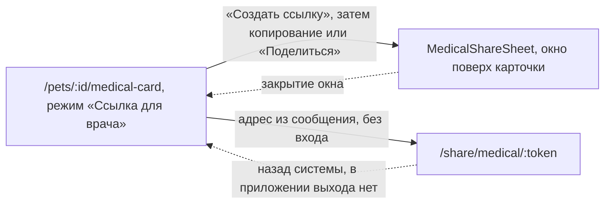

# Аудит пути: Медкарта по ссылке

Маршрут: `/share/medical/:token`, файл: `frontend/src/pages/SharedMedicalCard.tsx`,
сервер: `web/medical_share.py`

## Кто это

Страница для человека без учётной записи: ветеринар или клиника, которому владелец питомца
прислал ссылку. Она открывает медкарту в режиме чтения и её PDF, и ровно до конца срока, пока
владелец её не отозвал.

- Роли: любой, у кого есть ссылка. Сессия не нужна и не проверяется: маршрут вне
  `ProtectedRoute` (`App.tsx:259`), и он в списке публичных страниц, поэтому проба сессии на
  нём не идёт вовсе (`utils/publicPages.ts:8,11`, `hooks/useSession.ts:31-35,46`).
- Глубина: страница без шапки и без нижних вкладок: `Navbar` и `BottomTabBar` на этом маршруте
  не рисуются (`Navbar.tsx:55-57`, `BottomTabBar.tsx:32,51-53`).
- Создаёт ссылку владелец питомца или тот, кому доступ к питомцу дан, из карточки
  (`components/MedicalShareSheet.tsx`), то есть с другой стороны экрана.

## Пользовательские истории

1. **.** Я ветеринар, мне прислали ссылку, и я хочу посмотреть медкарту на приёме. Критерий:
   имя питомца заголовком, ниже то, о чём спрашивают на приёме
   (`SharedMedicalCard.tsx:78-93`, `pages/MedicalCard.tsx:670-825`).
2. **.** Я ветеринар, и мне нужно уйти с этой страницы. Критерий: назад системы. В приложении
   уйти некуда, см. «Найденное».
3. **.** Я ветеринар, и у меня нет сети на приёме, и я хочу иметь карту на телефоне. Критерий:
   кнопка «Скачать PDF» (`pages/MedicalCard.tsx:815`, `677-683`).
4. **.** Я ветеринар, и ссылка не открылась. Критерий: «Ссылка не действует», «Она закончилась
   или её отозвали. Попросите владельца питомца прислать новую»
   (`SharedMedicalCard.tsx:40`).
5. **.** Я ветеринар, и хочу знать, что вижу свежие данные и что страница не вечная. Критерий:
   «Собрано из записей питомца на <дата>. Ссылка действует до <дата>»
   (`SharedMedicalCard.tsx:89`).
6. **.** Я ветеринар, и хочу понять, что просрочено. Критерий: полоса просроченного без
   кнопки, потому что исправлять я не могу (`SharedMedicalCard.tsx:90`,
   `pages/MedicalCard.tsx:415-419`).

## Граф переходов

Рёбер между `/share/medical/:token` и другими маршрутами приложения нет: страница публичная,
ни одна кнопка на ней не ведёт внутрь. Единственное нажатие, ведущее куда-то, это «Скачать
PDF` (`pages/MedicalCard.tsx:680`) и копирование номера чипа (`pages/MedicalCard.tsx:183`).

## Путь по шагам

| Шаг | Действие | Что видит | Чем может кончиться |
| --- | --- | --- | --- |
| 1 | Открыл ссылку | Скелетон: заголовок и шесть строк, без пояснения, что это и чьё | Данные пришли или нет |
| 2 | Данные пришли | Заголовок с именем питомца, ниже строка «Собрано из записей питомца на <дата>. Ссылка действует до <дата>» | Чтение |
| 3 | Прочитал блок здоровья | «Здоровье и аллергии»: аллергии, хронические состояния, заметки, группа крови, номер чипа | Чтение |
| 4 | Прочитал лекарства | Курс лекарства или «Сейчас ничего не принимает» | Чтение |
| 5 | Прочитал блок «На приём» | Только если владелец его заполнил | Чтение |
| 6 | Прочитал прививки и обработки | Просроченные и те, что просрочены по сертификату, или «Не указаны» | Чтение |
| 7 | Прочитал клинику, питание, визиты, операции, прошлые курсы | Только то, что владелец внёс | Чтение |
| 8 | Увидел просроченное | Полоса с текстом и «И ещё N», без кнопки | Ничего сделать нельзя |
| 9 | Нажал «Скачать PDF» | Крутилка на кнопке, потом «PDF сохранён» | Файл у врача |
| 10 | Нажал номер чипа | «Номер чипа скопирован» | |
| 11 | Ссылка не действует | «Ссылка не действует», «Она закончилась или её отозвали. Попросите владельца питомца прислать новую» | Назад системы |
| 12 | Нет связи | То же самое, что в шаге 11 | |
| 13 | Захотел уйти | Назад системы | Вне приложения или обратно на страницу |

## Состояния экрана

| Состояние | Покрыто | Где в коде |
| --- | --- | --- |
| Загрузка | Да, скелетон без пояснений | `SharedMedicalCard.tsx:46-54` |
| Ссылка не действует | Да, один текст на «неверная», «истёкшая» и «отозванная» | `SharedMedicalCard.tsx:36-44`, `web/medical_share.py:146-157` |
| Нет связи | Нет, выглядит как «ссылка не действует» | `SharedMedicalCard.tsx:24,36-44` |
| Карточка пустая | Поля просто пусты, объяснения, что данные не заполнены, нет | `pages/MedicalCard.tsx:140,708-711,759-762` |
| Номер чипа есть | Да, он нажимается и копируется | `pages/MedicalCard.tsx:182-187` |
| Просрочено | Да, текстом, без действия | `SharedMedicalCard.tsx:90`, `pages/MedicalCard.tsx:407-422` |
| Идёт PDF | Да, кнопка с крутилкой и выключена | `pages/MedicalCard.tsx:680` |
| PDF не получился | Тост с текстом сервера | `SharedMedicalCard.tsx:63-65` |
| Врач снял файл, кнопка недоступна | Тост «Не удалось сформировать PDF» | `services/medicalShare.service.ts:39-42` |
| Вошёл в приложение по другой вкладке | Ничего не меняется, страница всё равно без шапки и вкладок | `Navbar.tsx:55-57` |
| Офлайн | То же, что «Нет связи» | |

## Точки входа и выхода

Вход:

- адрес из сообщения, который владелец скопировал или отправил системным меню
  (`MedicalShareSheet.tsx:48-62`);
- в приложении другой путь на эту страницу не ведёт: `PublicPages` сделал её публичной, и
  `BottomTabBar` на ней ничего не рисует (`utils/publicPages.ts:8,11`, `BottomTabBar.tsx:32`).

Выход:

- назад системы: единственный способ, и в приложении назад уводит либо на предыдущую
  страницу вкладки, либо в мессенджер;
- если ссылку открыли во второй вкладке того же браузера, вернуться в приложение можно
  только переключением на другую вкладку;
- внутри страницы переходов в приложение нет вообще, это проверено по вызовам `navigate` и
  `Link` в файлах страницы и в `VetView` (`SharedMedicalCard.tsx`,
  `pages/MedicalCard.tsx:670-826`).

## Правила и валидация

- Токен это 256 случайных бит, в базе лежит только его SHA-256, поэтому копия базы не
  открывает ничего (`web/medical_share.py:6,52-54,87-92`).
- Ссылка делается на 1, 7 или 30 дней (`MedicalShareSheet.tsx:12-16`, `web/medical_share.py:86`),
  и в базе хранится срок с запасом в 30 дней на уборку (`web/medical_share.py:94`).
- Действующих ссылок на питомец не больше десяти, иначе «Слишком много действующих ссылок.
  Отзовите ненужные» (`web/medical_share.py:41,84-85`).
- Отзыв сразу останавливает ссылку (`web/medical_share.py:128-143`), и это проверяется на
  каждом запросе вместе со сроком (`web/medical_share.py:150`).
- Неверный, истёкший и отозванный токен выглядят одинаково: 404 с кодом `not_found`
  (`web/medical_share.py:146-157,178`), чтобы по ответу нельзя было проверить, был ли
  токен вовсе.
- Сервер для этой страницы строит карту с пустым логином (`web/medical_share.py:180`), из-за
  чего `can_edit` всегда ложь (`web/medical_card.py:354`), то есть правки не предлагаются.
- Публичный маршрут ограничен 60 запросами в минуту (`web/medical_share.py:44,168,185`).
- Ответы помечены `Cache-Control: private, no-store`, `X-Robots-Tag: noindex, nofollow,
  noarchive` и `Referrer-Policy: no-referrer` (`web/medical_share.py:160-164`).
- Страница поверх этого добавляет `meta robots` после монтирования
  (`SharedMedicalCard.tsx:26-34`).
- Автора записей в медкарте нет вовсе, поэтому имя владельца или его со-владельца через
  ссылку не утекает (`web/medical_card.py:491`).

## Доступность

- Заголовок страницы это `h1` с именем питомца (`SharedMedicalCard.tsx:78`).
- Разделы это `h2` из `Section` в `VetView` (`pages/MedicalCard.tsx:708,721,728,759,772`),
  блок здоровья помечен `role="group"` и связан с заголовком (`pages/MedicalCard.tsx:129`).
- Полоса просроченного помечена `role="status"`, чтобы её прочитали при появлении
  (`pages/MedicalCard.tsx:408`).
- Кнопка номера чипа это `button` с подписью `Скопировать номер чипа <значение>`
  (`pages/MedicalCard.tsx:183`).
- Сообщение о неработающей ссылке это `h1` внутри `EmptyState`, то есть экран без других
  заголовков читается как начало страницы (`SharedMedicalCard.tsx:40`).
- Чего не хватать: у скелетона нет ни одного слова (`SharedMedicalCard.tsx:49-53`), поэтому
  первый экран у врача без названия и без подсказки, что это за документ. У полосы
  просроченного `role="status"` есть, а у строки со сроком действия ссылки (`89`) нет, и
  скринридер о ней не узнает, если человек читает сверху вниз не визуально.

## Найденное

| Что | Где | Почему это важно | Тяжесть | Предложение |
| --- | --- | --- | --- | --- |
| У врача нет ни шапки, ни вкладок, ни кнопки «назад» | `utils/publicPages.ts:8,11`, `Navbar.tsx:55-57`, `BottomTabBar.tsx:32,51-53` | Страница публичная, поэтому шапка и нижние вкладки на ней не рисуются, а нажатий, ведущих внутрь приложения, нет. Назад есть только у системы. Человек, открывший ссылку во второй вкладке того же браузера, где он вошёл в Petzy, оказывается в приложении без шапки: назад уведёт его на страницу приложения или во внешний источник ссылки | важно | Оставить как есть для врача, но добавить на страницу одну понятную ссылку «Открыть Petzy» или хотя бы строку, что это копия и возврата в приложение нет |
| Вводка об ссылке не описывает, что именно увидит врач | `MedicalShareSheet.tsx:79`, `pages/MedicalCard.tsx:702-813` | Владельцу говорят «В карте аллергии, лекарства и телефон клиники». По ссылке отдаётся заметно больше: визиты, операции, прошлые курсы, блок «На приём», питание и условия, номер чипа. Владелец решает, отдавать ли всё это, по вводке, которая об этом не упоминает. Соседние истории A4-15 и A4-16 из старого аудита помечены исправленными, там речь о самой карточке и о PDF, а не о том, что обещано владельцу до её создания | важно | Переписать вводку по факту: перечислить разделы, которые увидит врач, в одну строку |
| «Скачать PDF» стоит в самом низу, и подсказки про связь нет | `pages/MedicalCard.tsx:691,706,815`, `SharedMedicalCard.tsx:86-92` | Кнопка PDF единственное действие страницы, но блок с ней рисуется внизу только потому, что владельческого `onShare` не передано (`706` и `815`). Подсказка «Скачайте заранее: на приёме может не будет связи» печатается только когда передан `onAll`, а здесь его нет (`691`) | важно | На этой странице ставить кнопку вверх, сразу под строкой со сроком, и печатать подсказку про отсутствие связи |
| «Ссылка не действует» и «нет связи» неразличимы | `SharedMedicalCard.tsx:24,36-44` | У запроса `retry: false`, и любой отказ показан одним и тем же текстом про истёкшую или отозванную ссылку. Врач в приёмной звонит владельцу зря, хотя ссылка жива | важно | Различать сетевую ошибку и 404: при сети «Не удалось загрузить. Проверьте связь» с кнопкой «Повторить» |
| Скелетон без единого слова | `SharedMedicalCard.tsx:46-54` | Первый экран у человека, который не знает приложения, это шесть серых строк без заголовка и без пояснения | мелочь | Написать сверху «Медкарта <питомец>, загрузка» |
| Полоса просроченного без действия и без пояснения | `SharedMedicalCard.tsx:90`, `pages/MedicalCard.tsx:415-419` | Флаг `canAct={false}` убирает кнопку, и врач видит «Записать прививку нельзя», не понимая, что это его забота или нет. Слова «просрочено» в самой полосе тоже нет, есть только текст записи | мелочь | Добавить в полосу слово «просрочено» и, раз действия нет, короткое пояснение |
| Инструкция «не хранить и не индексировать» есть только в заголовках | `web/medical_share.py:9,160-164`, `SharedMedicalCard.tsx:26-34` | Владелец видит вводку «Отправляйте ссылку только врачу» (`MedicalShareSheet.tsx:79`), а врач на странице не видит ничего о том, что это личные данные и что ссылку не надо пересылать. Токен при этом остаётся в адресной строке и в истории браузера врача | мелочь | Одной строкой внизу страницы: «Это личные данные питомца. Не пересылайте ссылку» |
| Формат даты написан второй раз | `SharedMedicalCard.tsx:69`, `services/medicalShare.service.ts:49` | На странице своя копия `toLocaleString` с теми же параметрами, что у `formatShareEnd`. Две реализации одного формата разъедутся при правке одной | мелочь | Взять `formatShareEnd` из сервиса |
| Владелец, открывший свою ссылку, не может вернуться в приложение | `utils/publicPages.ts:11`, `Navbar.tsx:55-57` | Проба сессии на публичной странице выключена (`hooks/useSession.ts:46`), шапки нет. Владелец, который хочет посмотреть на карту глазами врача, оказывается в копии без единого пути назад, кроме системной кнопки | важно | Обсудить с владельцем, стоит ли на этой странице давать вошедшему человеку возврат в приложение |

## Вопросы к владельцу

- Нужен ли врачу доступ к истории записей, а не только к сводке. Сейчас видно последние три
  визита, три операции и три прошлых курса, остальное не показано вовсе
  (`pages/MedicalCard.tsx:674-676,805-813`).
- Стоит ли показывать на странице дату и время последнего изменения карточки, а не только дату
  сборки (`SharedMedicalCard.tsx:89`).
- Нужно ли врачу видеть, кто ещё ведёт питомца. Сейчас в медкарте автора нет вовсе
  (`web/medical_card.py:491`), и для приёма это, возможно, и правильно.
- Что делать, если ссылка попала к постороннему. Сейчас её единственная защита это срок и
  возможность отозвать, а узнать, что ссылку открывали, нельзя.
- Нужен ли счётчик, сколько раз открывали ссылку, чтобы владелец видел, что её пересылали.

## Связанные экраны

- [medical-card.md](medical-card.md), медкарта питомца, из которой делается ссылка
- [medical-links.md](medical-links.md), список действующих ссылок, он же `/settings/medical-links`
- [medical-card-section.md](medical-card-section.md), разделы медкарты, часть которых видна врачу
- [medical-profile-form.md](medical-profile-form.md), данные для врача, первый блок на этой странице
- [visit-prep-form.md](visit-prep-form.md), «На приём», блок, который врач видит, если владелец его заполнил
- [privacy.md](privacy.md), политика, где описано, что и кому отдаётся
- [login.md](login.md), вход, которого на этой странице нет и который врачу не предлагается