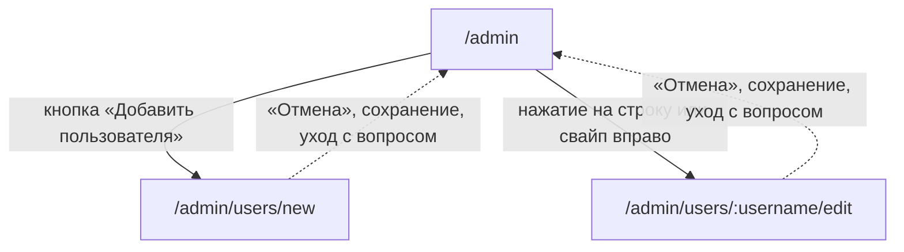

# Аудит пути: Форма человека

Маршруты: `/admin/users/new` и `/admin/users/:username/edit`, файл:
`frontend/src/pages/UserForm.tsx`

## Кто это

Форма учётной записи в руках администратора: логин и пароль при создании, имя, пароль, почта
и состояние доступа при правке. Один и тот же файл на два маршрута, разница только в
заголовке, наборе полей и нижних кнопках.

- Роли: администратор. По коду это нигде не проверяется, экран открыт любому вошедшему
  (`App.tsx:403-418`), в отличие от списка (`AdminPanel.tsx:90-113`).
- Глубина: экран поверх списка пользователей. Открывается кнопкой «Добавить пользователя»,
  нажатием на строку и свайпом вправо «Изменить» (`AdminPanel.tsx:85-88`, `80-83`, `179-184`).

## Пользовательские истории

1. **.** Я администратор, и хочу завести человека, потому что он не может войти сам. Критерий:
   логин, пароль, имя, почта, кнопка «Создать» (`UserForm.tsx:178-263`, `285`).
2. **.** Я администратор, и хочу исправить имя человека. Критерий: правка поля «Полное имя» и
   «Сохранить» (`UserForm.tsx:232-246`, `280-286`).
3. **.** Я администратор, и хочу выдать человеку новый пароль, потому что он его не помнит.
   Критерий: поле «Новый пароль» с подсказкой «Оставьте пустым», чтобы старый не трогать
   (`UserForm.tsx:212-225`), после сохранения у человека выходят все сессии
   (`web/users.py:269-271`).
4. **.** Я администратор, и хочу отключить доступ человека. Критерий: кнопка «Деактивировать» с
   вопросом, а у отключённого «Активировать» (`UserForm.tsx:297-315`).
5. **.** Я администратор, и хочу уйти, не потеряв написанное. Критерий: «Выйти без
   сохранения?» (`UserForm.tsx:66`, `hooks/useUnsavedChangesGuard.tsx:40-52`).
6. **.** Я человек без прав, и открыл этот адрес. Критерий: сообщение о запрете есть только на
   списке, здесь его нет, см. «Найденное».

## Граф переходов

Пунктиром возврат: `goBack` с запасным путём `/admin` (`UserForm.tsx:93,109,125,290`).

## Путь по шагам

| Шаг | Действие | Что видит | Чем может кончиться |
| --- | --- | --- | --- |
| 1 | Нажал «Добавить пользователя» | «Создать пользователя», группа «Учётные данные», поля «Логин», «Пароль», группа «Профиль», поля «Полное имя» и «Email» | Заполнить |
| 2 | Нажал на строку человека | «Редактировать пользователя», логина нет, вместо пароля «Новый пароль» с подсказкой «Оставьте пустым» | Править |
| 3 | Нажал «Создать» без логина | Под полем логина «Введите логин», фокус на нём | Ввести логин |
| 4 | Нажал «Создать» без пароля | «Придумайте пароль» | Придумать |
| 5 | Ввёл почту с ошибкой | «Проверьте email, например name@mail.ru» | Правьте |
| 6 | Нажал «Создать» | Крутилка на кнопке | «Пользователь создан» и возврат к списку |
| 7 | Логин уже занят | Тост «Пользователь с таким именем уже существует» | Поменять логин |
| 8 | Нажал «Сохранить» в правке | «Пользователь обновлён» и возврат | |
| 9 | Нажал «Деактивировать» | Вопрос «Деактивация пользователя», затем «Пользователь деактивирован» и возврат | |
| 10 | Нажал «Активировать» | «Пользователь активирован» и возврат | |
| 11 | Открыл несуществующий логин по адресу | Форма пустая, «Сохранить» работает | Отказ «Пользователь не найден» |
| 12 | Открыл адрес без прав правки | Форма пустая, «Сохранить» работает | Отказ «Доступ только для администратора» |

## Состояния экрана

| Состояние | Покрыто | Где в коде |
| --- | --- | --- |
| Загрузка человека при правке | Да, крутилка | `UserForm.tsx:150-152` |
| Человека нет в списке | Нет: форма остаётся пустой и активной | `UserForm.tsx:69-85,150-152` |
| Нет прав | Нет: форма показывается как обычно | `App.tsx:403-418` |
| Создание | Да, есть поле логина и требуется пароль | `UserForm.tsx:178-225` |
| Правка | Да, логин скрыт, пароль необязательный | `UserForm.tsx:178,201-215` |
| Нет логина | Да, ошибка под полем | `UserForm.tsx:24,183` |
| Нет пароля при создании | Да | `UserForm.tsx:25,215` |
| Некорректная почта | Да | `UserForm.tsx:27,252` |
| Ошибка сервера | Да, тост с текстом сервера | `UserForm.tsx:96,113,128` |
| Идёт запрос | Да, кнопка с крутилкой | `UserForm.tsx:154,281` |
| Успех | Да, тост и возврат к списку | `UserForm.tsx:89-94`, `121-126` |
| Человек отключён | Кнопки внизу меняются на «Активировать» | `UserForm.tsx:297-307` |
| Своя учётная запись | Ни отключения, ни активации | `UserForm.tsx:297` |
| Офлайн | Да, текстом «Нет связи с интернетом. Ничего не сохранилось, попробуйте ещё раз, когда связь появится» | `utils/apiError.ts:10`, `UserForm.tsx:96` |

## Точки входа и выхода

Вход:

- кнопка «Добавить пользователя» на списке, а также пустое состояние списка
  (`AdminPanel.tsx:154-155,260`);
- нажатие на строку списка (`AdminPanel.tsx:202`);
- свайп вправо «Изменить» (`AdminPanel.tsx:179-184`);
- прямой адрес `/admin/users/new` или `/admin/users/<логин>/edit`.

Выход:

- «Отмена» (`UserForm.tsx:287-293`);
- автоматически в `/admin` после создания, сохранения или смены состояния
  (`UserForm.tsx:93,109,125`);
- уход стрелкой в шапке или свайпом с вопросом «Выйти без сохранения?» (`UserForm.tsx:66,319`).

## Правила и валидация

- Создание это `POST /api/users`, правка это `PUT /api/users/<логин>`, отключение это
  `DELETE`, активация это `PUT` с `is_active: true` (`services/users.service.ts`, `UserForm.tsx:88,102-103,119-120`).
- На клиенте четыре правила: логин не пустой, пароль не пустой при создании, имя необязательное,
  почта как почта (`UserForm.tsx:23-28`).
- Сервер требует пароль не короче 6 символов при создании и при правке
  (`web/schemas.py:532,554`), и никаких других правил пароля здесь не проверяет
  (`web/users.py:182`, `web/users.py:257-260`). При регистрации проверок пять
  (`web/auth.py:107-117`).
- Логин на сервере проверяется только на непустоту (`web/schemas.py:531`) и пишется как есть,
  без приведения к нижнему регистру (`web/users.py:175`). При регистрации логин приводится к
  нижнему регистру и проверяется регулярным выражением (`web/auth.py:60,175-181`).
- Почта при создании и правке проверяется только длиной 100, формат не проверяется
  (`web/schemas.py:534,551`), и `email_verified` не выставляется (`web/users.py:186-194`).
- Поле `is_active` намеренно не отправляется (`UserForm.tsx:138-140`).
- Смена пароля и отключение отзывают все сессии человека (`web/users.py:269-271,299`).
- Администратора отключить нельзя, сервер отвечает «Нельзя деактивировать администратора»
  (`web/users.py:292-293`), а экран скрывает действие по своему сравнению «я это или нет»
  (`UserForm.tsx:297`).
- Пустой пароль при правке означает «оставить старый»: в запрос он просто не попадает
  (`UserForm.tsx:135`, `web/users.py:257`).
- Правка загружает данные из общего списка людей, а не из запроса одного человека
  (`UserForm.tsx:56-64`), хотя такой маршрут есть (`web/users.py:211-229`).

## Доступность

- Заголовок `h1`: «Создать пользователя» или «Редактировать пользователя»
  (`UserForm.tsx:164-166`), группы это `Form.Header` («Учётные данные», «Профиль»)
  (`UserForm.tsx:177,230`).
- Все поля с подписями и через `Form.Item`, у логина есть `required` (`UserForm.tsx:183`),
  ошибки это `FieldError`, то есть с `aria-invalid` и `aria-describedby` на поле
  (`components/FieldError.tsx:18-32`).
- У полей правильные `autoComplete`: `username`, `new-password`, `name`, `email`
  (`UserForm.tsx:189,223,241,258`).
- При правке рядом есть скрытое поле с логином для менеджеров паролей
  (`UserForm.tsx:201-211`).
- Валидация по уходу с поля, а не по каждой букве (`UserForm.tsx:39-46`).
- Кнопка отправки это `SpinnerButton` с `aria-busy`, а рядом есть скрытая кнопка отправки
  формы, чтобы работал Enter (`UserForm.tsx:275-286`).
- Опасная кнопка отключения отдельная, с вопросом (`UserForm.tsx:309-314`).
- Чего не хватает: у формы нет ни одного поля, у которого был бы счётчик длины, хотя логин
  ограничен 50 символами и обрежется молча (`web/schemas.py:531`). Кнопка «Деактивировать» и
  «Активировать» идут после кнопок сохранения, хотя отключение человека опаснее, чем
  правка его имени (`UserForm.tsx:280-315`).

## Найденное

| Что | Где | Почему это важно | Тяжесть | Предложение |
| --- | --- | --- | --- | --- |
| Форма открыта любому вошедшему | `App.tsx:403-418`, `UserForm.tsx` (весь файл) | Проверки прав нет нигде в файле, а список пользователей проверяет (`AdminPanel.tsx:90-113`). Человек без прав видит форму целиком, нажимает «Создать» и получает «Доступ только для администратора» (`web/security.py:405-406`, `web/errors.py:56`) | важно | Закрыть оба маршрута той же проверкой `isAdmin`, что и список, с тем же экраном запрета |
| Правка человека, которого нет, затирает имя и почту | `UserForm.tsx:69-85,132-148`, `web/users.py:251-254` | Данные подставляются только когда человек найден (`69-76`), а форма и «Сохранить» показываются в любом случае (`150-152` проверяет только загрузку). «Сохранить» отправляет `full_name: ''` и `email: ''` (`136-137`), а сервер это пишет. Сценарий достижим: список людей не пришёл из-за запрета или сети, а форма уже на экране | важно | При пустом `user` не показывать форму, а показать состояние «Такого пользователя нет» |
| Пароль проверяется только на «не пусто» | `UserForm.tsx:25`, `web/schemas.py:532`, `web/app.py:158` | Сервер требует 6 символов и отвечает кодом 422 с текстом pydantic по-английски, который попадает в русский тост. Правил «не короче 8», «не из частых», «минимум три разных символа», которые есть при регистрации (`web/auth.py:107-117`), здесь нет вовсе, поэтому администратор может создать аккаунт с паролем из шести одинаковых цифр | важно | Позвать `password_problem` в админском маршруте и показать полный список правил под полем |
| Логин не проверяется ничем | `UserForm.tsx:24`, `web/schemas.py:531`, `web/auth.py:60,253-254` | При регистрации логин это 3-30 латинских символов и он приводится к нижнему регистру. Здесь можно ввести что угодно, включая кириллицу и пробелы. При входе регистр подбирается только если точного совпадения нет, поэтому учётная запись «Anna» войдёт только с большой буквы, а с маленькой получит «Неверный логин или пароль» | важно | Тот же шаблон и то же сообщение про логин, что при регистрации, либо проверять на сервере тем же регулярным выражением |
| Почта администратора остаётся неподтверждённой и не видна владельцу | `web/users.py:186-194`, `web/account.py:132`, `AdminPanel.tsx:234-236` | Сервер пишет `email` без `email_verified`, а человек у себя на «Почте» видит «Почта не указана», потому что сервер отдаёт адрес только при `email_verified`. Администратор при этом видит почту в списке и считает, что она работает. Письмо для восстановления пароля при этом уйдёт на этот адрес | важно | Либо помечать такую почту в списке как «не подтверждена», либо просить человека подтвердить её на своём экране |
| Смена пароля у другого человека не говорит, что его выкинет | `UserForm.tsx:212-225`, `web/users.py:269-271` | Сервер отзывает все сессии человека, а на форме нет ни слова об этом. Администратор может удивиться, что человек «вышел» | важно | Пояснение под полем: «После смены пароля человеку придётся войти заново» |
| Правка тянет весь список людей вместо одного | `UserForm.tsx:56-64`, `web/users.py:211-229` | Запрос `GET /api/users` возвращает всех, чтобы найти одного. Маршрут `GET /api/users/<логин>` для этого существует и не используется | мелочь | Брать одного человека, тогда же и состояние «не найден» станет честным |
| Экран собран мимо общих классов приложения | `UserForm.tsx:156-176,266-274` | Здесь инлайновые стили и отступы числами, а не `page-container`, `safe-area-padding`, `section-header` и `.form-actions`, которые есть у соседних экранов (`EventTypeForm.tsx:264,439-445`, `AccountDelete.tsx:101-103`). Форма ещё и горизонтальная (`UserForm.tsx:171-175`) при вертикальной везде в приложении | мелочь | Переписать на общие классы и токены отступов |
| Отключение человека стоит ниже безобидных кнопок | `UserForm.tsx:280-315` | Порядок «Создать или Сохранить», «Отмена», «Деактивировать» обманывает: отключение человека опаснее правки его имени | мелочь | Деактивацию отделить от блока сохранения |
| Скрытая кнопка отправки без формы вокруг | `UserForm.tsx:275-279` | Это `button type="submit"` без родительской `form`, поэтому Enter в полях работает только если `Form` от antd-mobile подставил свою. Проверить это без запуска приложения нельзя | мелочь | Обернуть поля в настоящий `form onSubmit` и отдать Enter ему |

## Вопросы к владельцу

- Нужен ли администратору вообще этот экран, если он может завести человека только вручную.
  Регистрация по приглашению с паролем из письма была бы тем же набором полей без ручного
  придумывания пароля.
- Стоит ли показывать администратору, что у человека уже есть подтверждённая почта, иначе он
  может затереть её своей строкой.
- Нужно ли администратору видеть дату последнего входа человека, чтобы понимать, кого
  отключать. В базе этого нет.
- Стоит ли разрешить администратору менять логин. Сейчас это невозможно, логин скрыт и
  неизменяем (`UserForm.tsx:178,204`).

## Связанные экраны

- [admin-panel.md](admin-panel.md), список пользователей, откуда форма и куда возврат
- [register.md](register.md), обычная регистрация с полным списком правил пароля и логина
- [user-profile.md](user-profile.md), карточка человека обычным способом
- [settings.md](settings.md), настройки, откуда администратор попадает в админку
- [account-delete.md](account-delete.md), удаление аккаунта, недоступное администратору
- [login.md](login.md), вход, где человек без прав увидит отказ по своей учётной записи