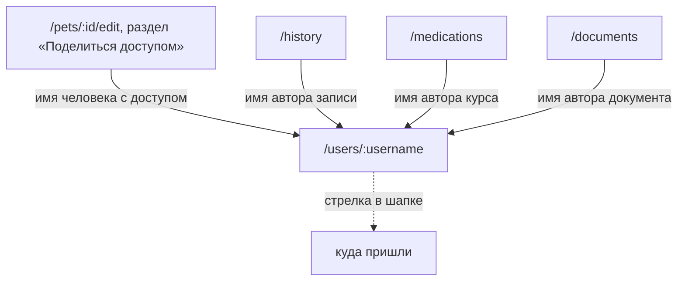

# Аудит пути: Профиль человека

Маршрут: `/users/:username`, файл: `frontend/src/pages/UserProfile.tsx`

## Кто это

Карточка другого человека в приложении: имя, логин, с какого времени в Petzy и какие
питомцы общие. Открывается по имени автора записи и по имени со-владельца в списке
доступа питомца.

- Роли: вошедший человек, у которого есть общий питомец с тем, чью карточку он открыл.
  Аноним не попадёт: маршрут под `ProtectedRoute` (`App.tsx:369-376`). Администратор видит
  чуть больше: ему сервер отдаёт всех питомцев человека (`web/users.py:142-146`).
- Глубина: экран поверх экрана, но числится частью вкладки «Настройки»
  (`BottomTabBar.tsx:15`).

## Пользовательские истории

1. **.** Я приглашённый, чтобы посмотреть, кто ещё ведёт моего питомца, нажать имя автора
   записи. Критерий: имя человека, логин, «На Petzy с января 2024» и список общих
   питомцев (`UserProfile.tsx:60-107`).
2. **.** Я приглашённый, чтобы убедиться, что поймал правильного человека, нажать его имя в
   разделе «Поделиться доступом» формы питомца. Критерий: открылась его карточка
   (`PetForm.tsx:841-858`).
3. **.** Я приглашённый, чтобы понять, что человек не тот, кого я искал, и уйти назад.
   Критерий: «Такого пользователя нет, или у вас нет общего питомца с ним», стрелка в
   шапке возвращает туда, откуда пришли (`UserProfile.tsx:38-58`).
4. **.** Я человек, чтобы посмотреть, какие питомцы у меня общие с тем, кого я только что
   пригласил. Критерий: у человека пусто «Нет общих питомцев», пока он не примет
   приглашение (`UserProfile.tsx:102-106`).

## Граф переходов

Пунктиром возврат: маршрут не вкладка, в шапке есть стрелка назад
(`utils/navigation.ts:4,15-17`).

## Путь по шагам

| Шаг | Действие | Что видит | Чем может кончиться |
| --- | --- | --- | --- |
| 1 | Нажал имя | Пока грузится, крутилка | Карточка или «Профиль недоступен» |
| 2 | Данные пришли | Аватар 88 пикселей, имя, `@логин`, «На Petzy с января 2024», заголовок «Общие питомцы» | Дальше идти некуда, на экране нет действий |
| 3 | Посмотрел список | По одной карточке на общего питомца с иконкой лапки и именем | Карточка не нажимается, питомца отсюда не открыть |
| 4 | Общих питомцев нет | «Нет общих питомцев» | |
| 5 | Человека нет или общего питомца нет | «Профиль недоступен» и «Такого пользователя нет, или у вас нет общего питомца с ним» | Только стрелка назад |
| 6 | Сеть не пришла | «Профиль недоступен» и «Не удалось загрузить профиль. Попробуйте ещё раз» | Повторить на экране нельзя |

## Состояния экрана

| Состояние | Покрыто | Где в коде |
| --- | --- | --- |
| Загрузка | Да, крутилка | `UserProfile.tsx:34-36` |
| Человека нет или нет общего питомца | Да, один текст на оба случая, как и на сервере | `UserProfile.tsx:38-53`, `web/users.py:108-146` |
| Ошибка сети | Текст есть, повтора нет | `UserProfile.tsx:49-53` |
| Нет имени, есть логин | Да, в заголовке логин без `@` | `UserProfile.tsx:70` |
| Нет даты регистрации | Да, строка не показывается | `UserProfile.tsx:77-81` |
| Нет общих питомцев | Да, «Нет общих питомцев» | `UserProfile.tsx:102-106` |
| Офлайн | Нет | |
| Длинное имя | Да, переносится в заголовке | `UserProfile.tsx:69-71` |
| Два питомца с одинаковым именем | Ключ списка одинаковый, это ломает список | `UserProfile.tsx:91-93` |

## Точки входа и выхода

Вход:

- раздел «Поделиться доступом» в форме питомца, имя человека, у которого уже есть доступ
  (`PetForm.tsx:843`);
- автор записи в истории (`components/HistoryItem.tsx:198`);
- автор курса лекарства (`pages/MedicationsList.tsx:529`);
- автор документа (`pages/DocumentsList.tsx:505`);
- своей карточки в приложении нет: открыть свою можно только из своей же записи, где имя
  автора ведёт на свой логин.

Выход:

- на экране нет ни одной кнопки, кроме стрелки в шапке;
- админский экран того же человека это другой маршрут, `/admin/users/:username/edit`
  (`pages/AdminPanel.tsx:82`).

## Правила и валидация

- Запрос: `GET /api/users/<username>/profile`, без повторов при ошибке
  (`UserProfile.tsx:27-32`, `services/users.service.ts:75`).
- Сервер отдаёт `username`, `full_name`, `created_at` и `shared_pets`, причём
  `shared_pets` это список имён, а не идентификаторов (`web/users.py:152-159`).
- Общих питомцев человек не увидит, пока не примет приглашение: питомец попадает в список
  по `shared_with` (`web/users.py:129-140`).
- Сервер намеренно не различает «нет человека» и «нет общего питомца», чтобы по ответу не
нельзя было проверить существование логина (`web/users.py:112-121`). Экран повторяет то же.
- Дату «с какого времени» экран собирает сам из строки вида «ГГГГ-ММ-ДД ЧЧ:ММ»
  (`UserProfile.tsx:13-22`).

## Доступность

- Заголовок это `h1` с именем или логином (`UserProfile.tsx:69-71`).
- Второй уровень это `h2` «Общие питомцы» (`UserProfile.tsx:86-88`).
- Список общих питомцев это `div` без роли списка, элементы это `div`, а не ссылки и не
  кнопки (`UserProfile.tsx:90-101`).
- Аватар с `fullName` (`components/UserAvatar.tsx`), у карточки человека есть текстовое
  имя рядом, поэтому картинка не единственный источник имени.
- Чего не хватает: у пустого состояния «Профиль недоступен» нет кнопки, поэтому с
  клавиатуры и без зрения уйти с него можно только стрелкой в шапке
  (`UserProfile.tsx:46-54`), и у сообщения об ошибке нет `role="alert"`.

## Найденное

| Что | Где | Почему это важно | Тяжесть | Предложение |
| --- | --- | --- | --- | --- |
| «Попробуйте ещё раз» без кнопки повтора | `UserProfile.tsx:49-53`, `EmptyState` требует `onAction`, которого нет | Человек без сети видит призыв повторить и не может: ни кнопки, ни автоматического повтора (`retry: false`) | важно | Либо передать `actionLabel` и `onAction` в `EmptyState`, либо убрать призыв |
| Общие питомцы приходят именами, поэтому карточка питомца никуда не ведёт | `UserProfile.tsx:91-99`, `web/users.py:146` | Человек видит «Рекс» и не может его открыть. Питомец известен по имени, а не по id, и в списке две карточки «Рекс» неразличимы | важно | Отдавать id вместе с именем и сделать карточку ссылкой на `/pets/:id/medical-card` |
| Ключ списка это имя питомца | `UserProfile.tsx:91-93` | В семье могут быть два питомца с одинаковым именем, тогда React увидит два одинаковых ключа и один из узлов может не перерисоваться | мелочь | Ключ по id, как только сервер его отдаст |
| Своей карточки в приложении нет | `PetForm.tsx:843`, `components/HistoryItem.tsx:198`, `pages/MedicationsList.tsx:529`, `pages/DocumentsList.tsx:505` | Открыть можно только чужих людей: своя карточка попадает под курсор только в собственных записях. В настройках строки нет | мелочь | Добавить строку «Мой профиль» в настройки |
| Экран числится частью вкладки «Настройки», но в шапке у него стрелка назад и нет переключателя питомцев | `BottomTabBar.tsx:15`, `utils/navigation.ts:4,15-17` | То же расхождение, что и на `/pets`: подсвечена «Настройки», а экран выглядит отдельным | мелочь | Решить вместе с `/pets`, см. [pets.md](pets.md) |
| Ошибку загрузки не объявляет скринридер | `UserProfile.tsx:38-58` | Экран молча меняет содержимое, у пустого состояния нет `role="status"` | мелочь | Добавить `role="alert"` состоянию с ошибкой |
| Список общих питомцев без роли и без навигации | `UserProfile.tsx:90-101` | Скринридер читает «Рекс» два раза подряд без пояснения, что это список | мелочь | Оформить списком, если питомцы станут ссылками |

## Вопросы к владельцу

- Что человек должен сделать на этом экране. Сейчас он может только посмотреть, и это
  честно, но стоит ли показать что-то ещё: связаться, позвать в свой питомец, увидеть его
  роль.
- Нужен ли заголовок «Общие питомцы», если общих питомцев обычно один.
- Стоит ли показывать, кто именно автор записи: сейчас на карточке человека нет ничего о
  том, чем он занимался в общем питомце.
- Свою карточку человек, вероятно, видеть не должен, а чужую он видит. Это правильно, но
  решение стоит зафиксировать.
- «На Petzy с января 2024» говорит о регистрации. Достаточно ли этого, или нужно «в
  приложении с января 2024».

## Связанные экраны

- [pet-form.md](pet-form.md), форма питомца, откуда открывается эта карточка
- [history.md](history.md), история, имя автора записи
- [medications-list.md](medications-list.md), лекарства, имя автора курса
- [documents-list.md](documents-list.md), документы, имя автора
- [settings.md](settings.md), настройки, вкладка подсвечена на этом маршруте
- [user-form.md](user-form.md), админская форма того же человека, другой маршрут