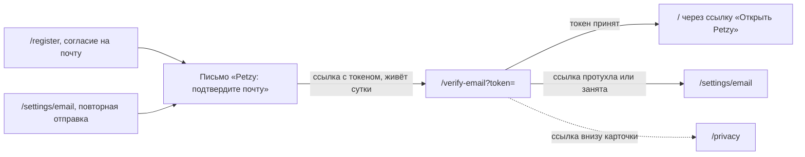

# Аудит пути: Подтверждение почты

Маршрут: `/verify-email?token=`, Файл: `frontend/src/pages/VerifyEmail.tsx`

## Кто это

Экран, который открывается из письма о подтверждении почты. Здесь нет формы: Petzy сам отправляет
токен на сервер один раз при открытии страницы и показывает результат одним предложением.

- Роли: аноним по ссылке из письма, чаще всего тот, кто открыл письмо на другом устройстве
- Глубина: публичный экран, без нижних вкладок (`utils/publicPages.ts:5`, `components/BottomTabBar.tsx:34`)

## Пользовательские истории

1. **.** Я только что зарегистрировался, чтобы подтвердить почту, открываю ссылку из письма.
   Критерий: «Подтверждаем почту…», затем «Почта подтверждена. Если забудете пароль, ссылка для
   нового придёт на неё» (`pages/VerifyEmail.tsx:32`, `:33`).
2. **.** Я переустановил приложение и открыл письмо на другом устройстве, чтобы подтвердить почту без
   входа в аккаунт. Критерий: экран работает без сессии, серверная проверка входа не требуется
   (`web/account.py:222`).
3. **.** Ссылка протухла, потому что я открыл её второй раз, чтобы понять, что делать. Критерий:
   «Ссылка устарела или уже использована. Отправить новое письмо можно в Настройках, в разделе
   «Почта»» (`pages/VerifyEmail.tsx:34`).
4. **.** Эту почту уже заняли в другом аккаунте, чтобы понять, что делать. Критерий: «Эта почта
   уже подтверждена в другом аккаунте Petzy. Укажите другую в Настройках» (`pages/VerifyEmail.tsx:35`).
5. **.** Нет связи, чтобы повторить попытку, читаю, что делать. Критерий: «Не удалось подтвердить
   почту. Проверьте соединение и откройте ссылку ещё раз» (`pages/VerifyEmail.tsx:36`).
6. **.** Я закончил, чтобы вернуться в приложение, жму «Открыть Petzy». Критерий: открывается лента
   или, если на этом устройстве нет сессии, экран входа (`pages/VerifyEmail.tsx:48`).

## Граф переходов

## Путь по шагам

| Шаг | Действие | Что видит | Чем может кончиться |
| --- | --- | --- | --- |
| 1 | Открывает ссылку | Спиннер и текст «Подтверждаем почту…» (`pages/VerifyEmail.tsx:32`) | Нет токена в адресе: сразу состояние протухшей ссылки (`pages/VerifyEmail.tsx:15`) |
| 2 | Ждёт ответа сервера | Спиннер, текст не меняется, кнопки нет (`pages/VerifyEmail.tsx:42`) | Успех, протухшая ссылка, занятая почта или ошибка связи |
| 3 | Читает результат | Одно предложение, `role="status"` (`pages/VerifyEmail.tsx:43`) | В любом состоянии появляется ссылка «Открыть Petzy» (`pages/VerifyEmail.tsx:46`) |
| 4 | Жмёт «Открыть Petzy» | Переход на `/` (`pages/VerifyEmail.tsx:48`) | Без сессии на этом устройке `ProtectedRoute` отправляет на `/login` (`components/ProtectedRoute.tsx:25`) |

Отмена и возврат: своей кнопки «назад» нет, `Navbar` скрыт (`components/Navbar.tsx:55`). Выход
один: ссылка «Открыть Petzy». Ошибка сети: состояние `failed` с текстом про проверку соединения,
сам токен при этом не тратится, но ссылка одноразовая и второй запрос с неё уже не пройдёт
(`web/account.py:225`).

## Состояния экрана

- Загрузка: `SpinLoading` внутри карточки и текст «Подтверждаем почту…» с многоточием
  (`pages/VerifyEmail.tsx:32`). Единственный экран из шести, где есть индикатор ожидания.
- Готово: «Почта подтверждена. Если забудете пароль, ссылка для нового придёт на неё».
- Ссылка мертва: «Ссылка устарела или уже использована. Отправить новое письмо можно в Настройках,
  в разделе «Почта»».
- Почта занята: «Эта почта уже подтверждена в другом аккаунте Petzy. Укажите другую в Настройках».
- Ошибка: «Не удалось подтвердить почту. Проверьте соединение и откройте ссылку ещё раз».
- Нет токена: состояние `dead` без обращения к серверу (`pages/VerifyEmail.tsx:15`).
- Пусто: применимо только к адресу без токена, отдельного текста «ссылка неполная» нет.
- Офлайн: состояние `failed`, кнопка «Открыть Petzy» есть, повтор возможен только перезагрузкой
  страницы.
- Длинные тексты: состояния однострочные, на телефоне переносятся, специальных правил нет.

## Точки входа и выхода

Вход: ссылка из письма о подтверждении, которую отправляет регистрация
(`web/auth.py:226`) и повторная отправка из `/settings/email` (`web/account.py:193`), плюс
прямой заход и `catch-all` (`App.tsx:569`). Выход: на `/` по ссылке «Открыть Petzy», в `/privacy`
ссылкой внизу карточки (`components/AuthShell.tsx:65`). Пути, которые упомянуты в текстах, в коде
экрана не реализованы: ни перехода в `/settings/email`, ни в `/settings`, ни в `/login` здесь нет.

## Правила и валидация

- Токен читается из адреса (`pages/VerifyEmail.tsx:14`). Без него запрос не уходит, состояние
  сразу `dead` (`pages/VerifyEmail.tsx:20`).
- Запрос уходит ровно один раз за монтирование: `useRef` защищает от повторного эффекта в
  StrictMode, потому что токен одноразовый (`pages/VerifyEmail.tsx:16`, `web/account.py:225`).
- На сервер уходит `POST /auth/email/verify` с `token` (`services/auth.service.ts:67`). Вход в
  аккаунт не нужен, поэтому экран работает с чужого устройства (`web/account.py:222`).
- Ответ разбирается по коду: `account_link_invalid` идёт в `dead`, `account_email_taken` в `taken`,
  всё остальное в `failed` (`pages/VerifyEmail.tsx:26`, `web/errors.py:93`).
- Ограничение на адрес: 30 запросов в час (`web/account.py:215`).
- Сервер проверяет, что почта аккаунта всё ещё ждёт подтверждения, иначе ссылка считается
  протухшей (`web/account.py:230`).
- Срок жизни ссылки сутки (`web/account.py:43`), на экране он не назван.

## Доступность

- Текст состояния помечен `role="status"`, поэтому смена с «Подтверждаем почту…» на результат
  произносится (`pages/VerifyEmail.tsx:43`). Это единственное место среди шести экранов, где
  смена состояния объявлена, на `/login` и `/register` результат приходит тостом.
- `h1` это логотип «Petzy» (`components/AuthShell.tsx:28`), на него встаёт фокус после перехода
  (`components/RouteFocus.tsx:26`).
- Спиннер без подписи, текст рядом объясняет, что происходит, поэтому он не мешает.
- Ссылка «Открыть Petzy» обычная, с классом `tap-link`, но это не кнопка, размер зоны зависит от
  текста (`pages/VerifyEmail.tsx:48`).
- Полей нет, поэтому `linkLabel`, `FieldError` и правила `enterKey.ts` здесь не работают.
- Чего нет: `aria-live` для смены состояния, `role="status"` есть, но само слово «готово» или
  «ошибка» не проговаривается отдельно, только весь текст.

## Найденное

| Что | Где | Почему это важно | Тяжесть | Предложение |
| --- | --- | --- | --- | --- |
| Тексты отправляют в Настройки, а единственная кнопка ведёт в `/` | `pages/VerifyEmail.tsx:34`, `pages/VerifyEmail.tsx:35`, `pages/VerifyEmail.tsx:48` | Человек без сессии на этом устройстве, а это обычное дело для ссылки из письма, попадает на `/login`, а не в нужный раздел | блокер | В состояниях `dead` и `taken` дать кнопки «Открыть Petzy», «Войти» и «Настройки, Почта», где последняя ведёт в `/settings/email` (`App.tsx:487`) |
| После успеха нет пути в раздел «Почта», хотя почта только что подтвердилась | `pages/VerifyEmail.tsx:33` | Человеку нечего делать, кроме как вернуться в приложение и искать раздел самому | мелочь | Добавить вторую ссылку на `/settings/email` рядом с «Открыть Petzy» |
| В состоянии `failed` кнопки «повторить» нет, только перезагрузка страницы | `pages/VerifyEmail.tsx:36`, `pages/VerifyEmail.tsx:46` | Текст зовёт открыть ссылку ещё раз, но на экране для этого нет действия, приходится нажимать адресную строку телефона | важно | Дать кнопку «Попробовать снова», которая повторяет запрос с тем же токеном, или объяснять, что нужно открыть ссылку заново |
| Ссылка без токена даёт тот же текст, что и протухшая | `pages/VerifyEmail.tsx:15`, `pages/VerifyEmail.tsx:34` | При обрезанной сроке в письме человек не понимает, что именно сломалось | мелочь | Отдельный текст для ссылки без токена |
| Срок жизни ссылки не назван | `web/account.py:43`, `pages/VerifyEmail.tsx:31` | Человек не знает, стоит ли просить новое письмо или подождать | мелочь | Добавить в текст протухшей ссылки, что она живёт сутки |
| Ограничение 30 запросов в час не видно, но при частом переборе человек получит 429 и увидит состояние `failed` | `web/account.py:215`, `pages/VerifyEmail.tsx:27` | Ошибка ограничения выглядит как «нет связи» и зовёт повторить, хотя повтор только увеличит счётчик | мелочь | Различать 429 и сетевую ошибку, как это сделано на входе (`pages/Login.tsx:70`) |
| Фокус после перехода встаёт на логотип, а не на текст состояния | `components/AuthShell.tsx:28`, `components/RouteFocus.tsx:26` | Скринридер объявляет «Petzy», а не то, что почта подтверждена | важно | Рисовать заголовок состояния как `h1` на экранах без формы |
| Экран открывается без сессии, но ссылка «Открыть Petzy» ведёт на защищённый маршрут | `pages/VerifyEmail.tsx:48`, `components/ProtectedRoute.tsx:25` | После успешного подтверждения человек упирается в форму входа, хотя только что доказал, что у него есть аккаунт | важно | Проверять наличие сессии и сразу открывать нужный раздел, а не `/` |

## Вопросы к владельцу

- Что показывать тому, кто подтвердил почту, но ещё не вошёл: «Открыть Petzy» ведёт на `/`, а
  сессии на этом устройстве обычно нет.
- Нужен ли отдельный экран, если письмо подтверждает смену почты уже подтверждённого адреса: сервер
  в этом случае отвечает тем же успехом, но письмо другое (`web/account.py:244`).
- Оставлять ли ограничение 30 запросов в час и что показывать при его срабатывании.

## Связанные экраны

- [Регистрация](register.md)
- [Почта в настройках](account-email.md)
- [Настройки](settings.md)
- [Вход](login.md)
- [Политика и согласие](privacy.md)
