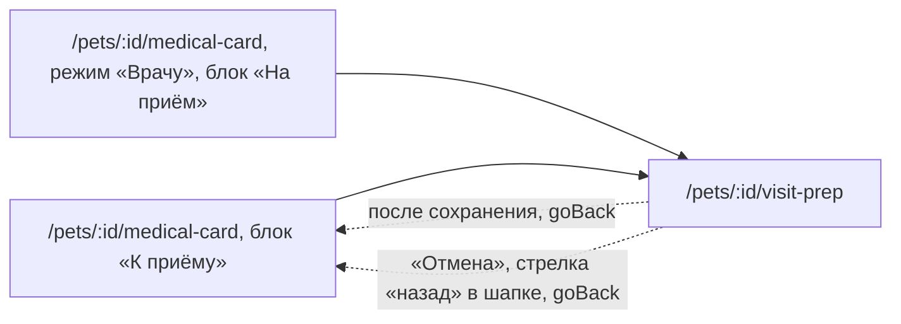

# Аудит пути: К приёму

Маршрут: `/pets/:id/visit-prep`, Файл: `frontend/src/pages/VisitPrepForm.tsx`

## Кто это

Короткая форма на один приём: что беспокоит питомца и по семи признакам «как обычно» или
«изменилось». Это то, что врач читает первым, и то, что человек пишет в ожидании приёма,
чтобы не забыть половину. После записи визита заметка очищается сама.

- Роли: владелец и приглашённый с доступом к питомцу. Сервер проверяет доступ так же, как
  профиль: `get_pet_and_validate(..., require_owner=False)` (`web/medical_card.py:524`,
  маршрут `:510`), аноним сюда не попадает, маршрут внутри `ProtectedRoute` (`App.tsx:346`)
- Глубина: экран поверх вкладки «Медкарта», вкладкой не считается
  (`utils/navigation.ts:7`), в шапке кнопка «назад» и нет переключателя питомца
  (`components/Navbar.tsx:60`, `:69`)
- Это единственный экран медкарты без круглой кнопки «+» (`pages/VisitPrepForm.tsx:80`)

## Пользовательские истории

1. **.** Я иду к врачу через неделю, чтобы не забыть жалобы, открываю «К приёму» из медкарты.
   Критерий: поле «Что беспокоит» с подсказкой «Например, третий день не ест, кашляет по ночам»
   (`pages/VisitPrepForm.tsx:91`, `:95`).
2. **.** Я не хочу писать, что аппетит в норме, жму «Как обычно» у строки «Аппетит». Критерий:
   чип остаётся нажатым, на карте в «На приём» появляется строка «Как обычно: аппетит»
   (`pages/VisitPrepForm.tsx:105`, `pages/MedicalCard.tsx:596`).
3. **.** Я передумал, жму тот же чип ещё раз. Критерий: ответ снимается, а не ставится
   наоборот (`pages/VisitPrepForm.tsx:49`).
4. **.** Аппетит изменился, жму «Изменилось». Критерий: на карте эта строка красная и стоит
   первой (`pages/MedicalCard.tsx:592`).
5. **.** Записал визит в медкарте, чтобы анкета не осталась висеть от прошлого приёма.
   Критерий: жалоба из анкеты переносится в форму визита, а сама анкета очищается
   (`pages/MedicalRecordForm.tsx:321`, `:461`).
6. **.** Заметка больше не нужна, жму «Убрать заметку». Критерий: кнопка называет себя так,
   когда поле пустое и заметка уже сохранена (`pages/VisitPrepForm.tsx:118`).

## Граф переходов

## Путь по шагам

| Шаг | Действие | Что видит | Чем может кончиться |
| --- | --- | --- | --- |
| 1 | Жмёт «Добавить» или «Изменить» в блоке «К приёму» | Заголовок «К приёму», имя питомца и строка «Врач увидит это первой строкой. После записи визита заметка очищается» (`pages/MedicalCard.tsx:925`, `pages/VisitPrepForm.tsx:83`, `:86`) | Кнопка называется «Изменить», если заметка уже есть (`pages/MedicalCard.tsx:924`) |
| 2 | Пишет, что беспокоит | Поле на три строки, растягивается до восьми, счётчик символов (`pages/VisitPrepForm.tsx:92`, `:98`) | Больше 500 символов не вводится (`pages/VisitPrepForm.tsx:96`) |
| 3 | Отвечает по семи признакам | Заголовок «Что изменилось», строки «Аппетит», «Жажда», «Стул», «Моча», «Рвота», «Кашель», «Активность» с чипами «Как обычно» и «Изменилось» (`pages/VisitPrepForm.tsx:101`, `services/medicalCard.service.ts:85`) | Повторное нажатие снимает ответ, чтобы вернуть «не отвечено» (`pages/VisitPrepForm.tsx:49`) |
| 4 | Жмёт «Сохранить» | Кнопка в состоянии ожидания, затем тост и возврат на медкарту (`pages/VisitPrepForm.tsx:117`, `:61`) | Пустая заметка сохраняется как пустая, тост «Заметка к приёму убрана» (`pages/VisitPrepForm.tsx:61`) |
| 5 | Записывает визит в медкарте | В форме визита жалоба уже подставлена, анкета после сохранения очищена (`pages/MedicalRecordForm.tsx:321`, `:461`) | Старое «К приёму» на карте исчезает (`pages/MedicalCard.tsx:931`) |

Отмена и возврат: «Отмена» и стрелка «назад» уходят через `goBack`, то есть назад по
истории, а при прямой ссылке на адрес медкарты (`utils/navigation.ts:46`,
`pages/VisitPrepForm.tsx:122`). При несохранённом ответе показывается вопрос
`useUnsavedChangesGuard` (`pages/VisitPrepForm.tsx:43`).
Ошибка сети: тост «Не удалось сохранить», набранное остаётся (`pages/VisitPrepForm.tsx:65`).

## Состояния экрана

- Загрузка: `LoadingSpinner` (`pages/VisitPrepForm.tsx:77`).
- Пусто: сохранённой заметки нет, поля пустые, но форма уже в счёте «изменённого», потому что
  ответили хотя бы по одному признаку (`pages/VisitPrepForm.tsx:41`).
- Пустота как признак удаления: если всё стереть и есть сохранённая заметка, кнопка
  переименовывается в «Убрать заметку» (`pages/VisitPrepForm.tsx:118`).
- Ошибка загрузки: «Не удалось загрузить анкету к приёму» с «Повторить»
  (`pages/VisitPrepForm.tsx:72`). Ответа 403 и 404 здесь нет, в отличие от медкарты и её
  раздела (`pages/MedicalCard.tsx:875`, `pages/MedicalCardSection.tsx:235`).
- Офлайн: «Нет связи с интернетом. Когда связь появится, нажмите «Повторить»»
  (`components/LoadError.tsx:39`).
- Неотвеченный признак на карте просто не показывается, а не помечается как «не отвечено»
  (`pages/MedicalCard.tsx:586`).
- Черновик на время сессии: значения восстанавливаются после ухода со страницы
  (`hooks/useSessionDraft.ts:20`, `pages/VisitPrepForm.tsx:44`).

## Точки входа и выхода

Вход: блок «К приёму» на медкарте, кнопки «Добавить» и «Изменить»
(`pages/MedicalCard.tsx:925`), блок «На приём» в режиме «Врачу» (`pages/MedicalCard.tsx:723`),
адрес из закладки или уведомления.
Выход: только назад, на медкарту. Других ссылок на экране нет.

## Правила и валидация

Это единственная форма медкарты без схемы проверки (`pages/VisitPrepForm.tsx:23`): проверок
нет ни на клиенте, ни на сервере, кроме длины жалобы.

- жалоба не больше 500 символов, ровно столько же проверяет сервер
  (`pages/VisitPrepForm.tsx:96`, `web/schemas.py:2280`)
- признаки отвечаются чипами, значение одно из двух (`pages/VisitPrepForm.tsx:47`)
- сервер отвергает неизвестный признак и значение не из списка
  (`web/schemas.py:2296`)
- при сохранении жалоба обрезается, пустая уходит как `null`, пустой объект очищает заметку
  (`pages/VisitPrepForm.tsx:58`, `web/schemas.py:2278`)
- серверной версии у заметки нет, поэтому вопроса о конфликте правок не бывает
  (`web/medical_card.py:510`), в отличие от профиля (`web/medical_card.py:463`)
- «изменённым» считается сам факт ответа, а не разница с сохранённым
  (`pages/VisitPrepForm.tsx:42`), поэтому вернуть все ответы в «не отвечено» и уйти всё
  равно спросит о несохранённом

## Доступность

- Каждая строка это группа с подписью, у каждого чипа `aria-pressed`, то есть состояние
  «отвечено» слышно и рисуется (`components/ChoiceChips.tsx:8`, `:21`)
- Поле жалобы многострочное и само расширяется, но с клавиатуры между полями не перейти: на
  экране одно поле (`pages/VisitPrepForm.tsx:92`)
- Счётчик символов помечен `aria-hidden`, а при достижении предела один раз произносится
  «Достигнут предел: 500 символов» (`components/FieldNote.tsx:38`, `:44`)
- Кнопка сохранения липкая и остаётся в доступе, форма помещается в экран целиком
  (`pages/VisitPrepForm.tsx:116`, `styles/globals.css:2204`)

## Найденное

| Что | Где | Почему это важно | Тяжесть | Предложение |
| --- | --- | --- | --- | --- |
| Пустая заметка сохраняется с сообщением «Заметка к приёму убрана» | `pages/VisitPrepForm.tsx:61` | Если человек ничего не писал, а заметки раньше не было, он видит сообщение об удалении того, чего не было. Кнопка при этом знает разницу и зовётся «Сохранить» (`pages/VisitPrepForm.tsx:118`), а сообщение про `saved` не знает | важно | Считать «было сохранено» до нажатия и говорить «Записано к приёму» либо «Заметка к приёму убрана» только если она правда была |
| У сервера нет версии заметки, поэтому два человека правят друг друга молча | `web/medical_card.py:510` против `web/medical_card.py:463` | Профиль защищён вопросом «Профиль изменили», а «К приёму» перезаписывается целиком без вопроса. Второй человек теряет свой текст | важно | Добавить версию и тот же вопрос, что у профиля |
| Ответа 403 и 404 на форме нет, в отличие от медкарты и её раздела | `pages/VisitPrepForm.tsx:72` против `pages/MedicalCard.tsx:875` | Питомец удалён или доступ закрыт: «Не удалось загрузить анкету к приёму» и «Повторить», который повторяет ту же ошибку | важно | Повторить ветку 403 и 404 с пустым состоянием «Питомец не найден» |
| Форма не выбирает питомца из адреса | `pages/VisitPrepForm.tsx:24` | Карта и её раздел адрес другого питомца делают выбранным (`pages/MedicalCard.tsx:843`, `pages/MedicalCardSection.tsx:216`). Эта форма этого не делает, и вкладка «Медкарта» внизу продолжает вести на прежнего питомца | важно | Повторить effect из карты |
| Подпись строки дублируется: она есть и у `Form.Item`, и у группы чипов | `pages/VisitPrepForm.tsx:103`, `:104` | Скринридер читает «Аппетит» дважды подряд, потому что группа подписана тем же текстом, что и строка | мелочь | Оставить подпись группе, а у `Form.Item` убрать или дать другую |
| «Изменённым» считается любой ответ, даже если его вернули обратно | `pages/VisitPrepForm.tsx:42`, `:50` | Ответили и сняли все семь: экран считает себя изменённым и спрашивает о несохранённом перед выходом, хотя в заметке ничего не поменялось | мелочь | Сравнивать с сохранённым, а не с фактом нажатия |
| Кнопки, закрывающие форму, свёрстаны инлайном вместо `.form-actions` | `pages/VisitPrepForm.tsx:121`, `styles/globals.css:2224` | Готовый класс для этого есть, та же правка нужна в двух других формах медкарты | мелочь | Взять `.form-actions` |
| Это единственный экран медкарты без кнопки «+» | `pages/VisitPrepForm.tsx:80` | Человек, пришедший с медкарты записать визит, на этой форме не найдёт привычного «Записать в медкарту». Отсутствие ничем не объяснено | мелочь | Либо оставить «+», либо объяснить в подзаголовке, что здесь только заметка |

## Вопросы к владельцу

- Анкета ждёт приёма, а визит записывается отдельной формой. Нужно ли в анкете спрашивать
  дату приёма, чтобы можно было сказать «записать визит» прямо отсюда? Сейчас в коде только
  семь признаков и одно поле.
- Семь признаков это список для всего тела. Стоит ли сделать его короче (аппетит, стул) или
  он по списку от ветеринара и трогать нельзя?
- Пустые ответы не показываются на карте вообще. Стоит ли писать «не отвечено» списком, или
  тишина здесь лучше, чтобы врач не думал, что такого признака не спрашивали?

## Связанные экраны

- [README](README.md), [_existing-audit.md](_existing-audit.md): истории A4-06, A4-13
- [Медкарта](medical-card.md): блок «К приёму» и его пустое состояние
- [Запись медкарты](medical-record-form.md): заполняет жалобу из этой анкеты и очищает её
- [Данные для врача](medical-profile-form.md): единственная форма медкарты с вопросом о конфликте
- [Медкарта по ссылке](shared-medical-card.md): блок «На приём» в режиме «Врачу»